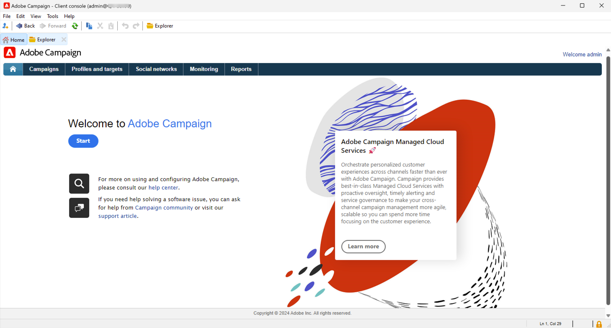

# 管理員與開發人員快速入門 {#acs-gs-admin}

此頁面概述Campaign v8的主要管理和資料管理功能。 它適用於從Campaign Standard轉換至Campaign v8的管理員和技術行銷人員。

主要變更是推出了使用者端主控台，這是與Adobe Campaign應用程式伺服器通訊的原生應用程式。

Campaign使用者端主控台會集中所有功能和設定。 它會與Campaign網頁使用者介面同步，確保兩個環境的一致性。

{zoomable="yes"}

[進一步瞭解Adobe Campaign v8](https://experienceleague.adobe.com/en/docs/campaign/campaign-v8/new/campaign-ui#ui-access){target="_blank"}的使用者端主控台使用者介面。

## Campaign v8架構 {#acs-gs-admi-archi}

Campaign v8 （主控台）檔案中會詳細說明Campaign架構。 在[此頁面](https://experienceleague.adobe.com/en/docs/campaign/campaign-v8/config/architecture/general-architecture){target="_blank"}中瞭解基本知識。

實用連結可讓您開始：

* 在[此頁面](https://experienceleague.adobe.com/en/docs/campaign/campaign-v8/new/ac-components){target="_blank"}中說明Adobe Campaign元件和全域架構。

* 請參閱[開始使用Campaign架構](https://experienceleague.adobe.com/en/docs/campaign/campaign-v8/config/architecture/architecture){target="_blank"}，瞭解Campaign架構，然後再開始建構您的執行個體。

<!--Two deployment models are available: **Campaign FDA deployment** (P1-P3) and **Campaign Enterprise (FFDA)** deployment (P4). As a customer transitioning from Campaign Standard, your deployment model is **Campaign FDA**.-->

* 異動訊息（訊息中心）是專為管理觸發式訊息而設計的Campaign v8模組。 它依賴特定架構模型，此模型在[本節](https://experienceleague.adobe.com/en/docs/campaign/campaign-v8/config/architecture/architecture#transac-msg-archi){target="_blank"}中有詳細說明。

## Campaign使用者端主控台 {#acs-gs-console}

### 安裝用戶端控制台 {#acs-gs-admin-console}

管理和設定工作會在使用者端主控台中執行。 第一步是設定環境。

Campaign使用者端主控台是原生應用程式，可透過標準網際網路通訊協定(例如SOAP和HTTP)與Adobe Campaign應用程式伺服器通訊。 Campaign使用者端主控台會集中所有功能和設定，且需要最少的頻寬，因為它依賴本機快取。 Campaign使用者端主控台專為輕鬆部署而設計，可從網際網路瀏覽器部署、自動更新，且不需要任何特定網路設定，因為它只會產生HTTP(S)流量。

以下影片說明如何下載和安裝Adobe Campaign使用者端主控台，以及如何管理您與執行個體的連線。

>[!VIDEO](https://video.tv.adobe.com/v/335375?quality=12&learn=on){transcript=true}

如需詳細資訊，請參閱[使用使用者端主控台連線至Campaign](https://experienceleague.adobe.com/en/docs/campaign/campaign-v8/new/connect){target="_blank"}。

請注意，使用者端主控台必須安裝在支援的環境中。 深入瞭解[Campaign v8 （主控台）相容性矩陣](https://experienceleague.adobe.com/en/docs/campaign/campaign-v8/releases/compatibility-matrix#ClientConsoleoperatingsystems){target="_blank"}。

### 探索使用者端主控台介面  {#acs-gs-ui}

瞭解Adobe Campaign v8使用者介面，以及如何透過本教學課程影片導覽主要功能。

>[!VIDEO](https://video.tv.adobe.com/v/334496?quality=12&learn=on){transcript=true}

如需詳細資訊，請參閱[使用使用者端主控台](https://experienceleague.adobe.com/en/docs/campaign/campaign-v8/new/campaign-ui){target="_blank"}。

## 管理環境 {#acs-gs-admin-env}

安裝使用者端主控台後，請依照本檔案中的步驟建立與應用程式伺服器的連線： [與應用程式伺服器檔案的連線](https://experienceleague.adobe.com/en/docs/campaign/campaign-v8/new/connect#create-your-connection){target="_blank"}。

安全性實務已深深植入我們的內部軟體開發和作業流程及工具，我們的跨職能團隊也嚴格遵循這些實務准則，以迅速預防、偵測和回應事件。 深入瞭解[Campaign安全性最佳實務](https://experienceleague.adobe.com/en/docs/campaign/campaign-v8/privacy/security){target="_blank"}。

### 存取許可權與許可權 {#acs-gs-admin-rights}

Adobe Campaign可讓您定義並管理指派給使用者的許可權。 這些許可權是透過結合操作員群組許可權、已命名的許可權和檔案夾許可權來定義。

身為Campaign Standard使用者轉換至Campaign v8，您的許可權和存取權維持不變。 Adobe已將安全性群組移至Campaign v8運運算元群組，而且您的每個組織單位的許可權已轉換為檔案夾許可權。 Campaign使用者   使用他們的Adobe ID連線至Campaign v8，然後可以使用與Campaign Standard相同的登入和密碼。

行銷活動[資料夾](https://experienceleague.adobe.com/zh-hant/docs/campaign/campaign-v8/config/configuration/folders-and-views){target="_blank"}為使用者端主控台之瀏覽器樹狀結構中的節點。 根據它們的型別，它們包含特定型別的資料。 程式會由Campaign v8中的資料夾具體化。 您可以建立檔案夾並管理其許可權以限制存取。 [了解更多](https://experienceleague.adobe.com/zh-hant/docs/campaign/campaign-v8/admin/permissions/folder-permissions){target="_blank"}。

進一步瞭解[使用者許可權檔案](https://experienceleague.adobe.com/zh-hant/docs/campaign/campaign-v8/admin/permissions/gs-permissions){target="_blank"}。

### Campaign 控制面板 {#acs-gs-admin-cp}

至於Campaign Standard，您可以使用「控制面板」來管理您的環境。 請注意，對於v8，「控制面板」提供額外功能。

您可以透過「Campaign 控制面板」，以 Adobe Campaign 產品管理員的身分，管理每個執行個體的設定並追蹤每個執行個體的使用量，協助您提高工作效率。其直覺式介面可讓您輕鬆監視主要資產的使用情況，並執行管理工作，例如 IP 位址允許清單新增、SFTP 儲存空間監控、金鑰管理等等。

進一步瞭解[控制面板教學課程](https://experienceleague.adobe.com/en/docs/control-panel-learn/tutorials/control-panel-overview){target="_blank"}和[控制面板檔案](https://experienceleague.adobe.com/docs/control-panel/using/control-panel-home.html?lang=zh-Hant){target="_blank"}。

* **新增IP位址** - Campaign控制面板可讓您將IP位址範圍新增至允許清單，以設定與執行個體的新連線。 進一步瞭解[IP允許清單檔案](https://experienceleague.adobe.com/en/docs/control-panel/using/instances-settings/ip-allow-listing-instance-access){target="_blank"}

* **子網域設定** — 您可以設定網域的子區段（技術上稱為「DNS區域」），以便與Adobe Campaign搭配使用。
進一步瞭解[子網域委派檔案](https://experienceleague.adobe.com/en/docs/control-panel/using/subdomains-and-certificates/subdomains-branding){target="_blank"}

* **管理SFTP伺服器** — 在「控制面板」中，您可以與所有連線至您可存取之Campaign執行個體的SFTP伺服器互動。 在[SFTP管理檔案](https://experienceleague.adobe.com/en/docs/control-panel/using/sftp-management/about-sftp-management){target="_blank"}中進一步瞭解

### 稽核軌跡 {#acs-gs-admin-audit-trail}

如同Campaign Standard已提供的功能，稽核軌跡可在Campaign v8中使用，以存取執行個體中所做變更的完整歷史記錄。

在Adobe Campaign Web使用者介面中，稽核軌跡功能可讓使用者完全瞭解對您執行個體內重要實體所做的所有修改，通常是對執行個體的順利操作產生重大影響的修改。 進一步瞭解[稽核軌跡檔案](../../v8/reporting/audit-trail.md)

### 資料套件 {#acs-gs-admin-audit-packages}

與Campaign Standard中類似，管理員可以定義套件，以透過結構化XML檔案在不同Adobe Campaign執行個體之間交換資源。 這些項目可能是設定參數或資料。

您可以使用資料包來匯出和匯入平台自訂設定和資料。 套件可以包含不同型別的設定和元件，無論是否經過篩選。 在[本檔案](https://experienceleague.adobe.com/en/docs/campaign/campaign-v8/developer/packages){target="_blank"}中瞭解如何在Campaign v8中使用資料套件。

<!--
MISSING LINKS: 

- System options
- Data Encryption/Decryption-->

### 個人化使用者介面 {#acs-gs-admin-ui}

您可以使用幾個選項來自訂使用者端主控台中的使用者介面，例如：

* **清單和資料顯示** — 管理使用者介面設定（例如清單、單位或資料顯示）的准則已在此檔案中提供： [使用者介面設定檔案](https://experienceleague.adobe.com/en/docs/campaign/campaign-v8/config/configuration/ui-settings){target="_blank"}

* **資料夾管理** — 資料夾是Adobe Campaign中的物件，可讓您組織元件和資料。 也可用來管理許可權。 瞭解如何[使用資料夾](../../v8/get-started/work-with-folders.md)。

* **自訂欄位** — 自訂欄位是透過Adobe Campaign主控台新增到現成結構描述的其他屬性。 這些自訂欄位會顯示在各種畫面中，例如設定檔或測試設定檔的詳細資訊。 進一步瞭解[自訂欄位設定檔案](../../v8/administration/custom-fields.md)。

## 設定品牌 {#acs-gs-admin-branding}

每家公司都有品牌准則，對視覺元素和技術細節加以定義。 至於Adobe Campaign Standard，Adobe Campaign v8可協助您集中管理這些方針，您所做的一切（從電子郵件中的標誌，到您的行銷活動中使用的URL和網域）都可以向客戶呈現一致的品牌形象。 作為技術管理員，您可以在Adobe Campaign中建立和管理多個品牌。

在[品牌推廣檔案](https://experienceleague.adobe.com/en/docs/experience-cloud/campaign/branding/branding-gs){target="_blank"}中進一步瞭解

## 瞭解資料模型建立 {#acs-gs-admin-data-model-creation}

與Campaign Standard類似，Adobe Campaign v8也隨附預先定義的資料模型。 Adobe Campaign仰賴包含連結在一起之表格的雲端資料庫。 進一步瞭解[資料模型檔案](https://experienceleague.adobe.com/en/docs/campaign/campaign-v8/developer/datamodel){target="_blank"}。

綱要是與資料庫表格相關聯的XML檔案。 它會定義資料結構，並描述表格的SQL定義。 請參閱[結構描述建立檔案](https://experienceleague.adobe.com/en/docs/campaign/campaign-v8/developer/shemas-forms/schemas){target="_blank"}

透過此影片瞭解如何建立方案以及如何延伸Campaign v8中的現有方案：

>[!VIDEO](https://video.tv.adobe.com/v/337939?quality=12&learn=on){transcript=true}

與Campaign Standard中的可用功能類似，您可以建立自訂資源。 在Campaign v8中，自訂資源為自訂或延伸&#x200B;**結構描述**。

* 在[此頁面](https://experienceleague.adobe.com/en/docs/campaign/campaign-v8/developer/shemas-forms/schemas){target="_blank"}中瞭解如何使用結構描述。

* 瞭解如何在[此頁面](https://experienceleague.adobe.com/en/docs/campaign/campaign-v8/developer/shemas-forms/extend-schema){target="_blank"}中擴充現有結構描述。

* 瞭解如何在[此頁面](https://experienceleague.adobe.com/en/docs/campaign/campaign-v8/developer/shemas-forms/create-schema){target="_blank"}中建立新的結構描述。

* 當您建立或擴充綱要時，需要建立或修改關聯的輸入表單，以使一般使用者可看見這些變更。 輸入表單可讓您從Adobe Campaign使用者端主控台編輯與資料結構描述相關聯的執行個體。 表單由其名稱和名稱空間識別。 請參閱[輸入表單建立檔案](https://experienceleague.adobe.com/en/docs/campaign/campaign-v8/developer/shemas-forms/forms){target="_blank"}。

## 工作流程和資料管理 {#acs-gs-admin-data-management}

與Adobe Campaign Standard相同，Adobe Campaign v8也包含工作流程模組，可讓您在應用程式伺服器的不同模組間協調所有流程和任務。 此全方位的圖形環境可讓您設計各式流程，包括細分、行銷活動執行、檔案處理、人員參與等。 工作流程引擎會執行並追蹤這些流程。 在[本檔案](https://experienceleague.adobe.com/en/docs/campaign/campaign-v8/data/workflows){target="_blank"}中瞭解如何開始使用Campaign v8的工作流程。

請參閱下列其他實用資源的連結：

* 透過此影片瞭解以維度和工作表格為目標是什麼，以及Adobe Campaign如何跨不同資料來源管理資料：

  >[!VIDEO](https://video.tv.adobe.com/v/339992?quality=12&learn=on){transcript=true}

* Campaign 可協助您將聯絡人新增至雲端資料庫。 您可以載入檔案、排程並自動化多個連絡人更新、在網路上收集資料，或直接在收件者表格中輸入設定檔資訊。  在[匯入資料（主控台）檔案](https://experienceleague.adobe.com/en/docs/campaign/campaign-v8/data/import){target="_blank"}中進一步瞭解。

* 您可以輕鬆地將不同的報表匯出為PDF或CSV格式，讓您能夠共用、操縱或列印它們。 進一步瞭解[匯出資料檔案](../../v8/reporting/export-reports.md)。

## REST API {#acs-gs-admin-apis}

Campaign REST API的目的是讓您建立Adobe Campaign的整合，並將Adobe Campaign與您使用的技術面板結合，以建立您自己的生態系統。

身為Campaign Standard使用者轉換至Campaign v8，您可使用REST API。

在[Rest API檔案](https://experienceleague.adobe.com/en/docs/experience-cloud/campaign/apis/get-started-apis){target="_blank"}中進一步瞭解。

請注意，從Campaign Standard轉換至Campaign v8時，某些建議和限制適用於REST API。 它們列在[此頁面](https://experienceleague.adobe.com/en/docs/experience-cloud/campaign/apis/limitations){target="_blank"}中。 轉換至Campaign v8時，如下列可用性注意事項中所列，也會套用特定限制：

>[!AVAILABILITY]
>
>* PKEY值會在現有Campaign Standard執行個體和已移轉的Campaign v8執行個體之間變更。 如果PKEY儲存在外部資料庫中，則實作需要以呼叫Adobe Campaign v8主要API （提供具有PKEY的pkey / hrefs連結）的方式變更，且後續API呼叫需要透過使用先前API呼叫的pkeys /hrefs來動態形成&#x200B;。
>
>* 在Campaign v8中，對於連結至設定檔之車輛的相同內文，&#x200B;我們會收到錯誤firstName屬性對`cusVehicle`無效，但僅具有不含連結之屬性的要求內文可正常運作。`{ "vehicleNumber": "20009", "vehicleName": "Model E", "vehicleOwner":{   "firstName":"tester 11", "lastName":"Smith 11" } }&#x200B;`
>
>* 時區會顯示為`profileAndServicesExt/profile` REST API呼叫的一部分，而非`profileAndServices/profile` REST API呼叫，因為它是隨著資料移轉新增至擴充型結構描述中的&#x200B;。
>
>* `ccpaOptOut`只會顯示為`profileAndServicesExt/profile` REST API呼叫的一部分，而非`profileAndServices/profile` REST API呼叫，因為它會作為資料移轉的一部分新增到擴充型結構描述中。
>

<!--
## Working with templates - TO REMOVE?

Workflow templates contain pre-configured settings and activities which can be reused for creating new workflows.
[Workflow template documentation](../../v8/workflows/create-workflow.md)

You can design your landing page content, and save it for future reuse. See the [landing page template documentation](../../v8/landing-pages/lp-templates.md).

Each event can trigger a personalized message. For this to happen, you need to create a message template to match each event type. Templates contain the necessary information for personalizing the transactional message. See the [Transactional messaging template documentation](https://experienceleague.adobe.com/en/docs/campaign/campaign-v8/send/real-time/transactional-template)

Using a workflow template is a best practice if you need to regularly import files with the same structure. See the [Import template documentation](https://experienceleague.adobe.com/en/docs/campaign/automation/workflows/use-cases/data-management/recurring-import-workflow){target="_blank"}
-->

## 訂閱服務 {#acs-gs-admin-sub}

如同在Campaign Standard中，身為管理員，您可以建立訂閱服務，而行銷人員可以傳送訊息給訂閱者。 重要概念和實施步驟均與Campaign Standard一致。 您可以在下方找到有用的連結和影片。

瞭解如何設定及管理訂閱並目標定位訂閱者。

>[!VIDEO](https://video.tv.adobe.com/v/334305?quality=12&learn=on){transcript=true}

* 請參閱訂閱服務[網頁使用者介面檔案](../../v8/audience/manage-subscribers.md)。

* 另請參閱[本區段](https://experienceleague.adobe.com/en/docs/campaign/campaign-v8/audience/subscriptions){target="_blank"}中有關在使用者端主控台中設定訂閱服務的檔案。

## 訊息和傳遞{#acs-gs-msg}

### 設定傳送通道 {#acs-gs-admin-channels}

Adobe Campaign v8身為Campaign Standard，可協助您傳送跨頻道行銷活動，包括電子郵件、簡訊、推播通知和直接郵件，並使用各種專屬報告來評估行銷的成效。 這些訊息會經過設計並透過傳遞傳送，而且可針對每位收件者進行個人化。核心功能包括目標定位、定義和個人化訊息、通訊執行及相關的營運報告。 主要功能存取點是傳送助理。 此存取點可導向 Adobe Campaign 涵括的多種功能。

作為管理員，您必須定義您的頻道設定。 請參閱下列連結以瞭解更多資訊。

* **電子郵件** — 電子郵件設定全部在[此頁面](https://experienceleague.adobe.com/en/docs/campaign/campaign-v8/send/emails/email-parameters){target="_blank"}中詳細說明。
* **簡訊** — 在[本檔案](https://experienceleague.adobe.com/en/docs/campaign/campaign-v8/send/sms/sms){target="_blank"}中瞭解如何設定您的簡訊頻道。
* **推播通知** — 設定推播通知頻道的步驟已在本節](https://experienceleague.adobe.com/en/docs/campaign/campaign-v8/send/push/push-data-collection){target="_blank"}中詳細說明[。
* **異動訊息** — 在Campaign v8中設定[異動訊息](https://experienceleague.adobe.com/en/docs/campaign/campaign-v8/send/real-time/transactional){target="_blank"}的步驟已在本節](https://experienceleague.adobe.com/en/docs/campaign/campaign-v8/config/configuration/transactional-msg-settings)中詳細說明[

### 外部帳戶 {#acs-gs-ext-accounts}

身為管理員，您負責設定及維護Campaign外部帳戶。 和Campaign Standard一樣，技術流程（例如技術工作流程或行銷活動工作流程）會使用外部帳戶。

轉換至Campaign v8的過程會處理您現有的Campaign Standard外部帳戶。

進一步瞭解[外部帳戶檔案](../../v8/administration/external-account.md)。

<!--
**Email**

MISSING LINKS :
- general email channel parameters 
- email routing accounts 
- email processing rules 
- email properties
-->

<!--
MISSING LINKS: 
- Setting external account 
- Adding vender details etc. -->

<!--
**Mobile app**
MISSING LINKS: 
- Configuring a mobile application using AEP SDKs 
- Sync Mobile app AEPSDK  
- Setting up your application in Adobe Campaign 
- Channel-specific application configuration
-->

### 動態內容 {#acs-gs-dyn-content}

使用 Campaign 建立動態內容並傳送個人化訊息。可合併個人化功能以改善您的訊息並建立自訂的使用者體驗。

透過Campaign v8，管理員可以定義動態內容區塊，並在此影片中如何使用動態內容區塊來個人化您的電子郵件傳送內容：

>[!VIDEO](https://video.tv.adobe.com/v/342088?quality=12&learn=on){transcript=true}

有用的連結：

* [開始使用個人化](https://experienceleague.adobe.com/en/docs/campaign/campaign-v8/send/personalize/personalize){target="_blank"}
* [使用個人化區塊](https://experienceleague.adobe.com/en/docs/campaign/campaign-v8/send/personalize/personalization-blocks){target="_blank"}
* [建立條件式內容](https://experienceleague.adobe.com/en/docs/campaign/campaign-v8/send/personalize/conditions){target="_blank"}
* [Personalization資料來源](https://experienceleague.adobe.com/en/docs/campaign/campaign-v8/send/personalize/personalization-data){target="_blank"}

### 傳遞範本 {#acs-gs-templates}

在Campaign v8中(例如在Campaign Standard中)需要使用傳遞範本。

為了加快並改善設計流程，請建立傳遞範本，以輕鬆地在行銷活動中重複使用自訂內容和設定。 此功能可讓您標準化創意外觀和風格，以便更快速地執行和啟動行銷活動。 瞭解如何在[Campaign網頁使用者介面](../../v8/msg/delivery-template.md)中建立傳遞範本。 另請參閱[本節](https://experienceleague.adobe.com/en/docs/campaign/campaign-v8/send/create-templates){target="_blank"}中有關如何在使用者端主控台中建立傳遞範本。

### 類型規則 {#acs-gs-admin-rules}

身為管理員，您負責建立和維護傳送的型別規則。 與Adobe Campaign Standard相同，在Campaign v8中，型別規則是商業規則，可讓您在傳送訊息前先對訊息執行檢查和篩選。

從Campaign Standard環境轉換至Campaign v8時，您的型別規則會移至Campaign v8。

在Campaign v8中，型別規則會隨特定的Campaign Optimization附件提供。 此模組可讓您控制、篩選及監控傳遞的傳送。 為了避免行銷活動之間發生衝突，Adobe Campaign 可以套用特定限制規則來測試各種組合。這可確保傳送的訊息符合客戶和公司通訊政策的需求與期望。 在[型別規則檔案](https://experienceleague.adobe.com/en/docs/campaign/automation/campaign-optimization/campaign-typologies){target="_blank"}中瞭解更多。

### 隔離管理 {#acs-gs-admin-quarantine}

所有隔離的地址和隔離規則已從Campaign Standard環境移轉至Campaign v8。 隔離管理不需要任何特定動作。

作為管理員，從[此頁面](../../v8/audience/quarantine.md)開始，熟悉Campaign v8中的隔離管理。 另請參閱[本節](https://experienceleague.adobe.com/en/docs/campaign/campaign-v8/send/failures/quarantines#access-quarantined-addresses){target="_blank"}中有關隔離管理的使用者端主控台詳細檔案。

## 管理Adobe Campaign整合 {#acs-gs-integrations}

您可以將Campaign執行個體連線至Adobe Experience Cloud解決方案，以便結合功能。 Adobe Campaign隨附數個聯結器，可讓您與外部應用程式通訊、連線至資料庫引擎、共用及同步資料。 在[本檔案](https://experienceleague.adobe.com/en/docs/campaign/campaign-v8/connect/integration){target="_blank"}中瞭解如何結合您的解決方案。

遷移到Campaign v8後，身為Campaign Standard使用者，以下適用於您：

* 如果您使用這些與Campaign Standard的整合，Adobe已移轉您的&#x200B;**Adobe Analytics**&#x200B;和&#x200B;**Audience Manager**&#x200B;設定和資料。
* 如果您的Campaign Standard環境已與&#x200B;**Adobe Experience Manager**&#x200B;整合，Adobe建議您改用&#x200B;**Adobe Experience Manager as a Cloud Service**，以便在Campaign Web使用者介面中設計電子郵件時使用此功能，並直接在您的Adobe Experience Manager環境中簡化電子郵件傳遞內容和表單的管理。 在[此頁面](../../v8/integrations/aem-content.md)瞭解更多資訊。
請注意，Campaign也可以與Adobe Experience Manager 6.5整合。若要設定此整合，請參閱[此檔案](https://experienceleague.adobe.com/en/docs/campaign/campaign-v8/connect/ac-aem){target="_blank"}。
* 如果您的Campaign Standard環境已與&#x200B;**觸發器**&#x200B;整合，您必須在Campaign v8中設定此整合，如[此頁面](https://experienceleague.adobe.com/en/docs/campaign/campaign-v8/connect/ac-triggers){target="_blank"}所詳述。
* 如果您的Campaign Standard環境已與&#x200B;**Adobe Target**&#x200B;整合，您必須在Campaign v8中設定此整合，如[此頁面](https://experienceleague.adobe.com/en/docs/campaign/campaign-v8/connect/ac-at){target="_blank"}所詳述。
