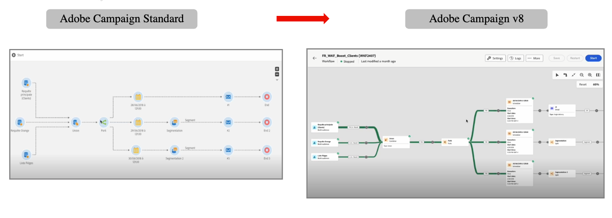
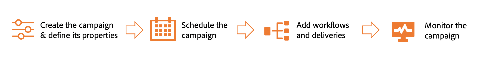

# 行銷人員快速入門 {#acs-gs-marketers}

本指南會概述Campaign v8的主要功能，供行銷人員從Campaign Standard轉換至Campaign v8。

您可以透過使用者端主控台或Web使用者介面存取Adobe Campaign v8。 網頁介面可讓您建立、管理及執行重要的行銷動作。 新的 Adobe Campaign Web 介面提供了現代直覺的使用者體驗，可簡化行銷活動的設計和傳遞。[了解更多](../../v8/get-started/user-interface.md)。

透過移轉，您從Campaign Standard匯入的所有資料都會匯入Campaign v8，以確保順暢的轉換，同時對您持續運作的中斷降至最低。

您可以繼續使用現有憑證登入並連線至新的Adobe Campaign v8執行個體。 登入後，您可以找到所有正在移轉的個人檔案和工作流程，讓您繼續處理行銷活動。

主要差異在於使用者介面。 以下是兩個介面中相同工作流程的比較：

{zoomable="yes"}

>[!NOTE]
> Adobe Campaign的網頁使用者介面版本會在持續傳遞模式上運作，允許以更可縮放、分階段的方法進行功能部署。 請定期檢視[發行說明](../../v8/rn/release-notes.md)，以取得最新更新。

## 探索Campaign網頁使用者介面 {#acs-gs-marketers-ui}

在以下影片中，瞭解如何存取和導覽Campaign網頁使用者介面，以及如何自訂詳細目錄清單。

>[!VIDEO](https://video.tv.adobe.com/v/3453433?quality=12&learn=on&captions=chi_hant){transcript=true}

如需更多詳細資料，請參閱以下檔案：

1. [探索Campaign網頁使用者介面](../../v8/get-started/user-interface.md)

1. [瀏覽及篩選清單](../../v8/get-started/list-filters.md)

## 建立及管理設定檔和對象 {#acs-gs-marketers-profiles-and-audiences}

在Campaign v8中建立和管理設定檔和受眾的一般概念，與Adobe Campaign Standard中的相同。 在[本節](../../v8/audience/gs-audiences-recipients.md)中瞭解如何開始使用設定檔和對象。

您可以在下方找到一些實用的連結，以供您開始使用。

### 管理輪廓 {#acs-gs-marketers-profiles}

在Adobe Campaign中，設定檔是儲存在資料庫中的記錄，可作為關鍵元件來建立傳遞的對象，並將個人化資料新增到您的內容中。

1. 透過此影片瞭解如何使用Campaign網頁使用者介面存取、管理和探索設定檔：

   >[!VIDEO](https://video.tv.adobe.com/v/3448375?quality=12&learn=on&captions=chi_hant){transcript=true}

   在[開始使用設定檔](../../v8/audience/about-recipients.md)檔案中進一步瞭解。

1. 瞭解如何在Campaign v8中[建立和管理測試設定檔](../../v8/audience/test-profiles.md)。

### 管理對象 {#acs-gs-marketers-audiences}

受眾是一組具有類似行為和/或特徵的設定檔。 您可以產生、選取或載入這類人員的集合。客群建立後，即可作為您的傳遞目標群體供運用。

透過此影片瞭解如何建立及管理對象、如何選取傳送對象及定義控制群組：

>[!VIDEO](https://video.tv.adobe.com/v/3453213?quality=12&learn=on&captions=chi_hant){transcript=true}

如需詳細資訊，請參閱[開始使用對象](../../v8/audience/manage-audience.md){target="_blank"}。

如同在Campaign Standard中，您可以新增控制組至您的傳送。 您可以定義控制組以避免傳送訊息給部分對象，並將傳送後的行為與主要目標進行比較。 此選項可協助您測量行銷活動的影響。
瞭解如何[設定控制組](../../v8/audience/control-group.md){target="_blank"}。

>[!AVAILABILITY]
>
>* 在轉變期間，所有透過Campaign Standard查詢活動建立的對象都會轉換為Campaign v8中的預先定義篩選器。 Campaign v8也支援查詢活動。
>
>* 讀取對象已轉換為具有[預先定義的篩選器](../../v8/query/build-query.md)的查詢活動
>
>* 預先定義的篩選器只會在受眾移轉至Campaign v8之後採用最新的值。
>
>* Campaign Standard中的檔案型別對象會移轉為不含維度的清單型別。

### 管理訂閱 {#acs-gs-marketers-sub}

您可以管理和建立您的服務（例如電子報），以及檢查這些服務的訂閱或取消訂閱。 關鍵步驟與Campaign Standard中的整體相同。 請前往下列頁面，瞭解更多資訊：

<table style="table-layout:fixed"><tr style="border: 0;">
<td>

<a href="https://experienceleague.adobe.com/zh-hant/docs/campaign-web/v8/audiences/work-with-services/manage-services"><strong>建立訂閱服務</strong></a>

</td>
<td>

<a href="https://experienceleague.adobe.com/zh-hant/docs/campaign-web/v8/audiences/work-with-services/manage-subscribers"><strong>管理訂閱者<strong></strong></a>

</td>
<td>

<a href="https://experienceleague.adobe.com/zh-hant/docs/campaign-web/v8/msg/send-to-subscribers"><strong>傳送訊息給服務的訂閱者</strong></a>

</td>
</tr>
</table>

## 使用計畫、方案和行銷活動 {#acs-gs-marketers-plans}

Adobe Campaign v8可讓您為行銷計畫和方案設定資料夾階層。 計畫、方案和行銷活動功能與Campaign Standard和Campaign v8類似。

在[計畫和方案檔案](../../v8/administration/plans-programs.md)中瞭解更多資訊。

您可以在下方找到開始使用的實用連結。 可能會影響您使用者體驗的變更會在「可用性」附註中醒目提示。

### 建立行銷活動 {#acs-gs-marketers-campaign}

Adobe Campaign可讓您使用內建的行銷活動管理功能，輕鬆協調目標式行銷活動。 透過定義排程的能力，您可以規劃行銷活動的持續時間和時機，以和策略目標保持一致性並將客群參與度擴展至最大。

請依照下列檔案深入瞭解行銷活動：

1. [開始使用行銷活動](../../v8/campaigns/gs-campaigns.md)
1. [存取和管理您的行銷活動](../../v8/campaigns/manage-campaigns.md)
1. [建立您的第一個行銷活動](../../v8/campaigns/create-campaigns.md)

### 建立工作流程 {#acs-gs-marketers-wf}

Campaign Web使用者介面已完全重新構想工作流程使用者介面，以方便使用、設定、執行和疑難排解。 如您在Campaign Standard中已有經驗，使用工作流程，即可策劃全方位的流程和任務、改善行銷活動各方面的速度和規模，從建立區段及準備訊息到傳送。 此外，您可以讓您的管道與一個易於使用的單一介面同步，用於行銷活動協調流程。

透過此影片瞭解工作流程的工作原理以及如何建立目標工作流程：

>[!VIDEO](https://video.tv.adobe.com/v/3453983?quality=12&learn=on&captions=chi_hant){transcript=true}

透過[Worklow檔案](../../v8/workflows/gs-workflows.md)取得更多詳細資料。

Adobe Campaign Web使用者介面在工作流程中提供查詢模型工具，可簡化根據各種條件篩選資料庫的程式。 [進一步瞭解查詢模型工具](../../v8/query/query-modeler-overview.md)

若要瞭解工作流程中每個活動的用途和功能，請探索[工作流程活動](../../v8/workflows/activities/about-activities.md)上可用的詳細資訊

檢閱工作流程的[護欄和限制](../../v8/get-started/guardrails.md)，以最大化工作流程的效率。

>[!AVAILABILITY]
>
>* 工作流程執行[歷史記錄和記錄](../../v8/workflows/start-monitor-workflows.md#logs-tasks)可在Adobe Campaign v8中使用。
>
>* 在Campaign Standard執行個體上執行的工作流程歷史記錄並未移轉至Campaign v8。
>
>* 組織單位會對應至資料夾的概念，以對應並確保類似的存取控制。
>

## 建立及管理傳遞 {#acs-gs-marketers-deliveries}

使用Campaign Web使用者介面，行銷人員可以從左側功能表&#x200B;**傳送**&#x200B;建立獨立傳送，或在工作流程內容中建立傳送，無論是否包含在行銷活動中。 重要步驟會與您先前在Campaign Standard中的體驗一致。 在下列章節中瞭解如何建立傳遞： [傳遞建立與管理檔案](../../v8/msg/gs-deliveries.md)。

有用的連結：

* **傳遞範本** — 為了加速及改善設計流程，您可以建立傳遞範本，以便在行銷活動中輕鬆重複使用自訂內容和設定。 此功能可讓您標準化創意的外觀和風格，以更快執行和啟動行銷活動/在[傳遞範本](../../v8/msg/delivery-template.md)頁面瞭解更多。

* **傳遞設定** — 傳遞設定是傳遞範本中定義的技術傳遞引數。 每個傳遞都能讓這些量度超載。 這些設定可從編輯傳遞或傳遞範本時可用的「設定」按鈕取得。 在[傳遞設定](../../v8/advanced-settings/delivery-settings.md)區段中瞭解更多。

* **動態內容** - Adobe Campaign Web動態內容功能可讓您根據所收集的收件者相關資訊來自訂內容。 使用動態內容，您即可確保行銷內容更具相關性，避免行銷不需要或不必要的產品或服務。在[動態內容](../../v8/personalization/gs-personalization.md)區段中瞭解更多。

* **測試與校樣** — 定義您的傳遞內容後，您可以使用設定檔和測試設定檔，在傳送訊息之前進行預覽與測試。 此步驟對於確保其準確性至關重要，但也不會在內容和個人化設定中發生錯誤。 請參閱[預覽和測試](../../v8/preview-test/preview-test.md)。

* **排程** — 您可以設定傳送訊息的日期和確切時間。 為您的行銷訊息選擇最合適的時間，可以將開啟率提升至最高。

   * 瞭解如何[排程獨立傳遞](../../v8/msg/gs-deliveries.md#gs-schedule)
   * 瞭解如何[在工作流程中排程傳遞](../../v8/monitor/schedule-sending.md#schedule-a-delivery-in-a-campaign-workflow)

* **新增優惠方案** — 您可以在Adobe Campaign網頁使用者介面中將優惠方案新增至您的傳送。 這些優惠可從優惠方案左側功能表取得，可讓您存取優惠方案清單。  瞭解如何[新增優惠方案至您的訊息](../../v8/msg/offers.md)

>[!AVAILABILITY]
>
>* 處於草稿狀態或完成狀態的傳遞已移轉。
>
>* 處於以下狀態之一的傳遞已移轉至Adobe Campaign v8，但必須再次準備：傳輸中/進行中/已取消/重試進行中/準備錯誤。
>
>* 處於以下狀態之一的傳遞已移轉為已取消的傳遞：針對已取消/重試進行中。
>
>* 追蹤連結、映象頁面URL連結、訂閱/取消訂閱連結的運作方式與Campaign Standard中相同。
>
>另請參閱下列章節： Adobe Campaign中的[追蹤與監控](https://experienceleague.adobe.com/zh-hant/docs/campaign/campaign-v8/analytics/tracking){target="_blank"}、[品牌](https://experienceleague.adobe.com/zh-hant/docs/experience-cloud/campaign/branding/branding-gs){target="_blank"}。

### 電子郵件傳遞 {#acs-gs-marketers-email}

在本影片中瞭解如何從頭開始建立電子郵件傳送、定義對象、設計內容、模擬預覽和傳送校樣：

>[!VIDEO](https://video.tv.adobe.com/v/3454016?quality=12&learn=on&captions=chi_hant){transcript=true}

在[建立您的第一封電子郵件檔案](../../v8/email/create-email.md)中瞭解如何建立您的第一封目標電子郵件

在Campaign v8中，建立、測試和傳送電子郵件傳送的詳細步驟類似於Campaign Standard。

1. **設計和定義內容**

   Campaign v8電子郵件設計工具類似於Campaign Standard中可用的設計工具。 提醒您，Campaign Standard[舊版電子郵件編輯器在幾年前](https://experienceleague.adobe.com/zh-hant/docs/campaign-standard/using/release-notes/deprecated-features#deprecated-features){target="_blank"}已被取代。 您應該已經轉換到Campaign電子郵件Designer ，以建立並個人化您的電子郵件內容。

   了解如何導覽電子郵件設計工具。透過以下影片，瞭解如何從草稿開始架構和設計電子郵件、如何個人化及測試您的電子郵件：

   >[!VIDEO](https://video.tv.adobe.com/v/3453576?quality=12&learn=on&captions=chi_hant){transcript=true}

   電子郵件設計工具讓您能夠透過直覺式的拖放介面建立引人入勝、量身打造的客製化電子郵件。在[電子郵件Designer檔案](../../v8/email/get-started-email-designer.md)中進一步瞭解

   在本影片中瞭解如何透過上傳HTML建立電子郵件、如何使其與電子郵件Designer相容，以及如何將其轉換為範本：

   >[!VIDEO](https://video.tv.adobe.com/v/3447043?quality=12&learn=on&captions=chi_hant){transcript=true}

   內容片段是可重複使用的元件，可在一則或多則訊息中參考。深入瞭解[內容片段](../../v8/content/fragments.md)，以簡化電子郵件傳遞的建立。

   為了加速及改善設計流程，您可以建立獨立範本，以輕鬆地在Adobe Campaign中重複使用自訂內容。 檢視[建立電子郵件範本](../../v8/email/create-email-templates.md)

1. **預覽和測試**

   在此影片中，瞭解如何在熱門的案頭、行動裝置和網頁型使用者端中預覽電子郵件訊息內容及個人化、傳送測試傳送（校樣）並檢查電子郵件呈現：

   >[!VIDEO](https://video.tv.adobe.com/v/3450348?quality=12&learn=on&captions=chi_hant){transcript=true}

1. **傳送電子郵件並檢查記錄**

   定義內容、對象和排程後，您就可以準備電子郵件傳送了。 請在下列章節中瞭解更多資訊：

   * [準備並傳送電子郵件](../../v8/monitor/prepare-send.md)
   * [監控傳遞記錄](../../v8/monitor/delivery-logs.md)

### 簡訊傳遞 {#acs-gs-marketers-sms}

簡訊傳遞提供了一種向客戶的行動裝置傳送簡訊的實用而高效的方式。使用此功能，您可以建立個人化的文字型訊息並預覽內容，讓通訊內容更有效益。

在Campaign v8中，建立、測試和傳送SMS傳送的詳細步驟類似於Campaign Standard。

<table style="table-layout:fixed"><tr style="border: 0;">
<td>

<a href="https://experienceleague.adobe.com/zh-hant/docs/campaign-web/v8/msg/sms/create-sms"><strong>建立簡訊傳遞</strong>

</td>
<td>

<a href="https://experienceleague.adobe.com/zh-hant/docs/campaign-web/v8/msg/sms/content-sms"><strong>設計簡訊傳遞<strong></strong></a>

</td>
<td>

<a href="https://experienceleague.adobe.com/zh-hant/docs/campaign-web/v8/msg/sms/send-sms"><strong>預覽並傳送SMS傳遞</strong></a>

</td>
</tr></table>

### 推播通知 {#acs-gs-marketers-push}

推播通知對於聯絡行動應用程式使用者至關重要，即使他們未主動使用您的應用程式。 它們有多種用途，例如提供更新、推動特定動作和通知交易。

在Campaign v8中，建立、測試和傳送推播通知傳送的詳細步驟類似於Campaign Standard。

<table style="table-layout:fixed"><tr style="border: 0;">
<td>

<a href="https://experienceleague.adobe.com/zh-hant/docs/campaign-web/v8/msg/push/create-push"><strong>建立推播傳遞</strong>

</td>
<td>

<a href="https://experienceleague.adobe.com/zh-hant/docs/campaign-web/v8/msg/push/content-push"><strong>設計推播傳遞<strong></strong></a>

</td>
<td>

<a href="https://experienceleague.adobe.com/zh-hant/docs/campaign-web/v8/msg/push/send-push"><strong>預覽並傳送推播傳遞</strong></a>

</tr></table>

>[!AVAILABILITY]
>
>* Adobe Campaign v8同時支援Android和iOS推播頻道。 若要使用推播頻道轉換現有工作流程與傳遞，請聯絡您的Adobe Campaign轉換經理。 深入瞭解[頻道設定](https://experienceleague.adobe.com/zh-hant/docs/campaign/campaign-v8/send/push/push-data-collection){target="_blank"}。
>
>* 請注意，適用於行動應用程式的SDK V4在幾年前[已在Campaign Standard](https://experienceleague.adobe.com/zh-hant/docs/campaign-standard/using/release-notes/deprecated-features#deprecated-features){target="_blank"}中被取代。 您應已轉換至Adobe Experience Platform SDK，此專案與Campaign v8中的專案相同。
> 

### 直接郵件 {#acs-gs-marketers-direct-mail}

直接郵件是一種離線管道，可讓您產生檔案以向客戶大量傳遞個人化信件，例如明信片、傳單或目錄。建立直接郵件傳遞時，Adobe Campaign 會自動產生一個摘取檔案，其中包含所有目標輪廓和選定資料，例如郵寄地址和輪廓屬性。

在Campaign v8中，建立、測試和傳送直接郵件傳送的詳細步驟類似於Campaign Standard。

1. [建立直接郵件傳遞](../../v8/direct-mail/create-direct-mail.md)
1. [定義解壓縮檔案](../../v8/direct-mail/content-direct-mail.md)
1. [預覽並傳送](../../v8/direct-mail/send-direct-mail.md)

### 應用程式內頻道 {#acs-gs-marketers-in-app}

請注意，應用程式內頻道無法在Campaign v8中使用。 如果您需要傳送應用程式內通知，請聯絡您的Adobe代表。

## 建立和管理登陸頁面 {#acs-gs-marketers-lp}

Adobe Campaign v8網頁使用者介面隨附重新想像的登陸頁面使用者體驗。 Campaign可讓您建立、設計和共用登入頁面。 登陸頁面可讓您引導使用者至線上表單，他們可在此更新資料、針對接收您的通訊選擇加入/退出，或訂閱電子報等特定服務。

身為Campaign Standard使用者轉換至Campaign v8，您現有的登入頁面已移轉至Campaign Web使用者介面。 您可以存取相同範圍的功能。

請在下列章節中進一步瞭解登入頁面：

<table style="table-layout:fixed"><tr style="border: 0;">
<td>

<a href="https://experienceleague.adobe.com/zh-hant/docs/campaign-web/v8/landing-pages/create-lp"><strong>建立登陸頁面</strong>

</td>
<td>

<a href="https://experienceleague.adobe.com/zh-hant/docs/campaign-web/v8/landing-pages/lp-content"><strong>設計登陸頁面</strong></a>

</td>
<td>

<a href="https://experienceleague.adobe.com/zh-hant/docs/campaign-web/v8/landing-pages/lp-templates"><strong>使用登入頁面範本</strong></a>

</td>
</tr></table>

## 報告 {#acs-gs-marketers-reporting}

Adobe Campaign提供了一組[報告工具](https://experienceleague.adobe.com/zh-hant/docs/campaign/campaign-v8/analytics/reports/gs-reporting){target="_blank"}。 身為管理員，您可以建立和設定要與其他Campaign使用者共用的報表。

Adobe Campaign報告工具套裝提供行銷工作有效性的寶貴見解，讓您最佳化行銷活動以發揮最大影響。 在[報告檔案](../../v8/reporting/gs-reports.md)中瞭解更多。

此外，根據您的Adobe Campaign Standard體驗，您可在Campaign v8中使用動態報告來傳送電子郵件。 它提供完全可自訂的即時報表，以評估行銷活動的影響。 其可新增對輪廓資料的存取權，除了功能性電子郵件行銷活動資料 (如開啟和點按) 外，還可依輪廓維度 (例如，性別、城市和年齡) 進行人口統計分析。在[動態報告檔案](https://experienceleague.adobe.com/zh-hant/docs/experience-cloud/campaign/reporting/get-started-reporting){target="_blank"}中瞭解更多

>[!AVAILABILITY]
>
>* [動態報告](https://experienceleague.adobe.com/zh-hant/docs/experience-cloud/campaign/reporting/get-started-reporting){target="_blank"}可用於報告電子郵件傳送、包含電子郵件傳送的行銷活動和異動訊息。 也可使用依設定檔維度的人口統計分析。
>
> * 從Adobe Campaign轉換到Adobe Campaign v8的所有使用者也可使用[Adobe Campaign Standard Web使用者介面報告](../../v8/reporting/campaign-reports.md)。

Adobe Campaign 可提供三種不同的報告：

<table style="table-layout:fixed"><tr style="border: 0;">
<td>

<a href="https://experienceleague.adobe.com/zh-hant/docs/campaign-web/v8/reports/campaign-report/campaign-reports"><strong>行銷活動報告</strong></a>

提供關於個別傳送的效能、成效和結果的詳細資訊，為您提供全面的總覽。

</td>
<td>

<a href="https://experienceleague.adobe.com/zh-hant/docs/campaign-web/v8/reports/delivery-report/delivery-reports"><strong>傳遞報告</strong>

針對每個管道的每次傳送效能，提供詳盡的分析：成功率、對象參與和其他基本量度。 它們可讓您評估行銷活動的整體有效性和影響。

</td>
<td>

<a href="https://experienceleague.adobe.com/zh-hant/docs/campaign-web/v8/reports/global-report/global-reports"><strong>全域報告</strong></a>

提供您Campaign執行個體中每個管道的流量和參與量度的整合整體摘要。 這些報告是由各種小工具所組成，每個小工具都提供有關您的行銷活動或傳遞績效的獨特觀點。

</td>
</tr>
</table>
