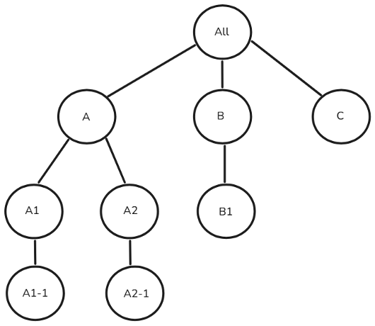
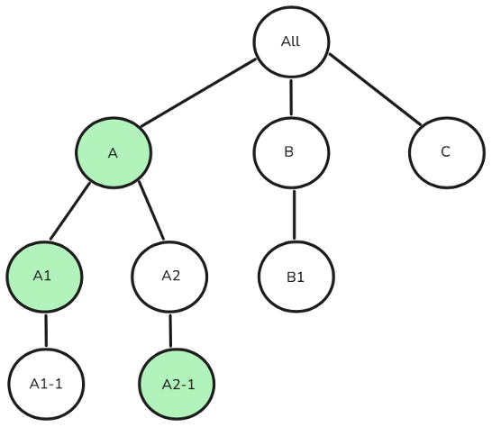
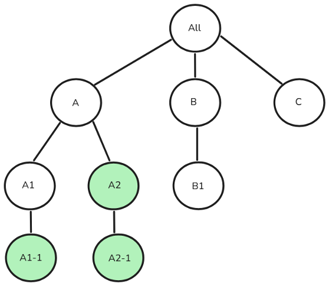

# 從Campaign Standard到Campaign v8的使用者存取管理 {#user-management-acs}

Adobe Campaign Standard和Adobe Campaign v8都可讓使用者定義和管理不同使用者/操作者的許可權。 這些許可權包含授予使用者存取產品各種功能的特定許可權。 不過，這兩種產品使用不同的方法和實作來管理使用者存取許可權。

Adobe Campaign Standard和Campaign v8會使用下列概念，來達成使用者存取管理：

| Campaign Standard | Campaign v8 |
|---------|----------|
| 使用者 | 操作員 |
| 角色 | 已命名的右側 |
| 安全性群組 | 操作員群組 |
| 組織單位 | 檔案夾許可權 |

## 從安全性群組移轉至操作員群組的方法

>[!IMPORTANT]
>
>這些角色/已命名許可權的功能在實施中可能會有所不同，這可能會造成授權問題（例如，許可權提升或功能中斷）。 我們建議使用者在轉換後檢閱這些對應，以確保適當的存取控制。 [進一步瞭解許可權](https://experienceleague.adobe.com/zh-hant/docs/campaign/campaign-v8/admin/permissions/manage-permissions)

下表概述從Adobe Campaign Standard轉換至Campaign v8時，使用者角色群組的移轉方法。 在Campaign Standard中，**安全性群組** （在Campaign v8中稱為&#x200B;**運運算元群組**）是用來指派一組角色給使用者。 雖然有些安全性群組/運運算元群組是現成可用的群組，但使用者可視需要建立新群組或修改現有群組。

| | **Campaign Standard** | **Campaign v8** |
|---------|----------|---------|
| **術語**  | 安全性群組 | 操作員群組 |

在Adobe Campaign Standard和Campaign v8中，**安全性群組**&#x200B;和&#x200B;**操作員群組**&#x200B;都會對應到Admin Console中的產品設定檔。 如果您想要將&#x200B;**安全性群組**&#x200B;或&#x200B;**操作員群組**&#x200B;指派給使用者，可以在Admin Console中連結對應的&#x200B;**產品設定檔**。 此關聯會在使用者登入時同步化。 [進一步瞭解產品設定檔](https://experienceleague.adobe.com/zh-hant/docs/campaign/campaign-v8/admin/permissions/manage-permissions)

| **Campaign Standard安全性群組** | **Campaign v8操作員群組** |
|----------|---------|
| 管理員 | 管理員 |
| 傳遞主管 | 管理員 |
| 工作流程主管 | 工作流程主管  |

## 從使用者角色移轉至已命名許可權的方法

>[!IMPORTANT]
>
>從Adobe Campaign Standard移轉至Campaign v8期間，具有&#x200B;**資料模型**&#x200B;角色但不具有&#x200B;**管理**&#x200B;角色的使用者將自動取得&#x200B;**管理**&#x200B;存取權，因為Campaign v8中的結構描述建立需要管理許可權。 若要避免此問題，請在移轉前移除其&#x200B;**資料模型**&#x200B;角色。

在Adobe Campaign Standard中，術語&#x200B;**使用者角色**&#x200B;在Campaign v8中稱為&#x200B;**已命名許可權**。 下表概述Campaign v8中與Campaign Standard中的&#x200B;**使用者角色**&#x200B;相對應的&#x200B;**已命名許可權**&#x200B;所使用的術語。

| **Campaign Standard使用者角色** | **已命名許可權為**&#x200B;的促銷活動v8 | **描述**  |
|----------|---------|---------|
| 管理 | 管理 | 具有管理許可權的使用者擁有執行個體的完整存取權。 |
| 資料模型  | 管理 | 直接執行出版物並建立自訂資源。 管理員可在Campaign v8中使用結構描述建立相關功能。  |
| 傳遞能力  | 管理  | 核准先前分析的傳遞的權利。  |
| 匯出 | 匯出 | 匯出資料的權利。  |
| 檔案存取  | 檔案存取  | 核准先前分析的傳遞的權利。  |
| 一般匯入  | 匯入  | 一般資料匯入的許可權 |
| 準備傳遞 | 準備傳遞 | 建立、修改、準備和刪除傳送的權利。  |
| SQL指令碼執行 | SQL指令碼執行 | 直接在資料庫上執行任何SQL命令的許可權。 |
| 開始傳遞  | 開始傳遞  | 核准先前分析的傳遞的權利。  |
| 系統命令執行 | 程式執行 | 在伺服器上執行系統命令的許可權。 |
| 工作流程 | 工作流程 | 管理工作流程開始、停止、暫停等的執行。 |

## 從組織單位移轉方法

>[!IMPORTANT]
>
>Adobe Campaign Standard中沒有&#x200B;**所有（所有）**&#x200B;作為直接或間接父級的組織單位將不會移轉至Campaign v8。
> 
>系統會為多個安全性群組中的使用者指派最高級別安全性群組的組織單位。 如果多個群組有平行的頂層單位，則系統會為Campaign Standard中的使用者選取組織單位，該使用者將只能存取系統選取的組織單位及其子項。 在移轉後的Campaign v8中，使用者將可存取&#x200B;**所有指派的組織單位及其子項**，可能會增加許可權。 為避免此問題，請避免將使用者指派給具有平行組織單位的安全性群組。 深入瞭解[平行組織單位指派](#parallel-assignments)。

在Adobe Campaign Standard中，**組織單位**&#x200B;對應至Campaign v8中的現有&#x200B;**資料夾**&#x200B;階層模型，以維持類似的存取控制。 [進一步瞭解資料夾管理](https://experienceleague.adobe.com/zh-hant/docs/campaign/campaign-v8/admin/permissions/folder-permissions)

| | **Campaign Standard** | **Campaign v8** |
|---------|----------|---------|
| **術語**  | 組織單位 | 資料夾 |

### 關於平行組織單位指派 {#parallel-assignments}

當使用者有權存取存在於階層不同分支中的多個單位（透過安全性群組指派）而沒有許可權存取共同父級組織單位時，會發生並行組織單位指派。 這會在移轉期間帶來安全性風險。

例如，請考量下列組織單位階層：

{width="50%" zoomable="yes"}

沒有平行組織單位的指派如下所示：

{width="50%" zoomable="yes"}

在此，使用者有權存取組織單位A、A1和A2-1，所有這些都連線在父組織單位A下。使用者可以存取「 」底下的所有內容。

下列指派包含平行組織單位：

{width="50%" zoomable="yes"}

使用者可以存取A1-1、A2和A2-1，它們存在於沒有共同指派父級的單獨分支中。

**安全性影響**

* 在Campaign Standard中，系統會為使用者選取一個頂層組織單位（A1-1或A2），限制僅存取該單位及其子項。
* 移轉至Campaign V8後，使用者可存取所有指派的組織單位及其子項中的資源。

**解析度**

透過確保指派給使用者的所有組織單位都屬於也指派給使用者的單一、通用父單位，可以解決平行組織單位指派。

以下列出一些達成此目標的方法：

1. 移除對多個分支的存取權：撤銷對多個平行分支的存取權，並確保所有存取權都在單一父項之下。
1. 指派通用父項：將存取權授與適當的通用父項組織單位，該單位包含所有必要的存取點。
1. 重新建構階層：修改組織單位結構，將所有需要的存取權置於單一分支下。

以上例來說，使用者可以存取A1-1、A2和A2-1的範例中，特定的解析度步驟如下：

1. 移除對多個分支的存取權：

   1. 撤銷對A1-1的存取權，僅保留A2 （包括A2-1）的存取權，或
   1. 撤銷對A2和A2-1的存取權，僅保留A1-1的存取權

1. 指派通用父項：

   1. 授予組織單位A （A1-1和A2的共同父系）的存取權，或
   1. 授予「全部」的存取權，其涵蓋整個階層

1. 重新建構階層：

   1. 將A1-1移到A2下，或
   1. 將A2和A2-1移到A1-1下

## 從計畫移轉方法

在Campaign v8中，**方案**&#x200B;表示為&#x200B;**資料夾**。 Campaign v8可建立資料夾並限制對資料夾的存取。

使用&#x200B;**群組**&#x200B;和&#x200B;**已命名的許可權**，**操作員**&#x200B;可以授與導覽階層內特定&#x200B;**資料夾**&#x200B;的存取權，並且能夠指派讀取、寫入和刪除許可權。 [進一步瞭解資料夾管理](https://experienceleague.adobe.com/zh-hant/docs/campaign/campaign-v8/admin/permissions/folder-permissions)

由於&#x200B;**方案**&#x200B;在Campaign v8中視為&#x200B;**資料夾**，因此其存取的管理方式與任何其他資料夾相同。 移轉後，Campaign Standard管理員可依照下列步驟操作：

1. 在檔案總管中，對任何資料夾按一下滑鼠右鍵，然後選取&#x200B;**[!UICONTROL 內容……]**。

1. 瀏覽至&#x200B;**[!UICONTROL 安全性]**&#x200B;標籤。

1. 根據所需的存取模式修改操作員群組許可權。 

## 用於存取REST API的產品設定檔對應 

若要從Campaign v8的執行執行個體存取交易API，除了&#x200B;**管理員**&#x200B;和&#x200B;**訊息中心**&#x200B;產品設定檔之外，還需要新的&#x200B;**產品設定檔**。 這個新的&#x200B;**產品設定檔**&#x200B;將新增至Campaign Standard中現有的或預先建立的技術帳戶。

移轉後，若不想將其&#x200B;**技術帳戶**&#x200B;連結至&#x200B;**管理員**&#x200B;產品設定檔，Campaign Standard使用者應檢閱其&#x200B;**產品設定檔對應**，並指派適當的&#x200B;**產品設定檔**。 若是未來的整合，我們建議在&#x200B;**REST URL**&#x200B;中使用Campaign v8 **租使用者ID**，而非先前的Campaign Standard **租使用者ID**。

## 移轉Campaign Standard操作員的內建Campaign資源存取權

從Campaign Standard移轉的操作者將擁有Campaign v8中特定內建資源的讀取存取權。

## 未移轉的安全性群組和角色 {#non-migrated-groups-roles}

以下是尚未轉換的Campaign Standard角色清單：

* 預設轉送帳戶 

* 訊息中心推播 

以下是尚未轉換的Campaign Standard安全性群組對應清單。

* 訊息中心代理程式

* 訊息中心推播代理程式

* Adobe Experience Manager應用程式管理員

* 轉送帳戶

>[!NOTE]
>
>在Adobe Campaign Standard中建立並指派給使用者的自訂角色不會移轉至Adobe Campaign v8。
