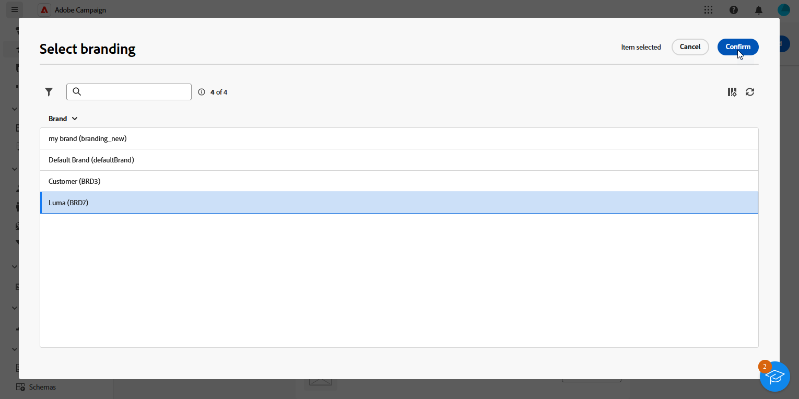

# 指派您的品牌 {#branding-assign}

## 將品牌連結至範本 {#linking-a-brand-to-a-template}

若要使用為品牌定義的引數，必須將其連結至傳遞範本。 您必須建立或編輯範本，才能執行此操作。

您的範本將連結至品牌。 在電子郵件編輯工具中，「 **預設寄件者的電子郵件地址**」、「 **預設寄件者名稱**」或「 **Logo** 」等元素將使用已設定的品牌資料。

>[!BEGINTABS]

>[!TAB Adobe Campaign Web]

若要建立傳遞範本，您可以複製內建範本、將現有傳遞轉換為範本或從頭開始建立傳遞範本。 [了解更多](../../msg/delivery-template.md)

建立範本後，您就可以將其連結至品牌。操作步驟：

1. 從左側&#x200B;**[!UICONTROL 傳送]**&#x200B;功能表瀏覽至&#x200B;**[!UICONTROL 範本]**&#x200B;索引標籤，並選取傳送範本。

   

1. 按一下&#x200B;**[!UICONTROL 設定]**。

   

1. 從&#x200B;**[!UICONTROL 傳遞]**&#x200B;索引標籤，存取&#x200B;**[!UICONTROL 品牌]**&#x200B;欄位，並選取您要連結至範本的品牌。

   

1. 確認您所選的項目並儲存範本。

您現在可以使用此範本來傳送您的傳遞。

>[!TAB Adobe Campaign V8]

若要建立傳遞範本，您可以複製內建範本、將現有傳遞轉換為範本或從頭開始建立傳遞範本。 [了解更多](https://experienceleague.adobe.com/docs/campaign/campaign-v8/send/create-templates.html)

建立範本後，您就可以將其連結至品牌。操作步驟：

1. 在Adobe Campaign總管中瀏覽至&#x200B;**[!UICONTROL 資源]** `>` **[!UICONTROL 範本]** `>` **[!UICONTROL 傳遞範本]**。

1. 選取傳遞範本或複製現有範本。

   

1. 存取您所選傳遞範本的&#x200B;**[!UICONTROL 屬性]**。

   

1. 從&#x200B;**[!UICONTROL 一般]**&#x200B;標籤中，從&#x200B;**[!UICONTROL 品牌]**&#x200B;下拉式清單中選取您的品牌。

   

1. 設定之後，選取&#x200B;**確定**。

您現在可以使用此範本來傳送您的傳遞。

>[!ENDTABS]

## 指派品牌給您的傳遞 {#assigning-a-brand-to-an-email}

>[!BEGINTABS]

>[!TAB Adobe Campaign Web]

若要建立新的獨立傳送，請遵循下列步驟。

1. 瀏覽至左側邊欄上的&#x200B;**[!UICONTROL 傳遞]**&#x200B;功能表，然後按一下&#x200B;**[!UICONTROL 建立傳遞]**&#x200B;按鈕。

   

1. 選取電子郵件或推播通知作為頻道，然後從清單中選擇傳遞範本。

1. 按一下「**[!UICONTROL 建立傳遞]**」按鈕以確認。

1. 從&#x200B;**[!UICONTROL 屬性]**&#x200B;頁面，按一下&#x200B;**[!UICONTROL 設定]**。

   

1. 從&#x200B;**[!UICONTROL 傳遞]**&#x200B;索引標籤，存取&#x200B;**[!UICONTROL 品牌]**&#x200B;欄位。

   

1. 選取您要連結至範本的品牌。

   

1. 進一步個人化您的傳遞。 如需建立電子郵件的詳細資訊，請參閱[建立您的第一封電子郵件](../../email/create-email.md)區段。

>[!TAB Adobe Campaign V8]

若要建立新的獨立傳送，請遵循下列步驟。

1. 若要建立新傳遞，請瀏覽至&#x200B;**[!UICONTROL 行銷活動]**&#x200B;標籤。

1. 按一下&#x200B;**[!UICONTROL 傳遞]**，然後按一下現有傳遞清單上方的&#x200B;**[!UICONTROL 建立]**&#x200B;按鈕。

   

1. 選取傳遞範本。

1. 存取您所選傳遞範本的&#x200B;**[!UICONTROL 屬性]**。

   

1. 從&#x200B;**[!UICONTROL 一般]**&#x200B;標籤中，從&#x200B;**[!UICONTROL 品牌]**&#x200B;下拉式清單中選取您的品牌。

   

1. 設定之後，選取&#x200B;**確定**。

1. 進一步個人化您的傳遞。 如需建立電子郵件的詳細資訊，請參閱[設計和傳送電子郵件](../../email/create-email.md)區段。

>[!ENDTABS]

## 檢查與異動訊息關聯的品牌 {#check-branding-transactional}

>[!IMPORTANT]
>
>本節僅適用於異動訊息（訊息中心）。
>
>雖然Campaign Web UI提供交易功能，但必須在Campaign v8使用者端主控台（控制執行個體）中執行下列驗證步驟。

從即時(RT)執行例項同步至控制例項的異動傳送不會複製路由或品牌等屬性。 這些同步傳送每週會從相同範本產生，以復原控制執行個體中的傳送指標。

因此，控制例項會顯示預設品牌。 訊息執行期間使用的實際品牌和路由設定是在控制例項上的異動訊息範本中定義的。

若要確認交易式訊息使用了哪個品牌：

1. 識別發佈至Real-Time的交易式範本的內部名稱（例如，`TransactionalMessaging4768`）。

   

1. 在控制項執行個體中，在&#x200B;**異動訊息範本**&#x200B;下搜尋此內部名稱。

   

1. 開啟範本以檢視品牌與其他相關屬性。
