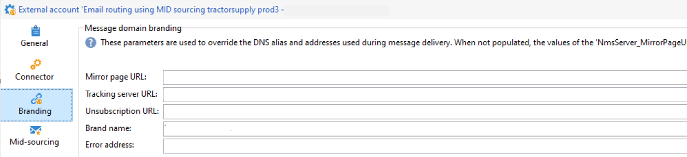

# 開始使用品牌化 {#branding-gs}

>[!AVAILABILITY]
>
>此功能僅針對新實作以隨選方式提供。 若要取得存取權，請聯絡您的 Adobe 代表。

每家公司都有品牌准則，對視覺元素和技術細節加以定義。 Adobe Campaign可協助您集中管理這些方針，因此您所做的一切（從電子郵件中的標誌，到您的行銷活動中使用的URL和網域）都能向客戶呈現一致的品牌形象。

技術管理員可以直接從Web UI建立和管理多個品牌。 這可讓您定義構成品牌身分識別的所有元素，包括標誌，甚至電子郵件追蹤設定。 這些品牌建立後，即可輕鬆連結至您的傳送。 [瞭解如何建立和設定品牌](branding-configure.md)。

您可以在Campaign中新增組織的實體，或建立必須在其他子網域下傳送的新電子郵件型別。 若要執行此作業，請依照下列步驟操作：

1. **設定新的子網域** — 對於Adobe要使用的任何新子網域，第一步是進行設定。 您可以透過[Campaign控制面板](https://experienceleague.adobe.com/docs/control-panel/using/subdomains-and-certificates/subdomains-branding.html?lang=zh-Hant)執行此工作，或連絡您的Adobe技術連絡人。 在此頁面[&#128279;](https://experienceleague.adobe.com/en/docs/deliverability-learn/deliverability-best-practice-guide/additional-resources/campaign/ac-domain-name-setup)中進一步瞭解子網域設定。

   >[!NOTE]
   >
   >所有管理員使用者都可存取控制面板。 授予使用者管理員存取權限的步驟已詳載於[本頁](https://experienceleague.adobe.com/docs/control-panel/using/discover-control-panel/managing-permissions.html?lang=zh-Hant#discover-control-panel)中。

1. **建立傳遞範本** — 新品牌可用後，最佳實務是建立至少一個參考此新品牌的新空白傳遞範本。 [了解更多資訊](branding-assign.md)。

1. **檢查傳遞能力准則** — 開始使用新網域之前，應與Adobe傳遞能力團隊討論策略。 例如，若應建立新的相似性來分割網域之間的IP，和/或若應定義加速計畫，則這些規則將有助於定義最佳實務。

## 相容性注意事項 {#compatibility-note}

新的集中式品牌模式與先前在使用者端主控台中使用的[舊版品牌](https://experienceleague.adobe.com/docs/campaign-classic/using/transactional-messaging/configure-transactional-messaging/additional-configurations.html#configuring-multibranding){target="_blank"}設定不相容。

在舊版方法中，客戶透過擴充extAccount表單並使用&#x200B;**品牌**&#x200B;標籤來實作品牌。

如果您的現有環境使用此舊版設定，則無法將其直接移轉至新的集中式品牌模型。 採用新系統需完全重新實作品牌設定。