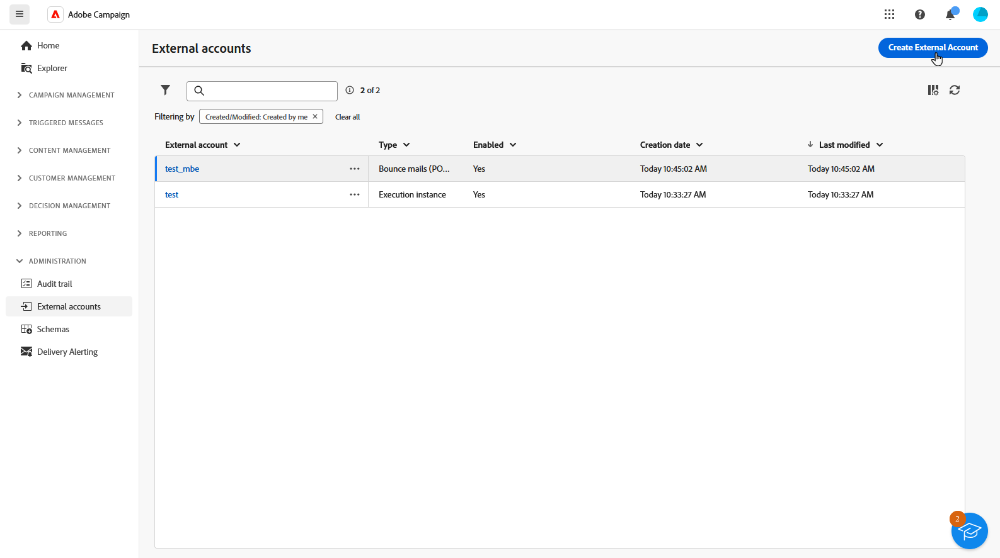
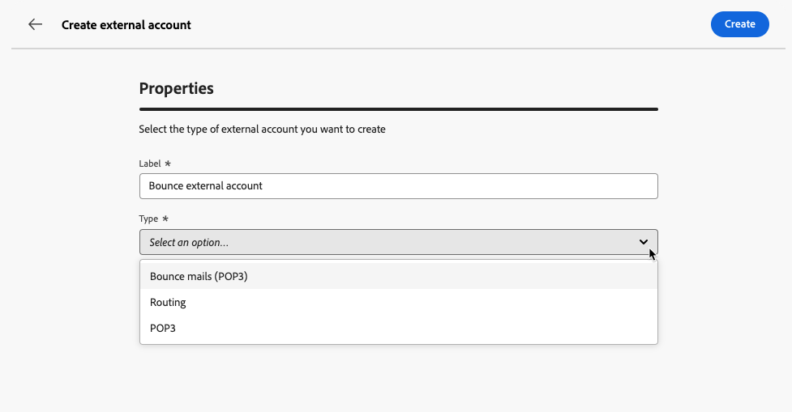
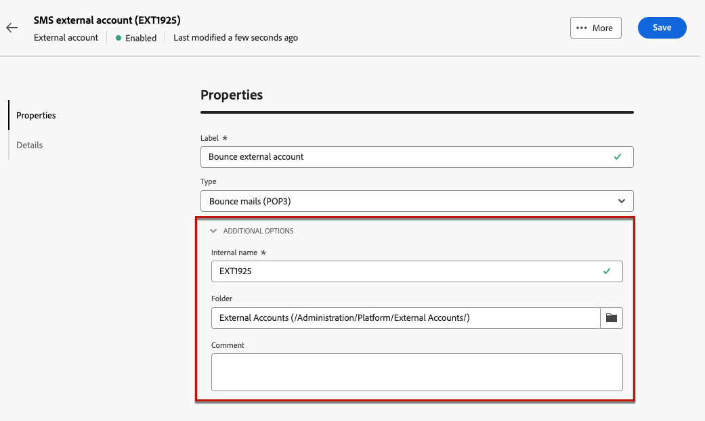
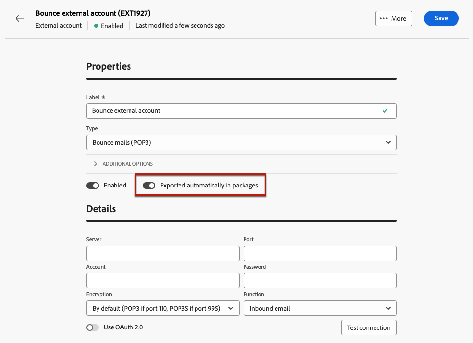

# 建立外部帳戶 {#create-external-account}

若要建立新的外部帳戶，請遵循下列步驟。 特定的組態設定取決於您正在建立的外部帳戶型別。

1. 從左窗格功能表，選取&#x200B;**[!UICONTROL 管理]**&#x200B;下的&#x200B;**[!UICONTROL 外部帳戶]**。

1. 按一下&#x200B;**[!UICONTROL 建立外部帳戶]**。

   

1. 輸入您的&#x200B;**[!UICONTROL 標籤]**&#x200B;並選取外部帳戶&#x200B;**[!UICONTROL 型別]**。

   * [促銷活動特定型別](external-account.md)
   * [Adobe解決方案整合](integration-external-account.md)
   * [傳輸資料](transfer-external-account.md)
   * [外部資料庫](external-account-database.md)

   

1. 按一下「**[!UICONTROL 建立]**」。

1. 從&#x200B;**[!UICONTROL 其他選項]**&#x200B;下拉式清單中，視需要變更&#x200B;**[!UICONTROL 內部名稱]**&#x200B;或&#x200B;**[!UICONTROL 資料夾]**&#x200B;路徑。

   

1. 啟用&#x200B;**[!UICONTROL 自動匯出到封裝]**&#x200B;選項，以自動匯出此外部帳戶管理的資料。<!--Exported where??-->

   

1. 在&#x200B;**[!UICONTROL 詳細資料]**&#x200B;區段中，根據所選外部帳戶型別指定認證，以設定帳戶的存取權。 [了解更多](#bounce)

1. 按一下&#x200B;**[!UICONTROL 測試連線]**&#x200B;以驗證您的設定是否正確。

1. 從&#x200B;**[!UICONTROL 更多……]**&#x200B;功能表，複製或刪除您的外部帳戶。

   ![熒幕擷圖顯示[更多]功能表，其中包含複製或刪除外部帳戶的選項。](assets/external_account_create_4.png)

1. 組態完成後，按一下[儲存]。****
