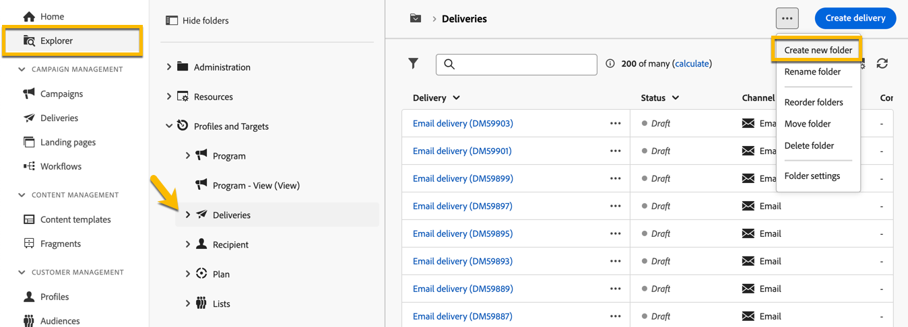

# 建立及管理資料夾

在Adobe Campaign中，您可以建立新資料夾來管理導覽樹狀結構。 在 **[!UICONTROL 瀏覽器]**，前往您要建立新資料夾的資料夾。

在 **[!UICONTROL ...]** 按鈕，您有 **[!UICONTROL 建立新資料夾]**

{zoomable="yes"}

當您建立新資料夾時，依預設，資料夾型別是資料夾父項的型別。
在我們的範例中，我們會在 **[!UICONTROL 傳遞]** 資料夾。

{zoomable="yes"}

您可以按一下「資料夾型別」圖示，變更資料夾型別，並可在顯示的清單中選擇它：

{zoomable="yes"}

若要設定資料夾型別，請按一下 **[!UICONTROL 確認]** 按鈕。

如果您想建立不含特定型別的資料夾，請選擇 **[!UICONTROL 一般資料夾]** 型別。

在Adobe Campaign Console中，您已說明資料夾的建立和管理流程 [此處](https://experienceleague.adobe.com/en/docs/campaign/campaign-v8/config/configuration/folders-and-views)，您也可以設定檔案夾的許可權。 [了解更多](https://experienceleague.adobe.com/en/docs/campaign/campaign-v8/admin/permissions/folder-permissions)
