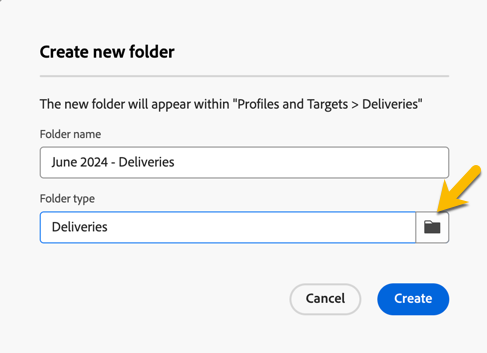

# 建立和管理資料夾

在Adobe Campaign中，您可以建立新資料夾來管理導覽樹狀結構。 在&#x200B;**[!UICONTROL Explorer]**&#x200B;中，移至您要建立新資料夾的資料夾。

在&#x200B;**[!UICONTROL ...]**&#x200B;按鈕下，選取&#x200B;**[!UICONTROL 建立新資料夾]**。

![熒幕擷圖顯示……按鈕下的[建立新資料夾]選項](assets/folder_create.png){zoomable="yes"}

當您建立新資料夾時，資料夾型別會預設為父資料夾的型別。\
在這個範例中，會在&#x200B;**[!UICONTROL 傳遞]**&#x200B;資料夾中建立一個資料夾。

{zoomable="yes"}中建立的新資料夾

您可以按一下「資料夾型別」圖示，並從顯示的清單中選取型別，來變更資料夾型別。

{zoomable="yes"}

按一下「**[!UICONTROL 確認]**」按鈕，設定資料夾類型。

若要建立不含特定型別的資料夾，請選取&#x200B;**[!UICONTROL 一般資料夾]**&#x200B;型別。

在Adobe Campaign主控台中，建立及管理資料夾的程式會在[這裡](https://experienceleague.adobe.com/zh-hant/docs/campaign/campaign-v8/config/configuration/folders-and-views)說明。 您也可以設定檔案夾的許可權。 [了解更多](https://experienceleague.adobe.com/zh-hant/docs/campaign/campaign-v8/admin/permissions/folder-permissions)。