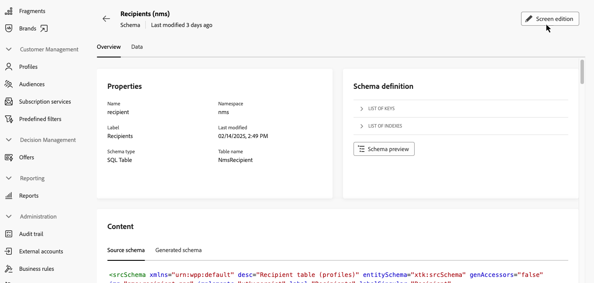
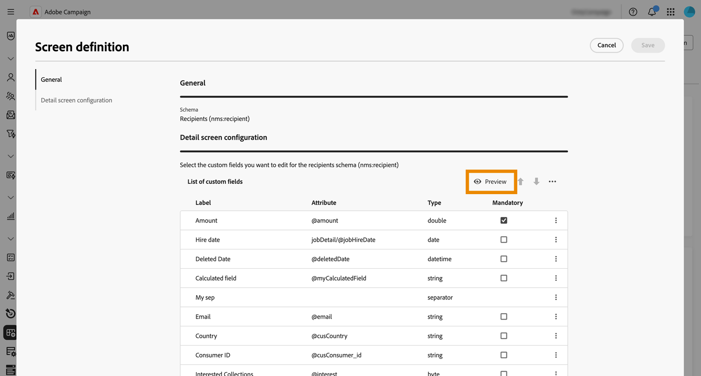
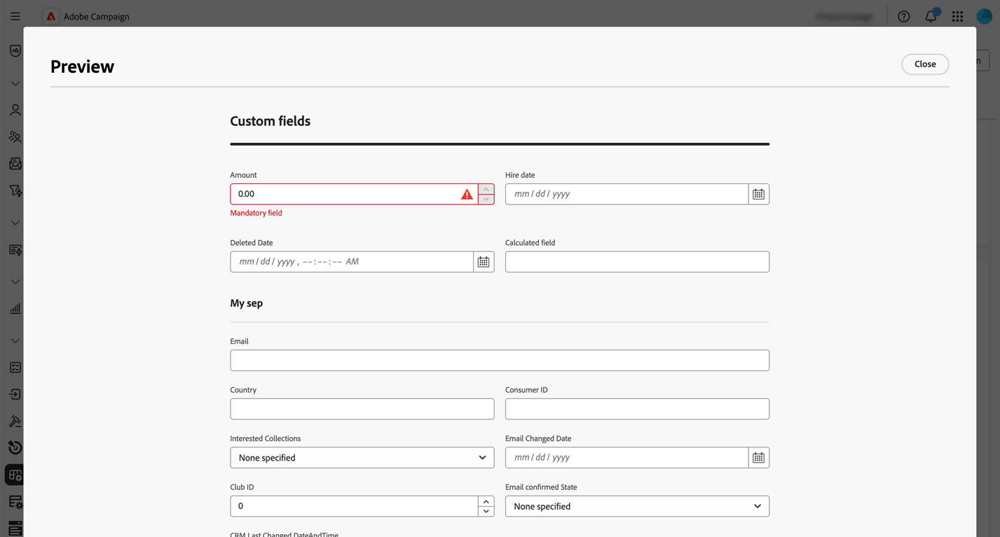
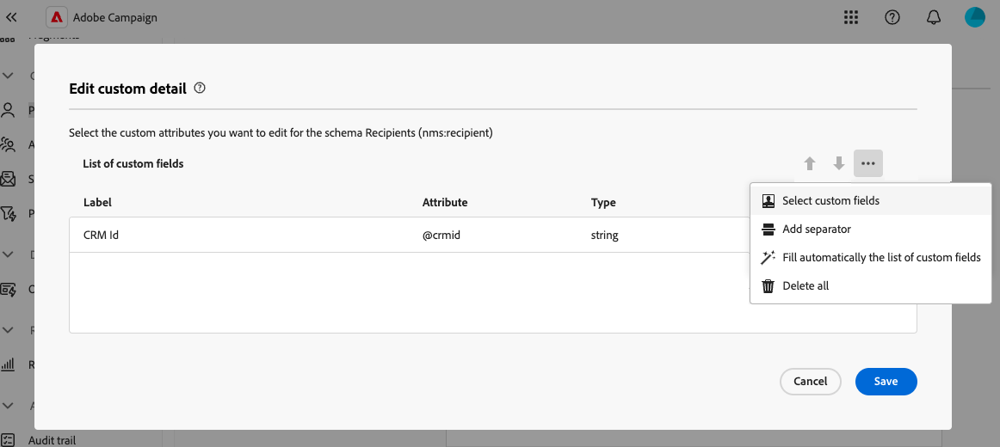
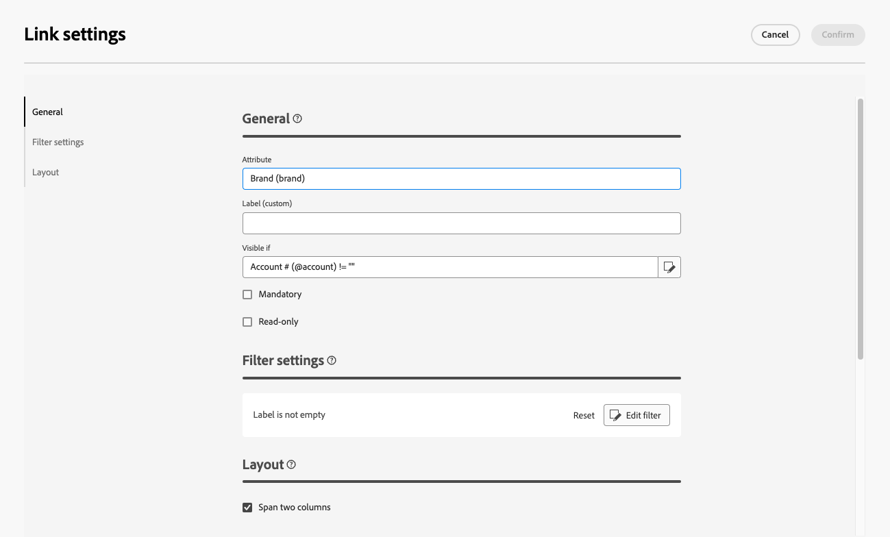
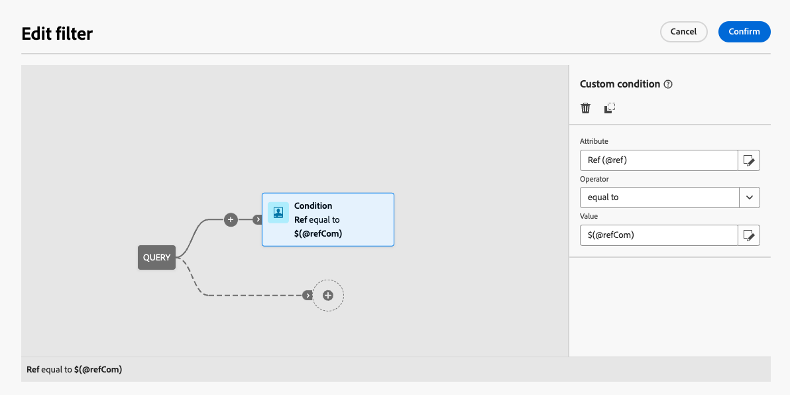
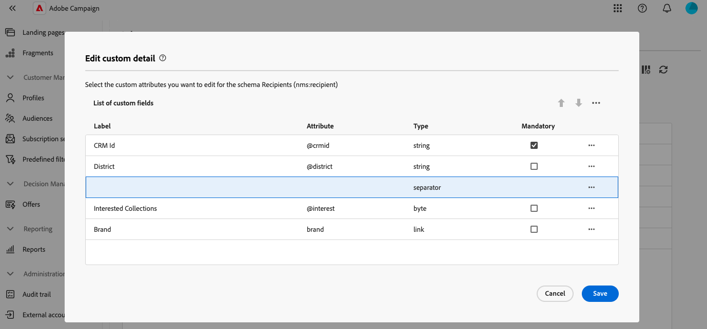
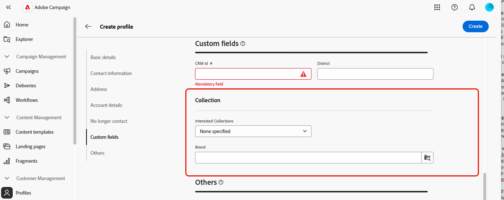

# 設定自訂欄位 {#custom-fields}

>[!CONTEXTUALHELP]
>id="acw_schema_editcustomfields"
>title="螢幕版本"
>abstract="介面中顯示的所有自訂欄位，以供顯示選取的結構描述。您可以使用向上鍵和向下鍵來變更其在介面中的顯示順序，並透過新增分隔符號將欄位分組到子區段中。若要刪除自訂欄位或編輯可見度條件等設定，請按一下省略符號按鈕。"

>[!CONTEXTUALHELP]
>id="acw_schema_editcustomfields_settings_general"
>title="一般"
>abstract="定義自訂欄位的一般設定。如果沒有提供標籤，則會顯示結構描述中定義的標籤。使用「**符合條件時可見**」欄位並利用控制何時顯示該欄位的 xtk 運算式來定義條件。您也可以在介面中將欄位標記為必填或唯讀。"

>[!CONTEXTUALHELP]
>id="acw_schema_editcustomfields_settings_link"
>title="連結屬性"
>abstract="使用查詢建模工具以指定顯示連結類型自訂欄位的規則。例如，根據另一個欄位的輸入來限制清單值。"

>[!CONTEXTUALHELP]
>id="acw_schema_editcustomfields_settings_layout"
>title="版面配置"
>abstract="預設情況下，自訂欄位在介面中顯示為兩欄。將這個選項切換為開啟，以全螢幕的寬度而非兩欄來顯示自訂欄位。"

>[!CONTEXTUALHELP]
>id="acw_schema_editcustomfields_separatorproperties"
>title="分隔符號屬性"
>abstract="指定在介面中顯示的子區段名稱。"

<!-- NOT USED IN THE UI?-->

>[!CONTEXTUALHELP]
>id="acw_schema_editcustomfields_settings"
>title="屬性設定"
>abstract="屬性設定"

自訂欄位是透過Adobe Campaign主控台新增至現成可用結構描述的其他屬性。 它們可讓您透過包含新屬性來自訂結構以符合您組織的需求。 在[Adobe Campaign v8檔案](https://experienceleague.adobe.com/docs/campaign/campaign-v8/developer/shemas-forms/extend-schema.html?lang=zh-Hant){target="_blank"}中瞭解如何擴充結構描述。

自訂欄位可顯示在各種畫面中，例如Campaign網頁介面中的設定檔詳細資料。 管理員可以控制哪些欄位可見，以及這些欄位的顯示方式。 這些變更會套用至所有Campaign使用者。

>[!NOTE]
>
>您必須擁有管理員許可權才能管理自訂欄位。

自訂欄位適用於下列結構描述：

* 行銷活動(nms)
* 計畫(nms)
* 程式(nms)
* 收件者(nms)
* 種子地址(nms)
* 傳遞(nms)

## 將自訂欄位新增到介面 {#add-custom}

>[!CONTEXTUALHELP]
>id="acw_schema_screen_definition"
>title="畫面定義"
>abstract="定義要為結構描述及其屬性編輯的自訂欄位清單。按一下「**預覽**」按鈕可在範例畫面中顯示自訂欄位。"

若要在介面中顯示自訂欄位，請執行下列步驟：

1. 瀏覽至左側導覽窗格中的&#x200B;**[!UICONTROL 結構描述]**&#x200B;功能表，並找出所需的結構描述。

   使用篩選器窗格中的&#x200B;**[!UICONTROL 可編輯]**&#x200B;篩選器，以快速識別具有自訂欄位的結構描述。

   ![在導覽窗格中顯示[結構描述]功能表與[可編輯]篩選器的熒幕擷圖](assets/custom-fields-open.png)

1. 在清單中選取結構描述名稱以開啟它。 詳細結構檢視隨即顯示。 [進一步瞭解結構描述詳細資料](../administration/schemas.md)。 按一下&#x200B;**[!UICONTROL 熒幕版本]**&#x200B;按鈕以存取自訂欄位。 在此範例中，已為&#x200B;**[!UICONTROL 收件者]**&#x200B;結構描述新增欄位。

   

   隨即顯示架構介面中所顯示的自訂欄位清單。

1. 按一下「**[!UICONTROL 預覽]**」按鈕可在範例畫面中顯示自訂欄位。

   

   在此處，「金額」欄位已標籤為必要。

   

1. 若要新增自訂欄位至介面，請按一下省略符號按鈕，然後選擇下列其中一個選項：

   * **[!UICONTROL 選取自訂欄位]**：選取一或多個自訂欄位以顯示於介面中。
   * **[!UICONTROL 自動填寫自訂欄位清單]**：將結構描述定義的所有自訂欄位新增到介面。

   

1. 新增自訂欄位後，您可以：

   * **重新排序欄位**：使用上下箭頭，或使用拖放方式來移動欄位。
   * **將欄位設為必要**：選取&#x200B;**必要**&#x200B;核取方塊。
   * **編輯欄位設定**：按一下省略符號按鈕，然後選擇&#x200B;**[!UICONTROL 編輯]**。 [了解更多](#settings)
   * **刪除欄位**：按一下省略符號按鈕，然後選擇&#x200B;**[!UICONTROL 刪除]**。
   * **在介面中將欄位組織成子區段**：按一下上下箭頭旁的省略符號按鈕，然後選擇&#x200B;**[!UICONTROL 新增分隔符號]**。 [了解更多](#separator)

## 設定自訂欄位設定 {#settings}

若要設定每個自訂欄位的特定設定，請按一下所需欄位旁的省略符號按鈕，並選取&#x200B;**[!UICONTROL 編輯]**。

可用的設定包括：

* **[!UICONTROL 屬性]**：自訂欄位的名稱。
* **[!UICONTROL 標籤（自訂）]**：要顯示在介面中的標籤。 如果未提供標籤，則會顯示結構描述中定義的標籤。
* **[!UICONTROL 顯示條件：]**：使用控制欄位顯示時間的xtk運算式定義條件。 例如，如果另一個欄位為空，則隱藏此欄位。
* **[!UICONTROL 必要]**：在介面中將欄位設為必要。
* **[!UICONTROL 唯讀]**：將介面中的欄位設為唯讀。 使用者將無法編輯欄位的值。
* **[!UICONTROL 篩選器設定]** （針對連結型別欄位）：使用查詢模組化工具來指定顯示連結型別自訂欄位的規則。 例如，根據另一個欄位的輸入來限制清單值。

  您也可以使用語法`$(<field-name>)`，參考條件中其他欄位輸入的值。 這可讓您參照在表單中輸入的欄位目前值，即使它尚未儲存到資料庫亦然。

  在以下範例中，條件會檢查@ref欄位的值是否與在@refCom欄位中輸入的值相符。 相反地，使用`@refCom`而非`$(@refCom)`會參照資料庫中@ref欄位的值。

  +++檢視範例

  

  +++

* **[!UICONTROL 跨越兩欄]**：根據預設，介面中的自訂欄位會以兩欄顯示。 將這個選項切換為開啟，以全螢幕的寬度而非兩欄來顯示自訂欄位。

## 組織子區段中的自訂欄位 {#separator}

Campaign Web使用者介面可讓您新增分隔符號，以便將介面中的自訂欄位分組，以提高可讀性。 若要這麼做，請依照以下步驟進行：

1. 按一下上下箭頭旁邊的省略符號按鈕，然後選取&#x200B;**[!UICONTROL 新增分隔符號]**。

1. 代表分隔符號的新行會新增至清單中。 按一下省略符號按鈕，然後選擇&#x200B;**[!UICONTROL 編輯]**&#x200B;以命名子區段。

1. 使用向上和向下箭頭將分隔符號移至所需位置。 分隔符號下方所列的欄位將會分組在它下方。

   在此範例中，「感興趣的集合」和「品牌」欄位會分組到「集合」子區段。

   | 自訂欄位設定 | 在介面中轉譯 |
   |  ---  |  ---  |
   | {zoomable="yes"} | {zoomable="yes"} |