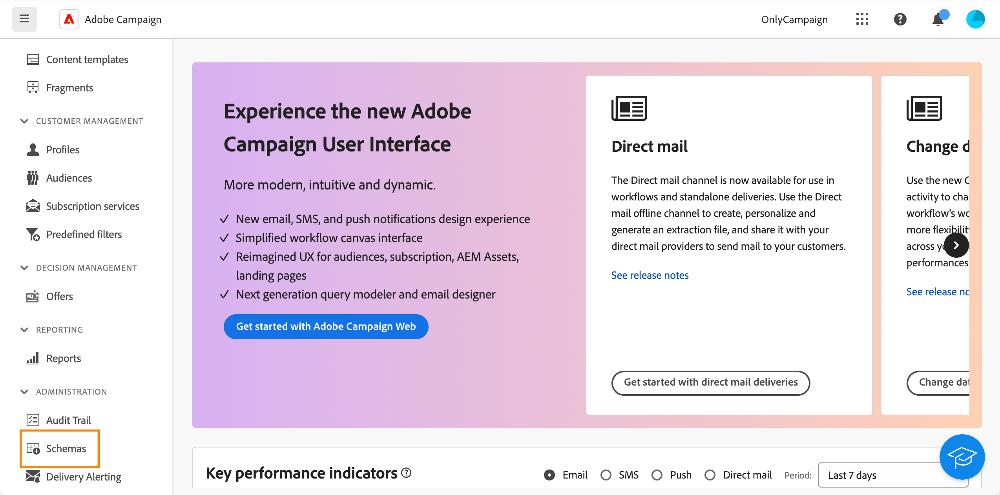
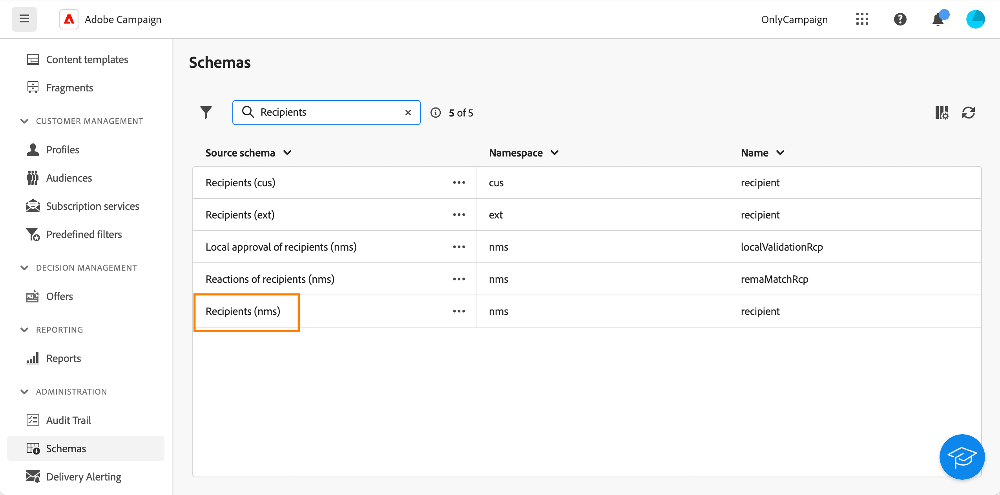
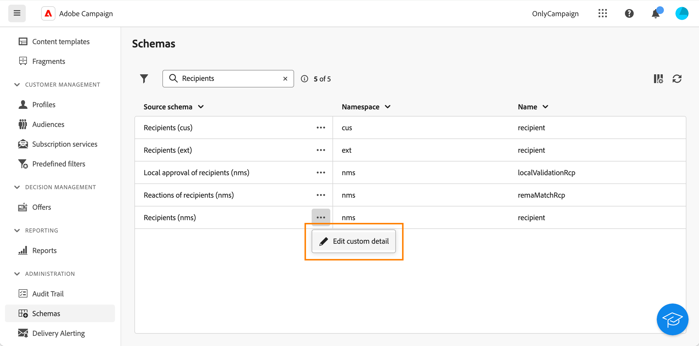
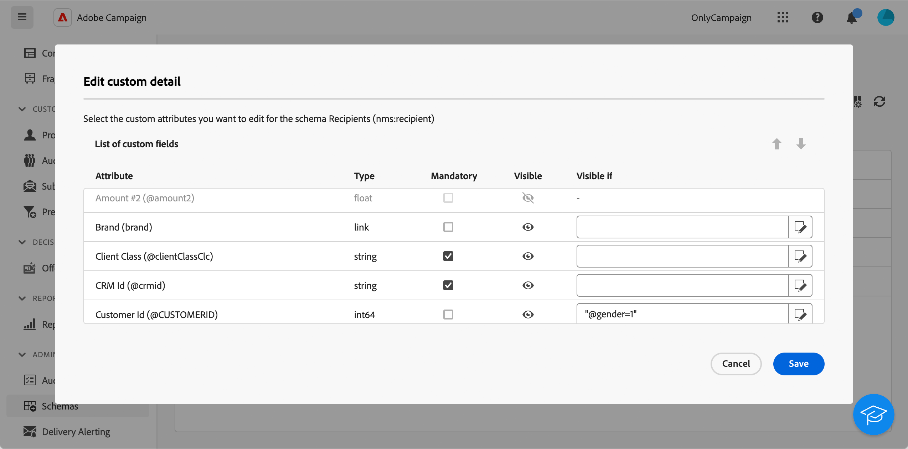
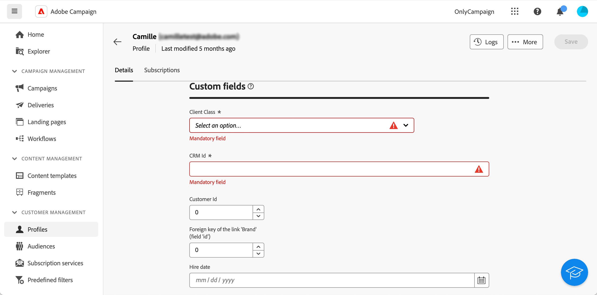

# 設定自訂欄位 {#custom-fields}

自訂欄位是透過 Adobe Campaign 主控台新增到現成結構描述的附加屬性。在[Adobe Campaign v8檔案](https://experienceleague.adobe.com/docs/campaign/campaign-v8/developer/shemas-forms/extend-schema.html){target="_blank"}中進一步瞭解

這些自訂欄位會顯示在各種畫面中，例如設定檔或測試設定檔的詳細資訊。

在Web使用者介面中，您無法建立自訂欄位，但可以修改其顯示方式。 修改會套用至所有Campaign使用者。

>[!NOTE]
>
>您必須有管理員許可權才能修改自訂欄位。

自訂欄位可用於下列結構描述：

* 收件者(nms)
* 行銷活動(nms)
* 傳遞(nms)
* 種子地址(nms)

若要設定自訂欄位，請執行下列步驟：

1. 在&#x200B;**管理**&#x200B;下，按一下&#x200B;**結構描述**。

   {zoomable="yes"}

1. 找到所需的結構描述，例如&#x200B;**收件者(nms)**&#x200B;結構描述。

   {zoomable="yes"}

1. 按一下&#x200B;**其他動作**&#x200B;按鈕，然後選取&#x200B;**編輯自訂詳細資料**。

   {zoomable="yes"}

   **編輯自訂詳細資料**&#x200B;畫面會顯示所有自訂欄位及其型別。

   {zoomable="yes"}

   此畫面可讓您執行下列動作：

   * 使用向上和向下箭頭變更不同欄位的順序。
   * 將欄位設為必要：勾選&#x200B;**必要**&#x200B;方塊。
   * 顯示或隱藏欄位：按一下&#x200B;**顯示**&#x200B;按鈕。
   * 新增可見性條件：按一下&#x200B;**Visible if**&#x200B;按鈕，並使用可用的xtk函式撰寫xtk運算式。

1. 導覽至顯示自訂欄位的畫面。 在我們的範例中，這是設定檔詳細資訊畫面。

   {zoomable="yes"}
