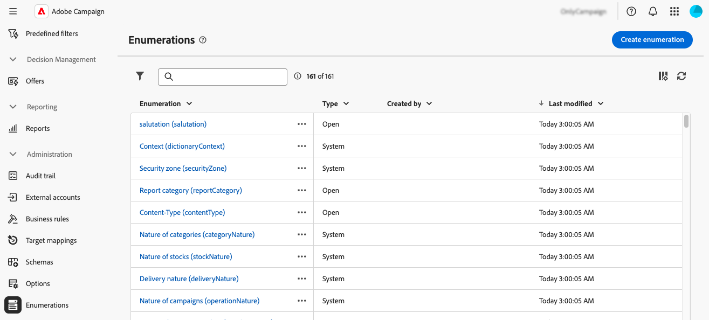
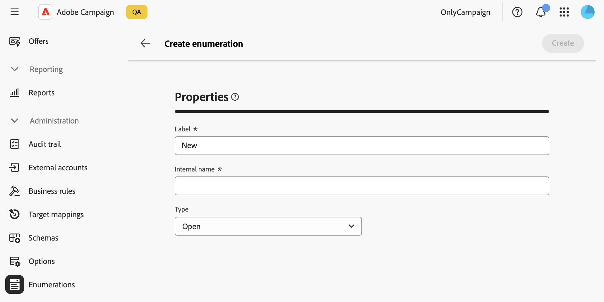
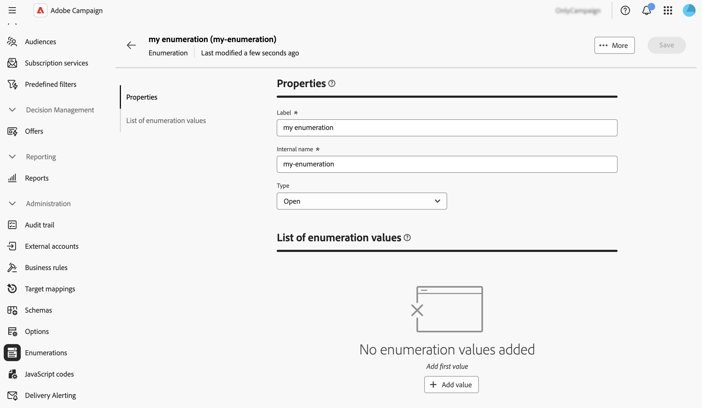
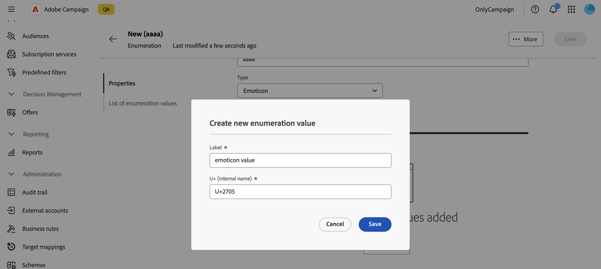
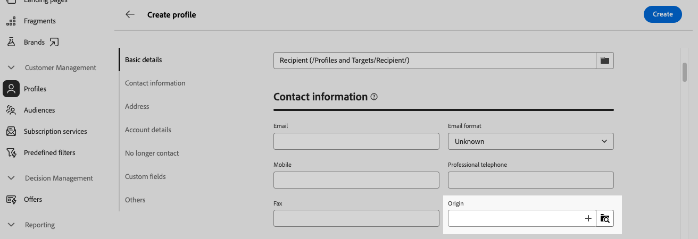
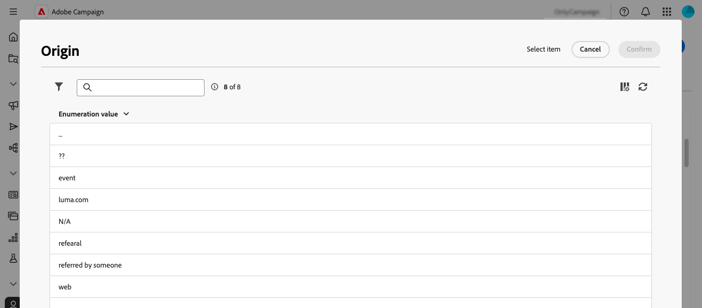
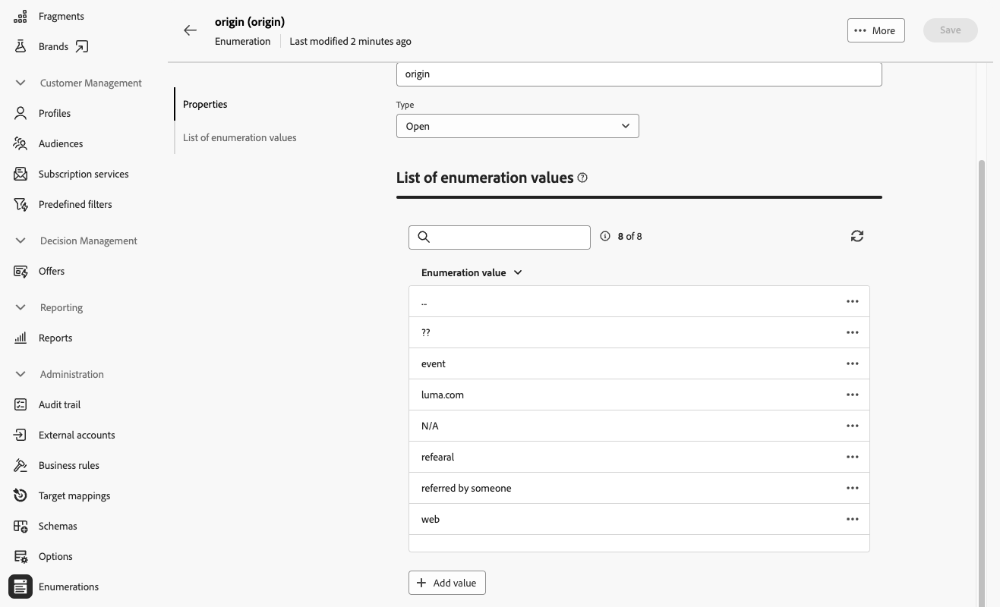
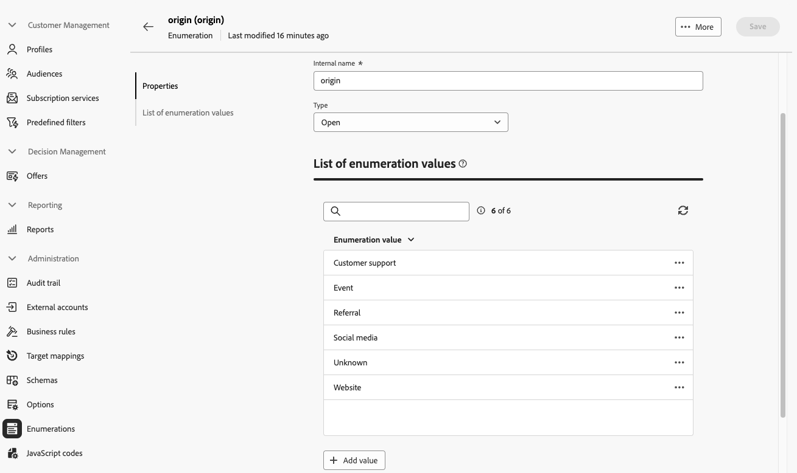
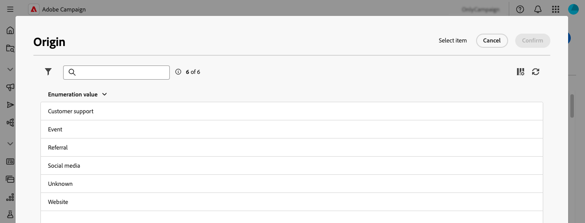

# 管理列舉 {#enumerations}

>[!CONTEXTUALHELP]
>id="acw_homepage_welcome_rn4"
>title="建立列舉"
>abstract="您現在可以直接透過 Adobe Campaign Web 使用者介面建立列舉。列舉是系統建議可以填入欄位的一組數值。"
>additional-url="https://experienceleague.adobe.com/docs/campaign-web/v8/release-notes/release-notes.html?lang=zh-hant" text="請參閱版本注意事項"

>[!CONTEXTUALHELP]
>id="acw_enumerations_list"
>title="分項清單"
>abstract="列舉是系統建議填入欄位的值清單。使用列舉來標準化這些欄位的值，以協助資料輸入或在查詢中使用。"

>[!CONTEXTUALHELP]
>id="acw_enumerations_properties"
>title="屬性"
>abstract="定義列舉的屬性，例如其名稱、內部名稱和類型。「**[!UICONTROL 已關閉的]**」列舉具有固定的值清單，只能從「**[!UICONTROL 列舉]**」選單中進行修改。「**[!UICONTROL 開放]**」列舉可讓使用者根據此列舉直接在欄位加入新的值。「**[!UICONTROL 系統]**」列舉與系統欄位相關。「**[!UICONTROL 表情符號]**」列舉用於更新表情符號清單。"

>[!CONTEXTUALHELP]
>id="acw_enumerations_values"
>title="列舉值的清單"
>abstract="若要新增數值至列舉，請按一下「**[!UICONTROL 新增數值]**」按鈕，然後依需求進行設定。"

## 什麼是分項清單？ {#about}

列舉是系統建議填入欄位的值清單。使用列舉來標準化這些欄位的值，有助於資料輸入或在查詢中使用。 值清單會以下拉式清單的形式顯示，您可以從中選取要在欄位中輸入的值。 下拉式清單也會啟用預測性輸入：輸入第一個字母，應用程式會填入其餘字母。

此型別欄位的值是透過左側導覽窗格中的&#x200B;**[!UICONTROL 管理]** / **[!UICONTROL 列舉]**&#x200B;功能表來定義。

## 建立分項清單 {#create}

若要建立分項清單，請遵循下列步驟：

1. 導覽至&#x200B;**[!UICONTROL 分項清單]**&#x200B;功能表，然後按一下&#x200B;**[!UICONTROL 建立分項清單]**&#x200B;按鈕。

1. 輸入列舉的&#x200B;**[!UICONTROL 標籤]**&#x200B;和&#x200B;**[!UICONTROL 內部名稱]**。

   

1. 選取分項清單&#x200B;**[!UICONTROL 型別]**：

   * **[!UICONTROL 已關閉的]**&#x200B;列舉具有只能從&#x200B;**[!UICONTROL 列舉]**&#x200B;功能表修改的固定值清單。
   * **[!UICONTROL 開啟]**&#x200B;列舉允許使用者根據此列舉直接在欄位中新增值。
   * **[!UICONTROL 系統]**&#x200B;列舉與系統欄位相關聯。
   * 「**[!UICONTROL 表情符號]**」列舉用於更新表情符號清單。

1. 按一下 **[!UICONTROL 建立]**。列舉詳細資訊隨即顯示，可讓您新增值至清單。

   

1. 若要新增值，請按一下&#x200B;**[!UICONTROL 新增值]**&#x200B;按鈕，然後視需要加以設定：

   * **[!UICONTROL 標籤]**：要在列舉中顯示的標籤。
   * **[!UICONTROL 內部名稱]**：值的內部名稱（用於系統列舉）。
   * **[!UICONTROL U+ （內部名稱）]** （表情符號列舉）：表情符號的Unicode代碼（用於表情符號列舉）。

   

1. 儲存您的變更。分項清單現在會在使用的畫面中更新。

## 使用案例：將預先定義的值新增至分項清單 {#uc}

依預設，設定檔詳細資訊畫面中的「來源」欄位可讓使用者自由輸入任何值。

每次使用者為欄位輸入值時，該值會自動新增到「來源」分項清單中，這可能會導致值清單中的值隨著時間推移出現冗餘、不一致或錯誤。

為了確保資料一致性並引導使用者填寫欄位，您可以定義一組預先定義的值。 請依照下列步驟操作：

1. 前往&#x200B;**[!UICONTROL 列舉]**&#x200B;功能表並開啟「原始」列舉。

2. 檢閱使用者輸入的值清單並加以清除。 按一下值旁邊的省略符號按鈕以將其刪除。 如果清單包含太多不一致專案，請刪除整個分項清單，然後從頭開始重新建立。

   

3. 新增預先定義的值。 若要這麼做，請按一下&#x200B;**[!UICONTROL 新增值]**&#x200B;按鈕，然後輸入使用者應選取的預先定義值。

   

4. 若要強制執行一致性，請將列舉型別切換為&#x200B;**[!UICONTROL 已關閉]**，這會限制使用者只能使用預先定義的值。
如果需要彈性，請保持它**[!UICONTROL 開啟]**&#x200B;以允許新的使用者專案。

5. 返回設定檔詳細資訊畫面。 「原點」欄位現在會顯示預先定義的選取值。

   
