# 外部資料庫帳戶 {#external-accounts}

使用外部資料庫型別外部帳戶將Adobe Campaign連線至協力廠商資料庫。

外部帳戶的組態設定會依您連線的資料庫引擎而有所不同。 如需每個支援資料庫的詳細說明，請參閱以下章節。

## Amazon Redshift

Amazon Redshift外部帳戶可讓您將您的Campaign執行個體連線至Amazon Redshift外部資料庫。

在Adobe Campaign網頁使用者介面中，設定您的Amazon Redshift外部帳戶。

1. [建立您的外部帳戶](external-account.md)，並選取&#x200B;**[!UICONTROL 外部資料庫]**&#x200B;作為外部帳戶的&#x200B;**[!UICONTROL 型別]**，並選取Amazon Redshift作為&#x200B;**[!UICONTROL 提供者型別]**。

1. 按一下「**[!UICONTROL 建立]**」。

1. 若要設定&#x200B;**[!UICONTROL Amazon Redshift]**&#x200B;外部帳戶，請填寫下列欄位：

   * **[!UICONTROL 型別]**： Amazon Redshift

   * **[!UICONTROL 伺服器]**：輸入Redshift伺服器的DNS名稱。

   * **[!UICONTROL 帳戶]**：提供將用於驗證的Redshift使用者名稱。

   * **[!UICONTROL 密碼]**：輸入與使用者帳戶關聯的密碼。

   * **[!UICONTROL 資料庫]**：如果尚未在DSN中定義資料庫名稱，請指定資料庫名稱。 如果DSN包含資料庫，則將此欄位保留空白。

   * **[!UICONTROL 工作結構描述]**：輸入Adobe Campaign將操作的結構描述名稱。

   * **[!UICONTROL 選項]**：新增您的環境可能需要的任何進階組態選項。

   * **[!UICONTROL 時區]**：選取或輸入伺服器的時區，以確保精確的時間作業。

   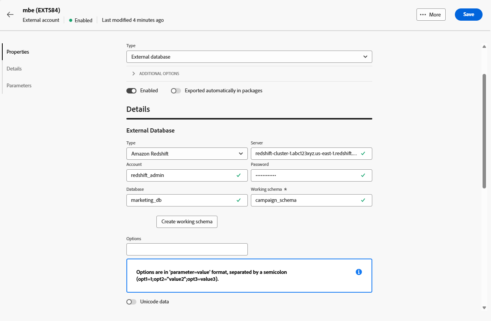

1. 設定連線後，請在遠端Redshift資料庫中建立Adobe Campaign SQL函式。 這些功能可用後，按一下&#x200B;**[!UICONTROL 部署功能]**&#x200B;以啟動它們。

1. 連結您的&#x200B;**[!UICONTROL 儲存體帳戶]**&#x200B;以最佳化效能，並在Adobe Campaign和Amazon Redshift之間啟用更快速的資料載入程式。

1. 輸入您的&#x200B;**[!UICONTROL 帳戶角色]**，該角色會決定Adobe Campaign在與您的Redshift環境互動時將使用的許可權。

## Amazon Redshift （舊版）

Amazon Redshift （舊版）外部帳戶可讓您將Campaign執行個體連線至Amazon Redshift外部資料庫。

在Adobe Campaign網頁使用者介面中，設定您的Amazon Redshift （舊版）外部帳戶。

1. [建立您的外部帳戶](external-account.md)，並選取&#x200B;**[!UICONTROL 外部資料庫]**&#x200B;作為外部帳戶的&#x200B;**[!UICONTROL 型別]**，並選取Amazon Redshift （舊版）作為&#x200B;**[!UICONTROL 提供者型別]**。

1. 按一下「**[!UICONTROL 建立]**」。

1. 若要設定&#x200B;**[!UICONTROL Amazon Redshift （舊版）]**&#x200B;外部帳戶，請填寫下列欄位：

   * **[!UICONTROL 型別]**： Amazon Redshift （舊版）

   * **[!UICONTROL 伺服器]**：輸入Redshift伺服器的DNS名稱。

   * **[!UICONTROL 帳戶]**：提供將用於驗證的Redshift使用者名稱。

   * **[!UICONTROL 密碼]**：輸入與使用者帳戶關聯的密碼。

   * **[!UICONTROL 資料庫]**：如果尚未在DSN中定義資料庫名稱，請指定資料庫名稱。 如果DSN包含資料庫，則將此欄位保留空白。

   * **[!UICONTROL 工作結構描述]**：輸入Adobe Campaign將操作的結構描述名稱。

   * **[!UICONTROL 時區]**：選取或輸入伺服器的時區，以確保精確的時間作業。

   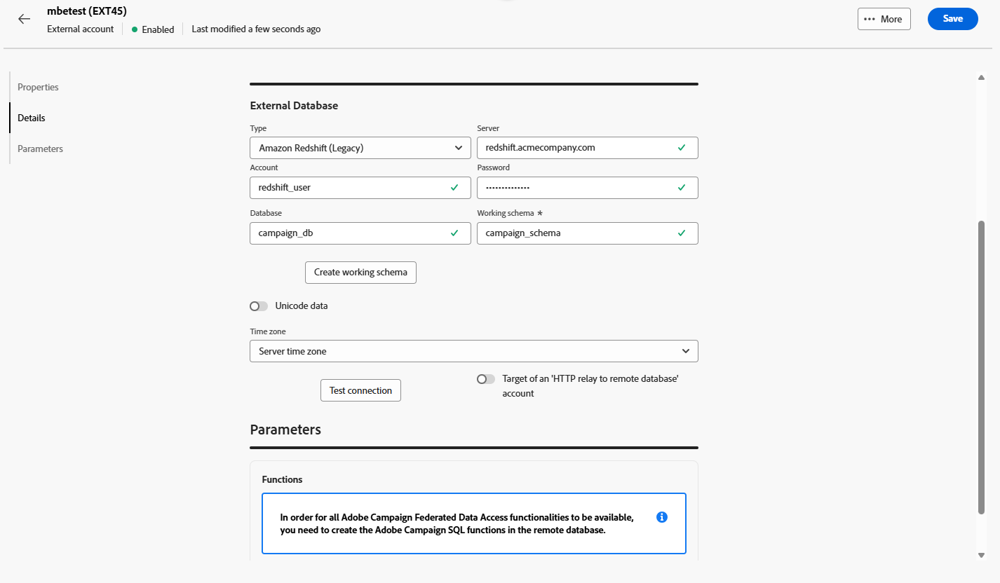

1. 設定連線後，請在遠端Redshift資料庫中建立Adobe Campaign SQL函式。 這些功能可用後，按一下&#x200B;**[!UICONTROL 部署功能]**&#x200B;以啟動它們。

## Azure Synapse Analytics

Azure Synapse Analytics外部帳戶可讓您將您的Campaign執行個體連線至Azure Synapse外部資料庫。

在Adobe Campaign網頁使用者介面中，設定您的Azure Synapse Analytics外部帳戶。

1. [建立您的外部帳戶](external-account.md)，並選取&#x200B;**[!UICONTROL 外部資料庫]**&#x200B;作為外部帳戶的&#x200B;**[!UICONTROL 型別]**，並選取Amazon Redshift作為&#x200B;**[!UICONTROL 提供者型別]**。

1. 按一下「**[!UICONTROL 建立]**」。

1. 若要設定&#x200B;**[!UICONTROL Azure Synapse Analytics]**&#x200B;外部帳戶，請填寫下列欄位：

   * **[!UICONTROL 型別]**： Azure Synapse Analytics

   * **[!UICONTROL 伺服器]**：輸入Azure Synapse伺服器的URL。

   * **[!UICONTROL 帳戶]**：提供將使用Synapse資料庫進行驗證的使用者名稱。

   * **[!UICONTROL 密碼]**：輸入與帳戶關聯的密碼。

   * **[!UICONTROL 資料庫]**：指定您要Adobe Campaign連線的目標資料庫。

   * **[!UICONTROL 資料表和函式前置詞]**：預設會設定為帳戶名稱。 如果您偏好使用不同的首碼來識別促銷活動相關物件，則可加以調整。

   * **[!UICONTROL 選項]**：新增您的環境可能需要的任何進階組態選項。

   * **[!UICONTROL 時區]**：選取或輸入伺服器的時區，以確保精確的時間作業。

   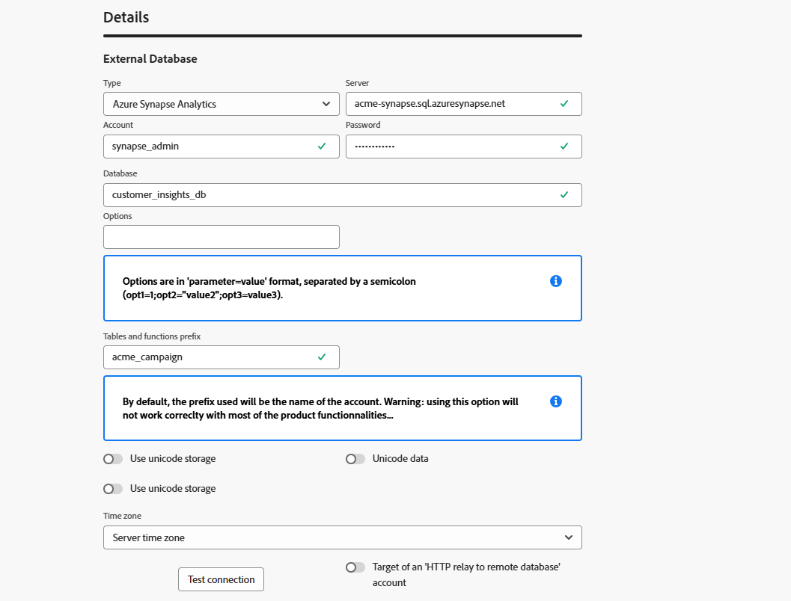

1. 您可以選擇啟用&#x200B;**[!UICONTROL 使用表格的工作表格空間]**&#x200B;選項，然後指定儲存工作表格的&#x200B;**[!UICONTROL 表格空間]**。

1. 如有需要，請啟用&#x200B;**[!UICONTROL 使用索引的工作表格空間]**&#x200B;選項，然後提供&#x200B;**[!UICONTROL 索引表格空間]**。

   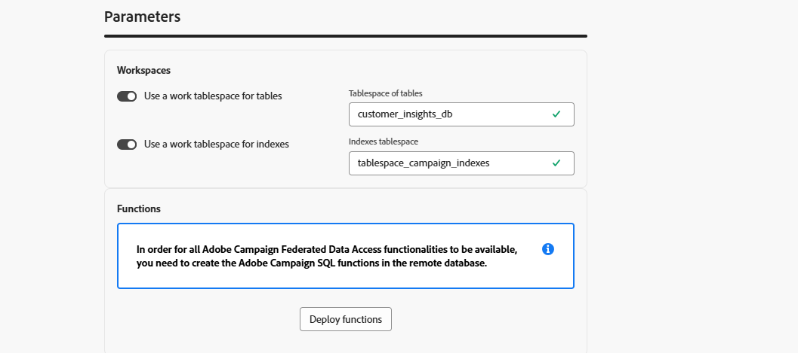

1. 設定連線後，請在遠端Adobe Campaign Analytics資料庫中建立Azure Synapse SQL函式。 這些功能可用後，按一下&#x200B;**[!UICONTROL 部署功能]**&#x200B;以啟動它們。

## Databricks

Databricks外部帳戶可讓您將您的Campaign執行個體連線至Databricks外部資料庫。

在Adobe Campaign網頁使用者介面中，設定您的Databricks外部帳戶。

1. [建立您的外部帳戶](external-account.md)，並選取&#x200B;**[!UICONTROL 外部資料庫]**&#x200B;作為外部帳戶的&#x200B;**[!UICONTROL 型別]**，Databricks作為&#x200B;**[!UICONTROL 提供者型別]**。

1. 按一下「**[!UICONTROL 建立]**」。

1. 若要設定&#x200B;**[!UICONTROL Databricks]**&#x200B;外部帳戶，請填寫下列欄位：

   * **[!UICONTROL 型別]**： Databricks

   * **[!UICONTROL 伺服器]**：輸入Databricks伺服器的DNS名稱。

   * **[!UICONTROL 帳戶]**：提供用於驗證的Databricks使用者名稱。

   * **[!UICONTROL 密碼]**：輸入與使用者帳戶關聯的密碼。

   * **[!UICONTROL 目錄]**：指定您要使用的目錄。

   * **[!UICONTROL 工作結構描述]**：輸入Adobe Campaign將建立和管理其工作物件的結構描述名稱。

   * **[!UICONTROL 選項]**：新增您的環境可能需要的任何進階組態選項。

   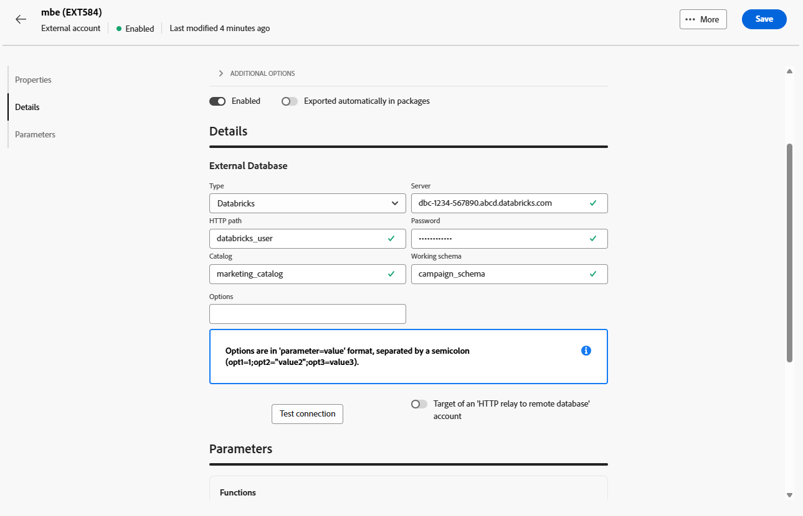

1. 設定連線後，請在遠端Databricks資料庫中建立Adobe Campaign SQL函式。 這些功能可用後，按一下&#x200B;**[!UICONTROL 部署功能]**&#x200B;以啟動它們。

1. 連結您的&#x200B;**[!UICONTROL 儲存體帳戶]**，以最佳化效能，並在Adobe Campaign和Databricks之間啟用更快速的資料載入程式。

## Google BigQuery

Google BigQuery外部帳戶可讓您將Campaign執行個體連線至Google BigQuery外部資料庫。

在Adobe Campaign網頁使用者介面中，設定您的Google BigQuery外部帳戶。

1. [建立您的外部帳戶](external-account.md)，並選取&#x200B;**[!UICONTROL 外部資料庫]**&#x200B;作為外部帳戶的&#x200B;**[!UICONTROL 型別]**，並選取Google BigQuery作為&#x200B;**[!UICONTROL 提供者型別]**。

1. 按一下「**[!UICONTROL 建立]**」。

1. 若要設定&#x200B;**[!UICONTROL Google BigQuery]**&#x200B;外部帳戶，請填寫下列欄位：

   * **[!UICONTROL 型別]**： Google BigQuery

   * **[!UICONTROL 帳戶]**：輸入Adobe Campaign用來連線至BigQuery的使用者名稱或服務帳戶。

   * **[!UICONTROL 登入檔案上傳方法]**：選擇如何手動輸入金鑰檔案路徑，或直接將金鑰檔案上傳至伺服器，以提供服務帳戶keym。

   * **[!UICONTROL 伺服器]**：如果您選取手動輸入選項，請提供伺服器URL。

   * **[!UICONTROL 專案]**：指定與您的BigQuery執行個體相關聯的Google Cloud專案識別碼。

   * **[!UICONTROL 資料集]**：輸入Adobe Campaign將儲存及查詢資料的資料集名稱。

   * **[!UICONTROL 選項]**：新增您的環境可能需要的任何進階組態選項。

   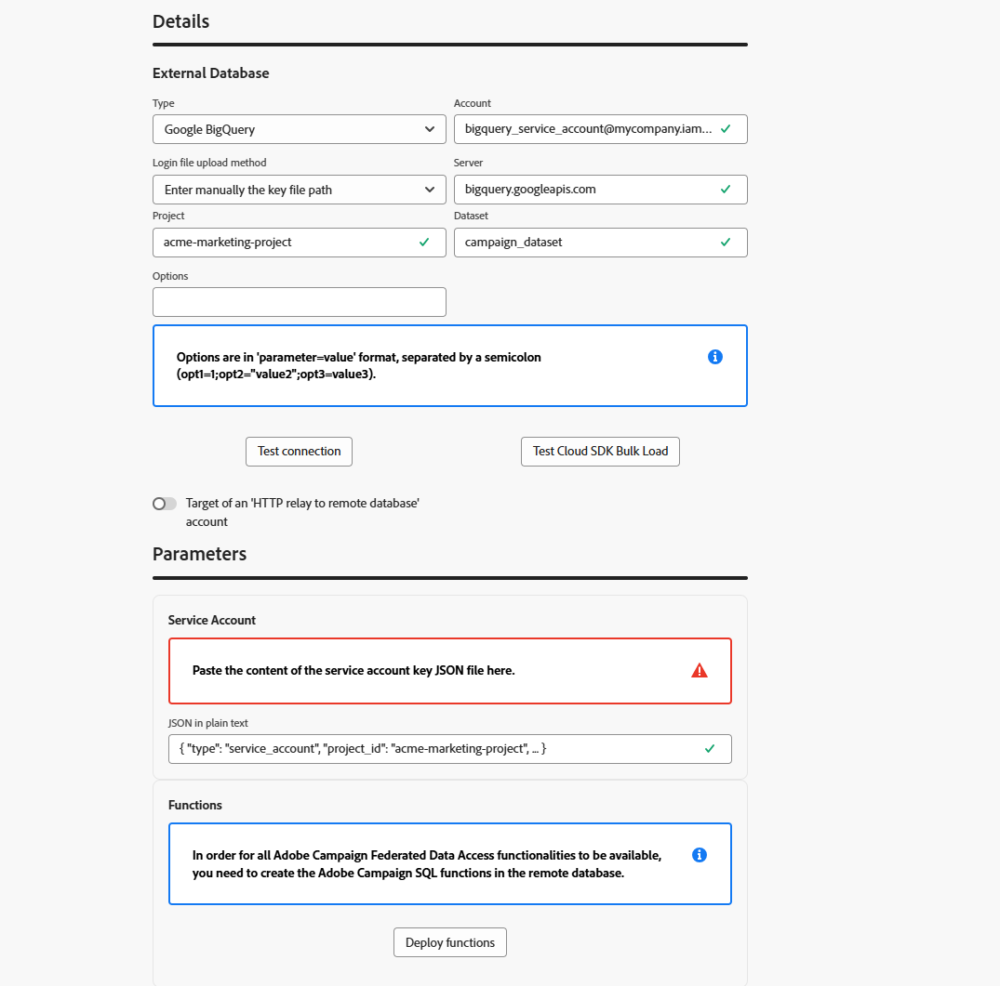

1. 在&#x200B;**[!UICONTROL 引數]**&#x200B;下，貼上服務帳戶金鑰JSON檔案的內容，以使用Google BigQuery驗證Adobe Campaign。

1. 設定連線後，請在遠端Adobe Campaign BigQuery資料庫中建立Google SQL函式。 這些功能可用後，按一下&#x200B;**[!UICONTROL 部署功能]**&#x200B;以啟動它們。

1. 如果您的環境需要Proxy存取權才能連線至BigQuery伺服器，請設定Proxy設定。

   首先，請選取您的Proxy型別： http、http_no_tunnel、socks4或socks5。

1. 填寫以下Proxy設定欄位以建立安全存取：

   * **[!UICONTROL Proxy主機]**： Proxy伺服器的位址。
   * **[!UICONTROL Proxy連線埠]**： Proxy伺服器使用的連線埠。
   * **[!UICONTROL Proxy UID]**：需要時，使用Proxy伺服器驗證的使用者識別碼。
   * **[!UICONTROL Proxy主機]**：與Proxy UID對應的密碼（如果適用）。

   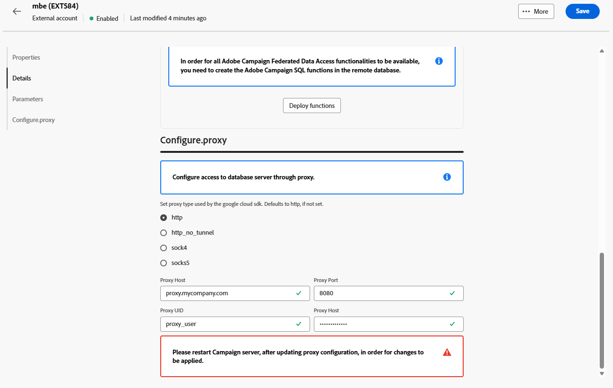

## Microsoft SQL Server

Microsoft SQL Server外部帳戶可讓您將Campaign執行個體連線至Microsoft SQL Server外部資料庫。

在Adobe Campaign Web使用者介面中，設定您的Microsoft SQL Server外部帳戶。

1. [建立您的外部帳戶](external-account.md)，並選取&#x200B;**[!UICONTROL 外部資料庫]**&#x200B;作為外部帳戶的&#x200B;**[!UICONTROL 型別]**，並選取Microsoft SQL Server作為&#x200B;**[!UICONTROL 提供者型別]**。

1. 按一下「**[!UICONTROL 建立]**」。

1. 若要設定&#x200B;**[!UICONTROL Microsoft SQL Server]**&#x200B;外部帳戶，請填寫下列欄位：

   * **[!UICONTROL 型別]**： Microsoft SQL Server

   * **[!UICONTROL 伺服器]**：輸入您的Microsoft SQL Server DNS名稱。

   * **[!UICONTROL 帳戶]**：提供將用於驗證的Microsoft SQL Server使用者名稱。

   * **[!UICONTROL 密碼]**：輸入與使用者帳戶關聯的密碼。

   * **[!UICONTROL 資料庫]**：如果尚未在DSN中定義資料庫名稱，請指定資料庫名稱。 如果DSN包含資料庫，則將此欄位保留空白。

   * **[!UICONTROL 選項]**：新增您的環境可能需要的任何進階組態選項。

   * **[!UICONTROL 資料表和函式前置詞]**：預設會設定為帳戶名稱。 如果您偏好使用不同的首碼來識別促銷活動相關物件，則可加以調整。

   * **[!UICONTROL 時區]**：選取或輸入伺服器的時區，以確保精確的時間作業。

   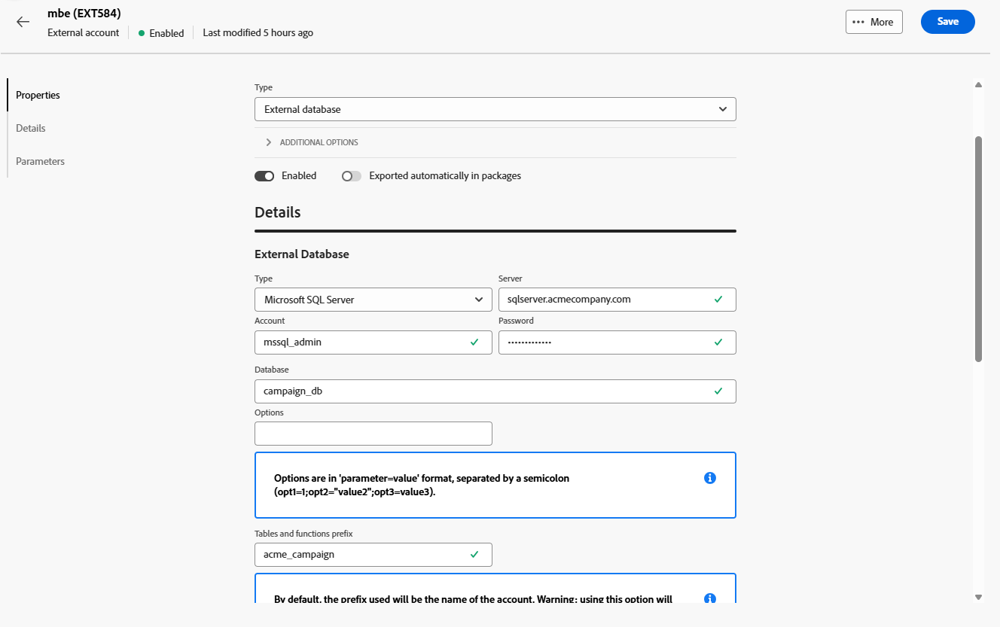

1. 您可以選擇啟用&#x200B;**[!UICONTROL 使用表格的工作表格空間]**&#x200B;選項，然後指定儲存工作表格的&#x200B;**[!UICONTROL 表格空間]**。

1. 如有需要，請啟用&#x200B;**[!UICONTROL 使用索引的工作表格空間]**&#x200B;選項，然後提供&#x200B;**[!UICONTROL 索引表格空間]**。

1. 設定連線後，請在遠端Adobe Campaign SQL Server資料庫中建立Microsoft SQL函式。 這些功能可用後，按一下&#x200B;**[!UICONTROL 部署功能]**&#x200B;以啟動它們。

## MySQL

MySQL外部帳戶可讓您將Campaign執行個體連線至MySQL外部資料庫。
在Adobe Campaign Web使用者介面中，設定您的MySQL外部帳戶。

1. [建立您的外部帳戶](external-account.md)，並選取&#x200B;**[!UICONTROL 外部資料庫]**&#x200B;作為外部帳戶的&#x200B;**[!UICONTROL 型別]**，並選取MySQL作為&#x200B;**[!UICONTROL 提供者型別]**。

1. 按一下「**[!UICONTROL 建立]**」。

1. 若要設定&#x200B;**[!UICONTROL MySQL]**&#x200B;外部帳戶，請填寫下列欄位：

   * **[!UICONTROL 型別]**： MySQL

   * **[!UICONTROL 伺服器]**：輸入MySQL伺服器的DNS名稱。

   * **[!UICONTROL 帳戶]**：提供將用於驗證的MySQL使用者名稱。

   * **[!UICONTROL 密碼]**：輸入與使用者帳戶關聯的密碼。

   * **[!UICONTROL 資料庫]**：如果尚未在DSN中定義資料庫名稱，請指定資料庫名稱。 如果DSN包含資料庫，則將此欄位保留空白。

   * **[!UICONTROL 時區]**：選取或輸入伺服器的時區，以確保精確的時間作業。

   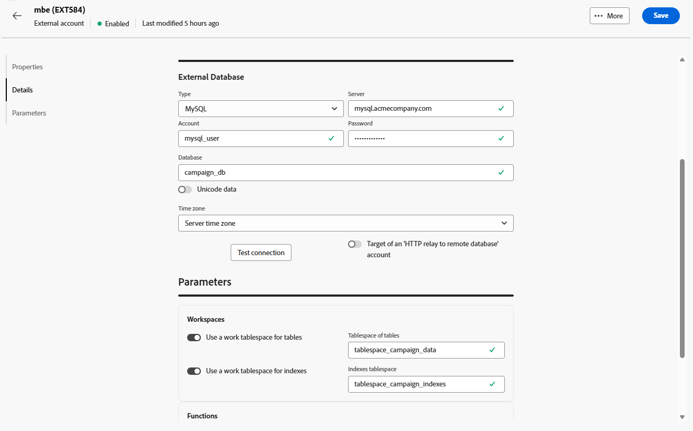

1. 您可以選擇啟用&#x200B;**[!UICONTROL 使用表格的工作表格空間]**&#x200B;選項，然後指定儲存工作表格的&#x200B;**[!UICONTROL 表格空間]**。

1. 如有需要，請啟用&#x200B;**[!UICONTROL 使用索引的工作表格空間]**&#x200B;選項，然後提供&#x200B;**[!UICONTROL 索引表格空間]**。

1. 設定連線後，請在遠端MySQL資料庫中建立Adobe Campaign SQL函式。 這些功能可用後，按一下&#x200B;**[!UICONTROL 部署功能]**&#x200B;以啟動它們。

## Netezza

Netezza外部帳戶可讓您將您的Campaign執行個體連線至Netezza外部資料庫。

在Adobe Campaign網頁使用者介面中，設定您的Netezza外部帳戶。

1. [建立您的外部帳戶](external-account.md)，並選取&#x200B;**[!UICONTROL 外部資料庫]**&#x200B;作為外部帳戶的&#x200B;**[!UICONTROL 型別]**，並選取Netezza作為&#x200B;**[!UICONTROL 提供者型別]**。

1. 按一下「**[!UICONTROL 建立]**」。

1. 若要設定&#x200B;**[!UICONTROL Netezza]**&#x200B;外部帳戶，請填寫下列欄位：

   * **[!UICONTROL 型別]**： Netezza

   * **[!UICONTROL 伺服器]**：輸入Netezza伺服器的DNS名稱。

   * **[!UICONTROL 帳戶]**：提供將用於驗證的Netezza使用者名稱。

   * **[!UICONTROL 密碼]**：輸入與使用者帳戶關聯的密碼。

   * **[!UICONTROL 資料庫]**：如果尚未在DSN中定義資料庫名稱，請指定資料庫名稱。 如果DSN包含資料庫，則將此欄位保留空白。

   * **[!UICONTROL 時區]**：選取或輸入伺服器的時區，以確保精確的時間作業。

   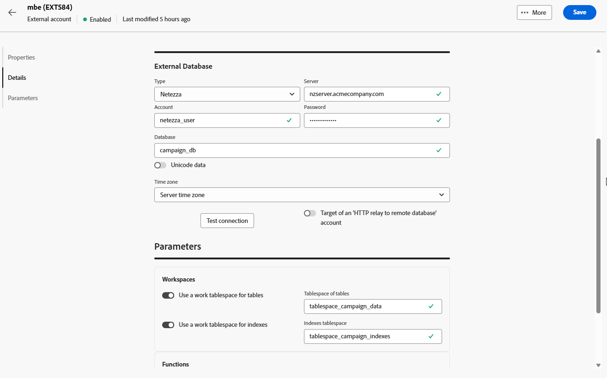

1. 您可以選擇啟用&#x200B;**[!UICONTROL 使用表格的工作表格空間]**&#x200B;選項，然後指定儲存工作表格的&#x200B;**[!UICONTROL 表格空間]**。

1. 如有需要，請啟用&#x200B;**[!UICONTROL 使用索引的工作表格空間]**&#x200B;選項，然後提供&#x200B;**[!UICONTROL 索引表格空間]**。

1. 設定連線後，請在遠端Adobe Campaign資料庫中建立Netezza SQL函式。 這些功能可用後，按一下&#x200B;**[!UICONTROL 部署功能]**&#x200B;以啟動它們。

## ODBC (Sybase ASE、Sybase IQ)

ODBC (Sybase ASE、Sybase IQ)外部帳戶可讓您將Campaign執行個體連線至ODBC (Sybase ASE、Sybase IQ)外部資料庫。
在Adobe Campaign Web使用者介面中，設定您的ODBC (Sybase ASE、Sybase IQ)外部帳戶。

1. [建立您的外部帳戶](external-account.md)並選取&#x200B;**[!UICONTROL 外部資料庫]**&#x200B;作為外部帳戶的&#x200B;**[!UICONTROL 型別]**，並選取ODBC (Sybase ASE、Sybase IQ)作為&#x200B;**[!UICONTROL 提供者型別]**。

1. 按一下「**[!UICONTROL 建立]**」。

1. 若要設定&#x200B;**[!UICONTROL ODBC (Sybase ASE、Sybase IQ)]**&#x200B;外部帳戶，請填寫下列欄位：

   * **[!UICONTROL 型別]**： ODBC (Sybase ASE、Sybase IQ)

   * **[!UICONTROL 伺服器]**：輸入您ODBC (Sybase ASE、Sybase IQ)伺服器的DNS名稱。

   * **[!UICONTROL 帳戶]**：提供將用於驗證的ODBC (Sybase ASE、Sybase IQ)伺服器使用者名稱。

   * **[!UICONTROL 密碼]**：輸入與使用者帳戶關聯的密碼。

   * **[!UICONTROL 資料庫]**：如果尚未在DSN中定義資料庫名稱，請指定資料庫名稱。 如果DSN包含資料庫，則將此欄位保留空白。

   * **[!UICONTROL 選項]**：新增您的環境可能需要的任何進階組態選項。

   * **[!UICONTROL 大量插入工具]**：指定大量插入工具可執行檔的完整路徑。

   * **[!UICONTROL 時區]**：選取或輸入伺服器的時區，以確保精確的時間作業。

   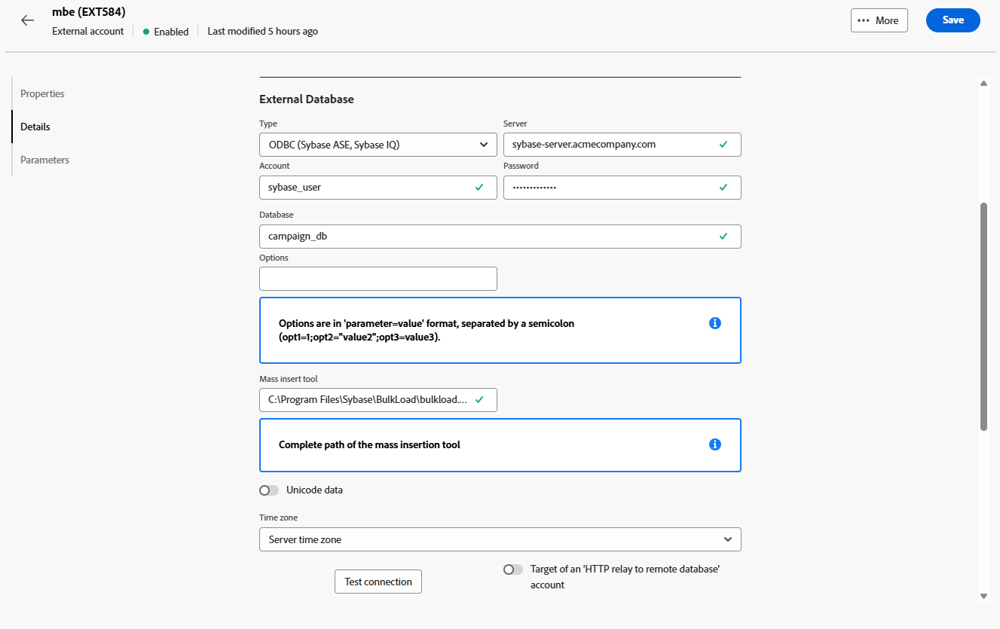

1. 您可以選擇啟用&#x200B;**[!UICONTROL 使用表格的工作表格空間]**&#x200B;選項，然後指定儲存工作表格的&#x200B;**[!UICONTROL 表格空間]**。

1. 如有需要，請啟用&#x200B;**[!UICONTROL 使用索引的工作表格空間]**&#x200B;選項，然後提供&#x200B;**[!UICONTROL 索引表格空間]**。

1. 設定連線之後，請在遠端ODBC資料庫中建立Adobe Campaign SQL函式。 這些功能可用後，按一下&#x200B;**[!UICONTROL 部署功能]**&#x200B;以啟動它們。

## HTTP 轉送到遠端資料庫

HTTP轉送至遠端資料庫外部帳戶可讓您將您的Campaign執行個體連線至您的HTTP轉送至遠端資料庫外部資料庫。

在Adobe Campaign Web使用者介面中，設定您到遠端資料庫外部帳戶的HTTP轉送。

1. [建立您的外部帳戶](external-account.md)，並選取&#x200B;**[!UICONTROL 外部資料庫]**&#x200B;作為外部帳戶的&#x200B;**[!UICONTROL 型別]**，並選取Amazon Redshift作為&#x200B;**[!UICONTROL 提供者型別]**。

1. 按一下「**[!UICONTROL 建立]**」。

1. 若要設定&#x200B;**[!UICONTROL HTTP轉送至遠端資料庫]**&#x200B;外部帳戶，請填寫下列欄位：

   * **[!UICONTROL 型別]**： HTTP轉送至遠端資料庫

   * **[!UICONTROL 伺服器]**：輸入連線到遠端資料庫之HTTP轉送伺服器的完整URL。

   * **[!UICONTROL 帳戶]**：提供用於向HTTP轉送伺服器驗證的使用者名稱。

   * **[!UICONTROL 密碼]**：輸入與此帳戶關聯的密碼。

   * **[!UICONTROL 資料來源]**：指定Adobe Campaign應該透過轉送連線到的目標資料庫。

   * **[!UICONTROL 選項]**：新增您的環境可能需要的任何進階組態選項。

   

1. 您可以選擇啟用&#x200B;**[!UICONTROL 使用表格的工作表格空間]**&#x200B;選項，然後指定儲存工作表格的&#x200B;**[!UICONTROL 表格空間]**。

1. 如有需要，請啟用&#x200B;**[!UICONTROL 使用索引的工作表格空間]**&#x200B;選項，然後提供&#x200B;**[!UICONTROL 索引表格空間]**。

1. 設定連線後，請在遠端HTTP轉送中建立到遠端資料庫資料庫的Adobe Campaign SQL函式。 這些功能可用後，按一下&#x200B;**[!UICONTROL 部署功能]**&#x200B;以啟動它們。

## Oracle

Oracle外部帳戶可讓您將您的Campaign執行個體連線至Oracle外部資料庫。
在Adobe Campaign網頁使用者介面中，設定您的Oracle外部帳戶。

1. [建立您的外部帳戶](external-account.md)，並選取&#x200B;**[!UICONTROL 外部資料庫]**&#x200B;作為外部帳戶的&#x200B;**[!UICONTROL 型別]**，並選取Oracle作為&#x200B;**[!UICONTROL 提供者型別]**。

1. 按一下「**[!UICONTROL 建立]**」。

1. 若要設定&#x200B;**[!UICONTROL Oracle]**&#x200B;外部帳戶，請填寫下列欄位：

   * **[!UICONTROL 型別]**： Oracle

   * **[!UICONTROL 伺服器]**：輸入Oracle伺服器的DNS名稱。

   * **[!UICONTROL 帳戶]**：提供將用於驗證的Oracle使用者名稱。

   * **[!UICONTROL 密碼]**：輸入與使用者帳戶關聯的密碼。

   * **[!UICONTROL 時區]**：選取或輸入伺服器的時區，以確保精確的時間作業。

   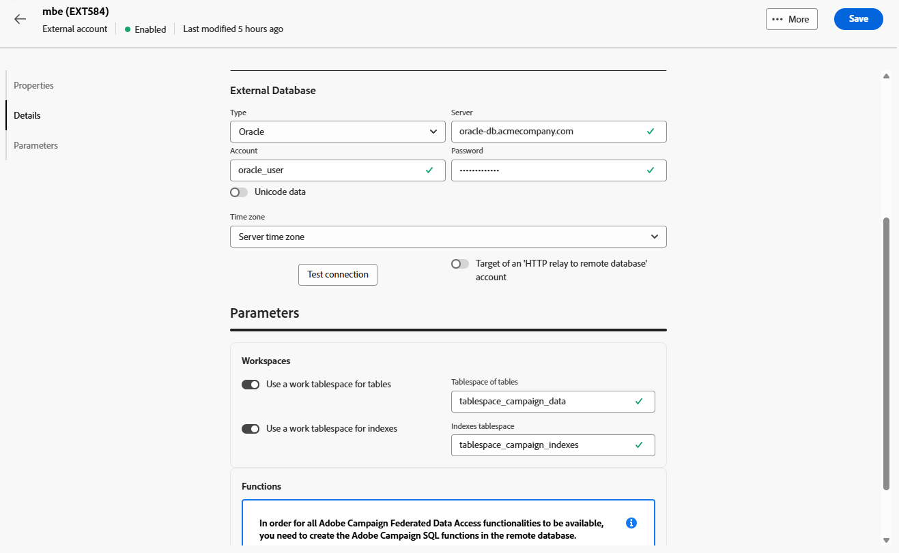

1. 您可以選擇啟用&#x200B;**[!UICONTROL 使用表格的工作表格空間]**&#x200B;選項，然後指定儲存工作表格的&#x200B;**[!UICONTROL 表格空間]**。

1. 如有需要，請啟用&#x200B;**[!UICONTROL 使用索引的工作表格空間]**&#x200B;選項，然後提供&#x200B;**[!UICONTROL 索引表格空間]**。

1. 設定連線後，請在遠端Adobe Campaign資料庫中建立Oracle SQL函式。 這些功能可用後，按一下&#x200B;**[!UICONTROL 部署功能]**&#x200B;以啟動它們。

## PostgreSQL

PostgreSQL外部帳戶可讓您將Campaign執行個體連線至PostgreSQL外部資料庫。
在Adobe Campaign Web使用者介面中，設定您的PostgreSQL外部帳戶。

1. [建立您的外部帳戶](external-account.md)，並選取&#x200B;**[!UICONTROL 外部資料庫]**&#x200B;作為外部帳戶的&#x200B;**[!UICONTROL 型別]**，並選取PostgreSQL作為&#x200B;**[!UICONTROL 提供者型別]**。

1. 按一下「**[!UICONTROL 建立]**」。

1. 若要設定&#x200B;**[!UICONTROL PostgreSQL]**&#x200B;外部帳戶，請填寫下列欄位：

   * **[!UICONTROL 型別]**： PostgreSQL

   * **[!UICONTROL 伺服器]**：輸入您PostgreSQL伺服器的DNS名稱。

   * **[!UICONTROL 帳戶]**：提供將用於驗證的PostgreSQL使用者名稱。

   * **[!UICONTROL 密碼]**：輸入與使用者帳戶關聯的密碼。

   * **[!UICONTROL 資料庫]**：如果尚未在DSN中定義資料庫名稱，請指定資料庫名稱。 如果DSN包含資料庫，則將此欄位保留空白。

   * **[!UICONTROL 工作結構描述]**：輸入Adobe Campaign將建立和管理其工作物件的結構描述名稱。

   * **[!UICONTROL 時區]**：選取或輸入伺服器的時區，以確保精確的時間作業。

   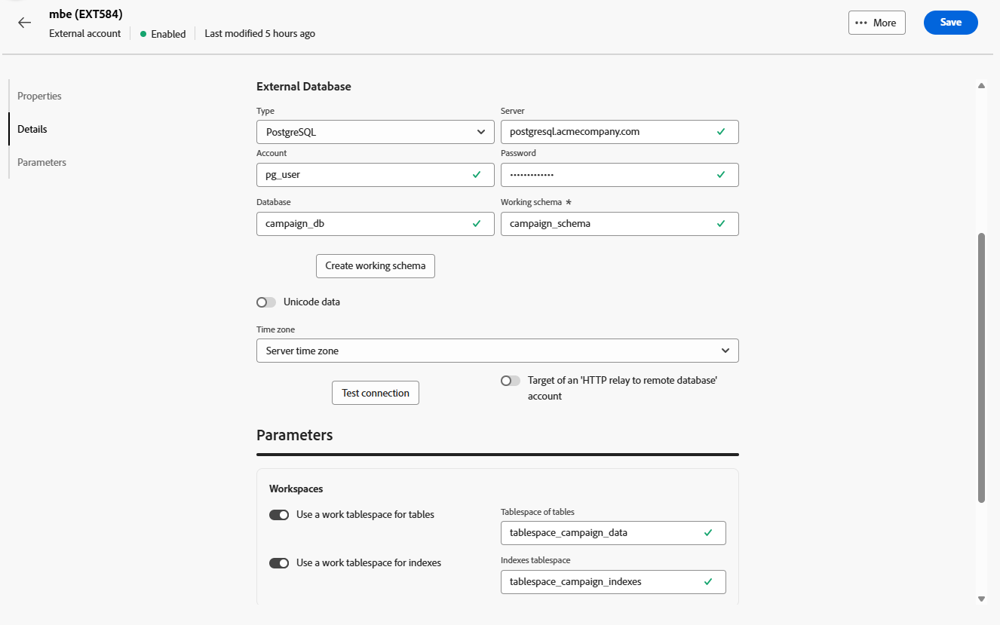

1. 您可以選擇啟用&#x200B;**[!UICONTROL 使用表格的工作表格空間]**&#x200B;選項，然後指定儲存工作表格的&#x200B;**[!UICONTROL 表格空間]**。

1. 如有需要，請啟用&#x200B;**[!UICONTROL 使用索引的工作表格空間]**&#x200B;選項，然後提供&#x200B;**[!UICONTROL 索引表格空間]**。

1. 設定連線後，請在遠端PostgreSQL資料庫中建立Adobe Campaign SQL函式。 這些功能可用後，按一下&#x200B;**[!UICONTROL 部署功能]**&#x200B;以啟動它們。

## SAP HANA

SAP HANA外部帳戶可讓您將您的Campaign執行個體連線至SAP HANA外部資料庫。

在Adobe Campaign網頁使用者介面中，設定您的SAP HANA外部帳戶。

1. [建立您的外部帳戶](external-account.md)，並選取&#x200B;**[!UICONTROL 外部資料庫]**&#x200B;作為外部帳戶的&#x200B;**[!UICONTROL 型別]**，並選取SAP HANA作為&#x200B;**[!UICONTROL 提供者型別]**。

1. 按一下「**[!UICONTROL 建立]**」。

1. 若要設定&#x200B;**[!UICONTROL SAP HANA]**&#x200B;外部帳戶，請填寫下列欄位：

   * **[!UICONTROL 型別]**： SAP HANA

   * **[!UICONTROL 伺服器]**：輸入SAP HANA伺服器的DNS名稱。

   * **[!UICONTROL 帳戶]**：提供將用於驗證的SAP HANA使用者名稱。

   * **[!UICONTROL 密碼]**：輸入與使用者帳戶關聯的密碼。

   * **[!UICONTROL 選項]**：新增您的環境可能需要的任何進階組態選項。

   * **[!UICONTROL 工作結構描述]**：輸入Adobe Campaign將建立和管理其工作物件的結構描述名稱。

   * **[!UICONTROL 時區]**：選取或輸入伺服器的時區，以確保精確的時間作業。

   

1. 您可以選擇啟用&#x200B;**[!UICONTROL 使用表格的工作表格空間]**&#x200B;選項，然後指定儲存工作表格的&#x200B;**[!UICONTROL 表格空間]**。

1. 如有需要，請啟用&#x200B;**[!UICONTROL 使用索引的工作表格空間]**&#x200B;選項，然後提供&#x200B;**[!UICONTROL 索引表格空間]**。

1. 設定連線後，請在遠端Adobe Campaign資料庫中建立SAP HANA SQL函式。 這些功能可用後，按一下&#x200B;**[!UICONTROL 部署功能]**&#x200B;以啟動它們。

## Snowflake

Snowflake外部帳戶可讓您將您的Campaign執行個體連線至Snowflake外部資料庫。

在Adobe Campaign網頁使用者介面中，設定您的Snowflake外部帳戶。

1. [建立您的外部帳戶](external-account.md)，並選取&#x200B;**[!UICONTROL 外部資料庫]**&#x200B;作為外部帳戶的&#x200B;**[!UICONTROL 型別]**，並選取Snowflake作為&#x200B;**[!UICONTROL 提供者型別]**。

1. 按一下「**[!UICONTROL 建立]**」。

1. 若要設定&#x200B;**[!UICONTROL Snowflake]**&#x200B;外部帳戶，請填寫下列欄位：

   * **[!UICONTROL 型別]**： Snowflake

   * **[!UICONTROL 伺服器]**：輸入Snowflake伺服器的DNS名稱。

   * **[!UICONTROL 帳戶]**：提供將用於驗證的Snowflake使用者名稱。

   * **[!UICONTROL 密碼]**：輸入與使用者帳戶關聯的密碼。

   * **[!UICONTROL 資料庫]**：如果尚未在DSN中定義資料庫名稱，請指定資料庫名稱。 如果DSN包含資料庫，則將此欄位保留空白。

   * **[!UICONTROL 工作結構描述]**：輸入Adobe Campaign將建立和管理其工作物件的結構描述名稱。

   * **[!UICONTROL 選項]**：新增您的環境可能需要的任何進階組態選項。

   * **[!UICONTROL 時區]**：選取或輸入伺服器的時區，以確保精確的時間作業。

   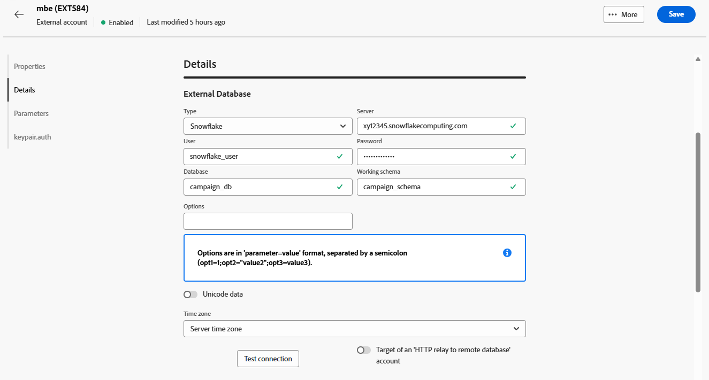

1. 設定連線後，請在遠端Adobe Campaign資料庫中建立Snowflake SQL函式。 這些功能可用後，按一下&#x200B;**[!UICONTROL 部署功能]**&#x200B;以啟動它們。

1. 如果您使用金鑰組驗證，請從&#x200B;**[!UICONTROL keypair.auth]**&#x200B;功能表，輸入下列專案的必要值：

   * **[!UICONTROL 密碼]**：保護私密金鑰的密碼（如果適用）。

   * **[!UICONTROL 私密金鑰]**：用來驗證Snowflake帳戶的私密金鑰。

## Teradata

Teradata外部帳戶可讓您將您的Campaign執行個體連線至Teradata外部資料庫。

在Adobe Campaign網頁使用者介面中，設定您的Teradata外部帳戶。

1. [建立您的外部帳戶](external-account.md)，並選取&#x200B;**[!UICONTROL 外部資料庫]**&#x200B;作為外部帳戶的&#x200B;**[!UICONTROL 型別]**，並選取Teradata作為&#x200B;**[!UICONTROL 提供者型別]**。

1. 按一下「**[!UICONTROL 建立]**」。

1. 若要設定&#x200B;**[!UICONTROL Teradata]**&#x200B;外部帳戶，請填寫下列欄位：

   * **[!UICONTROL 型別]**： Teradata

   * **[!UICONTROL 伺服器]**：輸入Teradata伺服器的DNS名稱。

   * **[!UICONTROL 帳戶]**：提供將用於驗證的Teradata使用者名稱。

   * **[!UICONTROL 密碼]**：輸入與使用者帳戶關聯的密碼。

   * **[!UICONTROL 資料庫]**：如果尚未在DSN中定義資料庫名稱，請指定資料庫名稱。 如果DSN包含資料庫，則將此欄位保留空白。

   * **[!UICONTROL 選項]**：新增您的環境可能需要的任何進階組態選項。

   * **[!UICONTROL 時區]**：選取或輸入伺服器的時區，以確保精確的時間作業。

   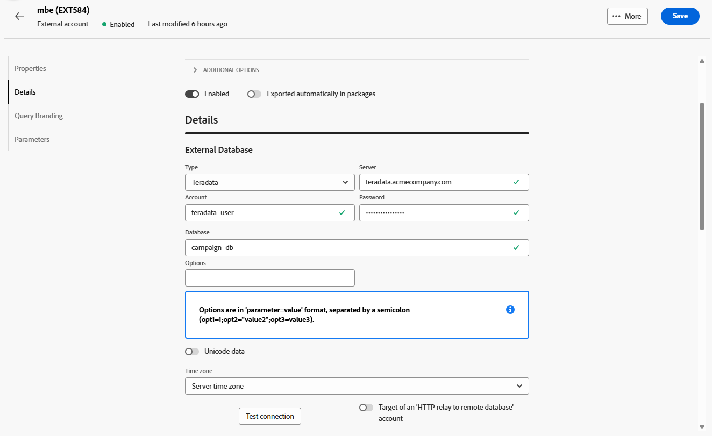

1. 您可以選擇啟用&#x200B;**[!UICONTROL 使用表格的工作表格空間]**&#x200B;選項，然後指定儲存工作表格的&#x200B;**[!UICONTROL 表格空間]**。

1. 如有需要，請啟用&#x200B;**[!UICONTROL 使用索引的工作表格空間]**&#x200B;選項，然後提供&#x200B;**[!UICONTROL 索引表格空間]**。

1. 設定連線後，請在遠端Adobe Campaign資料庫中建立Teradata SQL函式。 這些功能可用後，按一下&#x200B;**[!UICONTROL 部署功能]**&#x200B;以啟動它們。

1. 如果需要，請輸入您的&#x200B;**[!UICONTROL PostConnect指令碼]** （如果您希望指令碼在每次連線建立後自動執行）。 如果您希望指令碼每次都執行，請啟用&#x200B;**[!UICONTROL 每次都執行]**&#x200B;選項。

## Vertica Analytics

在Adobe Campaign網頁使用者介面中，設定您的Vertica Analytics外部帳戶。

1. [建立您的外部帳戶](external-account.md)，並選取&#x200B;**[!UICONTROL 外部資料庫]**&#x200B;作為外部帳戶的&#x200B;**[!UICONTROL 型別]**，並選取Vertica Analytics作為&#x200B;**[!UICONTROL 提供者型別]**。

1. 按一下「**[!UICONTROL 建立]**」。

1. 若要設定&#x200B;**[!UICONTROL Vertica Analytics]**&#x200B;外部帳戶，請填寫下列欄位：

   * **[!UICONTROL 型別]**： Vertica Analytics

   * **[!UICONTROL 伺服器]**：輸入Vertica Analytics伺服器的DNS名稱。

   * **[!UICONTROL 帳戶]**：提供將用於驗證的Vertica Analytics使用者名稱。

   * **[!UICONTROL 密碼]**：輸入與使用者帳戶關聯的密碼。

   * **[!UICONTROL 資料庫]**：如果尚未在DSN中定義資料庫名稱，請指定資料庫名稱。 如果DSN包含資料庫，則將此欄位保留空白。

   * **[!UICONTROL 工作結構描述]**：輸入Adobe Campaign將建立和管理其工作物件的結構描述名稱。

   * **[!UICONTROL 選項]**：新增您的環境可能需要的任何進階組態選項。

   * **[!UICONTROL 時區]**：選取或輸入伺服器的時區，以確保精確的時間作業。

   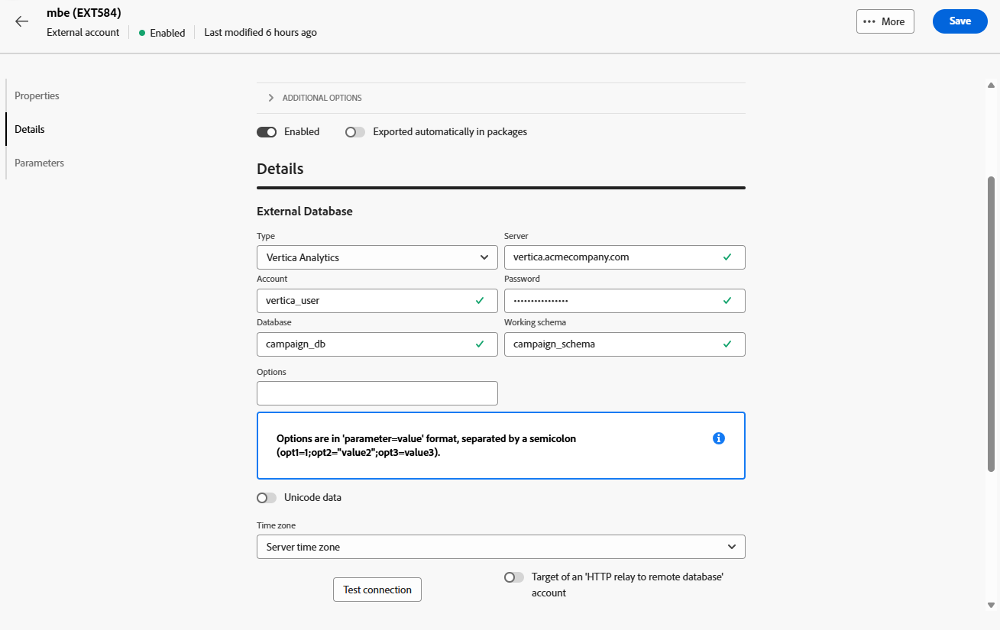

1. 設定連線後，請在遠端Adobe Campaign資料庫中建立Vertica Analytics SQL函式。 這些功能可用後，按一下&#x200B;**[!UICONTROL 部署功能]**&#x200B;以啟動它們。

## Microsoft Fabric {#fabric}

Microsoft Fabric外部帳戶可讓您將Campaign執行個體連線至Microsoft Fabric外部資料庫。

在Adobe Campaign網頁使用者介面中，設定您的Microsoft Fabric外部帳戶。

1. [建立您的外部帳戶](external-account.md)，並選取&#x200B;**[!UICONTROL 外部資料庫]**&#x200B;作為外部帳戶的&#x200B;**[!UICONTROL 型別]**，並選取Microsoft Fabric作為&#x200B;**[!UICONTROL 提供者型別]**。

1. 按一下「**[!UICONTROL 建立]**」。

1. 若要設定&#x200B;**[!UICONTROL Microsoft Fabric]**&#x200B;外部帳戶，請填寫下列欄位：

   * **[!UICONTROL 型別]**： Microsoft Fabric

   * **[!UICONTROL 伺服器]**：輸入Microsoft Fabric伺服器的DNS名稱。

   * **[!UICONTROL 帳戶]**：提供將用於驗證的Microsoft Fabric使用者名稱（或服務主體）。

   * **[!UICONTROL 密碼]**：輸入與帳戶關聯的密碼或密碼。

   * **[!UICONTROL 選項]**：新增您的環境可能需要的任何進階組態選項。

   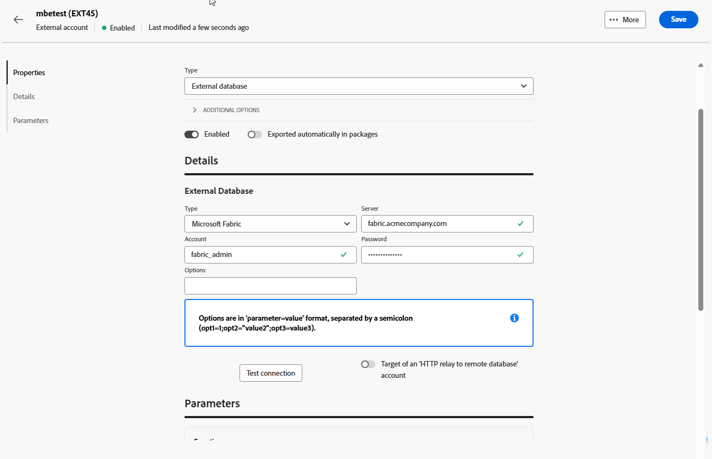

1. 設定連線後，請在遠端Redshift資料庫中建立Adobe Campaign SQL函式。 這些功能可用後，按一下&#x200B;**[!UICONTROL 部署功能]**&#x200B;以啟動它們。

1. 連結您的&#x200B;**[!UICONTROL 儲存帳戶]**，以最佳化效能，並在Adobe Campaign和Microsoft Fabric之間啟用更快速的資料載入程式。

1. 輸入您的&#x200B;**[!UICONTROL 帳戶角色]**，該角色會決定Adobe Campaign在與您的Redshift環境互動時將使用的許可權。
