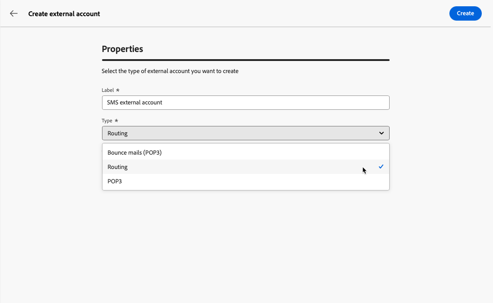
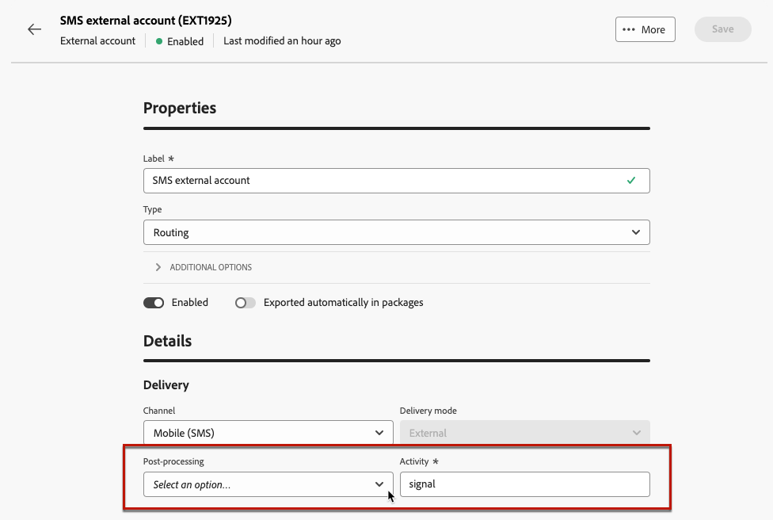
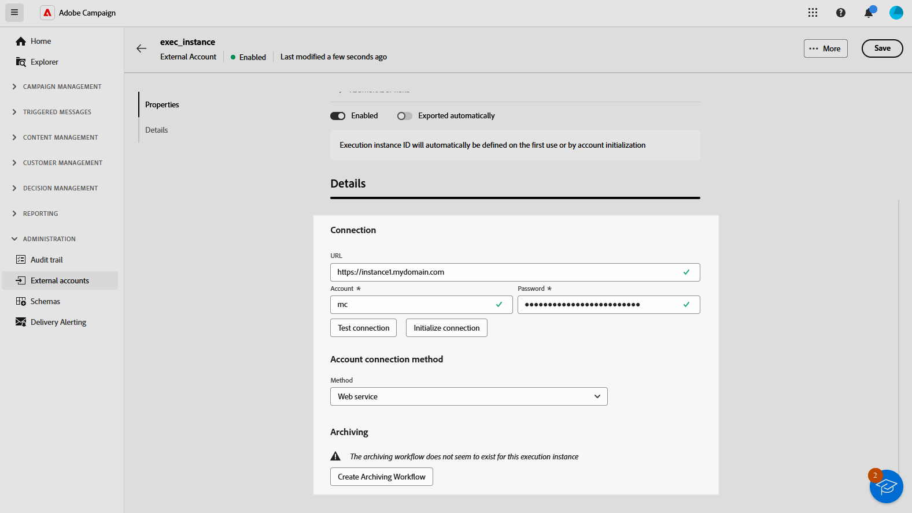
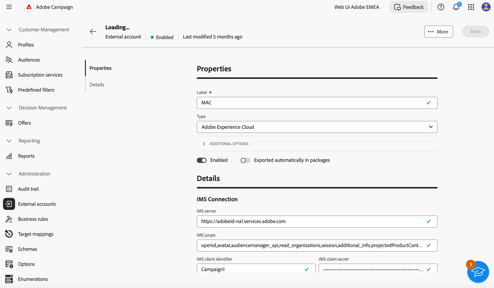
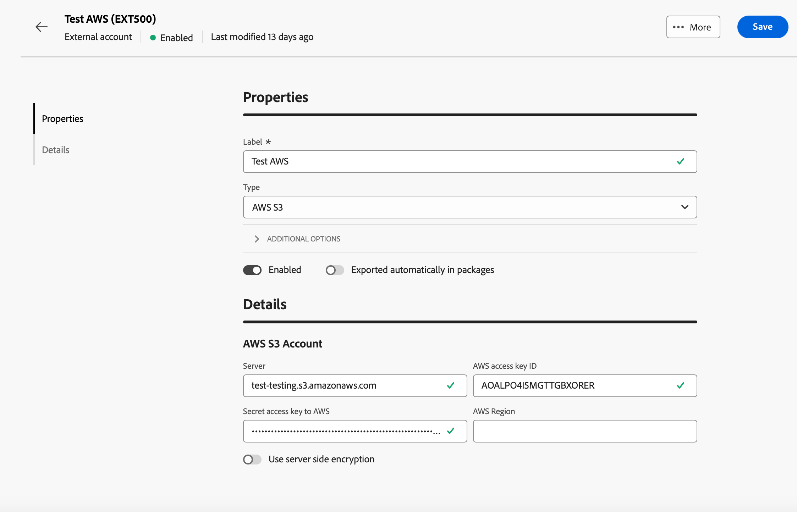
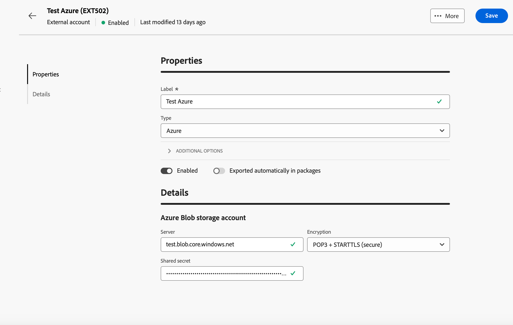

# 管理外部帳戶 {#external-accounts}

>[!CONTEXTUALHELP]
>id="acw_homepage_welcome_rn3"
>title="外部帳戶編寫"
>abstract="身為Campaign管理員，您現在可以從Campaign Web使用者介面設定與外部系統的新連線。 您也可以檢視、更新及管理現有的外部帳戶。"
>additional-url="https://experienceleague.adobe.com/docs/campaign-web/v8/release-notes/release-notes.html?lang=zh-hant" text="請參閱版本注意事項"

Adobe Campaign包括預先設定的外部帳戶，可輕鬆與各種系統整合。 若要連線到其他平台或自訂連線以符合您的工作流程，請使用Web使用者介面建立新的外部帳戶。 這可確保順暢的資料傳輸。

## 建立外部帳戶 {#create-ext-account}

若要建立新的外部帳戶，請遵循下列步驟。 詳細設定取決於外部帳戶的型別。 [了解更多](#campaign-specific)

1. 從左窗格功能表，選取&#x200B;**[!UICONTROL 管理]**&#x200B;下的&#x200B;**[!UICONTROL 外部帳戶]**。

1. 按一下&#x200B;**[!UICONTROL 建立外部帳戶]**。

   

1. 輸入您的&#x200B;**[!UICONTROL 標籤]**&#x200B;並選取外部帳戶&#x200B;**[!UICONTROL 型別]**。

   >[!NOTE]
   >
   >促銷活動特定型別的設定在[本節](#campaign-specific)中有詳細說明。

   

1. 按一下「**[!UICONTROL 建立]**」。

1. 從&#x200B;**[!UICONTROL 其他選項]**&#x200B;下拉式清單中，視需要變更&#x200B;**[!UICONTROL 內部名稱]**&#x200B;或&#x200B;**[!UICONTROL 資料夾]**&#x200B;路徑。

   

1. 啟用&#x200B;**[!UICONTROL 自動匯出到封裝]**&#x200B;選項，以自動匯出此外部帳戶管理的資料。<!--Exported where??-->

   

1. 在&#x200B;**[!UICONTROL 詳細資料]**&#x200B;區段中，根據所選外部帳戶型別指定認證，以設定帳戶的存取權。 [了解更多](#bounce)

1. 按一下&#x200B;**[!UICONTROL 測試連線]**&#x200B;以驗證您的設定是否正確。

1. 從&#x200B;**[!UICONTROL 更多……]**&#x200B;功能表，複製或刪除您的外部帳戶。

   ![熒幕擷圖顯示[更多]功能表，其中包含複製或刪除外部帳戶的選項。](assets/external_account_create_4.png)

1. 組態完成後，按一下[儲存]。**&#x200B;**

## 促銷活動特定外部帳戶 {#campaign-specific}

根據您選取的外部帳戶型別，請依照下列步驟設定帳戶設定。

### 退回郵件 (POP3) {#bounce}

「退回郵件」外部帳戶指定用來連線至電子郵件服務的外部POP3帳戶。 所有設定為POP3存取的伺服器都可以接收傳回郵件。

![熒幕擷圖顯示[退回郵件(POP3)]外部帳戶設定欄位。](assets/external_account_bounce.png)

若要設定&#x200B;**[!UICONTROL 退回郵件(POP3)]**&#x200B;外部帳戶，請填寫下列欄位：

* **[!UICONTROL 伺服器]** - POP3伺服器的URL。

* **[!UICONTROL 連線埠]** - POP3連線埠號碼（預設連線埠為110）。

* **[!UICONTROL 帳戶]** — 使用者名稱。

* **[!UICONTROL 密碼]** — 使用者帳戶密碼。

* **[!UICONTROL 加密]** — 選擇的加密型別，包括：
   * 依預設（若連線埠110則為POP3，若連線埠995則為POP3）。
   * 傳送STARTTLS後切換至SSL的POP3。
   * POP3不安全（預設連線埠110）。
   * POP3安全於SSL之上（預設連線埠995）。

* **[!UICONTROL 函式]** — 選取&#x200B;**[!UICONTROL 傳入電子郵件]**&#x200B;設定接收傳入電子郵件的帳戶，或選取&#x200B;**[!UICONTROL SOAP路由器]**&#x200B;處理SOAP要求。

>[!IMPORTANT]
>
>使用Microsoft OAuth 2.0設定POP3外部帳戶之前，您必須先在Azure入口網站中註冊應用程式。 如需詳細資訊，請參閱[此頁面](https://learn.microsoft.com/en-us/entra/identity-platform/quickstart-register-app){target=_blank}。

若要使用Microsoft OAuth 2.0設定POP3外部連結，請核取Microsoft OAuth 2.0選項並填寫下列欄位：

* **[!UICONTROL Azure租使用者]**

  Azure ID (或目錄（租使用者） ID)可在Azure入口網站應用程式概觀的Essentials下拉式清單中找到。

* **[!UICONTROL Azure使用者端ID]**

  使用者端ID (或應用程式（使用者端） ID)可在Azure入口網站應用程式概觀的Essentials下拉式清單中找到。

* **[!UICONTROL Azure使用者端密碼]**

  使用者端密碼識別碼可在Azure入口網站應用程式的「憑證和密碼」功能表的「使用者端密碼」欄中找到。

* **[!UICONTROL Azure重新導向URL]**

  您可在Azure入口網站中的應用程式驗證功能表中找到重新導向URL。 它應該以下列語法nl/jsp/oauth.jsp結尾，例如`https://redirect.adobe.net/nl/jsp/oauth.jsp`。

安裝及使用使用者端主控台中的[測試連線]按鈕需要網際網路存取。 設定完成後，inMail程式便可在沒有網際網路的情況下與Microsoft伺服器通訊。

輸入不同的認證後，您可以按一下「設定連線」以完成外部帳戶設定。

### 路由 {#routing}

若要設定外部傳遞的特定外部帳戶，請遵循下列步驟。

1. 建立外部帳戶。 [了解更多](../administration/external-account.md#create-ext-account)

1. 選取&#x200B;**[!UICONTROL 路由]**&#x200B;型別。

   {zoomable="yes"}

1. 選取想要的頻道，然後按一下&#x200B;**[!UICONTROL 建立]**。

1. 在外部帳戶&#x200B;**[!UICONTROL 詳細資料]**&#x200B;區段中，預設會選取&#x200B;**[!UICONTROL 外部]**&#x200B;作為&#x200B;**[!UICONTROL 傳遞模式]**。

   {zoomable="yes"}

   >[!NOTE]
   >
   >目前，**[!UICONTROL 外部]**&#x200B;是唯一可用的模式。

1. 若要在傳遞執行後處理流程，請將此外部化至後處理工作流程。 使用[外部訊號](../workflows/activities/external-signal.md)活動建立工作流程，並從&#x200B;**[!UICONTROL 後續處理]**&#x200B;欄位中選取它。

   {zoomable="yes"}

1. 在&#x200B;**[!UICONTROL 活動]**&#x200B;欄位中，編輯記錄中顯示的後處理工作流程活動的名稱。<!--you can edit the name of the activity that will be created if you add an external or bulk delivery to a workflow-->

### 執行執行個體 {#instance-exec}

如果您有分段的架構，請識別與控制執行個體相關聯的執行個體，並建立它們之間的連線。 在執行例項上部署異動訊息範本。

若要設定&#x200B;**[!UICONTROL 執行例項]**&#x200B;外部帳戶：

* **[!UICONTROL URL]** — 安裝執行個體的伺服器的URL。

* **[!UICONTROL 帳戶]** — 帳戶的名稱，符合操作員資料夾中定義的訊息中心代理程式。

* **[!UICONTROL 密碼]** — 運運算元資料夾中定義的帳戶密碼。

* **[!UICONTROL 方法]** — 在Web服務或同盟資料存取(FDA)之間選擇。

  針對FDA，請選取您的FDA帳戶。 請注意，與外部系統的Campaign連線僅限於進階使用者，而且只能從使用者端主控台使用。 [了解更多](https://experienceleague.adobe.com/en/docs/campaign/campaign-v8/connect/fda#_blank)

* **[!UICONTROL 建立封存工作流程]** — 對於在訊息中心中註冊的每個執行執行個體，無論您是否有一或多個執行個體，請為與該執行個體相關聯的每個外部帳戶建立個別的封存工作流程。

## Adobe解決方案整合外部帳戶

### Adobe Experience Cloud

若要使用Adobe ID連線至Adobe Campaign主控台，您必須設定Adobe Experience Cloud (MAC)外部帳戶。

* **[!UICONTROL IMS伺服器]**

  IMS伺服器的URL。 確定中繼和生產執行個體都指向相同的IMS生產端點。

* **[!UICONTROL IMS範圍]**

  此處定義的範圍必須是IMS布建的範圍的子集。

* **[!UICONTROL IMS使用者端識別碼]**

  IMS使用者端的ID。

* **[!UICONTROL IMS使用者端密碼]**

  您的IMS使用者端密碼的認證。

* **[!UICONTROL 回呼伺服器]**

  存取Adobe Campaign執行個體的URL。

* **[!UICONTROL IMS組織ID]**

  您組織的ID。 若要尋找您的組織識別碼，請參閱[此頁面](https://experienceleague.adobe.com/docs/core-services/interface/administration/organizations.html?lang=zh-hant){target=_blank}。

* **[!UICONTROL 關聯遮罩]**

  語法可讓Enterprise Dashboard中的設定名稱與Adobe Campaign中的群組同步。

* **[!UICONTROL 伺服器]**

  Adobe Experience Cloud執行個體的URL。

* **[!UICONTROL 租使用者]**

  您的Adobe Experience Cloud租使用者的名稱。

## 傳輸資料外部帳戶

### Amazon簡單儲存服務(S3) {#amazon-simple-storage-service--s3--external-account}

Amazon Simple Storage Service (S3)聯結器可用來匯入或匯出資料至Adobe Campaign。 您可以在工作流程活動中設定它。 如需詳細資訊，請參閱[此頁面](https://experienceleague.adobe.com/en/docs/campaign-web/v8/wf/design-workflows/transfer-file){target=_blank}。

當您設定此新外部帳戶時，您必須提供下列詳細資訊：

* **[!UICONTROL AWS S3帳戶伺服器]**

  您伺服器的URL，應填入如下：

  `  <S3bucket name>.s3.amazonaws.com/<s3object path>`

* **[!UICONTROL AWS存取金鑰識別碼]**

  若要瞭解在何處尋找您的AWS存取金鑰ID，請參閱此[頁面](https://docs.aws.amazon.com/general/latest/gr/aws-sec-cred-types.html#access-keys-and-secret-access-keys)。

* **[!UICONTROL AWS的秘密存取金鑰]**

  若要瞭解在何處尋找您的AWS秘密存取金鑰，請參閱此[頁面](https://aws.amazon.com/fr/blogs/security/wheres-my-secret-access-key/)。

* **[!UICONTROL AWS地區]**

  若要深入瞭解AWS地區，請參閱此[頁面](https://aws.amazon.com/about-aws/global-infrastructure/regions_az/)。

* **[!UICONTROL 使用伺服器端加密]**&#x200B;核取方塊可讓您以S3加密模式儲存檔案。

若要瞭解在何處尋找存取金鑰ID和機密存取金鑰，請參閱Amazon網站服務[檔案](https://docs.aws.amazon.com/general/latest/gr/aws-sec-cred-types.html#access-keys-and-secret-access-keys)。

### Azure Blob 儲存體 {#azure-blob-external-account}

**[!UICONTROL Azure Blob儲存體]**&#x200B;外部帳戶可用來匯入或匯出資料至Adobe Campaign，使用&#x200B;**[!UICONTROL 傳輸檔案]**&#x200B;工作流程活動。 如需詳細資訊，請參閱[本章節](https://experienceleague.adobe.com/en/docs/campaign-web/v8/wf/design-workflows/transfer-file){target=_blank}。

若要設定&#x200B;**[!UICONTROL Azure外部帳戶]**&#x200B;以搭配Adobe Campaign使用，您必須提供下列詳細資料：

* **[!UICONTROL 伺服器]**

  Azure Blob儲存伺服器的URL。

* **[!UICONTROL 加密]**

  選擇的加密型別，介於&#x200B;**[!UICONTROL 無]**&#x200B;或&#x200B;**[!UICONTROL SSL]**&#x200B;之間。

* **[!UICONTROL 存取金鑰]**

  若要瞭解在何處尋找您的&#x200B;**[!UICONTROL 存取金鑰]**，請參閱此[頁面](https://docs.microsoft.com/en-us/azure/storage/common/storage-account-keys-manage?tabs=azure-portal)。

## Hadoop

Hadoop外部帳戶可讓您將您的Campaign執行個體連線至Hadoop外部資料庫。 您可以在[Campaign V7主控台檔案](https://experienceleague.adobe.com/en/docs/campaign-classic/using/installing-campaign-classic/accessing-external-database/configure-fda/config-databases/configure-fda-hadoop){target=_blank}中進一步瞭解Hadoop。

* **[!UICONTROL 伺服器]**

  Hadoop儲存伺服器的URL。

* **[!UICONTROL 帳戶]**

  您的Hadoop伺服器帳戶名稱。
