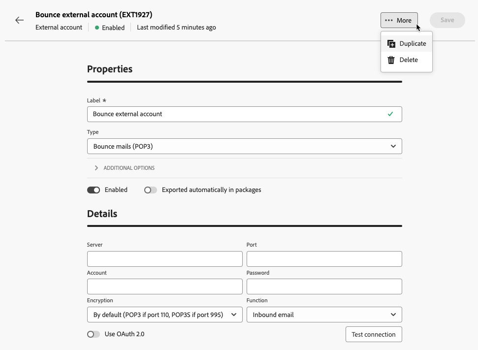
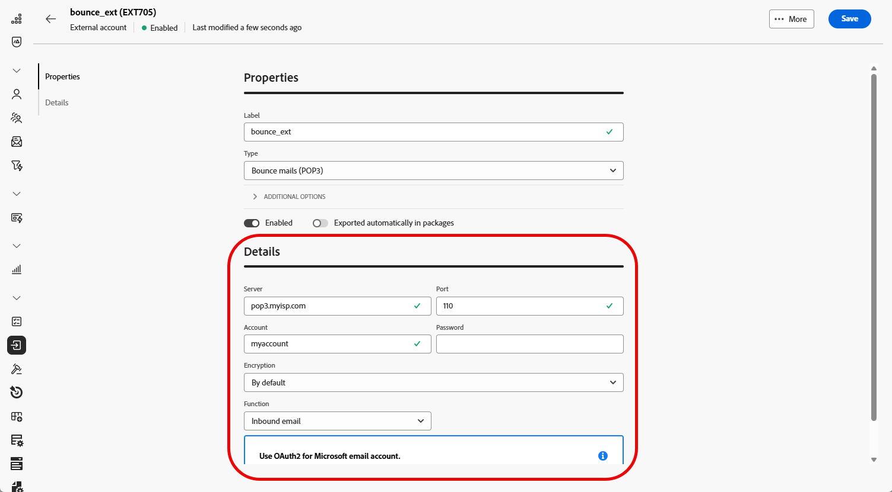

# 管理外部帳戶 {#external-accounts}

>[!CONTEXTUALHELP]
>id="acw_homepage_welcome_rn2"
>title="外部帳戶"
>abstract="您現在可以根據工作流程需求，連線至其他平台或自訂連線。此外，您還可以輕鬆建立新的外部帳戶，以滿足特定需求，並確保順暢的資料傳輸。"
>additional-url="https://experienceleague.adobe.com/docs/campaign-web/v8/release-notes/release-notes.html?lang=zh-hant" text="請參閱版本注意事項"

>[!AVAILABILITY]
>
> 請注意，外部帳戶目前僅可用於退信郵件(POP3)、路由和執行執行個體，未來將新增其他帳戶型別。
> 在Adobe Campaign主控台中建立的不支援外部帳戶會顯示在Web使用者介面中，但無法編輯或存取。

Adobe Campaign隨附預先設定的外部帳戶，可輕鬆與各種系統整合。 如果您需要連線至其他平台或自訂連線以符合工作流程，您現在可以使用網頁使用者介面輕鬆建立新的外部帳戶，以符合您的特定需求，並確保順暢的資料傳輸。

## 建立外部帳戶 {#create-ext-account}

若要建立新的外部帳戶，請遵循下列步驟。 詳細設定取決於外部帳戶的型別。 [了解更多](#campaign-specific)

1. 從左窗格功能表，選取&#x200B;**[!UICONTROL 管理]**&#x200B;下的&#x200B;**[!UICONTROL 外部帳戶]**。

1. 按一下&#x200B;**[!UICONTROL 建立外部帳戶]**。

   

1. 輸入您的&#x200B;**[!UICONTROL 標籤]**&#x200B;並選取外部帳戶&#x200B;**[!UICONTROL 型別]**。

   >[!NOTE]
   >
   >促銷活動特定型別的設定在[本節](#campaign-specific)中有詳細說明。

   

1. 按一下「**[!UICONTROL 建立]**」。

1. 您可以視需要從&#x200B;**[!UICONTROL 其他選項]**&#x200B;下拉式清單中變更&#x200B;**[!UICONTROL 內部名稱]**&#x200B;或&#x200B;**[!UICONTROL 資料夾]**&#x200B;路徑。

   

1. 若要自動匯出此外部帳戶所管理的資料，請啟用&#x200B;**[!UICONTROL 自動匯出到封裝]**&#x200B;選項。<!--Exported where??-->

   

1. 在&#x200B;**[!UICONTROL 詳細資料]**&#x200B;區段中，根據所選外部帳戶型別指定認證，以設定帳戶的存取權。 [了解更多](#bounce)

1. 按一下&#x200B;**[!UICONTROL 測試連線]**&#x200B;以檢查您的設定是否正確。

1. 從&#x200B;**[!UICONTROL 更多……]**&#x200B;功能表，您可以複製或刪除您的外部帳戶。

   

1. 完成設定後，按一下&#x200B;**[!UICONTROL 儲存]**。

## 促銷活動特定外部帳戶 {#campaign-specific}

根據您選取的外部帳戶型別，請依照下列步驟設定帳戶設定。

### 退回郵件 (POP3) {#bounce}

>[!AVAILABILITY]
>
> 目前不支援OAuth 2.0。

「退回郵件」外部帳戶指定用來連線至電子郵件服務的外部POP3帳戶。 所有設定為POP3存取的伺服器都可以接收傳回郵件。

若要設定&#x200B;**[!UICONTROL 退回郵件(POP3)]**&#x200B;外部帳戶，請填寫下列欄位：

* **[!UICONTROL 伺服器]** - POP3伺服器的URL

* **[!UICONTROL 連線埠]** - POP3連線埠號碼（預設連線埠為110）

* **[!UICONTROL 帳戶]** — 使用者名稱

* **[!UICONTROL 密碼]** — 使用者帳戶密碼

* **[!UICONTROL 加密]** — 選擇的加密型別，介於：

   * 依據預設 (如果連接埠為 110，則使用 POP3；如果連接埠為 995，則使用 POP3S)
   * 傳送 STARTTLS 後切換至 SSL 的 POP3
   * POP3 不安全 (預設為連接埠 110)
   * SSL 上的 POP3 安全 (預設為連接埠 995)

* **[!UICONTROL 函式]** — 當外部帳戶設定為接收傳入電子郵件或SOAP路由器以處理SOAP要求時，會收到傳入電子郵件。

### 路由 {#routing}

若要設定您外部傳遞中使用的特定外部帳戶，請遵循下列步驟。

1. 建立外部帳戶。 [了解更多](../administration/external-account.md#create-ext-account)

1. 選取&#x200B;**[!UICONTROL 路由]**&#x200B;型別。

   {zoomable="yes"}

1. 選取想要的頻道，然後按一下&#x200B;**[!UICONTROL 建立]**。

1. 在外部帳戶&#x200B;**[!UICONTROL 詳細資料]**&#x200B;區段中，預設會選取&#x200B;**[!UICONTROL 外部]**&#x200B;作為&#x200B;**[!UICONTROL 傳遞模式]**。

   {zoomable="yes"}

   >[!NOTE]
   >
   >目前&#x200B;**[!UICONTROL 外部]**&#x200B;是唯一可用的模式。

1. 若要在傳遞執行後處理流程，您可以將此外部化至後處理工作流程。 若要這麼做，您必須使用[外部訊號](../workflows/activities/external-signal.md)活動建立工作流程，並從&#x200B;**[!UICONTROL 後續處理]**&#x200B;欄位中選取它。

   {zoomable="yes"}

1. 在&#x200B;**[!UICONTROL 活動]**&#x200B;欄位中，您可以編輯將在記錄中顯示的後處理工作流程活動的名稱。<!--you can edit the name of the activity that will be created if you add an external or bulk delivery to a workflow-->

### 執行執行個體 {#instance-exec}

如果您有分段的架構，則必須識別與控制執行個體相關聯的執行個體，並建立它們之間的連線。 在執行例項上部署異動訊息範本。

若要設定&#x200B;**[!UICONTROL 執行例項]**&#x200B;外部帳戶：

* **[!UICONTROL URL]**

  安裝執行例項的伺服器的URL。

* **[!UICONTROL 帳戶]**

  帳戶名稱，它必須符合操作員資料夾中定義的訊息中心代理程式。

* **[!UICONTROL 密碼]**

  運運算元資料夾中定義的帳戶密碼。

* **[!UICONTROL 方法]**

  在Web服務或同盟資料存取(FDA)之間選擇。
若是FDA方法，請選取您的FDA帳戶。 請注意，與外部系統的Campaign連線僅限於進階使用者，而且只能從使用者端主控台使用。 [了解更多](https://experienceleague.adobe.com/en/docs/campaign/campaign-v8/connect/fda#_blank)

* **[!UICONTROL 建立封存工作流程]**

  對於在訊息中心註冊的每個執行例項，無論您是否擁有一個或多個例項，您都需要為與該執行例項關聯的每個外部帳戶建立單獨的封存工作流程。
