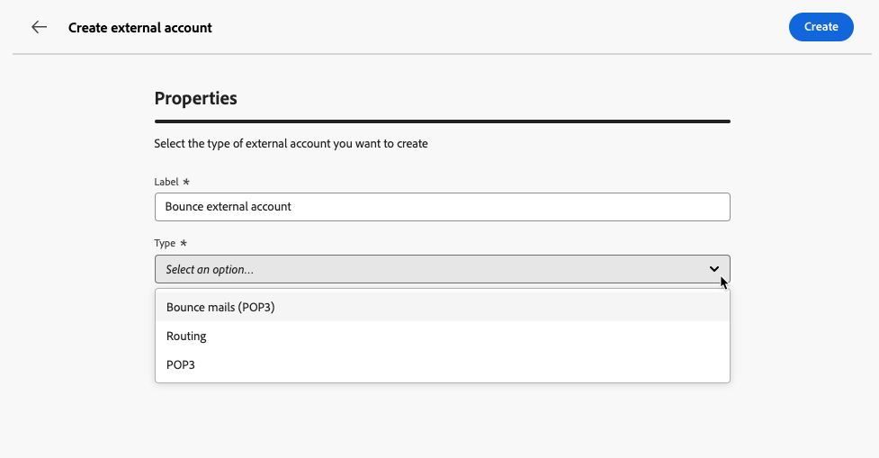
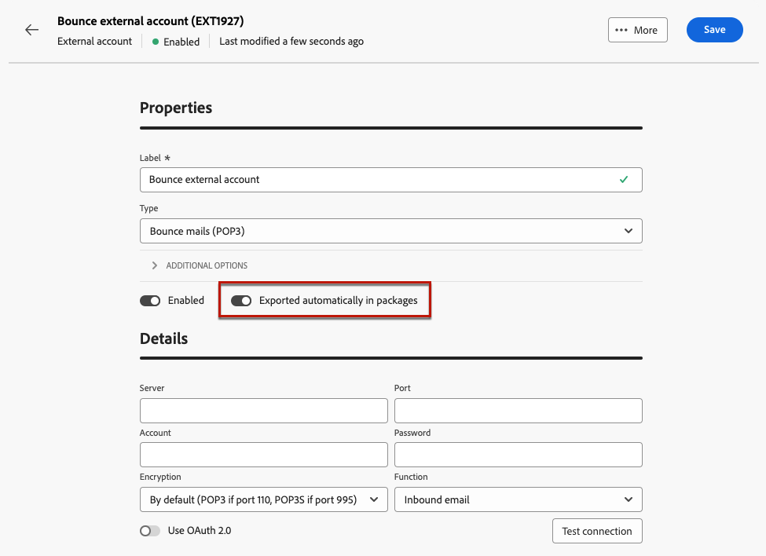

# 管理外部帳戶 {#external-accounts}

>[!AVAILABILITY]
>
>* 外部帳戶目前僅可用於退回郵件(POP3)、路由及執行個體。 稍後將新增其他帳戶型別。
>
>* 在Adobe Campaign主控台中建立的不支援外部帳戶會顯示在Web使用者介面中，但無法編輯或存取。

Adobe Campaign包括預先設定的外部帳戶，可輕鬆與各種系統整合。 若要連線到其他平台或自訂連線以符合您的工作流程，請使用Web使用者介面建立新的外部帳戶。 這可確保順暢的資料傳輸。

## 建立外部帳戶 {#create-ext-account}

若要建立新的外部帳戶，請遵循下列步驟。 詳細設定取決於外部帳戶的型別。 [了解更多](#campaign-specific)

1. 從左窗格功能表，選取&#x200B;**[!UICONTROL 管理]**&#x200B;下的&#x200B;**[!UICONTROL 外部帳戶]**。

1. 按一下&#x200B;**[!UICONTROL 建立外部帳戶]**。

   

1. 輸入您的&#x200B;**[!UICONTROL 標籤]**&#x200B;並選取外部帳戶&#x200B;**[!UICONTROL 型別]**。

   >[!NOTE]
   >
   >促銷活動特定型別的設定在[本節](#campaign-specific)中有詳細說明。

   

1. 按一下「**[!UICONTROL 建立]**」。

1. 從&#x200B;**[!UICONTROL 其他選項]**&#x200B;下拉式清單中，視需要變更&#x200B;**[!UICONTROL 內部名稱]**&#x200B;或&#x200B;**[!UICONTROL 資料夾]**&#x200B;路徑。

   

1. 啟用&#x200B;**[!UICONTROL 自動匯出到封裝]**&#x200B;選項，以自動匯出此外部帳戶管理的資料。<!--Exported where??-->

   

1. 在&#x200B;**[!UICONTROL 詳細資料]**&#x200B;區段中，根據所選外部帳戶型別指定認證，以設定帳戶的存取權。 [了解更多](#bounce)

1. 按一下&#x200B;**[!UICONTROL 測試連線]**&#x200B;以驗證您的設定是否正確。

1. 從&#x200B;**[!UICONTROL 更多……]**&#x200B;功能表，複製或刪除您的外部帳戶。

   ![熒幕擷圖顯示[更多]功能表，其中包含複製或刪除外部帳戶的選項。](assets/external_account_create_4.png)

1. 組態完成後，按一下[儲存]。**&#x200B;**

## 促銷活動特定外部帳戶 {#campaign-specific}

根據您選取的外部帳戶型別，請依照下列步驟設定帳戶設定。

### 退回郵件 (POP3) {#bounce}

>[!AVAILABILITY]
>
> 目前不支援OAuth 2.0。

「退回郵件」外部帳戶指定用來連線至電子郵件服務的外部POP3帳戶。 所有設定為POP3存取的伺服器都可以接收傳回郵件。

![熒幕擷圖顯示[退回郵件(POP3)]外部帳戶設定欄位。](assets/external_account_bounce.png)

若要設定&#x200B;**[!UICONTROL 退回郵件(POP3)]**&#x200B;外部帳戶，請填寫下列欄位：

* **[!UICONTROL 伺服器]** - POP3伺服器的URL。

* **[!UICONTROL 連線埠]** - POP3連線埠號碼（預設連線埠為110）。

* **[!UICONTROL 帳戶]** — 使用者名稱。

* **[!UICONTROL 密碼]** — 使用者帳戶密碼。

* **[!UICONTROL 加密]** — 選擇的加密型別，包括：
   * 依預設（若連線埠110則為POP3，若連線埠995則為POP3）。
   * 傳送STARTTLS後切換至SSL的POP3。
   * POP3不安全（預設連線埠110）。
   * POP3安全於SSL之上（預設連線埠995）。

* **[!UICONTROL 函式]** — 選取&#x200B;**[!UICONTROL 傳入電子郵件]**&#x200B;設定接收傳入電子郵件的帳戶，或選取&#x200B;**[!UICONTROL SOAP路由器]**&#x200B;處理SOAP要求。

### 路由 {#routing}

若要設定外部傳遞的特定外部帳戶，請遵循下列步驟。

1. 建立外部帳戶。 [了解更多](../administration/external-account.md#create-ext-account)

1. 選取&#x200B;**[!UICONTROL 路由]**&#x200B;型別。

   {zoomable="yes"}

1. 選取想要的頻道，然後按一下&#x200B;**[!UICONTROL 建立]**。

1. 在外部帳戶&#x200B;**[!UICONTROL 詳細資料]**&#x200B;區段中，預設會選取&#x200B;**[!UICONTROL 外部]**&#x200B;作為&#x200B;**[!UICONTROL 傳遞模式]**。

   {zoomable="yes"}

   >[!NOTE]
   >
   >目前，**[!UICONTROL 外部]**&#x200B;是唯一可用的模式。

1. 若要在傳遞執行後處理流程，請將此外部化至後處理工作流程。 使用[外部訊號](../workflows/activities/external-signal.md)活動建立工作流程，並從&#x200B;**[!UICONTROL 後續處理]**&#x200B;欄位中選取它。

   {zoomable="yes"}

1. 在&#x200B;**[!UICONTROL 活動]**&#x200B;欄位中，編輯記錄中顯示的後處理工作流程活動的名稱。<!--you can edit the name of the activity that will be created if you add an external or bulk delivery to a workflow-->

### 執行執行個體 {#instance-exec}

如果您有分段的架構，請識別與控制執行個體相關聯的執行個體，並建立它們之間的連線。 在執行例項上部署異動訊息範本。

若要設定&#x200B;**[!UICONTROL 執行例項]**&#x200B;外部帳戶：

* **[!UICONTROL URL]** — 安裝執行個體的伺服器的URL。

* **[!UICONTROL 帳戶]** — 帳戶的名稱，符合操作員資料夾中定義的訊息中心代理程式。

* **[!UICONTROL 密碼]** — 運運算元資料夾中定義的帳戶密碼。

* **[!UICONTROL 方法]** — 在Web服務或同盟資料存取(FDA)之間選擇。

  針對FDA，請選取您的FDA帳戶。 請注意，與外部系統的Campaign連線僅限於進階使用者，而且只能從使用者端主控台使用。 [了解更多](https://experienceleague.adobe.com/zh-hant/docs/campaign/campaign-v8/connect/fda#_blank)

* **[!UICONTROL 建立封存工作流程]** — 對於在訊息中心中註冊的每個執行執行個體，無論您是否有一或多個執行個體，請為與該執行個體相關聯的每個外部帳戶建立個別的封存工作流程。