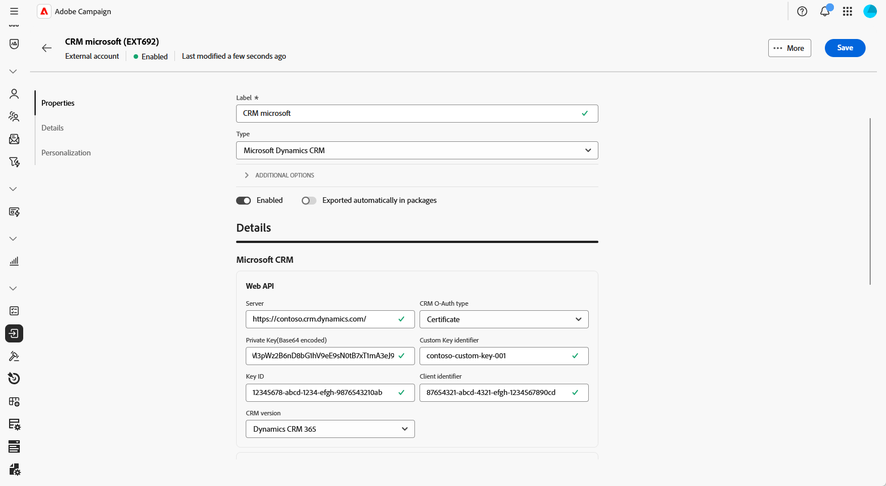
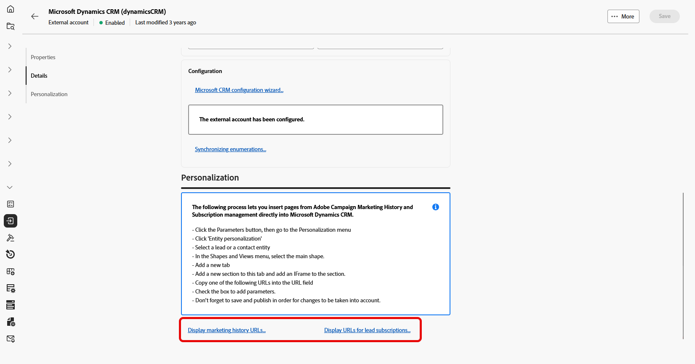
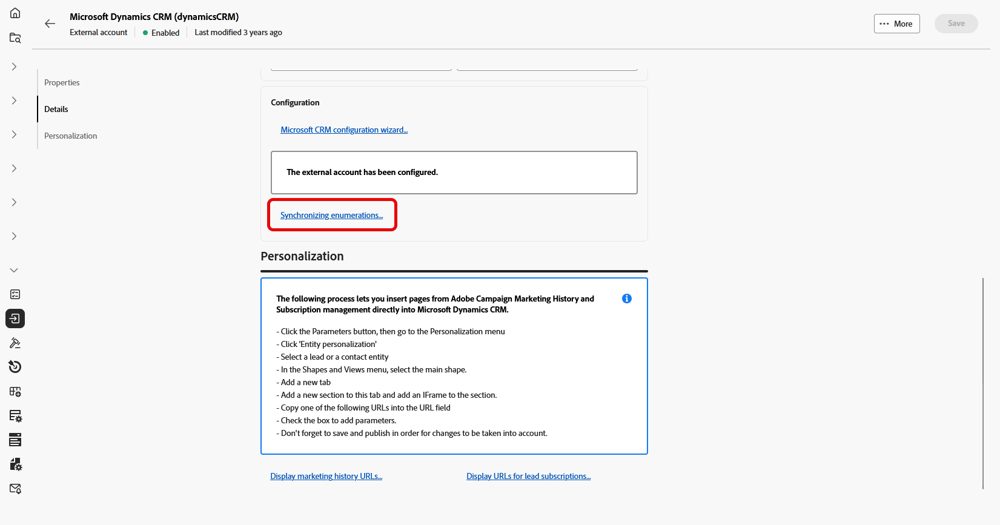
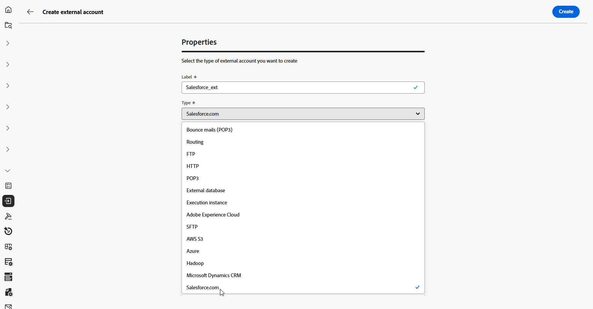
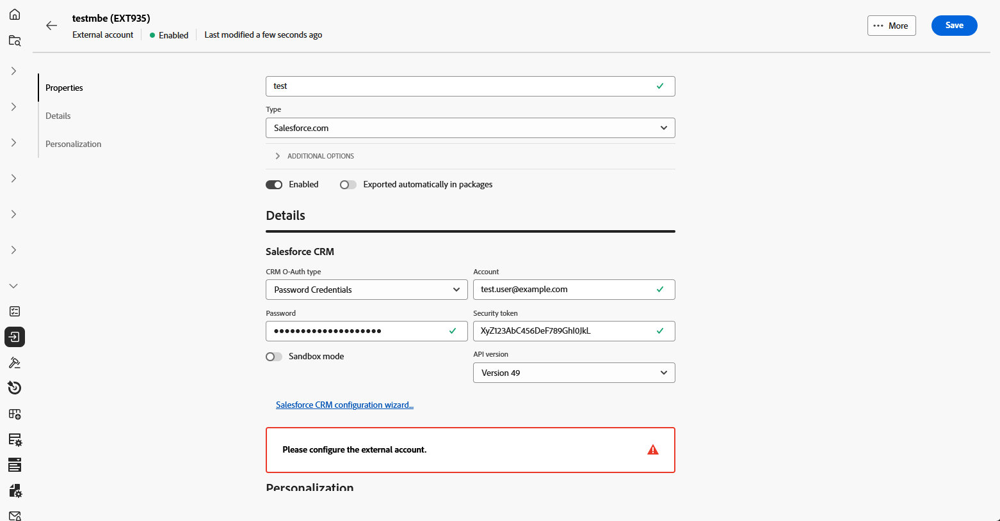
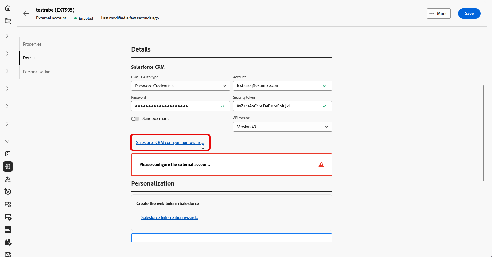
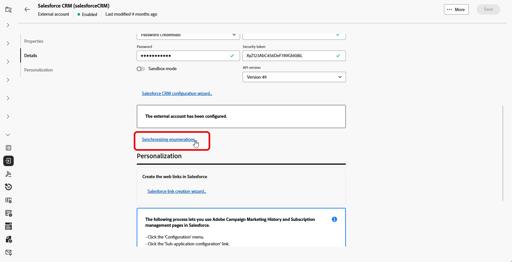
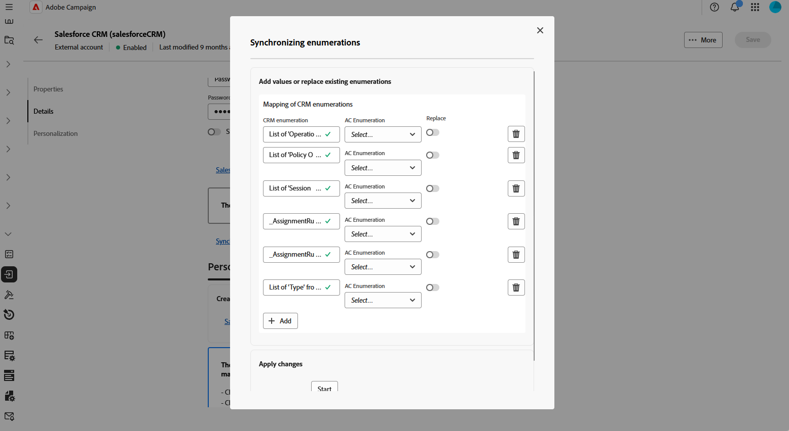

# CRM外部帳戶 {#external-crm}

使用外部CRM型別帳戶將Adobe Campaign與協力廠商資料庫連線。

此外部帳戶的組態設定取決於您連線的特定資料庫引擎。 以下各節提供每個支援資料庫的詳細設定指示。

## Microsoft Dynamics CRM

Microsoft Dynamics CRM外部帳戶可讓您將您的Campaign執行個體連線至Microsoft Dynamics CRM外部資料庫。

在Adobe Campaign Web使用者介面中，設定您的Microsoft Dynamics CRM外部帳戶。

1. [建立您的外部帳戶](external-account.md)，並選取&#x200B;**[!UICONTROL 外部資料庫]**&#x200B;作為外部帳戶的&#x200B;**[!UICONTROL 型別]**，並選取Microsoft Dynamics CRM作為&#x200B;**[!UICONTROL 提供者型別]**。

1. 按一下「**[!UICONTROL 建立]**」。

1. 若要設定&#x200B;**[!UICONTROL Microsoft Dynamics CRM]**&#x200B;外部帳戶，請填寫下列欄位：

   

   +++ CRM OAuth型別：密碼認證

   * **[!UICONTROL 伺服器]**：輸入Microsoft CRM伺服器的URL。

     若要尋找您的Microsoft CRM伺服器URL，請登入您的Microsoft Dynamics CRM帳戶，選取Dynamics 365，然後開啟您的應用程式。 伺服器URL會顯示在瀏覽器的位址列中，例如： `https://myserver.crm.dynamics.com/`。

   * **[!UICONTROL 帳戶]**：指定用來登入Microsoft CRM的帳戶。

   * **[!UICONTROL 密碼]**：輸入與指定帳戶關聯的密碼。

   * **[!UICONTROL 使用者端識別碼]**：輸入Microsoft Azure管理入口網站中的使用者端識別碼。

   * **[!UICONTROL CRM版本]**：選擇Dynamics CRM 365 CRM版本。

   +++

    

   +++ 對於CRM O-Auth型別：憑證

   * **[!UICONTROL 伺服器]**：輸入Microsoft CRM伺服器的URL。

     若要尋找您的Microsoft CRM伺服器URL，請登入您的Microsoft Dynamics CRM帳戶，選取Dynamics 365，然後開啟您的應用程式。 伺服器URL會顯示在瀏覽器的位址列中，例如： `https://myserver.crm.dynamics.com/`。

   * **[!UICONTROL 私密金鑰（Base64編碼）]**：提供Base64格式的私密金鑰。

     若要這樣做，您可以使用Base64編碼器或使用Linux的命令列`base64 -w0 private.key`。

   * **[!UICONTROL 自訂金鑰識別碼]**：輸入用於憑證的自訂金鑰識別碼。

   * **[!UICONTROL 金鑰識別碼]**：輸入與憑證關聯的金鑰識別碼。

   * **[!UICONTROL 使用者端識別碼]**：輸入Microsoft Azure管理中找到的使用者端識別碼

   * **[!UICONTROL CRM版本]**：選擇Dynamics CRM 365 CRM版本。

   +++

1. 設定連線後，存取&#x200B;**[!UICONTROL Microsoft CRM設定精靈]**&#x200B;以產生您的Microsoft CRM表格清單。

   按一下&#x200B;**[!UICONTROL 下一步]**&#x200B;以選取所需的資料表。

   

1. 選取要擷取的Microsoft CRM資料表，或透過指定&#x200B;**[!UICONTROL 資料表標籤]**&#x200B;和&#x200B;**[!UICONTROL 資料表內部名稱]**&#x200B;來新增遠端資料表，然後啟用&#x200B;**[!UICONTROL 選取專案]**&#x200B;切換功能。

   按一下&#x200B;**[!UICONTROL 下一步]**。

1. 按一下&#x200B;**[!UICONTROL 開始]**，開始根據選取的資料表建立Microsoft CRM結構描述。

1. 依照熒幕上的指示，將來自Adobe Campaign行銷記錄和訂閱管理的頁面直接插入Microsoft Dynamics CRM。

1. 按一下&#x200B;**[!UICONTROL 顯示行銷記錄URL]**&#x200B;以檢視整合行銷記錄頁面的URL，或按一下&#x200B;**[!UICONTROL 顯示潛在客戶訂閱的URL]**&#x200B;以檢視整合訂閱管理頁面的URL。

   

1. 設定Microsoft CRM外部帳戶後，按一下&#x200B;**[!UICONTROL 儲存]**。

1. 建立外部帳戶後，您現在可以按一下&#x200B;**[!UICONTROL 同步列舉……]**，自動從Microsoft CRM同步列舉至Adobe Campaign Web使用者介面。

   

1. 選取符合Microsoft CRM分項清單的Adobe Campaign分項清單。

   若要以Microsoft CRM值取代Adobe Campaign值，請啟用&#x200B;**[!UICONTROL 取代]**&#x200B;選項。

## Salesforce {#salesforce}

若要設定Salesforce外部帳戶以搭配Adobe Campaign使用，您必須提供下列詳細資料：

1. [建立您的外部帳戶](external-account.md)，並選取&#x200B;**[!UICONTROL 外部資料庫]**&#x200B;作為外部帳戶的&#x200B;**[!UICONTROL 型別]**，並選取Salesforce.com作為&#x200B;**[!UICONTROL 提供者型別]**。

   

1. 按一下「**[!UICONTROL 建立]**」。

1. 若要設定&#x200B;**[!UICONTROL Salesforce]**&#x200B;外部帳戶，請填寫下列欄位：

   * **[!UICONTROL CRM O-Auth型別]**： **[!UICONTROL 密碼認證]**&#x200B;或&#x200B;**[!UICONTROL 認證]**

   * **[!UICONTROL 帳戶]**：用來登入Salesforce CRM的帳戶。

   * **[!UICONTROL 密碼]**：輸入與指定帳戶關聯的密碼。

   * **[!UICONTROL 安全性權杖]**：輸入與帳戶相關聯的Salesforce安全性權杖。

   * **[!UICONTROL API版本]**：選擇版本49。

   

1. 開啟&#x200B;**[!UICONTROL Salesforce CRM設定精靈]**&#x200B;以產生Salesforce CRM表格清單，然後按一下&#x200B;**[!UICONTROL 下一步]**。

   

1. 選取要擷取的Salesforce資料表，或輸入&#x200B;**[!UICONTROL 資料表標籤]**&#x200B;和&#x200B;**[!UICONTROL 資料表內部名稱]**&#x200B;來新增遠端資料表，然後啟用&#x200B;**[!UICONTROL 選取專案]**&#x200B;切換功能。

   按一下&#x200B;**[!UICONTROL 下一步]**。

1. 按一下&#x200B;**[!UICONTROL 開始]**，開始根據選取的資料表建立Salesforce CRM結構描述。

1. 按一下&#x200B;**[!UICONTROL Salesforce連結建立精靈……]**，在Salesforce中產生網頁連結。

   然後，按一下[下一步]****&#x200B;從Salesforce擷取&#x200B;**潛在客戶**&#x200B;和&#x200B;**連絡人**&#x200B;的網頁連結。

1. 選取連結以匯出至Salesforce網頁連結清單。

1. 依照熒幕上的指示，從Adobe Campaign Web使用者介面將&#x200B;**行銷記錄**&#x200B;和&#x200B;**訂閱管理**&#x200B;頁面插入Salesforce CRM。

1. 設定Salesforce CRM外部帳戶後，按一下&#x200B;**[!UICONTROL 儲存]**。

1. 建立外部帳戶後，您現在可以按一下&#x200B;**[!UICONTROL 同步列舉……]**，自動從Salesforce同步列舉，到Adobe Campaign Web使用者介面。

   

1. 選取符合Adobe Campaign分項清單的Salesforce分項清單。

   若要以Salesforce值取代Adobe Campaign值，請啟用&#x200B;**[!UICONTROL 取代]**&#x200B;選項。

   

