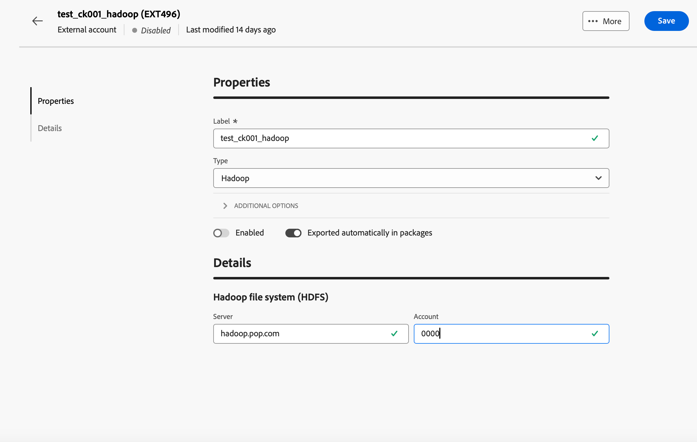

# Hadoop外部帳戶 {#external-hadoop}

Hadoop外部帳戶可讓您將您的Campaign執行個體連線至Hadoop外部資料庫。 您可以在[Campaign V7主控台檔案](https://experienceleague.adobe.com/en/docs/campaign-classic/using/installing-campaign-classic/accessing-external-database/configure-fda/config-databases/configure-fda-hadoop){target=_blank}中進一步瞭解Hadoop。

若要設定&#x200B;**[!UICONTROL Hadoop]**&#x200B;外部帳戶，請填寫下列欄位：

* **[!UICONTROL 伺服器]**

  Hadoop儲存伺服器的URL。

* **[!UICONTROL 帳戶]**

  您的Hadoop伺服器帳戶名稱。
