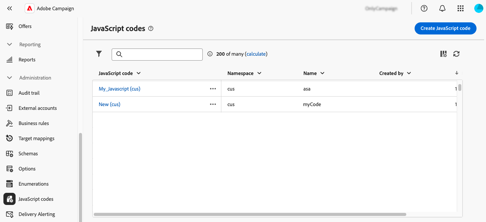
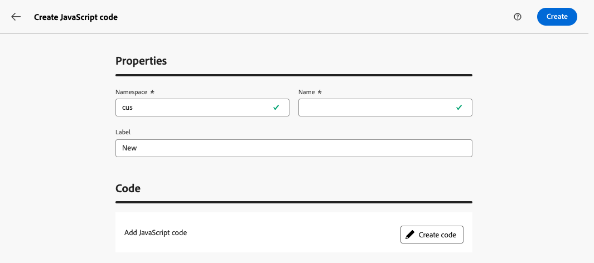
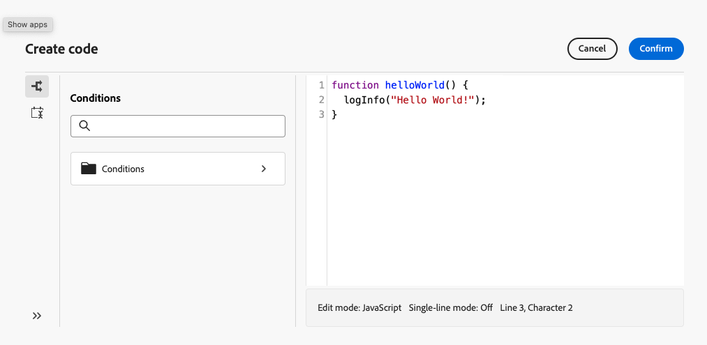
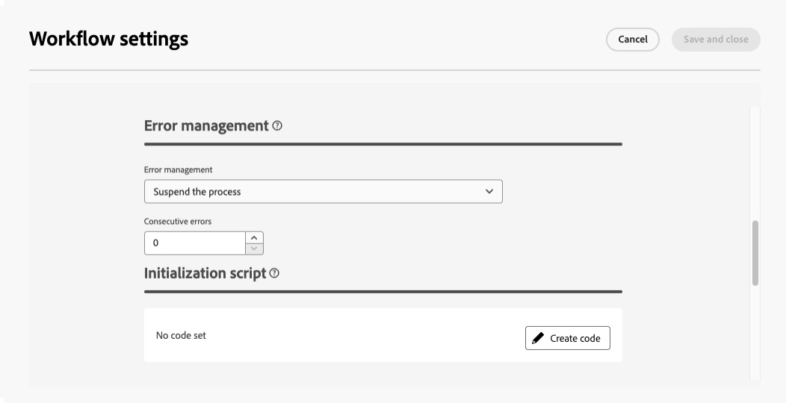
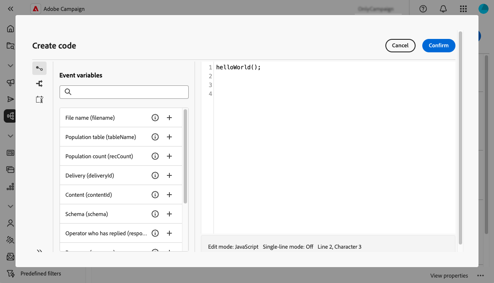

# 使用 JavaScript 程式碼 {#javascript-codes}

>[!CONTEXTUALHELP]
>id="acw_javascript_codes_list"
>title="JavaScript 程式碼"
>abstract="JavaScript 程式碼"

>[!CONTEXTUALHELP]
>id="acw_javascript_codes_create"
>title="建立 JavaScript 程式碼"
>abstract="建立 JavaScript 程式碼"

## 關於JavaScript程式碼 {#about}

JavaScript程式碼可讓您建立可重複使用的函式，並可在類似程式庫的工作流程中使用。 這些函式儲存在左側導覽窗格中的&#x200B;**[!UICONTROL 管理]** > **[!UICONTROL JavaScript程式碼]**&#x200B;功能表中。



從JavaScript程式碼清單中，您可以：

* **複製或刪除代碼**：按一下省略符號按鈕，然後選取所要的動作。
* **修改程式碼**：按一下程式碼名稱以開啟其屬性。 進行變更並儲存。
* **建立新的JavaScript代碼**：按一下&#x200B;**[!UICONTROL 建立JavaScript代碼]**&#x200B;按鈕。

>[!NOTE]
>
>雖然JavaScript程式碼功能表位置在Adobe Campaign主控台和網頁使用者介面之間有所差異，但清單仍相同，而且運作方式與映象類似。

## 建立JavaScript程式碼 {#create}

若要建立JavaScript程式碼，請依照下列步驟進行：

1. 瀏覽至&#x200B;**[!UICONTROL JavaScript程式碼]**&#x200B;功能表，然後按一下&#x200B;**[!UICONTROL 建立JavaScript程式碼]**&#x200B;按鈕。

1. 定義程式碼的屬性：

   * **[!UICONTROL 名稱空間]**：指定與自訂資源相關的名稱空間。 依預設，名稱空間為「cus」，但可能會依您的實施而有所不同。
   * **[!UICONTROL 名稱]**：用來參考程式碼的唯一識別碼。
   * **[!UICONTROL 標籤]**：要在JavaScript程式碼清單中顯示的描述性標籤。

   

   >[!NOTE]
   >
   >建立後，**[!UICONTROL 名稱空間]**&#x200B;和&#x200B;**[!UICONTROL 名稱]**&#x200B;欄位就無法修改。 若要進行變更，請復製程式碼並視需要更新。
   >
   >在Campaign主控台中，JavaScript程式碼名稱會顯示為這兩個欄位的串連。

1. 按一下&#x200B;**[!UICONTROL 建立代碼]**&#x200B;按鈕以定義JavaScript代碼。 左窗格提供兩個功能表，可讓您使用與條件和日期格式相關的預先定義函式。

   

1. 按一下&#x200B;**[!UICONTROL 確認]**&#x200B;以儲存您的程式碼。

1. 當您的JavaScript程式碼準備就緒時，請按一下&#x200B;**[!UICONTROL 建立]**。  JavaScript程式碼現在可在所有工作流程中使用。

## 從工作流程使用JavaScript程式碼 {#workflow}

### 載入JavaScript程式碼程式庫 {#library}

您可以在工作流程中參考JavaScript程式碼，以避免重寫重複工作的程式碼。 若要使用這些程式碼，您必須先在工作流程的初始化指令碼中載入對應的程式庫。 這可讓您載入包含您想在工作流程中使用的函式的所有程式庫一次。

若要載入程式庫，請執行下列步驟：

1. 開啟工作流程並按一下&#x200B;**[!UICONTROL 設定]**&#x200B;按鈕。
1. 瀏覽至&#x200B;**[!UICONTROL 初始化指令碼]**&#x200B;區段，然後按一下&#x200B;**[!UICONTROL 建立程式碼]**。

   

1. 在程式碼中使用下列語法載入程式庫：

   ```
   loadLibrary("/<namespace>/<name>")
   ```

   * 以JavaScript程式碼建立期間指定的名稱空間取代`<namespace>`。
   * 以JavaScript程式碼名稱取代`<name>`。

1. 按一下&#x200B;**[!UICONTROL 確認]**&#x200B;並儲存設定。

### 工作流程中的參考函式 {#reference}

載入JavaScript程式庫後，您可以直接在工作流程中參考JavaScript程式碼中定義的函式，通常使用&#x200B;**[!UICONTROL JavaScript程式碼]**&#x200B;活動。


