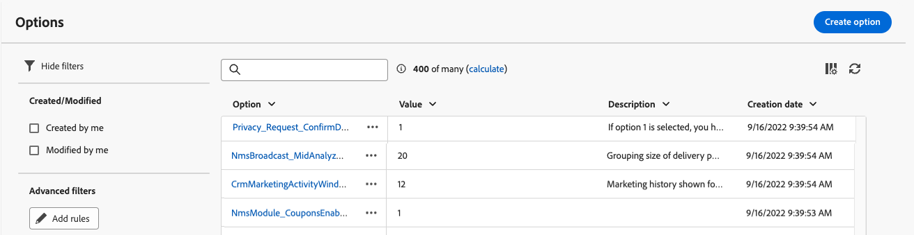
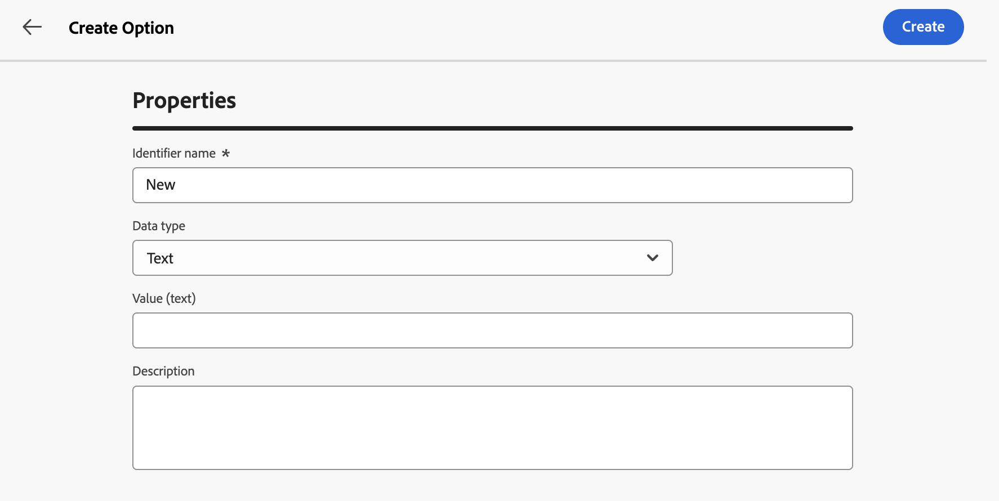
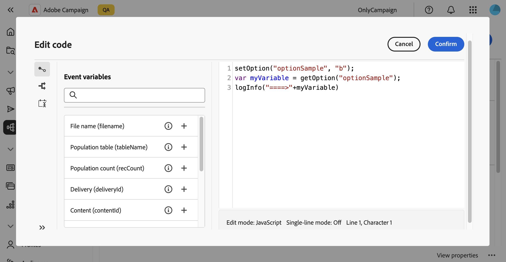
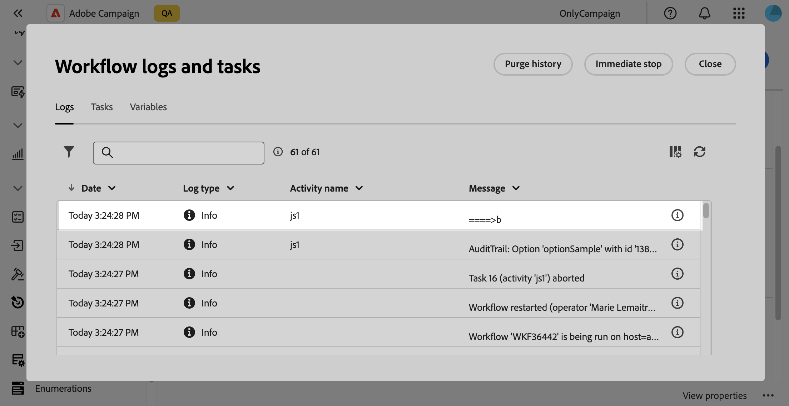
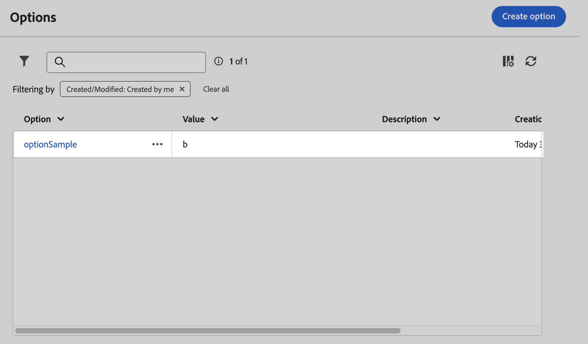

# 設定 [!DNL Campaign] 選項 {#options}

>[!CONTEXTUALHELP]
>id="acw_options_list"
>title="選項"
>abstract="選項"

>[!CONTEXTUALHELP]
>id="acw_options_create"
>title="建立選項"
>abstract="建立選項"

Adobe Campaign網頁版包含技術選項，可讓您更明確地設定應用程式。 這些選項中有些是內建的，有些則可視需要手動新增。

>[!IMPORTANT]
>內建選項已預先設定，僅供進階使用者修改。 如果您有任何問題或請求，請聯絡您的Adobe代表。

## 存取Campaign選項 {#access}

可從&#x200B;**[!UICONTROL 管理]** / **[!UICONTROL 選項]**&#x200B;功能表取得選項。 使用篩選窗格縮小清單的範圍，並快速找出您需要的選項。

\
[選項清單顯示在[管理] / [選項]功能表中]

>[!NOTE]
>雖然選項功能表位置在Adobe Campaign主控台和Web使用者介面之間有所不同，但清單仍相同，而且就像映象一樣運作。 如需可用選項的詳細資訊，請參閱[Campaign v7檔案](https://experienceleague.adobe.com/en/docs/campaign-classic/using/installing-campaign-classic/appendices/configuring-campaign-options){target="_blank"}中的選項清單。

從選項清單中，您可以：

* **複製或刪除選項**：按一下省略符號按鈕，然後選取所要的動作。
* **修改選項**：按一下選項名稱以開啟其屬性。 進行變更並儲存。
* **建立自訂選項**：按一下&#x200B;**[!UICONTROL 建立選項]**&#x200B;按鈕。

## 建立選項 {#create}

Adobe Campaign Web使用者介面可讓您建立符合您需求的自訂選項。 在處理 **[!UICONTROL JavaScript 程式碼]**&#x200B;工作流程活動時，利用自訂選項來儲存中間資料特別實用。

若要建立選項：

1. 存取選項清單並按一下&#x200B;**[!UICONTROL 建立選項]**。
1. 輸入選項的名稱，選取其型別，然後設定所要的值。
1. 按一下&#x200B;**[!UICONTROL 建立]**&#x200B;以建立選項。

選項可作為資料的臨時儲存空間，提供下列優點：

* 輸入值：選項支援特定的資料型別，例如日期、整數、字串等。
* 彈性：選項可讓使用者有效率地儲存及擷取資料，而不需要管理資料庫表格。

在下列範例中，名為`sampleOption`的自訂選項是以初始值「a」建立的。 工作流程中的&#x200B;**[!UICONTROL JavaScript程式碼]**&#x200B;活動會修改此選項的值，並將其儲存在變數中。 更新的值會顯示在工作流程記錄檔中，並反映在&#x200B;**[!UICONTROL 選項]**&#x200B;功能表中。

1. 建立選項。

   

1. 設定&#x200B;**[!UICONTROL JavaScript程式碼]**&#x200B;活動並啟動工作流程。

   

1. 執行工作流程以在工作流程記錄檔中檢視更新的值。

   

1. 更新的值現在會顯示在&#x200B;**[!UICONTROL 選項]**&#x200B;功能表中。

   
