# 計劃和專案 {#plan-and-programs}

Adobe Campaign 讓您可以為行銷計劃和專案設定資料夾階層。

為了更妥善地組織這些元件，Adobe建議使用下列階層：計畫`>`方案`>`行銷活動。

* **計畫**&#x200B;可能包含多個計畫。 它會定義特定期間的策略目標。
* **方案**&#x200B;可能包含其他方案，以及行銷活動、工作流程和登入頁面。
* **行銷活動**&#x200B;可能包含傳遞、工作流程和登入頁面。

## 建立及設定計畫 {#create-plan}

若要建立計畫，請建立資料夾型別為&#x200B;**[!UICONTROL 計畫]**&#x200B;的資料夾。 [進一步瞭解如何建立資料夾](../get-started/work-with-folders.md)

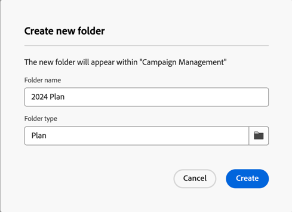{zoomable="yes"}

前往您計畫的&#x200B;**[!UICONTROL 資料夾設定]**&#x200B;來管理它。

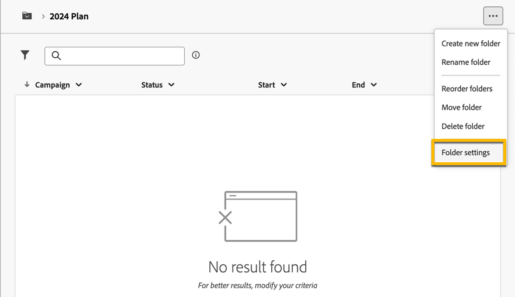{zoomable="yes"}資料夾設定的熒幕擷圖

定義&#x200B;**[!UICONTROL 自訂選項]**，並設定計畫的排程日期。

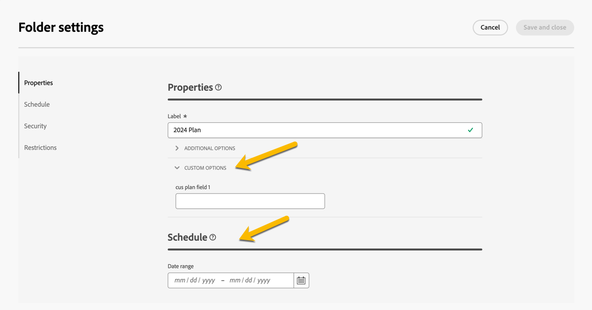{zoomable="yes"}自訂選項的熒幕擷圖

若要管理&#x200B;**[!UICONTROL 自訂選項]**：

1. 瀏覽至&#x200B;**[!UICONTROL 結構描述]**。
1. 選擇篩選器中的&#x200B;**[!UICONTROL 可編輯]**&#x200B;結構描述。
1. 按一下結構。

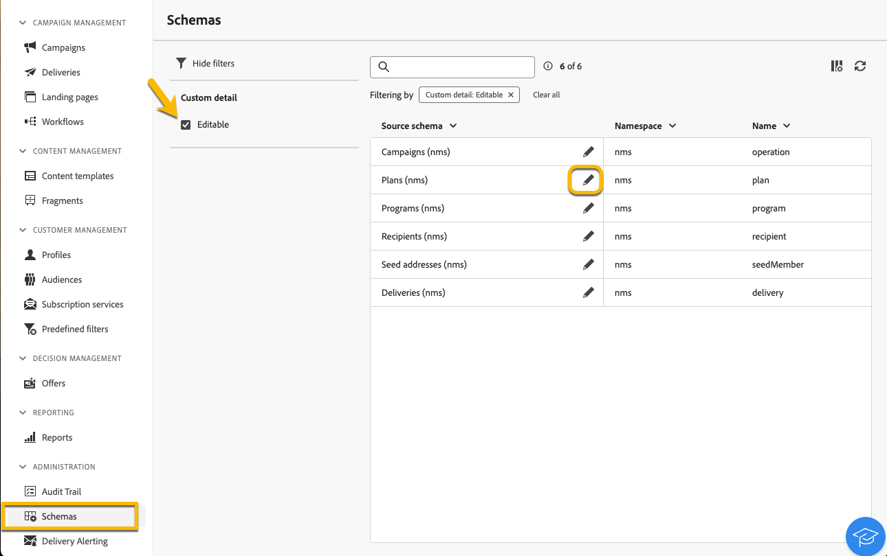{zoomable="yes"}

1. 按一下&#x200B;**[!UICONTROL 熒幕版本]**&#x200B;按鈕。

   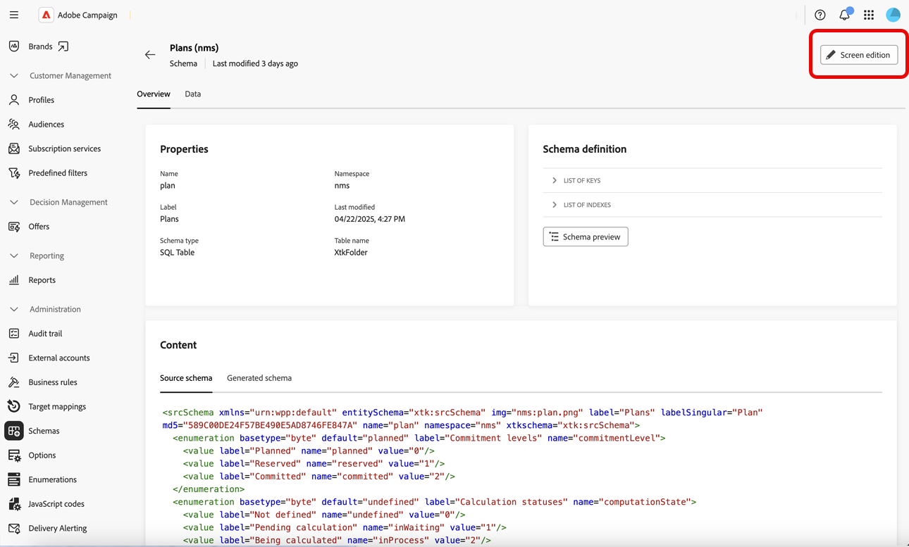{zoomable="yes"}

設定自訂選項：

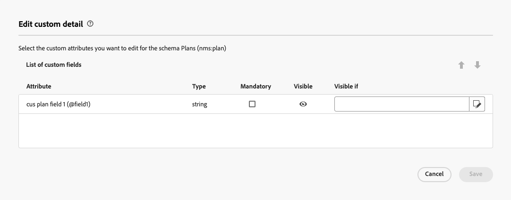{zoomable="yes"}自訂欄位設定的熒幕擷圖

## 建立及設定程式

若要在您的計畫中建立方案（[深入瞭解如何建立方案](#create-plan)），請瀏覽至您的計畫，並建立資料夾型別為&#x200B;**[!UICONTROL 方案]**&#x200B;的資料夾。 [進一步瞭解如何建立資料夾](../get-started/work-with-folders.md)。

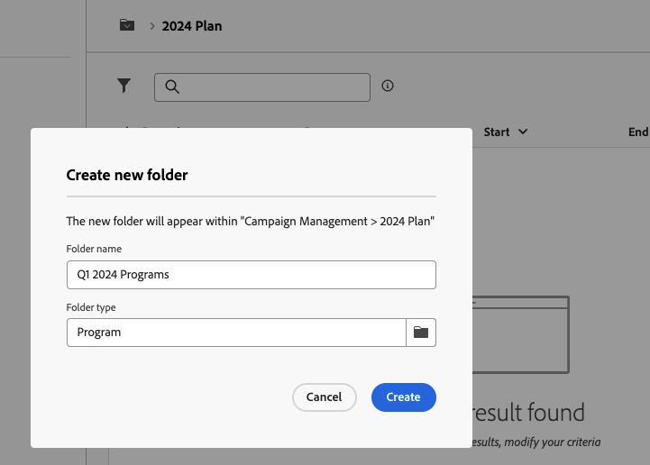{zoomable="yes"}

移至程式的&#x200B;**[!UICONTROL 資料夾設定]**&#x200B;來管理它。

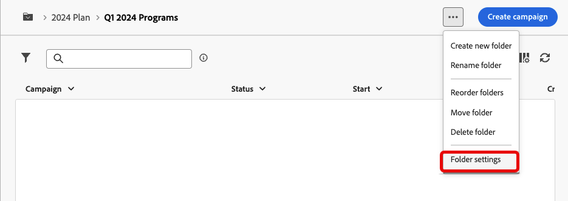{zoomable="yes"}

定義&#x200B;**[!UICONTROL 自訂選項]**，並設定方案的排程日期。

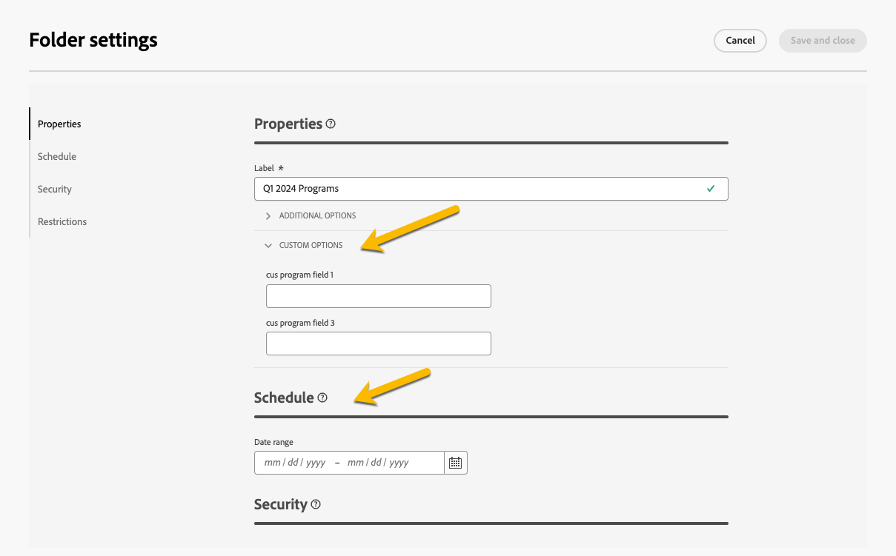{zoomable="yes"}

若要管理&#x200B;**[!UICONTROL 自訂選項]**：

1. 瀏覽至&#x200B;**[!UICONTROL 結構描述]**。
1. 選擇篩選器中的&#x200B;**[!UICONTROL 可編輯]**&#x200B;結構描述。
1. 按一下結構。

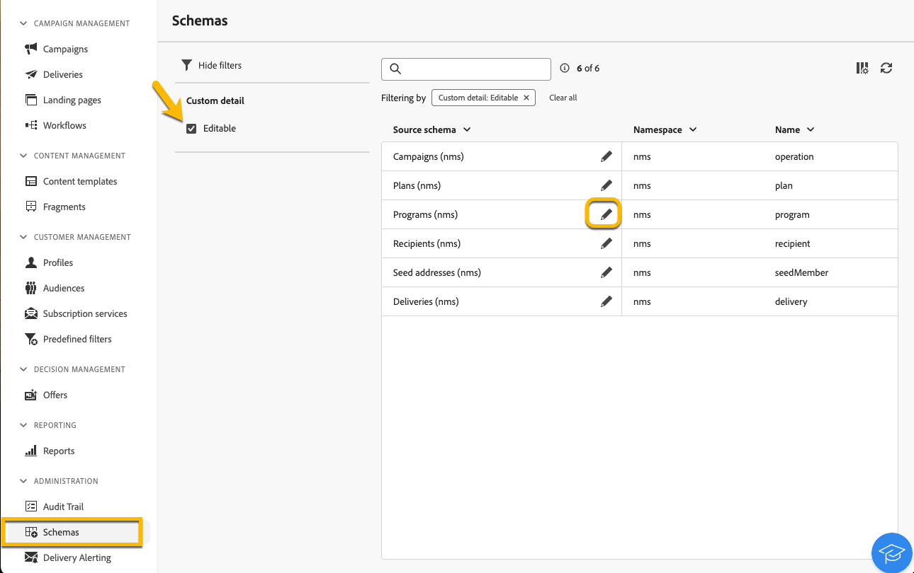{zoomable="yes"}

1. 按一下&#x200B;**[!UICONTROL 熒幕版本]**&#x200B;按鈕。

   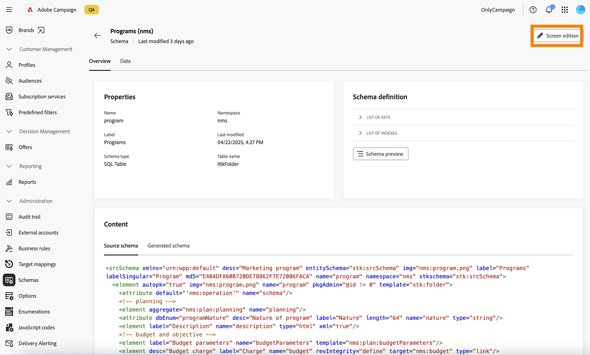{zoomable="yes"}

設定自訂選項：

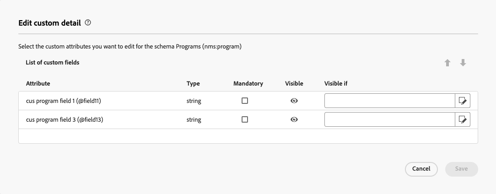{zoomable="yes"}

## 如何將行銷活動連結至方案

您有兩種方式可將行銷活動連結至方案：

### 方式#1：您已擁有方案，且想要建立與其連結的行銷活動

若要將新行銷活動連結至您的方案，請直接在方案中建立行銷活動。

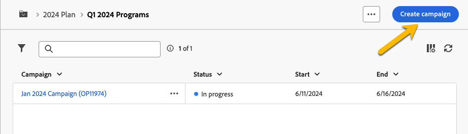{zoomable="yes"}

**[!UICONTROL 資料夾]**&#x200B;設定會自動填入您的程式路徑。

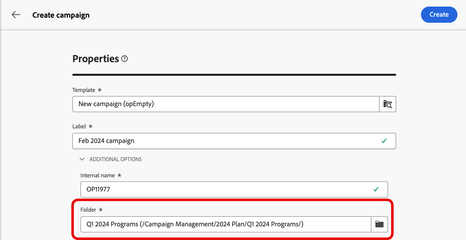{zoomable="yes"}

### 方式#2：您已有現有行銷活動，且想將其連結至現有方案

前往您要連結至方案之行銷活動的&#x200B;**[!UICONTROL 設定]**&#x200B;按鈕。

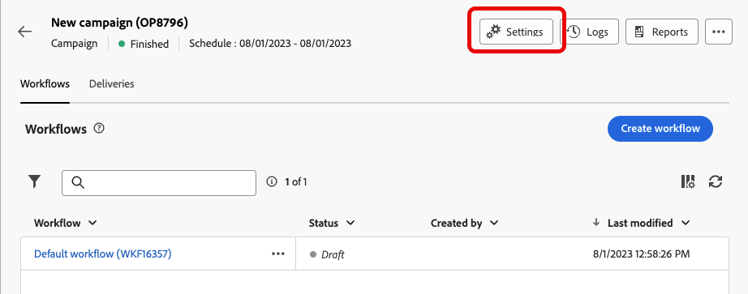{zoomable="yes"}

在它的&#x200B;**[!UICONTROL 屬性]**&#x200B;中，按一下&#x200B;**[!UICONTROL 資料夾]**&#x200B;設定中的&#x200B;**[!UICONTROL 資料夾]**&#x200B;圖示以選擇您的&#x200B;**[!UICONTROL 程式]**&#x200B;資料夾。

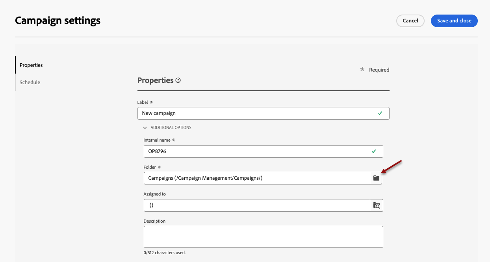{zoomable="yes"}

選取您的&#x200B;**[!UICONTROL 程式]**&#x200B;資料夾，按一下&#x200B;**[!UICONTROL 確認]**&#x200B;按鈕，然後按一下&#x200B;**[!UICONTROL 儲存並關閉]**&#x200B;按鈕。

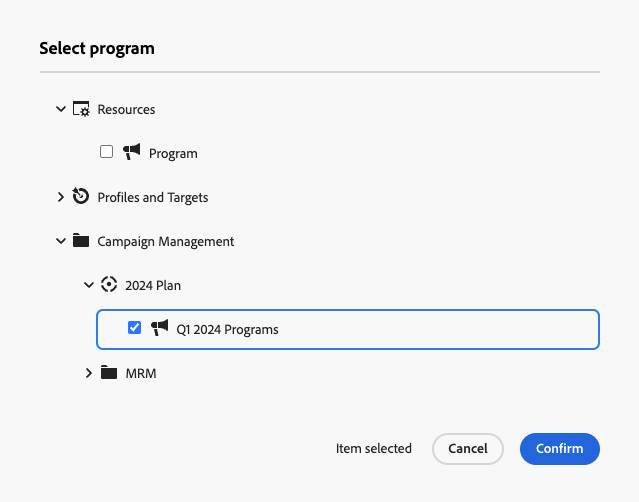{zoomable="yes"}

您的行銷活動現在已列在您的方案中。

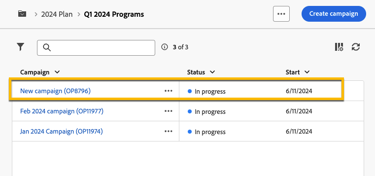{zoomable="yes"}