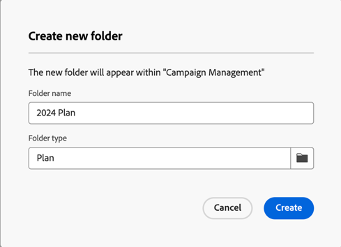
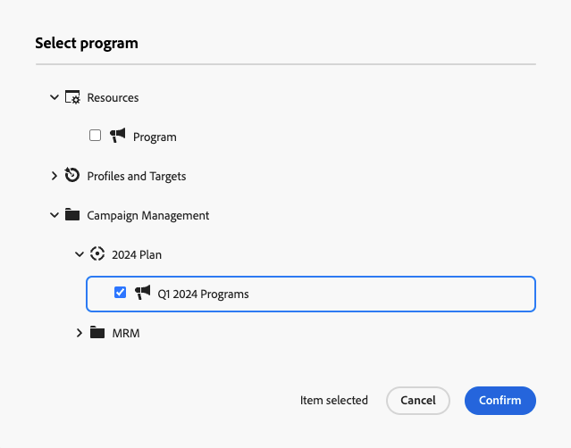

# 計劃和專案 {#plan-and-programs}

Adobe Campaign 讓您可以為行銷計劃和專案設定資料夾階層。

為了更妥善地組織這些元件，Adobe建議使用下列階層：計畫`>`方案`>`行銷活動。

* **計畫**&#x200B;可能包含多個計畫。 它會定義特定期間的策略目標。
* **方案**&#x200B;可能包含其他方案，以及行銷活動、工作流程和登錄頁面。
* **行銷活動**&#x200B;可能包含傳遞、工作流程和登入頁面。

## 建立及設定計畫 {#create-plan}

若要建立計畫，請建立資料夾型別為&#x200B;**[!UICONTROL 計畫]**&#x200B;的資料夾。 [進一步瞭解如何建立資料夾](../get-started/work-with-folders.md)

{zoomable="yes"}

前往您計畫的&#x200B;**[!UICONTROL 資料夾設定]**&#x200B;來管理它。

{zoomable="yes"}資料夾設定的熒幕擷圖

定義&#x200B;**[!UICONTROL 自訂選項]**，並設定計畫的排程日期。

{zoomable="yes"}自訂選項的熒幕擷圖

若要管理&#x200B;**[!UICONTROL 自訂選項]**：

1. 瀏覽至&#x200B;**[!UICONTROL 結構描述]**。
1. 選擇篩選器中的&#x200B;**[!UICONTROL 可編輯]**&#x200B;結構描述。
1. 按一下結構。

{zoomable="yes"}

1. 按一下&#x200B;**[!UICONTROL 熒幕版本]**&#x200B;按鈕。

   {zoomable="yes"}

設定自訂選項：

{zoomable="yes"}自訂欄位設定的熒幕擷圖

## 建立及設定程式 {#create-program}

可從左側導覽功能表取得方案，類似於行銷活動、傳送和工作流程的清單檢視。 **[!UICONTROL 方案]**&#x200B;專案可讓您在現有方案中建立方案，而不是在計畫底下。

若要在計畫中建立您的第一個最上層方案，請在總管中導覽至您的方案（請參閱此[區段](#create-plan)），然後建立資料夾型別為&#x200B;**[!UICONTROL 方案]**&#x200B;的資料夾。 [進一步瞭解如何建立資料夾](../get-started/work-with-folders.md)。

若要在現有方案中建立方案，請遵循下列步驟：

1. 瀏覽至左側導覽功能表中的&#x200B;**[!UICONTROL 程式]**&#x200B;專案。 此檢視會列出您的所有程式，並讓您搜尋和篩選。 按一下程式即可在瀏覽器檢視中開啟它。

   {zoomable="yes"}

1. 按一下&#x200B;**[!UICONTROL 建立程式]**&#x200B;並設定下列選項：

   ![顯示[建立程式]熒幕的熒幕擷圖](assets/program_create.png){zoomable="yes"}

   * 輸入&#x200B;**[!UICONTROL 標籤]**。
   * 選取現有程式以用作&#x200B;**[!UICONTROL 父資料夾]**。
   * 選擇性地在&#x200B;**[!UICONTROL 排程]**&#x200B;區段中設定&#x200B;**[!UICONTROL 日期範圍]**。

   >[!TIP]
   >
   >如果從「總管」檢視建立程式，則父資料夾會自動設定為目前的程式。

1. 再按一下&#x200B;**[!UICONTROL 建立方案]**&#x200B;以儲存變更並建立方案。 然後程式會顯示在Explorer檢視中。 您可以像其他資料夾一樣重新命名、刪除和存取其設定。 您也可以在此方案中建立子方案。

   {zoomable="yes"}

計畫的自訂選項設定方式與計畫的設定方式相同。 請參閱[建立並設定計畫](#create-plan)。

## 如何將行銷活動連結至方案

您有兩種方式可將行銷活動連結至方案：

### 方式#1：您已擁有方案，且想要建立與其連結的行銷活動

若要將新行銷活動連結至您的方案，請直接在方案中建立行銷活動。

{zoomable="yes"}

**[!UICONTROL 資料夾]**&#x200B;設定會自動填入您的程式路徑。

{zoomable="yes"}

### 方式#2：您已有現有行銷活動，且想將其連結至現有方案

前往您要連結至方案之行銷活動的&#x200B;**[!UICONTROL 設定]**&#x200B;按鈕。

{zoomable="yes"}

在它的&#x200B;**[!UICONTROL 屬性]**&#x200B;中，按一下&#x200B;**[!UICONTROL 資料夾]**&#x200B;設定中的&#x200B;**[!UICONTROL 資料夾]**&#x200B;圖示以選擇您的&#x200B;**[!UICONTROL 程式]**&#x200B;資料夾。

{zoomable="yes"}

選取您的&#x200B;**[!UICONTROL 程式]**&#x200B;資料夾，按一下&#x200B;**[!UICONTROL 確認]**&#x200B;按鈕，然後按一下&#x200B;**[!UICONTROL 儲存並關閉]**&#x200B;按鈕。

{zoomable="yes"}

您的行銷活動現在已列在您的方案中。

{zoomable="yes"}