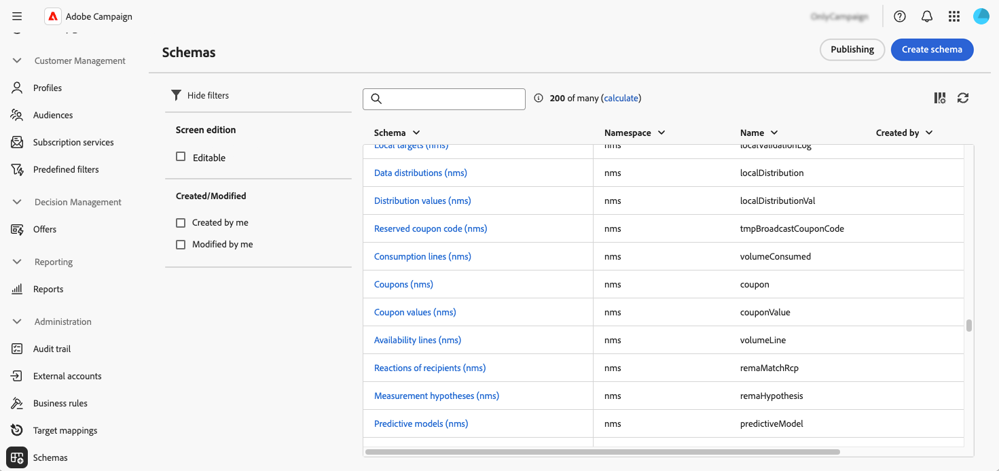
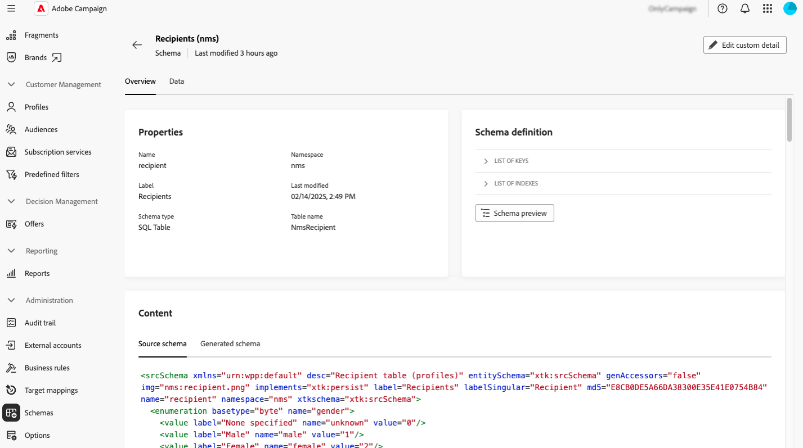
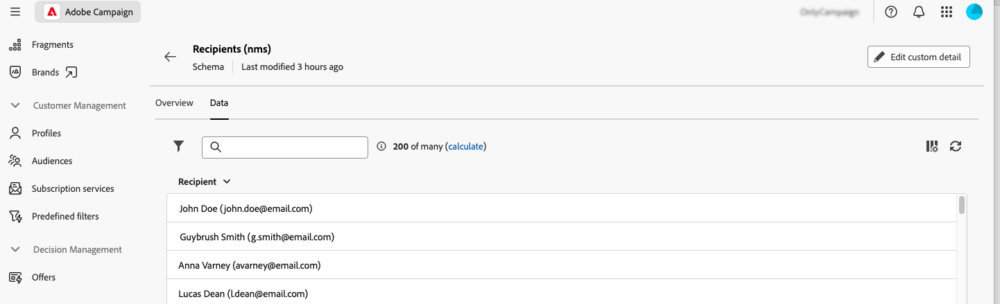
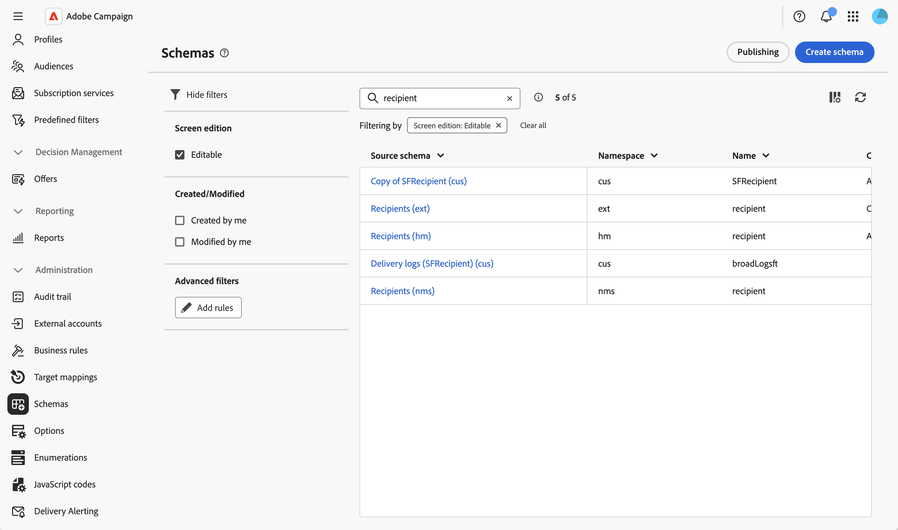
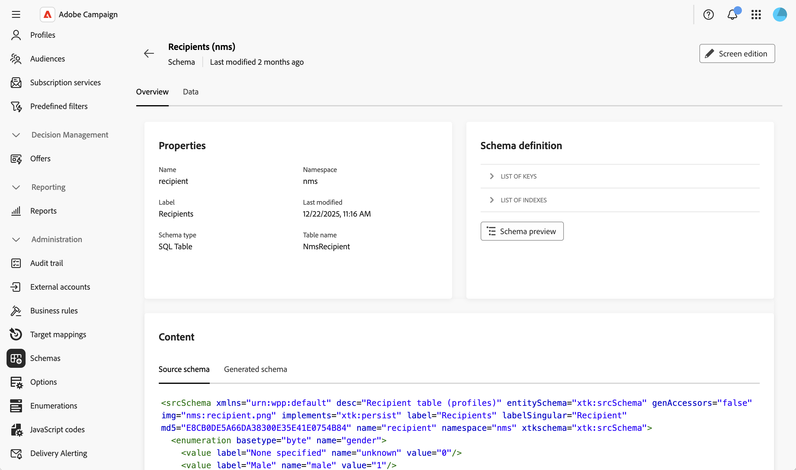
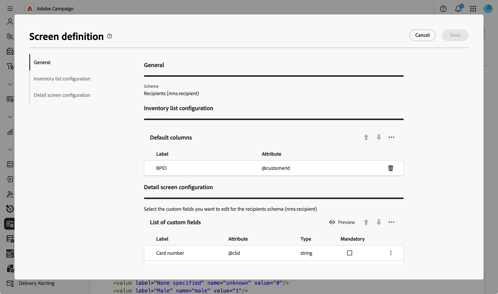

# 存取和設定方案 {#access}

可從&#x200B;**[!UICONTROL 管理]** > **[!UICONTROL 方案]**&#x200B;功能表存取方案。

在此畫面中，您可以檢視所有現有結構。 您可以使用篩選器來調整清單顯示項目，例如僅顯示可編輯的結構描述。

若要開啟結構描述，請選取其名稱。 詳細結構檢視隨即顯示。

## 結構概觀 {#overview}

**[!UICONTROL 總覽]**&#x200B;標籤提供結構描述的一般檢視：

* **[!UICONTROL 屬性]**&#x200B;區段會顯示索引鍵資訊，例如結構描述名稱、名稱空間和相關聯的資料表名稱。

* **[!UICONTROL 結構描述定義]**&#x200B;區段顯示有關結構描述定義的詳細資訊，包括用於資料協調的主要金鑰及其與其他表格的連結。

  按一下&#x200B;**[!UICONTROL 結構描述預覽]**&#x200B;按鈕，以檢視構成結構描述的不同欄位和連結。 這可讓您檢查架構的完整結構。 如果結構描述已使用自訂欄位擴充，您可以將其所有擴充功能視覺化。

* **[!UICONTROL Content]**&#x200B;區段會顯示結構描述的XML內容，讓您在來源和產生的語法之間切換。

## 結構描述資料 {#data}

**[!UICONTROL Data]**&#x200B;索引標籤提供有關結構描述資料的資訊。

## 自訂熒幕顯示 {#screen-def}

熒幕定義可讓您設定在介面中顯示及編輯綱要欄位的方式。 您可以設定清單檢視的預設欄、自訂在詳細畫面中顯示的自訂欄位、新增集合清單以顯示相關資料，以及使用分隔符號和可見性條件將欄位組織成區段。

若要存取熒幕定義：

1. 瀏覽至&#x200B;**[!UICONTROL 結構描述]**&#x200B;功能表，並使用篩選器找到可編輯的結構描述。

   

1. 選取清單中的結構描述名稱以開啟它，然後按一下結構描述詳細資料檢視中的&#x200B;**[!UICONTROL 熒幕版本]**&#x200B;按鈕以存取熒幕定義。

   

   不同的清單可讓您使用向上和向下箭頭圖示，或拖放元素，以重新排列元素。 若要移除專案，請按一下特定列上的垃圾桶圖示，或從省略符號圖示中選取&#x200B;**[!UICONTROL 全部刪除]**。

   

從熒幕定義中，您可以：

* [設定預設清單欄](schemas-list-columns.md) — 設定清單檢視中預設顯示的欄。
* [編輯自訂欄位](schemas-custom-fields.md) — 設定哪些自訂欄位會顯示在詳細畫面中，並將它們組織成區段。
* [新增集合清單](schemas-collection-lists.md) — 新增集合清單，以在設定檔畫面中顯示相關資料。
