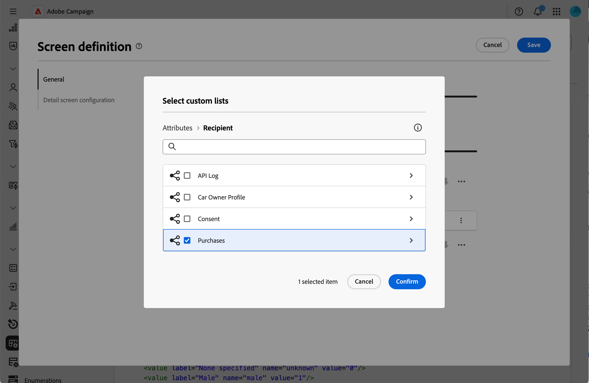

# 新增集合清單 {#collection-lists}

**自訂清單清單**&#x200B;區段可讓您定義集合連結，例如購買。 然後，相關資料會透過專用索引標籤顯示在設定檔畫面中。

如需有關熒幕定義畫面以及如何存取畫面的詳細資訊，請參閱[存取畫面定義](schemas-browse-access.md#screen-def)區段。

>[!NOTE]
>
>目前，此功能僅適用於收件者結構描述。

若要新增集合清單，請執行下列動作：

1. 瀏覽至&#x200B;**[!UICONTROL 結構描述]**&#x200B;功能表，並使用篩選器找到可編輯的結構描述。

1. 選取清單中的結構描述名稱以開啟它，然後按一下結構描述詳細資料檢視中的&#x200B;**[!UICONTROL 熒幕版本]**&#x200B;按鈕以存取熒幕定義。

1. 按一下省略符號圖示，然後選擇&#x200B;**[!UICONTROL 選取自訂清單]**。

   

1. 選取其中一個可用的自訂清單，例如購買專案，然後按一下[確認]。**&#x200B;**

   

1. 瀏覽至&#x200B;**設定檔**&#x200B;功能表，並篩選已購買的設定檔。

   

1. 按一下設定檔。 您會注意到新標籤隨即顯示。 您可以視需要新增更多欄。

   
