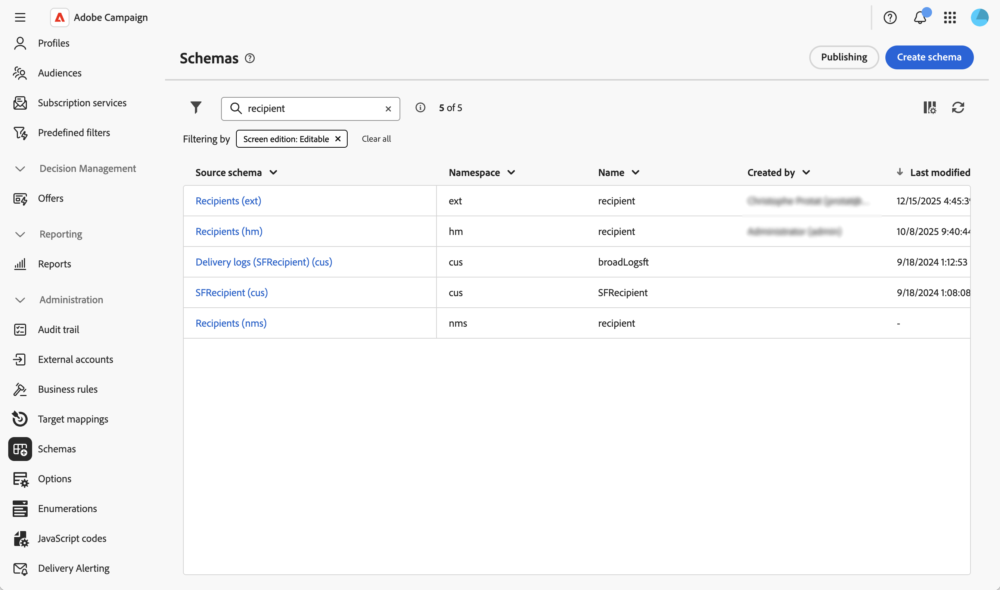
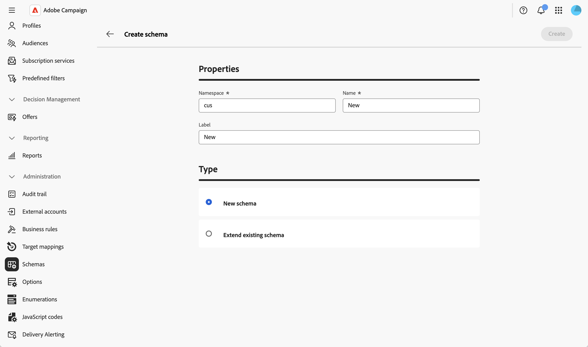
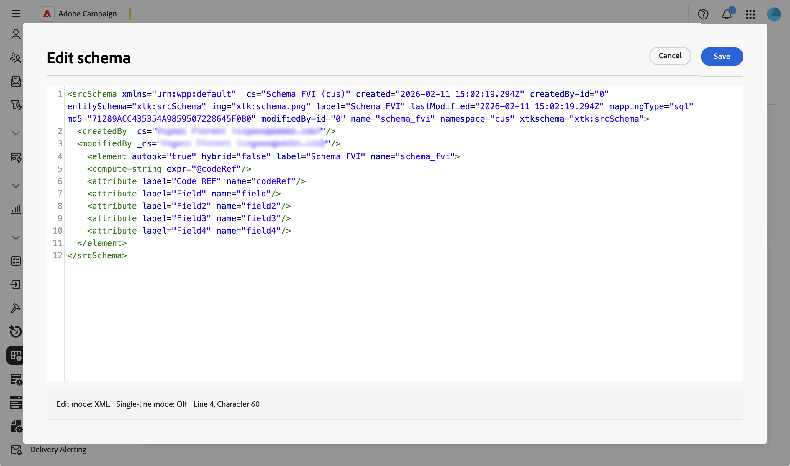
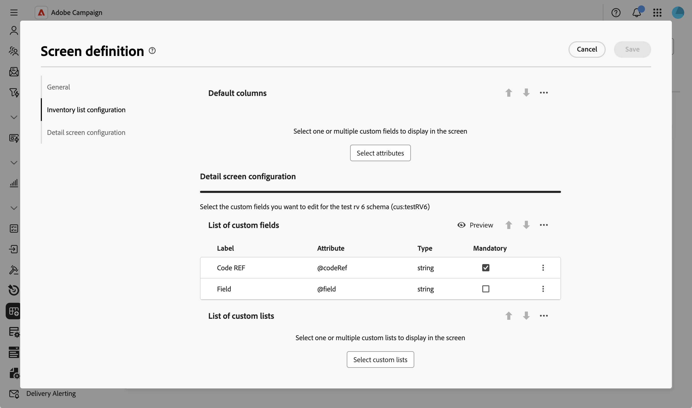
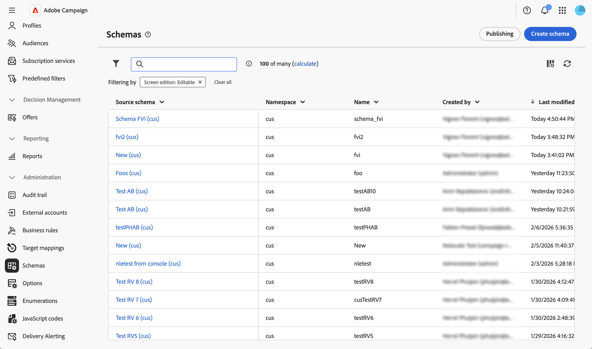
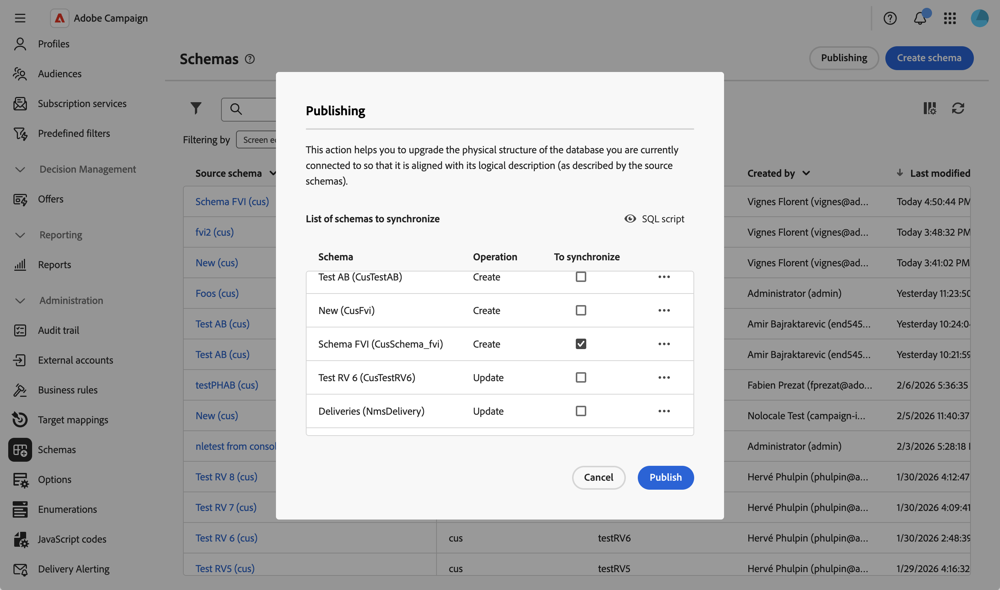
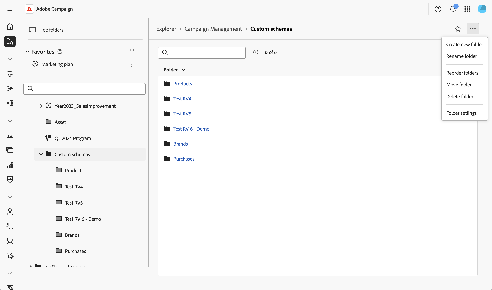
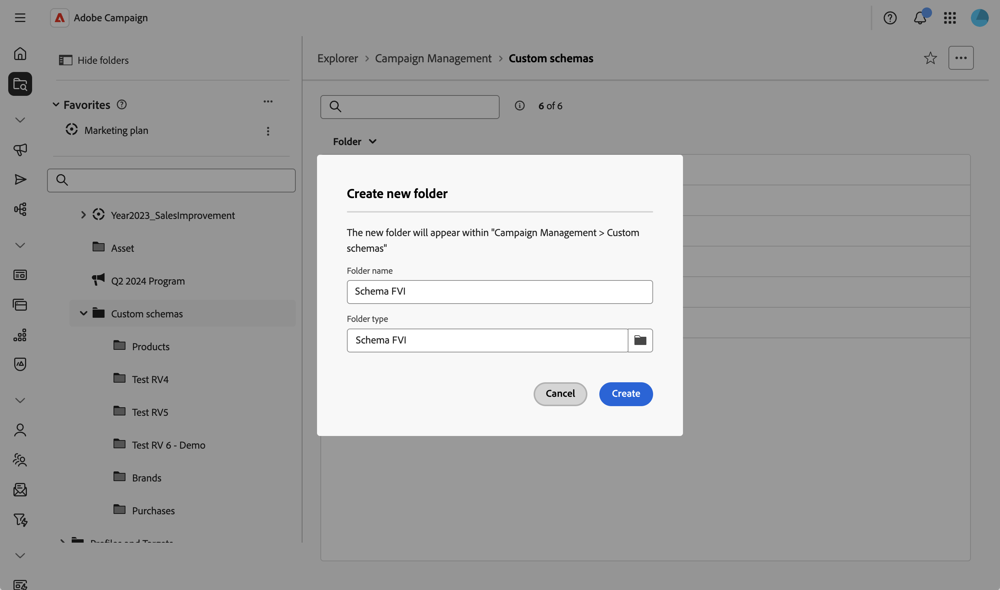

# 建立和發佈結構描述 {#create-publish}

## 建立和管理方案 {#create-schemas}

您可以建立新方案、擴充現有方案，以及存取外部資料庫。

### 建立或擴充方案 {#create-new}

若要建立或擴充綱要：

1. 瀏覽至&#x200B;**[!UICONTROL 管理]** > **[!UICONTROL 結構描述]**。
1. 按一下&#x200B;**[!UICONTROL 建立結構描述]**。

   

1. 輸入結構描述的名稱空間（例如，自訂結構描述為`cus`）。
1. 輸入唯一名稱和標籤，然後選擇是要建立新方案還是擴充現有方案。

1. 按一下「**[!UICONTROL 建立]**」。
   

會建立架構並顯示產生的架構結構。

結構描述預設為空白。 您現在需要使用結構編輯器新增要包含在結構描述中的欄位：

1. 按一下結構描述詳細資訊畫面中&#x200B;**[!UICONTROL 內容]**&#x200B;區段中的鉛筆圖示。
2. 新增所需元素並儲存。 以下是自訂結構描述結構的範例：

   

系統會自動驗證XML結構並產生架構。

### 定義熒幕版本 {#define-attributes}

建立方案後，您需要定義熒幕版本。

如需有關熒幕定義畫面以及如何存取畫面的詳細資訊，請參閱[存取畫面定義](schemas-browse-access.md#screen-def)區段。

在我們的範例中，我們僅新增兩個自訂欄位：

1. 按一下結構描述詳細資料檢視中的&#x200B;**[!UICONTROL 熒幕版本]**&#x200B;按鈕以存取熒幕定義。

1. 按一下&#x200B;**[!UICONTROL 自訂欄位清單]**&#x200B;表格上方的省略符號圖示，然後選擇&#x200B;**[!UICONTROL 選取屬性]**。
1. 選取您要新增的自訂欄位並進行確認。

   

## 發佈並同步結構描述 {#publish}

建立或修改方案後，您需要發佈該方案，以將邏輯方案與實體資料庫結構同步。

### 發佈結構描述變更 {#publish-changes}

>[!CAUTION]
>
>發佈結構描述變更會修改資料庫結構。 在確認發佈之前，請務必瞭解這些變更的影響。

若要發佈結構描述變更：

1. 瀏覽至&#x200B;**[!UICONTROL 管理]** > **[!UICONTROL 結構描述]**&#x200B;以存取結構描述清單。
1. 按一下&#x200B;**[!UICONTROL 發佈]**&#x200B;並確認。

   

1. 在清單中選取您要同步的結構描述。

   

1. 檢閱將執行以更新資料庫結構的SQL指令碼。
1. 按一下&#x200B;**[!UICONTROL 發佈]**&#x200B;並確認繼續發佈。

>[!NOTE]
>
>根據資料庫的大小和變更的複雜性，此程式可能需要一些時間。

### 建立導覽專案 {#navigation}

發佈自訂結構描述後，您可以在Explorer中建立導覽專案，以存取自訂資料：

1. 導覽至&#x200B;**[!UICONTROL Explorer]**&#x200B;功能表，並選取您要放置自訂結構描述的資料夾。
1. 按一下省略符號圖示，然後按一下&#x200B;**[!UICONTROL 建立新資料夾]**。
   
1. 新增標籤，並在&#x200B;**[!UICONTROL 資料夾型別]**&#x200B;欄位中選擇您的結構描述。
   
1. 現在可從&#x200B;**[!UICONTROL 總管]**&#x200B;檢視存取自訂結構描述。

從新資料夾中，您可以：

* 檢視自訂結構描述中的記錄清單。
* 建立新記錄。
* 編輯和刪除現有記錄。
* 自訂清單檢視中預設顯示的欄。
