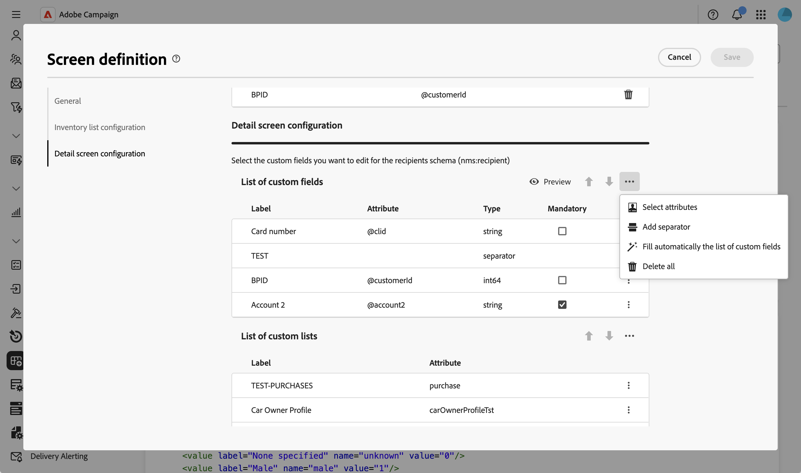
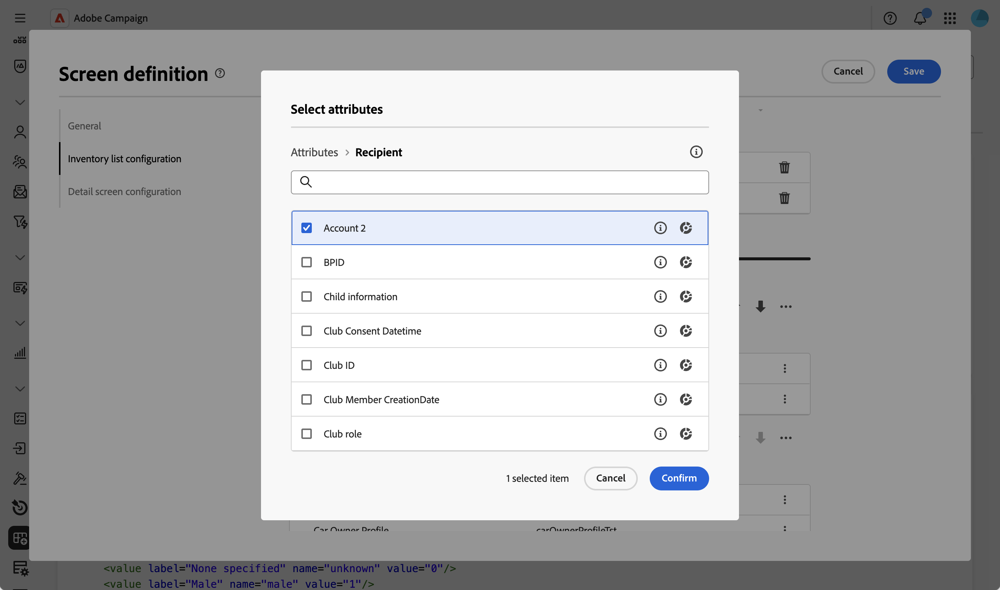
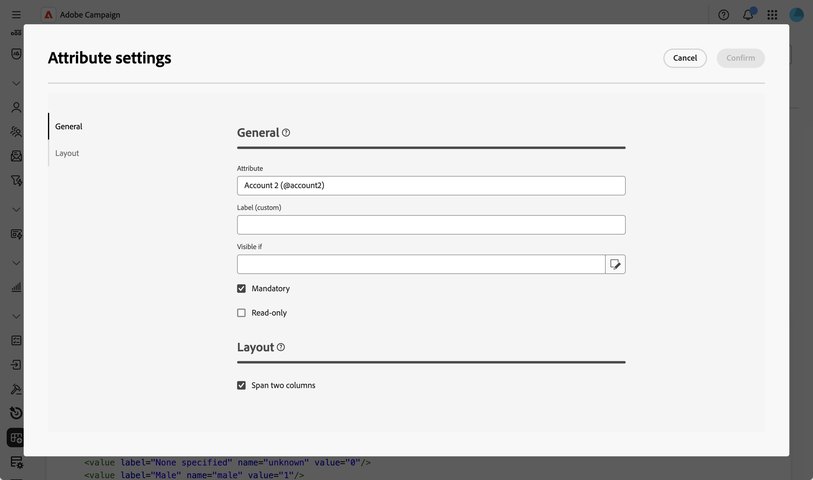
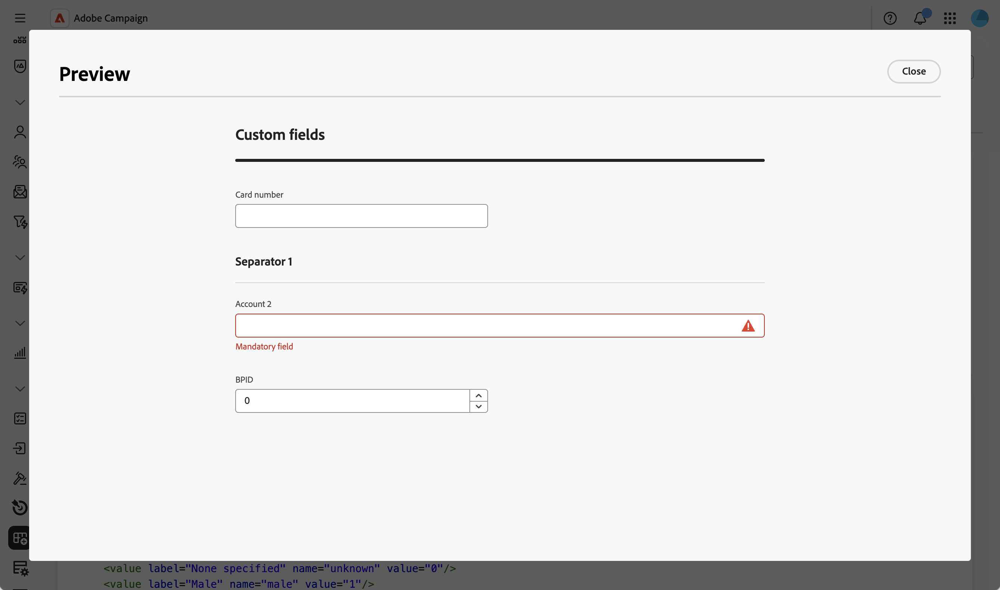
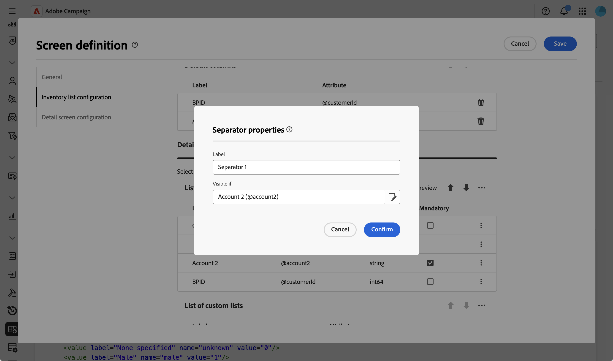

# 編輯自訂欄位 {#fields}

自訂欄位是透過Adobe Campaign主控台新增至現成可用結構描述的其他屬性。 它們可讓您透過包含新屬性來自訂結構以符合您組織的需求。

自訂欄位可以顯示在各種畫面中，例如介面中的設定檔詳細資訊。 您可以控制哪些欄位可見，以及它們在介面中的顯示方式。

如需有關熒幕定義畫面以及如何存取畫面的詳細資訊，請參閱[存取畫面定義](schemas-browse-access.md#screen-def)區段。

若要新增自訂欄位至清單：

1. 瀏覽至&#x200B;**[!UICONTROL 結構描述]**&#x200B;功能表，並使用篩選器找到可編輯的結構描述。

1. 選取清單中的結構描述名稱以開啟它，然後按一下結構描述詳細資料檢視中的&#x200B;**[!UICONTROL 熒幕版本]**&#x200B;按鈕以存取熒幕定義。

1. 按一下&#x200B;**[!UICONTROL 自訂欄位清單]**&#x200B;表格上方的省略符號圖示，然後選擇&#x200B;**[!UICONTROL 選取屬性]**以選取一或多個自訂欄位以顯示於介面中。
   
1. 選取您要新增的自訂欄位並進行確認。

   

   >[!NOTE]
   >
   > 您也可以選取&#x200B;**[!UICONTROL 自動填寫自訂欄位清單]**，以將結構描述定義的所有自訂欄位新增到介面。

新增自訂欄位後，您可以預覽、重新排序、設定為必要、編輯設定或組織為子區段。

## 設定欄位設定 {#field-settings}

若要設定每個自訂欄位的特定設定，請按一下清單中欄位列的省略符號圖示，並選取&#x200B;**[!UICONTROL 編輯]**。

可用的設定包括：

* **[!UICONTROL 屬性]**：自訂欄位的名稱（唯讀）。
* **[!UICONTROL 標籤（自訂）]**：要顯示在介面中的標籤。 如果未提供標籤，則會顯示結構描述中定義的標籤。
* **[!UICONTROL 顯示條件：]**：使用控制欄位顯示時間的xtk運算式定義條件。 例如，如果另一個欄位為空，則隱藏此欄位。
* **[!UICONTROL 必要]**：在介面中將欄位設為必要。
* **[!UICONTROL 唯讀]**：將介面中的欄位設為唯讀。 使用者將無法編輯欄位的值。
* **[!UICONTROL 篩選器設定]** （針對連結型別欄位）：使用查詢模組化工具來指定顯示連結型別自訂欄位的規則。 例如，根據另一個欄位的輸入來限制清單值。

  +++檢視範例

  您也可以使用語法`$(<field-name>)`，參考條件中其他欄位輸入的值。 這可讓您參照在表單中輸入的欄位目前值，即使它尚未儲存到資料庫亦然。

  在以下範例中，條件會檢查@ref欄位的值是否與在@refCom欄位中輸入的值相符。 相反地，使用`@refCom`而非`$(@refCom)`會參照資料庫中@ref欄位的值。

  

  +++

* **[!UICONTROL 跨越兩欄]**：根據預設，介面中的自訂欄位會以兩欄顯示。 將這個選項切換為開啟，以全螢幕的寬度而非兩欄來顯示自訂欄位。

## 預覽自訂欄位 {#preview}

按一下&#x200B;**[!UICONTROL 預覽]**，在範例畫面中顯示自訂欄位。 這可讓您檢視欄位在介面中的顯示方式，包括哪些欄位標示為必填欄位。

## 組織子區段中的欄位 {#separator}

您可以新增分隔符號，以便將介面中的自訂欄位分組，以提高可讀性。 若要這麼做，請依照以下步驟進行：

1. 按一下&#x200B;**[!UICONTROL 自訂欄位清單]**&#x200B;表格上方的省略符號圖示，然後選擇&#x200B;**[!UICONTROL 新增分隔符號]**。

1. 代表分隔符號的新行會新增至清單中。 按一下分隔符號列上的省略符號圖示，然後選擇&#x200B;**[!UICONTROL 編輯]**。

1. 輸入分隔符號的&#x200B;**[!UICONTROL 標籤]**，並（選擇性）設定&#x200B;**[!UICONTROL Visible if]**&#x200B;條件來控制顯示分隔符號的時間。

   

1. 使用向上和向下箭頭將分隔符號移至所需位置。 分隔符號下方所列的欄位將會分組在它下方。

   在此範例中，「感興趣的集合」和「品牌」欄位會分組到「集合」子區段。

   | 自訂欄位設定 | 在介面中轉譯 |
   |  ---  |  ---  |
   | {zoomable="yes"} | {zoomable="yes"} |
