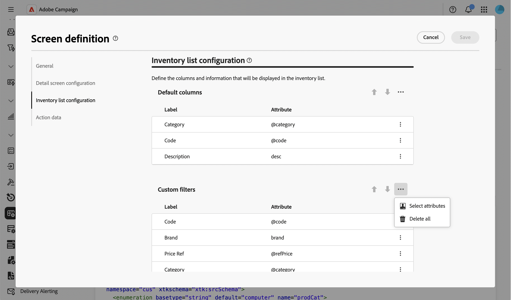
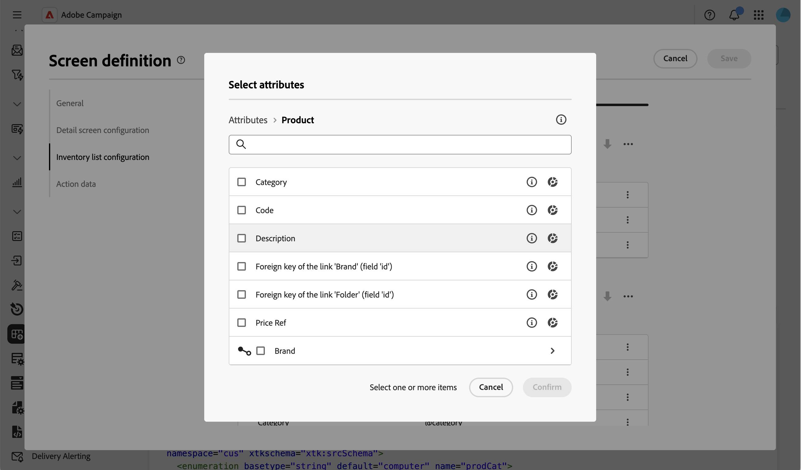
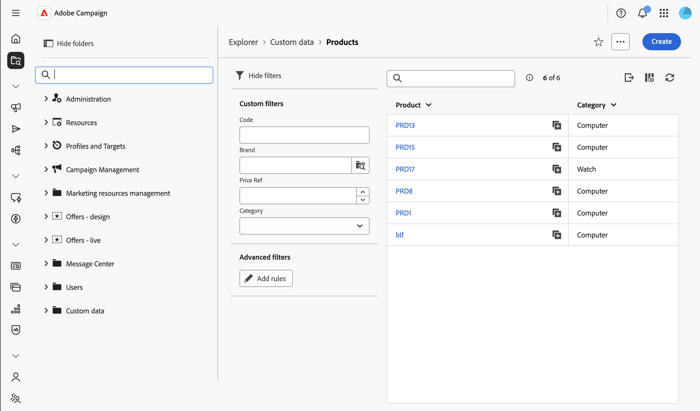
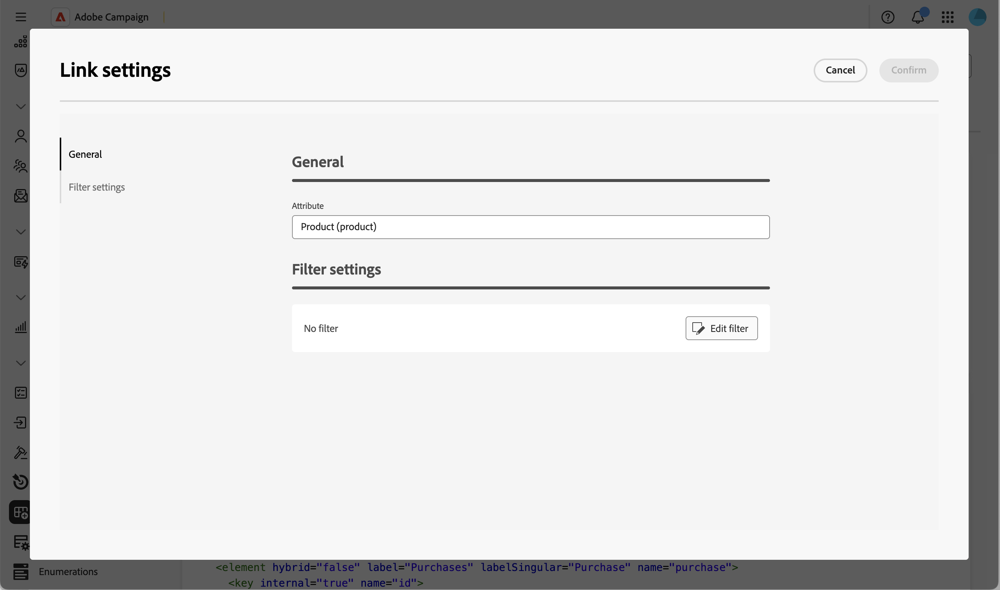

# 新增自訂篩選器 {#custom-filters}

**[!UICONTROL 詳細目錄清單組態]** > **[!UICONTROL 自訂篩選器]**&#x200B;區段可讓您選擇哪些屬性會在結構描述清單檢視的[篩選器窗格](../query/filter.md)中，於&#x200B;**[!UICONTROL 進階篩選器]**&#x200B;規則產生器上方，顯示為快速存取欄位。

如需有關熒幕定義畫面以及如何存取畫面的詳細資訊，請參閱[存取畫面定義](schemas-browse-access.md#screen-def)區段。

## 新增自訂篩選器 {#add}

1. 瀏覽至&#x200B;**[!UICONTROL 結構描述]**&#x200B;功能表，並使用篩選器找到可編輯的結構描述。

1. 選取清單中的結構描述名稱以開啟它，然後按一下結構描述詳細資料檢視中的&#x200B;**[!UICONTROL 熒幕版本]**&#x200B;按鈕以存取熒幕定義。

1. 移至&#x200B;**[!UICONTROL 詳細目錄清單組態]**&#x200B;區段，然後按一下&#x200B;**[!UICONTROL 自訂篩選器]**&#x200B;表格上方的省略符號圖示，然後選擇&#x200B;**[!UICONTROL 選取屬性]**。

   

1. 選取一或多個屬性並確認。

   您可以選擇：

   * 結構描述的直接屬性，例如程式碼或類別。
   * 連結屬性，例如連結至產品的品牌。 在此情況下，篩選器會使用僅限於連結結構描述的搜尋選擇器。
   * 連結的子屬性，例如連結資料夾的全名或連結收件者的電子郵件。

   

1. 按一下「**[!UICONTROL 儲存]**」。 您可以使用上下箭頭或拖曳自訂篩選器來重新排序自訂篩選器。 若要移除篩選器，請按一下其列中的省略符號圖示，然後選取&#x200B;**[!UICONTROL 刪除]**。

1. 瀏覽至此結構描述的記錄清單，並開啟篩選器窗格。 您選取的屬性會顯示為&#x200B;**[!UICONTROL 自訂篩選器]**，在&#x200B;**[!UICONTROL 進階篩選器]**&#x200B;規則產生器上方。

   

   >[!NOTE]
   >
   >根據日期或日期和時間屬性的自訂篩選器會顯示為日期範圍選取器。

1. 在其中一個自訂篩選條件中輸入或選取值，以調整清單。

## 限制連結型別自訂篩選器的值 {#settings}

對於根據連結屬性的自訂篩選器，您可以限制選取器中可用的值。

>[!NOTE]
>
>以下說明的&#x200B;**[!UICONTROL 編輯]**&#x200B;選項僅適用於以連結屬性為基礎的自訂篩選器。 基於其他屬性型別的自訂篩選器只能重新排序或移除。

1. 在連結型別自訂篩選的列上，按一下省略符號圖示並選取&#x200B;**[!UICONTROL 編輯]**。

   

1. 在&#x200B;**[!UICONTROL 篩選器設定]**&#x200B;索引標籤中，按一下&#x200B;**[!UICONTROL 編輯篩選器]**，然後使用查詢模型工具來定義條件，以限制選取器中可用的值。 例如，使用電子郵件通道將傳送篩選條件限製為傳送。

   

1. 確認您的變更。
