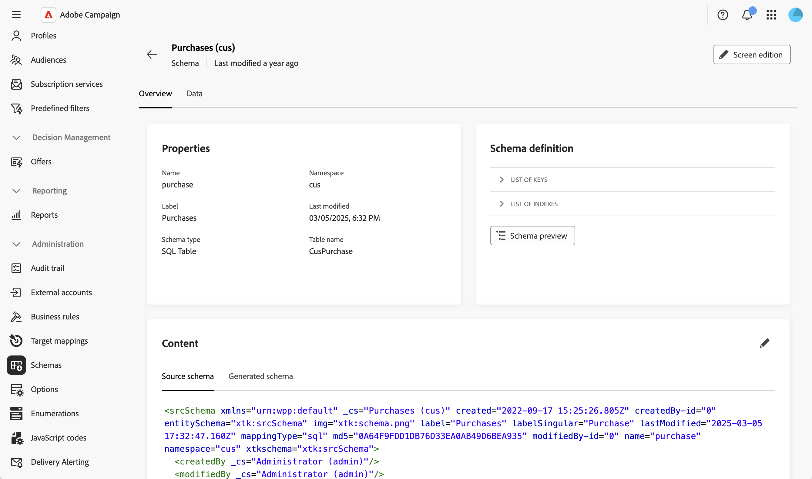
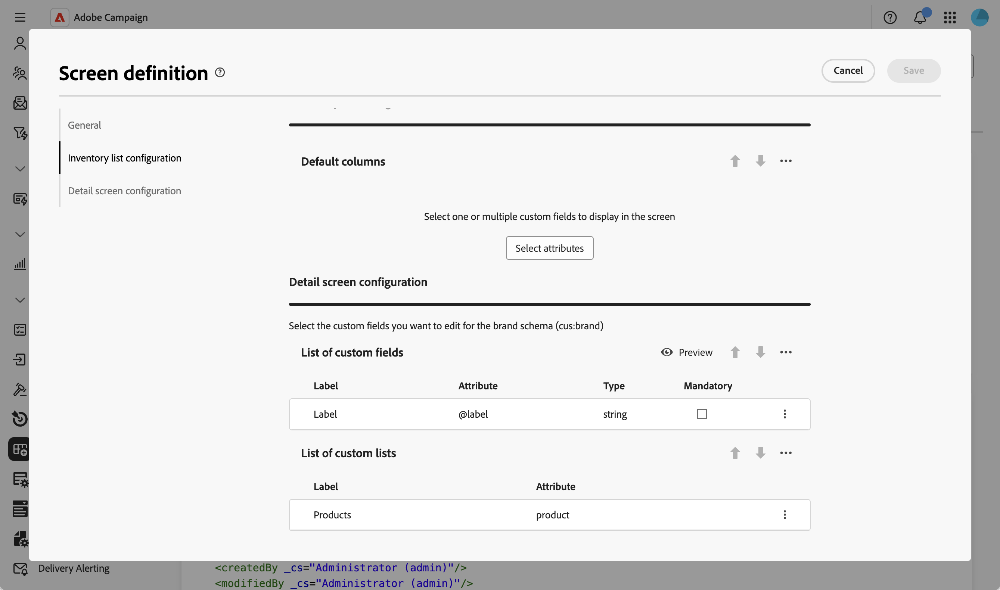
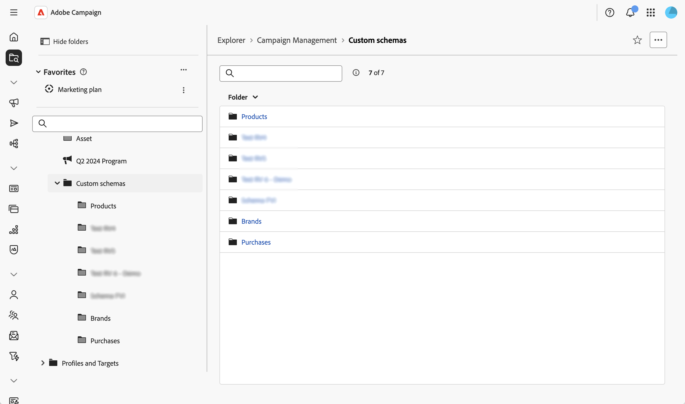
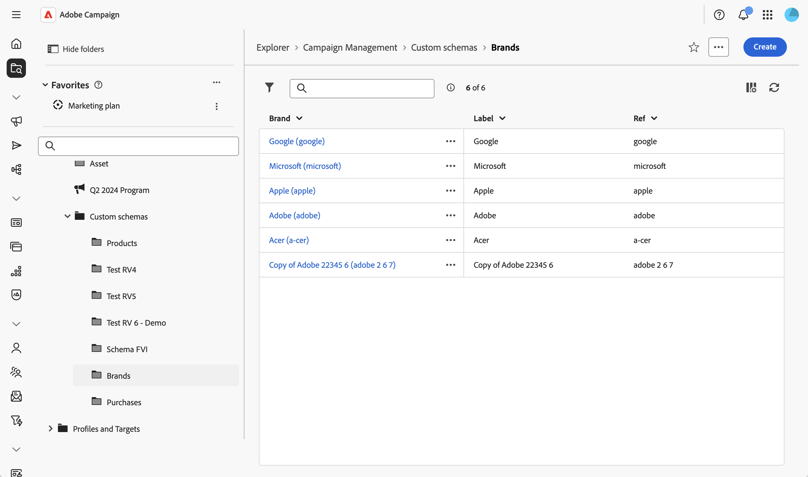

# 使用自訂表格 {#custom-forms}

自訂表單是資料輸入介面，可讓您直接從Web使用者介面管理自訂結構描述中的記錄。 每個自訂表單都會對應至特定的自訂結構，並提供清單檢視來瀏覽記錄，並提供詳細資料檢視來建立、編輯和刪除記錄。

自訂表單以結構的表單定義（畫面定義）為基礎，可設定要顯示哪些欄位以及這些欄位的組織方式。

>[!NOTE]
>
>自訂表單僅適用於已設定表單定義的結構描述。

## 建立和發佈自訂結構描述 {#form-schema}

您必須先建立並發佈自訂結構描述。 如需詳細指示，請參閱此[區段](schemas-create-publish.md)。

以下是此範例使用的資料模型：

* 收件者進行了多次購買
* 購買已連結至產品
* 產品已連結至品牌

針對此使用案例，已建立三個結構描述：購買、產品和品牌結構描述。 範例如下：

## 設定熒幕定義 {#form-screen-schema}

定義要顯示哪些欄位及其組織方式。 如需詳細指示，請參閱此[區段](schemas-browse-access.md#screen-def)。

以下是新增產品自訂清單的品牌結構描述範例。 然後，表單會顯示連結至品牌的產品清單。

在「產品」結構描述中，我們會新增「購買」自訂清單。 而對於購買綱要，則為產品和收件者欄位。

## 建立導覽專案 {#form-screen-entries}

在Explorer中建立資料夾以存取您的自訂表單。 如需詳細指示，請參閱此[區段](schemas-create-publish.md#navigation)。

清單檢視會顯示該結構描述的所有記錄。 如果結構描述已設定表單定義，清單便可以編輯，而且您可以建立、編輯和刪除記錄。

然後，您可以：

* **檢視和編輯記錄**：按一下清單檢視中的記錄，以詳細檢視開啟該記錄，並直接編輯欄位。
* **建立新記錄**：按一下&#x200B;**[!UICONTROL 建立]**&#x200B;按鈕，並填寫必填欄位。 對於連結欄位，使用搜尋圖示從可用的相關記錄中進行選取。
* **刪除記錄**：選取記錄並使用記錄詳細資料或清單檢視中可用的刪除動作。
* **在索引標籤中檢視相關資料**：透過詳細資料檢視中的專用索引標籤存取相關記錄（例如，檢視連結至品牌的所有產品，或連結至產品的所有購買）。
* **套用篩選器**：使用篩選器面板調整清單檢視，並根據結構描述中的任何欄位尋找特定記錄。
* **自訂清單欄**：設定透過熒幕定義預設顯示在清單檢視中的欄。
