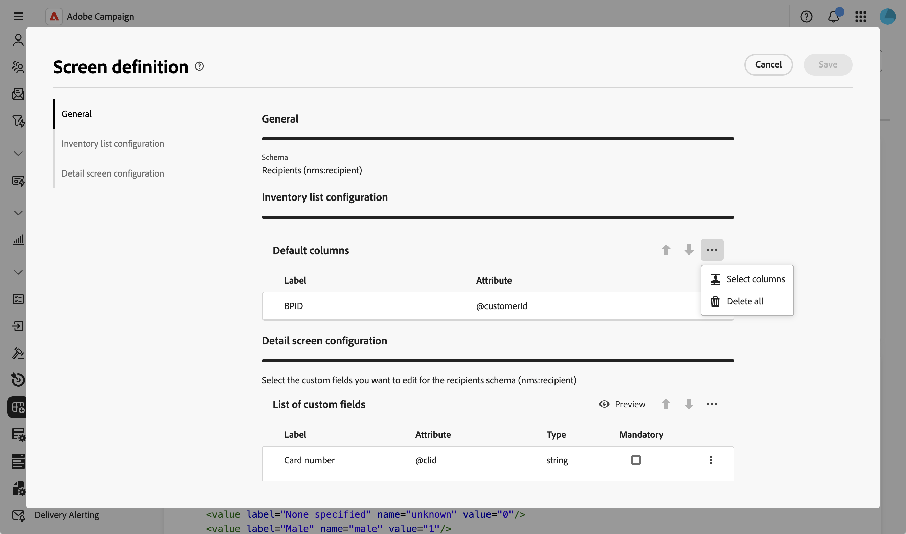
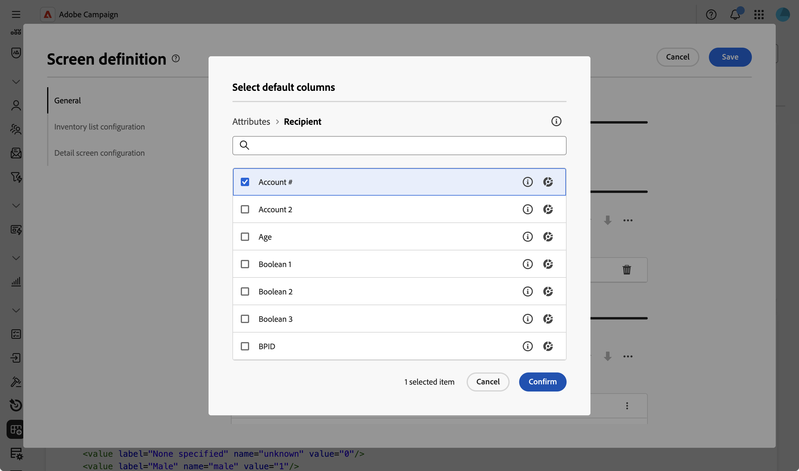
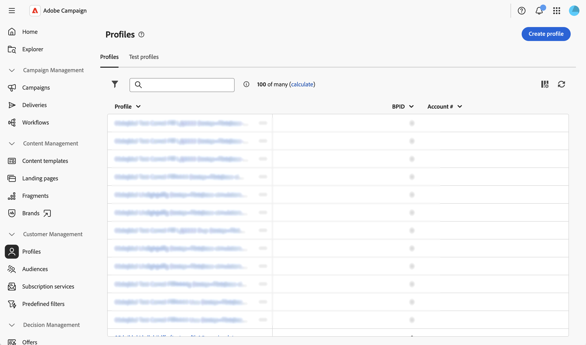

# 設定清單欄 {#list-columns}

**[!UICONTROL 詳細目錄清單組態]**&#x200B;區段可讓您設定哪些欄預設顯示在清單檢視中。 每一欄會顯示其標籤和對應的屬性。

如需有關熒幕定義畫面以及如何存取畫面的詳細資訊，請參閱[存取畫面定義](schemas-browse-access.md#screen-def)區段。

若要將新欄新增至預設清單：

1. 瀏覽至&#x200B;**[!UICONTROL 結構描述]**&#x200B;功能表，並使用篩選器找到可編輯的結構描述。

1. 選取清單中的結構描述名稱以開啟它，然後按一下結構描述詳細資料檢視中的&#x200B;**[!UICONTROL 熒幕版本]**&#x200B;按鈕以存取熒幕定義。

1. 按一下省略符號圖示（三個點）。
1. 選擇&#x200B;**[!UICONTROL 選取資料行]**。
   

1. 選取要在清單檢視中顯示的屬性並確認。

   

1. 瀏覽至&#x200B;**設定檔**&#x200B;功能表以存取設定檔清單檢視。 您會注意到新標籤隨即顯示。 您可以視需要新增更多欄。

   
