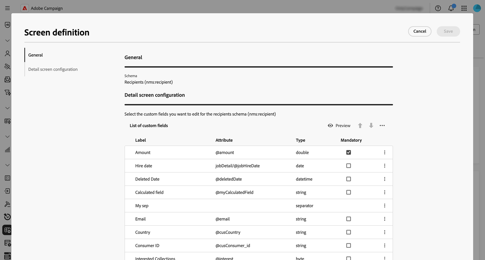

# 使用結構描述 {#schemas}

>[!CONTEXTUALHELP]
>id="acw_homepage_welcome_rn3"
>title="使用結構描述"
>abstract="現在您可以在清單中選取結構描述的名稱來存取其詳細資料。自訂欄位版本也可從&#x200B;**熒幕版本**&#x200B;按鈕存取。"
>additional-url="https://experienceleague.adobe.com/docs/campaign-web/v8/release-notes/release-notes.html?lang=zh-hant" text="請參閱版本注意事項"

>[!CONTEXTUALHELP]
>id="acw_schema"
>title="結構描述"
>abstract="**[!DNL Adobe Campaign]** 使用 XML 型結構描述來定義應用程式內資料的物理和邏輯結構。在這個畫面，您可以查看所有現有結構描述，而且在清單中選取結構描述名稱可存取其詳細資訊。您可以使用篩選器來調整清單顯示項目，例如僅顯示可編輯的結構描述。"

## 關於綱要 {#about}

**[!DNL Adobe Campaign]** 使用 XML 型結構描述來定義應用程式內資料的物理和邏輯結構。架構是連結至資料庫表格的XML檔案，其定義：

* SQL表格結構，包括表格名稱、欄位和關係。
* XML資料結構，包括元素、屬性、階層、型別、預設值和標籤。

結構描述在以下方面發揮著關鍵作用：

* 將應用程式資料對應至資料庫表格。
* 定義資料物件之間的關係。
* 指定每個欄位的結構和屬性。

Adobe Campaign中的每個實體都有專屬的結構描述，以確保資料一致性和組織。

有關綱要的詳細資訊，請參閱[Campaign主控台檔案](https://experienceleague.adobe.com/zh-hant/docs/campaign/campaign-v8/developer/shemas-forms/schemas){target="_blank"}。

## 在網頁使用者介面中存取綱要 {#access}

可從&#x200B;**[!UICONTROL 管理]** > **[!UICONTROL 方案]**&#x200B;功能表存取方案。

在此畫面中，您可以檢視所有現有結構。 您可以使用篩選器來調整清單顯示項目，例如僅顯示可編輯的結構描述。

若要開啟結構描述，請選取其名稱。 詳細結構檢視隨即顯示。

### 結構概觀 {#overview}

**[!UICONTROL 總覽]**&#x200B;標籤提供結構描述的一般檢視：

* **[!UICONTROL 屬性]**&#x200B;區段會顯示索引鍵資訊，例如結構描述名稱、名稱空間和相關聯的資料表名稱。

* **[!UICONTROL 結構描述定義]**&#x200B;區段顯示有關結構描述定義的詳細資訊，包括用於資料協調的主要金鑰及其與其他表格的連結。

  按一下&#x200B;**[!UICONTROL 結構描述預覽]**&#x200B;按鈕，以檢視構成結構描述的不同欄位和連結。 這可讓您檢查架構的完整結構。 如果結構描述已使用自訂欄位擴充，您可以將其所有擴充功能視覺化。

* **[!UICONTROL Content]**&#x200B;區段會顯示結構描述的XML內容，讓您在來源和產生的語法之間切換。

### 結構描述資料 {#data}

**[!UICONTROL Data]**&#x200B;索引標籤提供有關結構描述資料的資訊。

## 編輯自訂欄位 {#fields}

自訂欄位是透過Adobe Campaign主控台新增至現成可用結構描述的其他屬性。 它們可讓您透過包含新屬性來自訂結構以符合您組織的需求。

自訂欄位可顯示在各種畫面中，例如Campaign網頁介面中的設定檔詳細資料。 您可以控制哪些欄位可見，以及它們在介面中的顯示方式。 若要這麼做，請按一下&#x200B;**[!UICONTROL 結構描述]**&#x200B;功能表中的&#x200B;**[!UICONTROL 熒幕版本]**&#x200B;按鈕。

按一下&#x200B;**[!UICONTROL 預覽]**，在範例畫面中顯示自訂欄位。

如需如何在結構描述中編輯自訂欄位的詳細資訊，請參閱本節： [設定自訂欄位](../administration/custom-fields.md)。