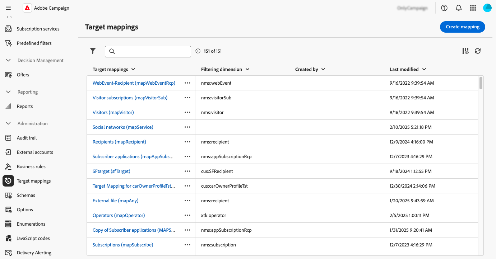
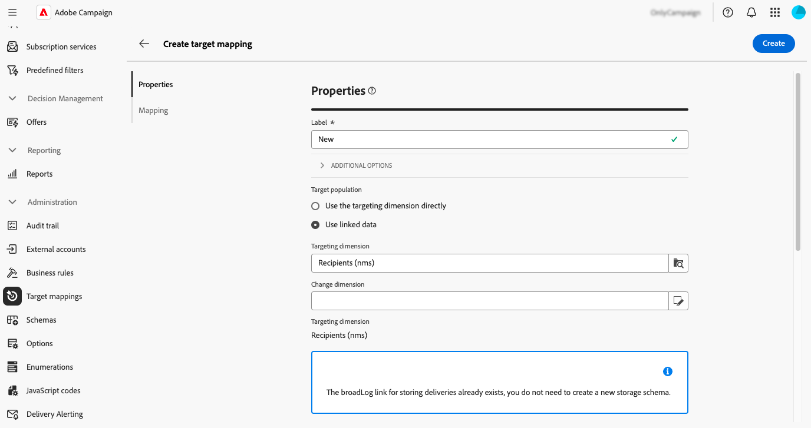
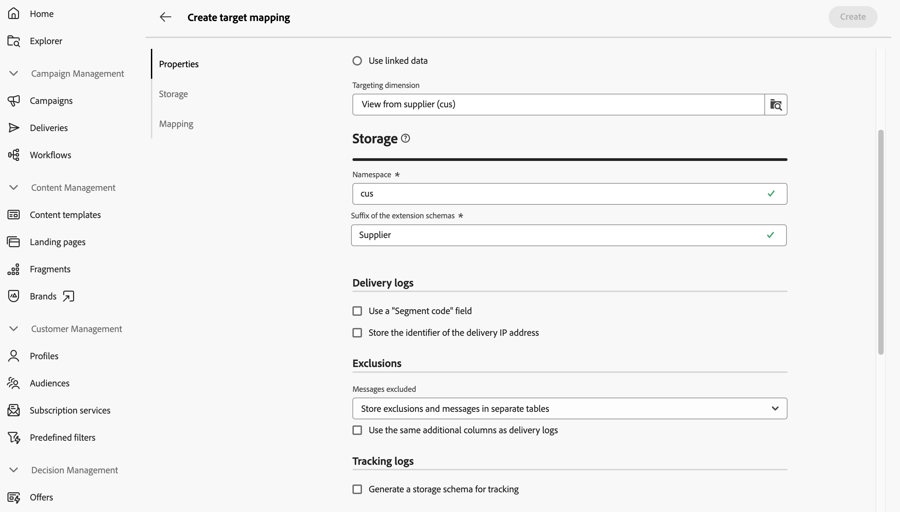
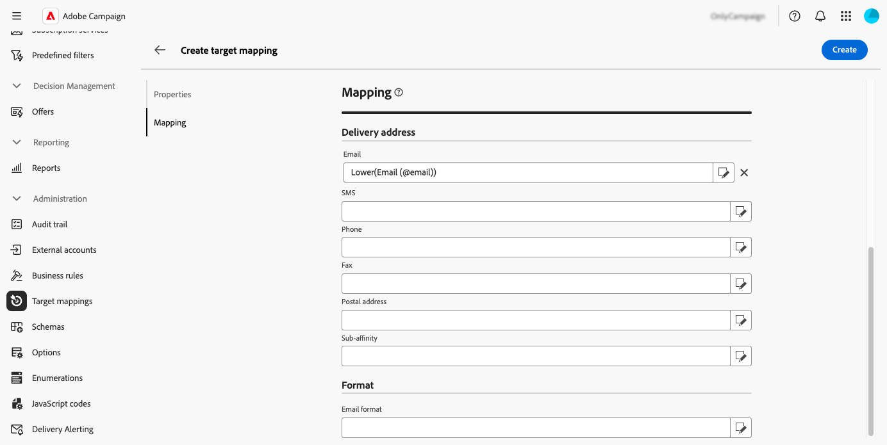
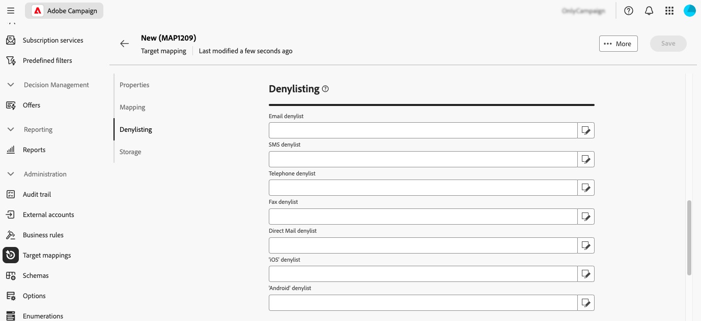
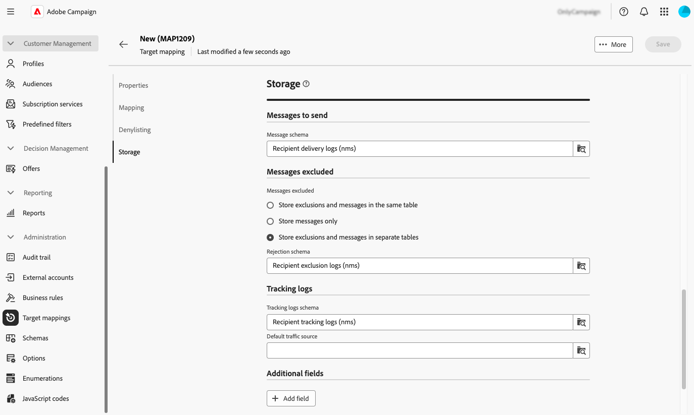
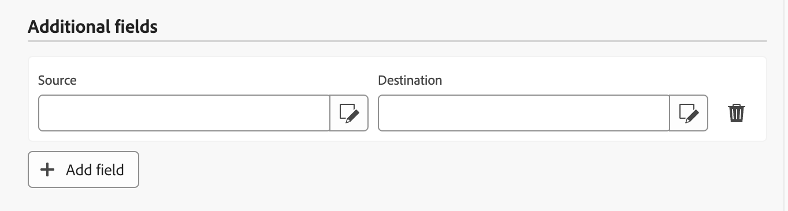

# 管理目標對應 {#target-mappings}

>[!CONTEXTUALHELP]
>id="acw_homepage_welcome_rn2"
>title="目標對應"
>abstract="現在您可以在 Campaign Web 使用者介面中建立目標對應。目標對應定義不同的傳遞管道 (電子郵件、SMS、推播通知) 如何連結到結構描述的資料欄位。"
>additional-url="https://experienceleague.adobe.com/docs/campaign-web/v8/release-notes/release-notes.html?lang=zh-hant" text="請參閱版本注意事項"

>[!CONTEXTUALHELP]
>id="acw_targetmapping_list"
>title="目標對應 "
>abstract="目標對應"

## 關於目標對應 {#about}

每個通訊通道都會使用預設的目標對應來定位其收件者。 例如，根據預設，電子郵件和簡訊傳遞範本的目標為&#x200B;**[!UICONTROL 收件者]**。 因此，它們的目標對應使用&#x200B;**nms：recipient**&#x200B;資料表的欄位。 對於推播通知，預設的目標對應是連結到收件者表格的&#x200B;**訂閱者應用程式(nms：appSubscriptionRcp)**。

目標對應可從&#x200B;**[!UICONTROL 管理]** > **[!UICONTROL 目標對應]**&#x200B;功能表存取。 您可以從此畫面存取每個目標對應的詳細資訊，或建立新的目標對應以符合您的需求。

如需Adobe Campaign隨附的內建目標對應詳細資訊，請參閱[Campaign v8使用者端主控台檔案](https://experienceleague.adobe.com/docs/campaign/campaign-v8/audience/add-profiles/target-mappings.html){target="_blank"}。

## 建立目標對應 {#create-mapping}

>[!CONTEXTUALHELP]
>id="acw_targetmapping_properties"
>title="目標對應屬性"
>abstract="您可以利用「**[!UICONTROL 屬性]**」區段定義目標對應的一般設定以及目標群體。"

>[!CONTEXTUALHELP]
>id="acw_targetmapping_mapping"
>title="目標對應對應"
>abstract="您可以利用「**[!UICONTROL 對應]**」區段來確認目標對應的結構描述中有哪些屬性可在各個傳遞位址欄位中使用。"

>[!CONTEXTUALHELP]
>id="acw_targetmapping_denylist"
>title="目標對應封鎖清單"
>abstract="目標對應封鎖清單"

>[!CONTEXTUALHELP]
>id="acw_targetmapping_storage"
>title="目標對應儲存"
>abstract="您可以利用「**[!UICONTROL 儲存]**」區段來確認記錄必須儲存在什麼地方。"

若要建立新的目標對應，請存取&#x200B;**[!UICONTROL 管理]** > **[!UICONTROL 目標對應]**&#x200B;功能表。 按一下&#x200B;**[!UICONTROL 建立對應]**&#x200B;按鈕，然後遵循以下各節中詳述的步驟。

1. 在&#x200B;**[!UICONTROL 屬性]**&#x200B;區段中，輸入目標對應的&#x200B;**[!UICONTROL 標籤]**。

1. 展開&#x200B;**[!UICONTROL 其他選項]**&#x200B;區段以定義進階設定，例如目標對應的內部名稱、儲存資料夾和說明。

1. 選取目標母體。 您可以：

   * **[!UICONTROL 直接使用目標維度]**：從可用維度清單中直接選取要定位的維度。
   * **[!UICONTROL 使用連結的資料]**：此選項可讓您從目標維度開始（例如訂閱），然後切換到您要鎖定的目標維度（例如收件者）。

   

1. 如果選取的維度尚未由現有目標對應使用，則需要建立儲存記錄的結構描述。 若要這麼做，可在&#x200B;**[!UICONTROL 儲存體]**&#x200B;區段中取得其他選項。 展開下列區段以取得詳細資訊。

   +++新目標維度的儲存選項

   1. **[!UICONTROL 名稱空間]**：識別將用於建立記錄的名稱空間。
   1. **[!UICONTROL 擴充功能結構描述的尾碼]**：提供新結構描述的尾碼。

      在下列範例中，broadlog名稱將是「cusbroadlogSupplier」。

      

   1. **[!UICONTROL 傳遞記錄]**：啟用此區段中的選項，以區段代碼欄位或包含傳遞IP位址的欄位來擴充傳送記錄。 例如，您可以在工作流程期間計算的區段代碼儲存至傳送記錄檔，以便稍後調整目標。 這可讓您定位具有此特定區段代碼的設定檔。

   1. **[!UICONTROL 排除專案]**：指定您要如何儲存排除專案記錄檔。

   1. **[!UICONTROL 追蹤記錄]**：啟用&#x200B;**[!UICONTROL 產生追蹤的結構描述]**&#x200B;選項，以產生追蹤記錄的儲存結構描述

+++

1. 使用&#x200B;**[!UICONTROL 對應]**&#x200B;區段來識別目標對應結構描述中要用於每個傳遞位址列位的屬性。 對於每個欄位，選取要對應的所需屬性。 您也可以建立運算式來識別欄位。 例如，您可以將下層函式套用至地址屬性。

   

1. 當目標對應準備就緒時，請按一下&#x200B;**[!UICONTROL 建立]**&#x200B;按鈕。 系統會自動建立記錄檔的目標對應及所有相關結構描述。

建立目標對應後，畫面上會顯示兩個額外的區段：

* **[!UICONTROL 加入封鎖清單]**：此區段可讓您識別目標對應結構描述中要用於封鎖清單的屬性。

  

* **[!UICONTROL 儲存體]**：此區段可讓您識別要用來儲存記錄檔的資料表。

  

   * **[!UICONTROL 訊息結構描述]**：識別要用來儲存傳送記錄檔的結構描述。
   * **[!UICONTROL 已排除的郵件]**：本節指定如何管理傳遞和排除記錄儲存體。

      * **[!UICONTROL 將排除專案和訊息儲存在相同資料表中]**
      * **[!UICONTROL 僅儲存郵件]**：不儲存排除專案。
      * **[!UICONTROL 將排除專案和訊息儲存在不同的資料表]**：選取要用來在&#x200B;**[!UICONTROL 拒絕結構描述]**&#x200B;欄位中儲存排除記錄的結構描述。

   * **[!UICONTROL 追蹤記錄]**：選擇儲存追蹤記錄和預設流量來源的位置。
   * **[!UICONTROL 其他欄位]**：此區段可讓您指定要儲存至傳遞記錄檔的其他欄位清單。 這些欄位可永久儲存有關目標個別成員的資訊(例如 `recipient/@firstName`)或儲存工作流程期間計算的其他資料（例如`[targetData/@offeCode]`）

     若要這麼做，請選取&#x200B;**[!UICONTROL 新增欄位]**。 識別您要儲存在&#x200B;**[!UICONTROL Source]**&#x200B;欄位中的資訊，以及要用於傳送記錄檔的屬性，以將此資訊儲存在&#x200B;**[!UICONTROL 目的地]**&#x200B;欄位中。

     {width="50%" zoomable="yes"}
