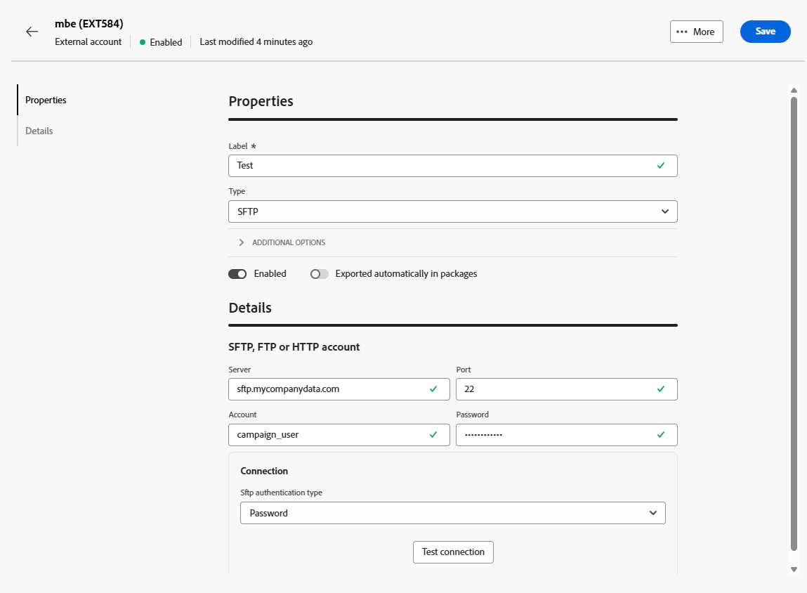
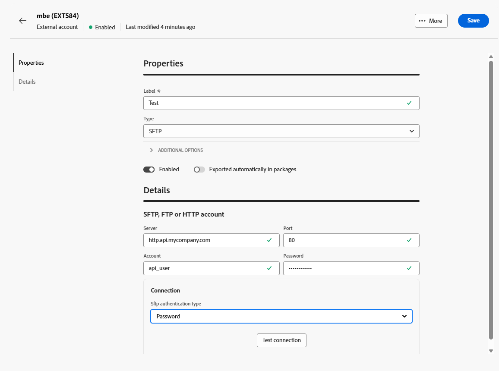
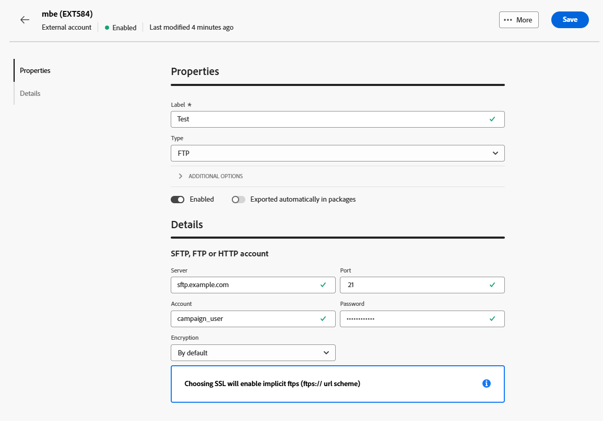

# 傳輸資料外部帳戶 {#transfer-external-account}

## Amazon簡單儲存服務(S3) {#amazon-simple-storage-service--s3--external-account}

Amazon Simple Storage Service (S3)聯結器可用來匯入或匯出資料至Adobe Campaign。 您可以在工作流程活動中設定它。 如需詳細資訊，請參閱[此頁面](https://experienceleague.adobe.com/zh-hant/docs/campaign-web/v8/wf/design-workflows/transfer-file){target=_blank}。

當您設定此新外部帳戶時，您必須提供下列詳細資訊：

* **[!UICONTROL AWS S3帳戶伺服器]**

  您伺服器的URL，應填入如下：

  `  <S3bucket name>.s3.amazonaws.com/<s3object path>`

* **[!UICONTROL AWS存取金鑰識別碼]**

  若要瞭解在何處尋找您的AWS存取金鑰ID，請參閱此[頁面](https://docs.aws.amazon.com/general/latest/gr/aws-sec-cred-types.html#access-keys-and-secret-access-keys)。

* **[!UICONTROL AWS的秘密存取金鑰]**

  若要瞭解在何處尋找您的AWS秘密存取金鑰，請參閱此[頁面](https://aws.amazon.com/fr/blogs/security/wheres-my-secret-access-key/)。

* **[!UICONTROL AWS地區]**

  若要深入瞭解AWS地區，請參閱此[頁面](https://aws.amazon.com/about-aws/global-infrastructure/regions_az/)。

* **[!UICONTROL 使用伺服器端加密]**&#x200B;核取方塊可讓您以S3加密模式儲存檔案。

若要瞭解在何處尋找存取金鑰ID和機密存取金鑰，請參閱Amazon網站服務[檔案](https://docs.aws.amazon.com/general/latest/gr/aws-sec-cred-types.html#access-keys-and-secret-access-keys)。

## Azure Blob 儲存體 {#azure-blob-external-account}

**[!UICONTROL Azure Blob儲存體]**&#x200B;外部帳戶可用來匯入或匯出資料至Adobe Campaign，使用&#x200B;**[!UICONTROL 傳輸檔案]**&#x200B;工作流程活動。 如需詳細資訊，請參閱[本章節](https://experienceleague.adobe.com/zh-hant/docs/campaign-web/v8/wf/design-workflows/transfer-file){target=_blank}。

若要設定&#x200B;**[!UICONTROL Azure外部帳戶]**&#x200B;以搭配Adobe Campaign使用，您必須提供下列詳細資料：

* **[!UICONTROL 伺服器]**

  Azure Blob儲存伺服器的URL。

* **[!UICONTROL 加密]**

  選擇的加密型別，介於&#x200B;**[!UICONTROL 無]**&#x200B;或&#x200B;**[!UICONTROL SSL]**&#x200B;之間。

* **[!UICONTROL 存取金鑰]**

  若要瞭解在何處尋找您的&#x200B;**[!UICONTROL 存取金鑰]**，請參閱此[頁面](https://docs.microsoft.com/en-us/azure/storage/common/storage-account-keys-manage?tabs=azure-portal)。

## SFTP

SFTP外部帳戶可讓您設定並測試對Adobe Campaign外部伺服器的存取權。

若要設定&#x200B;**[!UICONTROL SFTP]**&#x200B;外部帳戶，請填寫下列欄位：

* **[!UICONTROL 伺服器]**

  輸入SFTP伺服器的名稱或位址。

* **[!UICONTROL 連線埠]**

  指定SFTP連線連線埠號碼。 預設連線埠為22。

* **[!UICONTROL 帳戶]**

  輸入用來連線至SFTP伺服器的使用者名稱。

* **[!UICONTROL 密碼]**

  輸入SFTP帳戶的密碼。

* **[!UICONTROL SFTP驗證型別]**

  選擇要向SFTP伺服器驗證的方法。 選項包括：

   * **[!UICONTROL 密碼]**：使用帳戶的密碼進行驗證。

   * **[!UICONTROL 公開金鑰]**：使用SSH金鑰組（私密金鑰和公開金鑰）進行驗證。

如果選取了&#x200B;**[!UICONTROL 公開金鑰]**&#x200B;驗證，則需要填寫下列欄位：

* **[!UICONTROL 私密金鑰檔案]**

  指定用於驗證的私人SSH金鑰檔案。

* **[!UICONTROL 公開金鑰檔案]**

  指定在SFTP伺服器上註冊的對應公開SSH金鑰。

* **[!UICONTROL SSH金鑰複雜密碼]**

  如果私密金鑰受到保護，請輸入密碼以解密。

## HTTP

HTTP外部帳戶可讓您設定並測試對Adobe Campaign外部伺服器的存取權。

若要設定&#x200B;**[!UICONTROL HTTP]**&#x200B;外部帳戶，請填寫下列欄位：

* **[!UICONTROL 伺服器]**

  輸入HTTP伺服器的名稱或位址。

* **[!UICONTROL 連線埠]**

  指定HTTP連線連線埠號碼。 預設連線埠為80。

* **[!UICONTROL 帳戶]**

  輸入用於驗證的使用者名稱。

* **[!UICONTROL 密碼]**

  輸入與使用者帳戶關聯的密碼。

* **[!UICONTROL SFTP驗證型別]**

  選取連線的驗證型別。 選項包括：

   * 密碼
   * 公開金鑰

如果您使用&#x200B;**[!UICONTROL 公開金鑰]**&#x200B;驗證，請從&#x200B;**[!UICONTROL 公開金鑰驗證]**&#x200B;功能表，輸入下列專案的必要值：

* **[!UICONTROL 密碼]**：保護私密金鑰的密碼（如果適用）。

* **[!UICONTROL 私密金鑰]**：用來驗證Snowflake帳戶的私密金鑰。

## FTP

FTP外部帳戶可讓您設定並測試對Adobe Campaign外部伺服器的存取權。

若要設定&#x200B;**[!UICONTROL FTP]**&#x200B;外部帳戶，請填寫下列欄位：

* **[!UICONTROL 伺服器]**

  輸入FTP伺服器的名稱或位址。

* **[!UICONTROL 連線埠]**

  指定FTP連線連線埠號碼。 預設連線埠為21。

* **[!UICONTROL 帳戶]**

  輸入用於驗證的使用者名稱。

* **[!UICONTROL 密碼]**

  輸入與使用者帳戶關聯的密碼。

* **[!UICONTROL 加密]**

  選取連線的加密型別。 選項包括：

   * 依據預設
   * POP3 + STARTTLS
   * POP3不安全
   * POP3安全