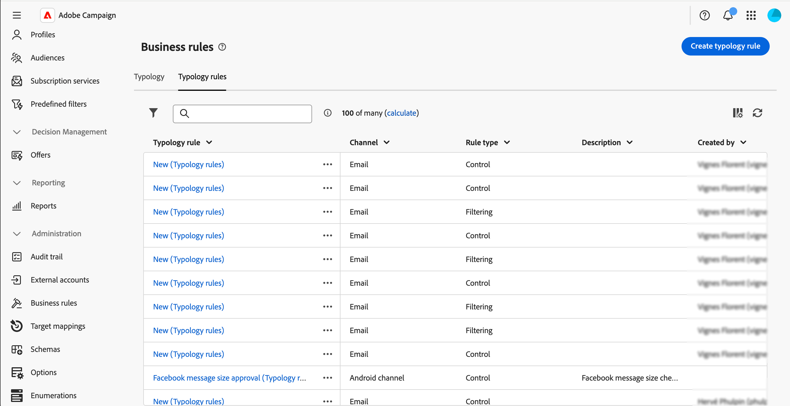
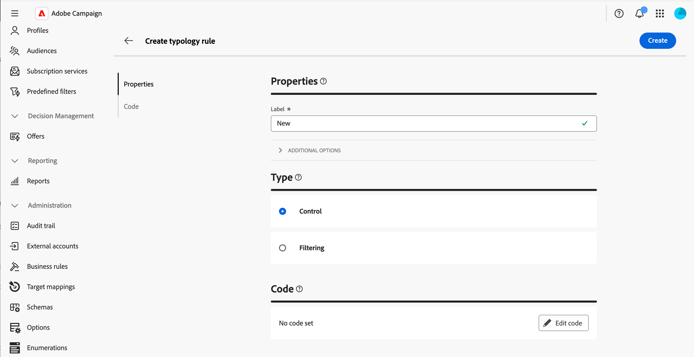
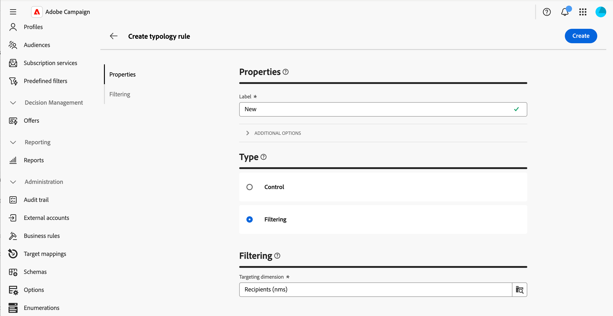
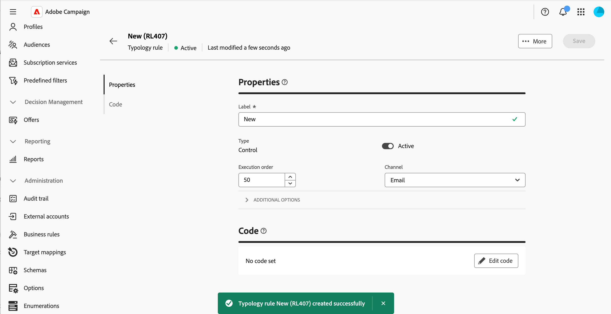

# 使用業務規則 (類型) {#typologies}

>[!CONTEXTUALHELP]
>id="acw_business_rules"
>title="類型和類型規則"
>abstract="您可以利用類型將所有傳遞的業務實務標準化。類型是類型規則的集合，讓您可以控制、篩選傳遞的傳送並排定其優先順序。在準備階段，與類型規則中的標準相符的輪廓會排除在傳遞對象之外。"

>[!CONTEXTUALHELP]
>id="acw_business_rules_typology_rules_type"
>title="篩選"
>abstract=" 有兩種類型規則可用：  **控制**&#x200B;規則，確保傳送前的訊息品質和有效性，例如字元顯示、簡訊長度、地址格式或 URL 縮短。  **篩選**&#x200B;規則會根據特定標準 (例如年齡、地點、國家或電話號碼) 來排除目標客群區段。"

## 關於型別

您可以利用類型將所有傳遞的業務實務標準化。**型別**&#x200B;是&#x200B;**型別規則**&#x200B;的集合，可讓您控制、篩選傳遞內容，並設定其優先順序。 在準備階段，與類型規則中的標準相符的輪廓會排除在傳遞對象之外。

型別可確保您的傳送一律包含特定元素，例如取消訂閱連結或主旨行，或用於從預期目標中排除群組的篩選規則，例如取消訂閱者、競爭者或不忠誠客戶。

可透過&#x200B;**[!UICONTROL 管理]** > **[!UICONTROL 商業規則]**&#x200B;功能表存取型別。 從此畫面存取所有現有的型別與型別規則，或根據您的需求建立新型別與型別規則。

>[!NOTE]
>
>**[!UICONTROL 型別規則]**&#x200B;清單會顯示目前在Web使用者介面或使用者端主控台中建立的所有現有規則。 不過，在Web使用者介面中只能建立&#x200B;**控制**&#x200B;和&#x200B;**篩選**&#x200B;規則。 若要建立其他型別的型別規則，例如壓力或容量規則，請使用Campaign v8使用者端主控台。 [瞭解如何在使用者端主控台中建立型別規則](https://experienceleague.adobe.com/en/docs/campaign/automation/campaign-optimization/campaign-typologies){target="_blank"}

將型別套用至訊息的主要步驟如下：

1. [建立型別](#typology)。
1. [建立型別規則](#typology-rule)。
1. [在型別](#add-rules)中參考型別規則。
1. [套用型別至訊息](#message)。

## 建立類型 {#typology}

>[!CONTEXTUALHELP]
>id="acw_business_rules_typology_properties"
>title="類型屬性"
>abstract="定義類型的屬性並展開「**[!UICONTROL 附加選項]**」區段，以存取進階設定。使用「**[!UICONTROL IP 親和原則]**」欄位，使 IP 親和原則與類型相關聯。這樣，您便能夠定義每個親和原則可使用哪些特定的 IP 位址，更好地控制 SMTP 傳出流量。"

>[!CONTEXTUALHELP]
>id="acw_business_rules_typology_ip_affinity"
>title="IP 親和原則"
>abstract="管理與 IP 位址的相似性可讓您根據傳遞動作的類型，將不同的 IP 位址與每種類型的流量相關聯，從而更好地控制傳出 SMTP 流量。"

若要建立型別，請遵循下列步驟：

1. 導覽至&#x200B;**[!UICONTROL 商業規則]**&#x200B;功能表，然後選取&#x200B;**[!UICONTROL 型別]**&#x200B;標籤。

1. 按一下&#x200B;**[!UICONTROL 建立型別]**&#x200B;按鈕，然後輸入型別的&#x200B;**[!UICONTROL 標籤]**。

1. 展開&#x200B;**[!UICONTROL 其他選項]**&#x200B;區段以定義進階設定，例如型別的內部名稱、儲存資料夾和說明。

   

   >[!NOTE]
   >
   >**[!UICONTROL IP相關性]**&#x200B;欄位可讓您將IP相關性與型別建立關聯。 這可定義哪些特定的IP位址可用於每個相似性，以更好地控制傳出SMTP流量。 例如，您可以對每個國家或子網域使用一個相似性。 接著，您可以為每個國家/地區建立一個型別，並將每個相似性連結至對應的型別。

1. 按一下&#x200B;**[!UICONTROL 「建立]**」以確認型別建立。

型別詳細資訊隨即開啟。 在此畫面中，直接參考現有的型別規則，或建立新的型別規則以供稍後參考：
* [瞭解如何建立型別規則](#add-rules)
* [瞭解如何在型別中參考規則](#add-rules)

## 建立類型規則 {#typology-rule}

>[!CONTEXTUALHELP]
>id="acw_business_rules_typology_rules_properties"
>title="類型規則屬性"
>abstract="定義類型規則的屬性。**控制**&#x200B;規則在傳送前驗證訊息品質和有效性，而&#x200B;**篩選**&#x200B;規則會根據特定標準排除目標對象的區段。  在同一個訊息處理階段執行數個相同類型的規則時，您也可以變更此規則的執行順序，藉以管理類型規則的執行順序。"

有兩種型別規則可供使用：

* **控制**：確保訊息品質和預先傳送的有效性，例如字元顯示、簡訊長度、位址格式或URL縮短。 這些規則是使用指令碼介面來建立，以定義內容檢查和修改的複雜邏輯。

* **篩選**：根據特定條件（例如年齡、地點、國家/地區或電話號碼）排除目標對象的區段。 這些規則會連結至目標維度。

>[!NOTE]
>
>目前只能從Web使用者介面建立&#x200B;**控制**&#x200B;與&#x200B;**篩選**&#x200B;型別規則。 若要建立其他型別的規則，請使用「使用者端主控台」。 [瞭解如何在使用者端主控台中建立型別規則](https://experienceleague.adobe.com/en/docs/campaign/automation/campaign-optimization/campaign-typologies){target="_blank"}

若要建立型別規則，請遵循下列步驟：

1. 導覽至&#x200B;**[!UICONTROL 商業規則]**&#x200B;功能表，然後選取&#x200B;**[!UICONTROL 型別規則]**&#x200B;標籤。

1. 按一下&#x200B;**[!UICONTROL 建立型別規則]**&#x200B;按鈕，然後遵循以下詳細步驟。

   

### 定義規則的主要屬性 {#properties}

>[!CONTEXTUALHELP]
>id="acw_business_rules_typology_rules_filtering"
>title="篩選"
>abstract="**篩選**&#x200B;規則會根據特定標準 (例如年齡、地點、國家或電話號碼) 排除目標客群區段。選取類型規則的目標維度，然後按一下「**[!UICONTROL 新增規則]**」按鈕以存取查詢建模工具並建置規則。"

>[!CONTEXTUALHELP]
>id="acw_business_rules_typology_rules_code"
>title="程式碼"
>abstract="**控制**&#x200B;規則會在傳送前驗證訊息品質和有效性 (例如字元顯示、簡訊長度、地址格式或 URL 縮短)。這些規則是使用 JavaScript 程式碼所建立的。"

以下是建立新型別規則時要定義的主要屬性：

>[!BEGINTABS]

>[!TAB 控制規則]

1. 輸入規則的&#x200B;**[!UICONTROL 標籤]**。

   

1. **[!UICONTROL 其他選項]**&#x200B;區段可讓您存取進階設定，例如規則的內部名稱、資料夾儲存和說明。 您也可以指定何時應套用規則及其警示等級。 請展開下列各節以取得詳細資訊。

   +++階段

   指定在傳遞生命週期的哪個時間點套用規則。 在&#x200B;**[!UICONTROL 階段]**&#x200B;下拉式清單中選取值：

   * **[!UICONTROL 在鎖定目標開始時]**：發生錯誤時，防止執行個人化步驟。

   * **[!UICONTROL 鎖定目標之後]**：如果您需要知道目標的磁碟區，請選取此階段以套用控制規則。 例如，**[!UICONTROL 檢查校訂大小]**&#x200B;控制項規則會套用到每個目標階段之後。 如果校樣收件者過多，此規則會防止訊息個人化。

   * **[!UICONTROL 在個人化開始時]**：如果控制項涉及核准訊息個人化，請選取此階段。 訊息個人化會在分析階段中執行。

   * **[!UICONTROL 在分析結束時]**：套用需要完整訊息個人化的檢查。

   +++

   +++層級

   指定規則的警示等級：

   * **[!UICONTROL 錯誤]**：停止訊息準備

   * **[!UICONTROL 警告]**：在準備記錄檔中顯示警告

   * **[!UICONTROL 資訊]**：在準備記錄檔中顯示資訊

   * **[!UICONTROL 詳細資訊]**：顯示伺服器記錄檔中的資訊

   +++

1. 若要建置規則的內容，請按一下&#x200B;**編輯程式碼**&#x200B;按鈕，然後使用JavaScript輸入規則的邏輯。 在以下範例中，會建立規則以在目標為空時於記錄中顯示警告。

   

1. 按一下「**建立**」。

>[!TAB 篩選規則]

1. 輸入規則的&#x200B;**[!UICONTROL 標籤]**。

   

1. 展開&#x200B;**[!UICONTROL 其他選項]**&#x200B;區段以存取進階設定，例如規則的內部名稱、資料夾儲存和說明。

1. 若要建置規則的內容，請選取目標維度，然後按一下&#x200B;**[!UICONTROL 新增規則]**&#x200B;按鈕，以使用[規則產生器](../query/query-modeler-overview.md)定義篩選條件。

   

1. 按一下&#x200B;**建立**

>[!ENDTABS]

### 定義規則的其他屬性 {#add-properties}

現在來定義其他引數。 在此畫面中，您仍可變更先前定義的主要屬性。

1. 如果您不希望規則在建立後立即啟用，請將&#x200B;**[!UICONTROL 啟用]**&#x200B;選項切換為關閉。

1. 定義規則的&#x200B;**[!UICONTROL 執行順序]**。

   依預設，型別規則順序設為50。 調整此值以管理在同一訊息處理階段執行多個相同型別的規則時，型別規則將執行的順序。 例如，執行順序為20的篩選規則會在執行順序為30的篩選規則之前執行。

1. 選取要與規則關聯的&#x200B;**[!UICONTROL 管道]**。

您的規則已準備好在型別中參考，以套用至訊息。

## 在型別中參考型別規則 {#add-rules}

若要在型別中參照一或多個規則，請遵循下列步驟：

1. 導覽至&#x200B;**[!UICONTROL 型別]**&#x200B;標籤，並開啟您要參考規則的型別。

1. 選取&#x200B;**[!UICONTROL 型別規則]**&#x200B;索引標籤，然後按一下&#x200B;**[!UICONTROL 新增規則)]**&#x200B;按鈕。

   

1. 選取一或多個型別規則以與型別產生關聯並確認。

   

1. 按一下「**[!UICONTROL 儲存]**」。

您現在可以將型別套用至訊息。 完成後，將執行所有選取的型別規則以執行定義的檢查。

## 套用型別至訊息 {#message}

若要將型別套用至訊息或訊息範本，請在訊息設定中選取型別。 [瞭解如何設定傳遞設定](../advanced-settings/delivery-settings.md#typology)

套用後，將執行包含在型別中的型別規則，以在訊息準備期間檢查傳遞有效性。 型別規則中符合條件的設定檔會從傳送對象中排除。