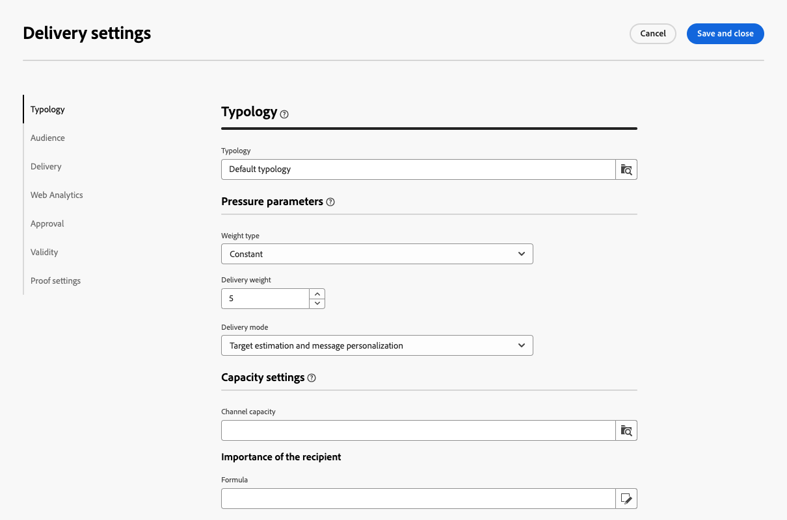
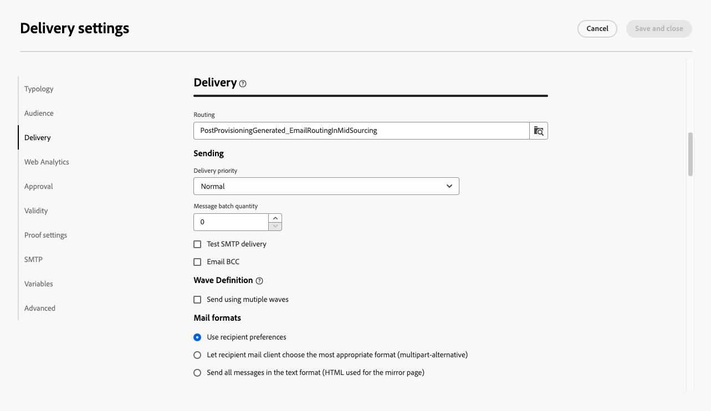

# 電子郵件傳遞設定 {#email-del-settings}

電子郵件傳遞設定為 **技術傳遞引數** 在電子郵件範本中定義的。 每個傳遞都能讓這些量度超載。

這些設定可從 **設定** 編輯電子郵件傳遞或電子郵件傳遞範本時可用的按鈕。

## 電子郵件傳遞設定 {#email-delivery-settings}

>[!CAUTION]
>
>這些設定僅供您參考。其中一些取決於您的設定和權限。不可在此版本的產品中修改它們。

## 類型設定 {#typology}

>[!CONTEXTUALHELP]
>id="acw_email_settings_typology"
>title="類型"
>abstract="類型規則允許行銷人員將所有傳遞的業務實務標準化。類型是類型規則的集合，可讓您控制、篩選傳遞的傳送並排定其優先順序。在準備階段，與類型規則中的標準相符的設定檔會排除在傳遞對象之外。類型和類型規則是在 Campaign 用戶端主控台中建立的。"

>[!CONTEXTUALHELP]
>id="acw_delivery_template_settings_typology"
>title="傳遞的類型設定"
>abstract="類型規則允許行銷人員將所有傳遞的業務實務標準化。類型是類型規則的集合，可讓您控制、篩選傳遞的傳送並排定其優先順序。在準備階段，與類型規則中的標準相符的設定檔會排除在傳遞對象之外。類型和類型規則是在 Campaign 用戶端主控台中建立的。"

型別是一組 **型別規則** 在準備階段期間執行，以便一次輕鬆將多個篩選規則套用至傳遞。 它們可讓行銷人員標準化所有傳送的業務實務，讓他們控制、篩選傳送內容並安排傳送內容的優先順序。

將型別與訊息或訊息範本產生關聯時，會執行包含在型別中的型別規則，以在訊息準備期間檢查傳遞是否有效。 然後，符合型別規則中之條件的設定檔會從傳送對象中排除。

型別可讓您確保電子郵件一律包含特定元素（例如取消訂閱連結或主旨列）或篩選規則，以從預期目標中排除群組（例如取消訂閱者、競爭者或不忠誠客戶）。

{zoomable=&quot;yes&quot;}

>[!NOTE]
>
>型別與型別規則是在Campaign使用者端主控台中建立。 進一步了解壓力規則以及如何在中設定疲勞管理 [Campaign v8 （使用者端主控台）檔案](https://experienceleague.adobe.com/docs/campaign/automation/campaign-optimization/campaign-typologies.html?lang=zh-Hant){target="_blank"}.

### 壓力參數 {#pressure-parameters}

>[!CONTEXTUALHELP]
>id="acw_email_settings_pressure_parameters"
>title="傳遞壓力參數"
>abstract="傳遞權重可讓您確認疲勞管理架構內最優先的傳遞。權重最高的訊息具有最高優先。"

>[!CONTEXTUALHELP]
>id="acw_delivery_template_settings_delivery_weight"
>title="傳遞權重"
>abstract="傳遞權重可讓您確認壓力管理架構內最優先的傳遞。權重最高的訊息具有最高優先。"

在本節中，壓力引數可讓您定義 **臨界值** 以設定疲勞管理規則，指定期間內可傳送到單一設定檔的最大訊息數量。

一旦達到此臨界值時，在考慮到該期間結束之前，將不再進行傳送。此程序可以讓您在訊息超過設定的臨界值時，自動將設定檔排除在傳送之外，以避免過度請求。

臨界值可以是常數或變數。這表示在指定期間，臨界值可能會因某個設定檔而異，甚至會因為相同的設定檔而有所不同。

「**[!UICONTROL 權重類型]**」欄位提供三個選項：

* **[!UICONTROL 常數]**
* **[!UICONTROL 取決於收件者]**
* **[!UICONTROL 已定義在每個規則中]**

使用「**[!UICONTROL 傳遞權重]**」欄位可定義傳遞優先順序。每個傳遞都有權重，代表其優先順序。傳遞的預設權重為 5。壓力規則可讓您定義套用到它們的傳遞權重。權重可以設定或透過公式計算以適合收件者。例如，您可以根據收件者的興趣定義傳遞權重。

使用「**[!UICONTROL 傳遞模式]**」欄位可選取目標評估模式。提供三種模式：

* **[!UICONTROL 目標預估和訊息個人化]**
* **[!UICONTROL 臨時目標的評估和核准]**
* **[!UICONTROL 目標評估]**

>[!NOTE]
>
>疲勞管理是在Campaign使用者端主控台中設定。 進一步瞭解 [Campaign v8 （使用者端主控台）檔案](https://experienceleague.adobe.com/docs/campaign/automation/campaign-optimization/pressure-rules.html?lang=zh-Hant){target="_blank"}.

### 容量設定 {#capacity-settings}

>[!CONTEXTUALHELP]
>id="acw_email_settings_capacity_settings"
>title="傳遞的容量設定"
>abstract="在傳遞訊息之前，請使用容量規則以確保您的組織可以處理傳遞、傳遞可能生成的傳入訊息，以及用於聯絡訂閱者的呼叫次數等。容量規則是在 Adobe Campaign v8 主控台中定義。在此畫面中，選取與電子郵件頻道關聯的規則。"

>[!CONTEXTUALHELP]
>id="acw_delivery_template_settings_recipient_importance"
>title="收件者的重要性"
>abstract="收件者的重要性是一種公式，用於確定在超出產能類型規則時要保留哪些收件者。"

在此區段中，您可以選取Adobe Campaign v8主控台中定義的容量規則。 此規則與電子郵件管道相關聯。

此 **[!UICONTROL 收件者的重要性]** 欄位是一個公式，用於確定在超過容量型別規則時保留哪些收件者。

>[!NOTE]
>
>型別規則是在Campaign使用者端主控台中設定。 進一步瞭解 [Campaign v8 （使用者端主控台）檔案](https://experienceleague.adobe.com/docs/campaign/automation/campaign-optimization/consistency-rules.html){target="_blank"}.

## 對象設定 {#audience}

>[!CONTEXTUALHELP]
>id="acw_email_settings_audience"
>title="傳遞的對象設定"
>abstract="在那些可用項目中選取「**目標對應**」。目標對應是在 Adobe Campaign v8 主控台中定義的。您也可以設定傳遞的排除參數。 "

在此區段中，您可以選取其中可用的&#x200B;**目標對應**。目標對應是在 Adobe Campaign v8 主控台中定義的。目標對應是作業正在處理的資料型別。 它可讓您定義目標母體：收件者、合約受益者、操作者、訂閱者等。

進一步瞭解中的目標對應 [本節](../audience/targeting-dimensions.md).

在 **[!UICONTROL 排除]** 欄位，您可以選取排除不想再被聯絡或隔離的收件者。 [瞭解更多](https://experienceleague.adobe.com/docs/campaign/campaign-v8/send/failures/quarantines.html){target="_blank"}

## 傳遞 {#delivery}

>[!CONTEXTUALHELP]
>id="acw_email_settings_delivery"
>title="傳遞的傳遞設定"
>abstract="傳遞參數是套用到傳遞的技術設定。您可以變更傳遞和例行模式、啟動電子郵件密件副本、使用波段傳送，也可以選擇傳送電子郵件的格式。這些選項僅限於專業使用者。"

**[!UICONTROL 傳遞]** 引數為適用於您傳送的技術設定。

{zoomable=&quot;yes&quot;}

整合的電子郵件 **[!UICONTROL 路由]** 預設會提供外部帳戶。 其包含可讓應用程式傳送電子郵件的技術參數。

您可以定義 **[!UICONTROL 傳送中]** 以下的設定。

* **[!UICONTROL 傳遞優先順序]**：此選項可設定您的傳送的優先順序層級，以變更傳送順序：正常、高或低。

* **[!UICONTROL 訊息批次數量]**：使用此選項可定義在同一XML傳遞套件中分組的訊息數。 如果引數設為0，訊息會自動分組。 封裝大小由計算定義 `<delivery size>/1024`，每個套件最少8則訊息，最多256則訊息。

  >[!IMPORTANT]
  >
  >當透過複製現有傳遞建立傳遞時，此引數會重設。

* **[!UICONTROL 測試SMTP傳遞]**：此選項用於測試透過SMTP的傳送。 傳遞會處理到連線到SMTP伺服器，但不會傳送：對於每個傳遞收件者，Campaign會連線到SMTP提供者伺服器、執行SMTP RCPT TO命令，並在SMTP DATA命令之前關閉連線。

* **[!UICONTROL 電子郵件密件副本]**：此選項是用來透過密件副本在外部系統上儲存電子郵件，僅需將密件副本電子郵件地址新增至您的訊息目標即可。 進一步瞭解 [Campaign v8 （使用者端主控台）檔案](https://experienceleague.adobe.com/docs/campaign/campaign-v8/config/configuration/email-settings.html){target="_blank"}.

在 **[!UICONTROL 波段定義]** 區段，選取 **[!UICONTROL 使用多個波段傳送]** 逐步增加使用波段傳送之音量的選項。 這可避免您的郵件被標示為垃圾郵件，或您想要限制每天的郵件數。 使用波段您可以將傳送劃分為幾個批次，而不是同時傳送大量訊息。 [了解更多](send-using-waves.md)

您也可以變更 **[!UICONTROL 郵件格式]** 已傳送的電子郵件訊息數量，詳情如下。

* **[!UICONTROL 使用收件者偏好設定]** （預設模式）

  訊息格式會根據儲存在收件者設定檔中的資料定義。 如果收件者希望以特定格式接收郵件，則此格式為傳送的格式。如果未填入欄位，則會傳送替代的多重部分訊息（請參閱下文）。

* **[!UICONTROL 讓收件者郵件使用者端選擇最合適的格式]**

  訊息包含兩種格式：文字和HTML。 接收時顯示的格式取決於收件者郵件軟體的設定（替代的多重部分）。

  >[!IMPORTANT]
  >
  >此選項包含檔案的兩個版本。 因此，它會影響傳遞率，因為郵件大小較大。

* **[!UICONTROL 以文字格式傳送所有訊息]**

  訊息會以文字格式傳送。 不會傳送HTML格式，但只有當收件者按一下訊息時，才會用於映象頁面。

## 網站分析 {#web-analytics}

>[!CONTEXTUALHELP]
>id="acw_email_settings_webanalytics"
>title="傳遞的網站分析設定"
>abstract="選取網路分析帳戶。此帳戶是在 Campaign 用戶端主控台中設定的。您也可以定義與您所用分析工具共用的標籤。"

您可以在此區段中選取網站分析帳戶。 此帳戶是在Campaign使用者端主控台中設定。

您也可以定義與您所用分析工具共用的標籤。

>[!NOTE]
>
>Web Analytics功能是在Campaign使用者端主控台中設定。 進一步瞭解 [Campaign v8 （使用者端主控台）檔案](https://experienceleague.adobe.com/docs/campaign/campaign-v8/connect/ac-aa.html#external-account-ac){target="_blank"}.

## 重試次數 {#retries}

>[!CONTEXTUALHELP]
>id="acw_delivery_template_settings_retries"
>title="最多重試次數"
>abstract="如果訊息由於臨時錯誤而失敗，則會重試到傳遞期間結束為止。"

<!--Currently not visible in UI > ??-->

因軟性或忽略錯誤而暫時未傳送的郵件可能會自動重試。 根據預設，排程在傳送的第一天進行五次重試，最小間隔為一小時分佈在一天中的24小時。

進一步瞭解重試管理，請參閱 [Campaign v8 （使用者端主控台）檔案](https://experienceleague.adobe.com/docs/campaign/campaign-v8/config/configuration/email-settings.html){target="_blank"}.

## 核准 {#approval}

>[!CONTEXTUALHELP]
>id="acw_email_settings_approval"
>title="傳遞的核准模式"
>abstract="選取「核准模式」。如果在傳遞準備期間產生警告，您可以設定傳遞以定義它是否仍應執行。"

>[!CONTEXTUALHELP]
>id="acw_delivery_template_settings_approval"
>title="傳遞的核准模式"
>abstract="根據該範本選取傳遞的核准模式。如果在傳遞準備期間產生警告，您可以設定傳遞以定義它是否仍應執行。"

如果在傳遞準備期間產生警告，您可以設定傳遞以定義它是否仍應執行。依預設，使用者必須在分析階段結束時確認傳送訊息：這是&#x200B;**手動**&#x200B;驗證。

您可以在相關欄位選取另一個核准模式。可用的模式包括：

* ****[!UICONTROL 手動]****：分析階段結束時，使用者必須確認傳遞開始傳送。

* **[!UICONTROL 半自動]**：如果分析階段未產生警告訊息，會自動開始傳送。

* **[!UICONTROL 自動]**：分析階段結束時會自動開始傳送，不論分析的結果為何。

## 有效性 {#validity}

>[!CONTEXTUALHELP]
>id="acw_email_settings_validity"
>title="設定有效性"
>abstract="「**傳遞期間**」欄位可讓您輸入全域傳遞重試的限制。這表示 Adobe Campaign 會傳送從開始日期開始的訊息，然後，對於僅傳回錯誤的訊息，會執行一般、可設定的重試，直到達到效度限制為止。「 **資源效度限制**」欄位是用於上傳的資源，主要用於鏡像頁面和影像。一旦達到限制，資源將不可再供使用。"

>[!CONTEXTUALHELP]
>id="acw_delivery_template_settings_resources_validity"
>title="資源效度限制"
>abstract="「**資源效度限制**」欄位是用於上傳的資源，主要用於鏡像頁面和影像。這些資源在有限的時間內有效：一旦達到限制，資源將不再可用。"

>[!CONTEXTUALHELP]
>id="acw_delivery_template_settings_delivery_duration"
>title="傳遞期間"
>abstract="「**傳遞期間**」欄位可讓您輸入全域傳遞重試的限制。這表示 Adobe Campaign 會傳送從開始日期開始的訊息，然後，對於僅傳回錯誤的訊息，會執行一般、可設定的重試，直到達到效度限制為止。"

<!--
>[!CONTEXTUALHELP]
>id="acw_email_settings_resources_validity"
>title="Resources validity limit"
>abstract="The Validity limit field is used for uploaded resources, such as the mirror page or images. These resources are valid for a limited time: once the limit is reached, resources are no longer available."
-->

### 有效期限 {#validity-period}

「**[!UICONTROL 傳遞期間]**」欄位可讓您輸入全域傳遞重試的限制。這表示 Adobe Campaign 會傳送從開始日期開始的訊息，然後，對於僅傳回錯誤的訊息，會執行一般、可設定的重試，直到達到效度限制為止。

您也可以選擇指定日期。為此，請選取「**[!UICONTROL 明確設定有效日期]**」。在此情況下，傳遞和有效期限制日期也讓您指定時間。預設使用目前時間，但您可以直接在輸入欄位中修改。

**[!UICONTROL 資源效度限制]** 用於上傳的資源，主要用於映象頁面和影像。 本頁面的資源在限定時間內有效 (以節省磁碟空間)。在此限制之後，這些資源將不再可用。

{zoomable=&quot;yes&quot;}

<!--Change screenshot to be consistent with prod > not sure which version is correct-->

進一步瞭解中的傳遞有效期 [Campaign v8 （使用者端主控台）檔案](https://experienceleague.adobe.com/docs/campaign/campaign-v8/campaigns/send/failures/delivery-failures.html#validity-period){target="_blank"}.

### 鏡像頁面管理 {#mirror}

鏡像頁面是可透過網頁瀏覽器線上存取的 HTML 頁面。其內容與電子郵件相同。依預設，如果將連結插入郵件內容中，則會產生鏡像頁面。

除預設模式之外，還有提供以下選項：

* **[!UICONTROL 強制產生映象頁面]**：使用此模式可產生映象頁面，即使傳送中未插入映象頁面的連結亦然。
* **[!UICONTROL 不要產生映象頁面]**：使用此模式可避免產生映象頁面，即使連結存在於傳送中亦然。
* **[!UICONTROL 產生僅可使用訊息識別碼存取的映象頁面]**：當電子郵件內容中不存在映象頁面連結時，使用此選項可啟用從使用者端主控台在傳送記錄視窗中存取映象頁面內容。

### 追蹤 {#tracking}

<!--
>[!CONTEXTUALHELP]
>id="acw_email_settings_tracking_validity"
>title="Validity period"
>abstract="This option defines the duration for which the tracking is activated on the URLs."
-->

>[!CONTEXTUALHELP]
>id="acw_delivery_template_settings_tracking_validity"
>title="有效期限"
>abstract="有效期會設定在訊息 URL 上啟動追蹤的持續時間。"

**[!UICONTROL 追蹤]** 引數會在相關區段中定義。 可能的選項包括：

**[!UICONTROL 追蹤效度限制]**：使用此選項可變更在URL上啟用追蹤的持續時間。

**[!UICONTROL 過期URL的替代URL]**：使用此選項可輸入後援網頁的URL：追蹤過期後就會顯示。

## 校樣設定 {#test-setttings}

>[!CONTEXTUALHELP]
>id="acw_email_settings_testsettings"
>title="定義傳遞的校樣設定"
>abstract="選取排除參數並自訂校樣的標籤。"

<!--Test to be replaced with Proof everywhere - currently not consistent within UI > changed to Proof to reflect UI here but not consistent in documentation either-->

您可以設定在此區段設定排除參數。可使用的選項包括：

* ****[!UICONTROL 保持雙面]**** 可讓您授權傳送多筆訊息給符合數個目標定位條件的收件者。

* **[!UICONTROL 保留已加入封鎖清單的地址]**&#x200B;可讓您遠離目標，任何不再作為傳遞目標的設定檔，例如在取消訂閱 (選擇退出) 之後。

* **[!UICONTROL 保留被隔離的地址]**&#x200B;可讓您遠離目標，任何具有不會回應之地址的設定檔。

您也可以自訂校樣的標籤：

* 使用 **[!UICONTROL 保留傳遞代碼以作證明]** 將為其相關傳遞定義的相同傳遞代碼與證明建立關聯。

* 依預設，校訂的主題會以「PROOF #」為前置詞，其中#是校訂的編號。 您可以在「**[!UICONTROL 標籤前置詞]**」欄位變更此前置詞。