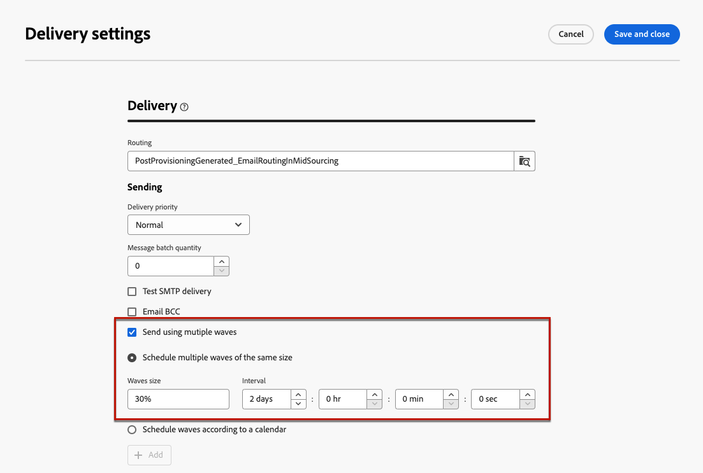
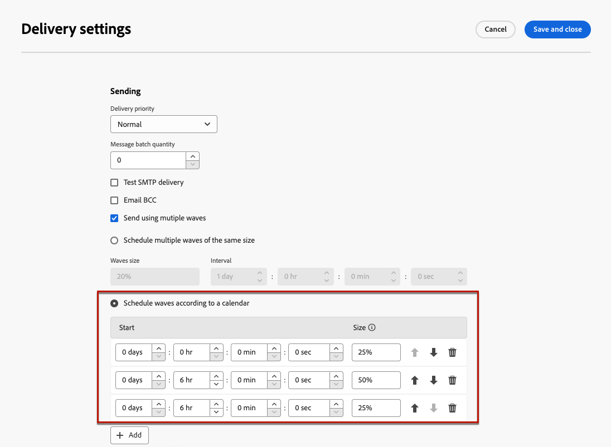
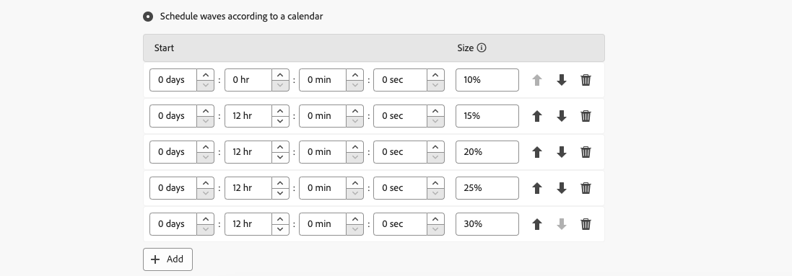

# 使用波段傳送 {#send-using-waves}

>[!CONTEXTUALHELP]
>id="acw_deliveries_waves_definition"
>title="波段定義"
>abstract="定義波段以將傳遞目標分成幾批，而不是同時傳送大量訊息。"

>[!CONTEXTUALHELP]
>id="acw_deliveries_waves_size"
>title="波段的大小"
>abstract="需要波段的大小。在大小欄位中輸入數值 (訊息數) 或百分比 (0-100%)。"

若要平衡負載，您可以將傳送劃分為幾個批次。 設定批次數量及其相對於整個傳送的比例。

>[!NOTE]
>
>您只能定義兩個連續波段之間的大小和延遲。 無法設定每個波次的收件者選取條件。

1. 開啟 [傳遞設定](delivery-settings.md#retries) 並前往 **[!UICONTROL 傳遞]** 標籤。
1. 選取 **[!UICONTROL 使用多個波段傳送]** 選項，然後按一下 **[!UICONTROL 定義波段……]** 連結。

1. 若要設定波段，您可以：

   * **[!UICONTROL 排程相同大小的多個波段]**.

     例如，如果您輸入 **[!UICONTROL 30%]** 在對應欄位中，每個波段將代表傳送中所包含訊息的30%，但最後一個波段除外，這將代表訊息的10%。

     

     在 **[!UICONTROL 間隔]** 部分，指定兩個連續波段開始之間的延遲。 例如，如果您輸入 **[!UICONTROL 2d]**，第一波會立即開始，第二波會在兩天內開始，第三波會在四天內開始，以此類推。

   * **[!UICONTROL 根據行事曆排程波段]**.

     在 **[!UICONTROL 開始]** 欄，指定兩個連續波段開始之間的延遲。 在 **[!UICONTROL 大小]** 欄，輸入固定數字或百分比。

     在以下範例中，第一個波段代表傳遞中包含之訊息總數的25%，並會立即開始。 接下來的兩個批次會完成傳遞，並設定為每六小時開始一次。

     

     特定型別控制規則、 **[!UICONTROL 波段排程檢查]**，確保最後一個波段是在傳遞效度限制之前計畫。 行銷活動型別及其規則設定於 **[!UICONTROL 型別]** 傳遞設定的索引標籤。 進一步瞭解 [Campaign v8 （使用者端主控台）檔案](https://experienceleague.adobe.com/docs/campaign/automation/campaign-optimization/control-rules.html).

     >[!IMPORTANT]
     >
     >請確定最後一個批次沒有超過傳遞期限，該期限定義於 **[!UICONTROL 有效性]** 標籤。 否則，部分訊息可能不會傳送。 [了解更多](delivery-settings.md#validity)
     >
     >在設定最後一個波段時，您也必須允許足夠的重試時間。 [了解更多](delivery-settings.md#retries)

1. 若要監視您的傳送情況，請前往 [傳遞記錄](../monitor/delivery-logs.md).

您可以檢視已在處理批次中傳送的傳遞(**[!UICONTROL 已傳送]** 狀態)和在剩餘波段中要傳送的傳遞(**[!UICONTROL 擱置中]** 狀態)。

以下兩個範例是使用多個波段的最常見使用案例。

* **啟動處理期間**

  使用新平台傳送電子郵件時，網際網路服務提供者(ISP)會懷疑無法辨識的IP位址。 如果突然傳送大量電子郵件，ISP通常會將其標籤為垃圾郵件。

  為避免被標籤為垃圾訊息，您可以逐步增加使用波段傳送的數量。 這應該可以確保啟動階段的順利發展，並且讓您降低無效的位址的整體比率。

  若要這麼做，請使用 **[!UICONTROL 根據行事曆排程波段]** 選項。 例如，將第一個波段設為10%，將第二個波段設為15%，以此類推。

  

* **涉及客服中心的行銷活動**

  管理電話忠誠度行銷活動時，貴組織處理聯絡訂閱者之通話次數的能力有限。

  使用波段時，您可以將每天的訊息數量限製為20，這是客服中心的每日處理能力。

  若要這麼做，請選取 **[!UICONTROL 排程相同大小的多個波段]** 選項。 輸入 **[!UICONTROL 20]** 作為波浪的大小和 **[!UICONTROL 1d]** 在 **[!UICONTROL 期間]** 欄位。

  