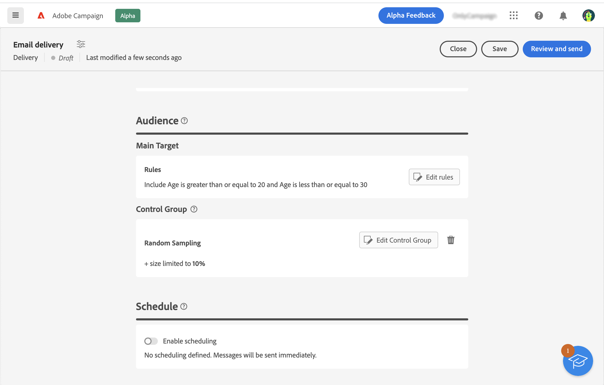

# Get started with audiences {#about-audiences}

>[!CONTEXTUALHELP]
>id="acw_homepage_card2"
>title="Get started with audiences"
>abstract="Learn how to manage audience for your email content."

<!--
Audience only created for the delivery, not available later-->

<!--
Three ways:
* existing audience

Campaign or AEP Audiences

* create new on the fly

query like AEP segment builder (same component with campaign data)

* import from file

show use case with a new audience creation (or import from file?)

control groups like acc: exract, random, based on attribute
-->

In this section, learn how to define the audience of email. The audience is the main target of your delivery: the recipients who receive the email. The type of audience depends on the target mapping defined in the delivery template. See this [section](../email/create-email.md). 

To define the audience, you can:

* use an existing audience, see this [section](add-audience.md).
* create a new audience. See this [section](segment-builder.md).

You can also define control groups to avoid sending messages to a portion of your audience in order to measure the impact of your campaigns. See this [section](control-group.md).

