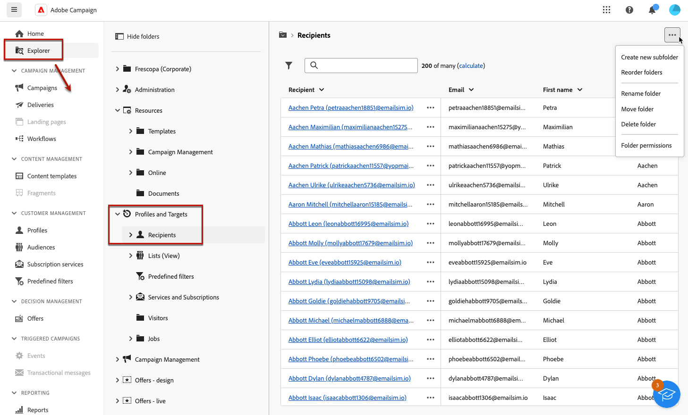
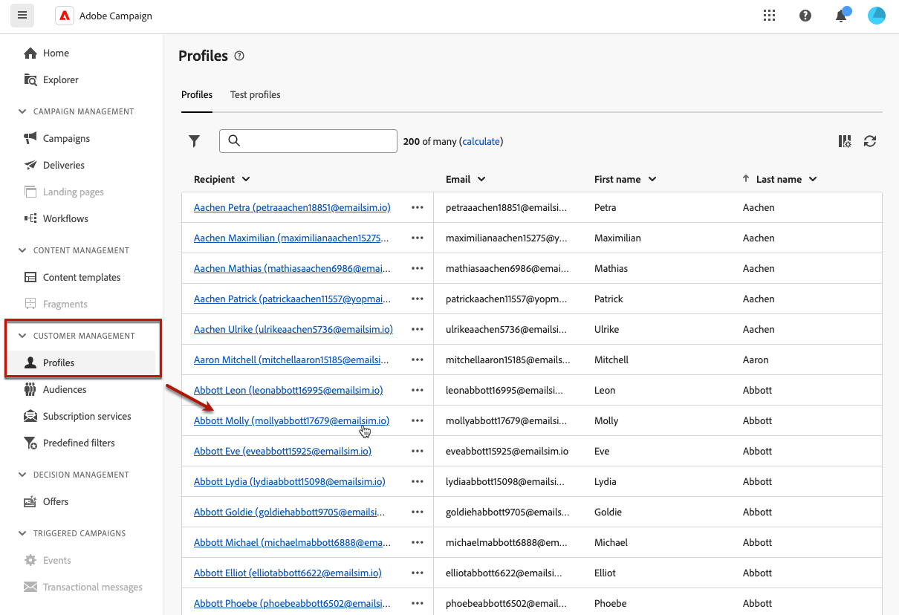
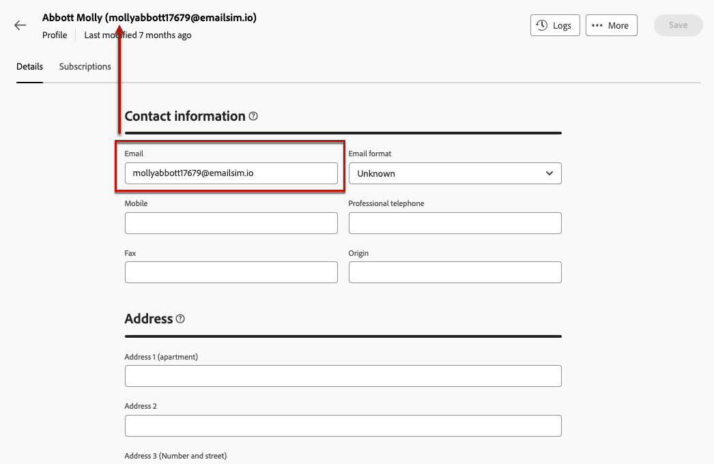
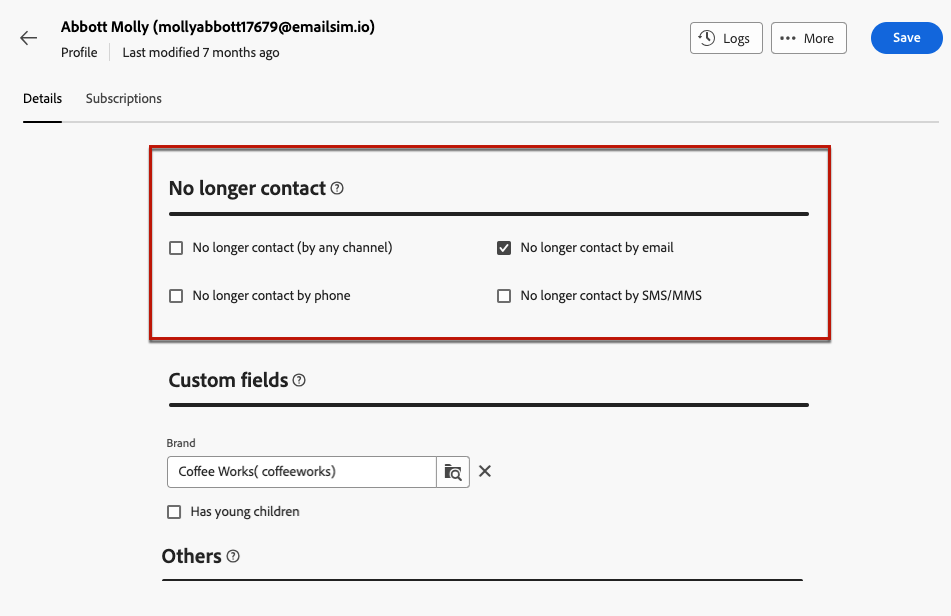
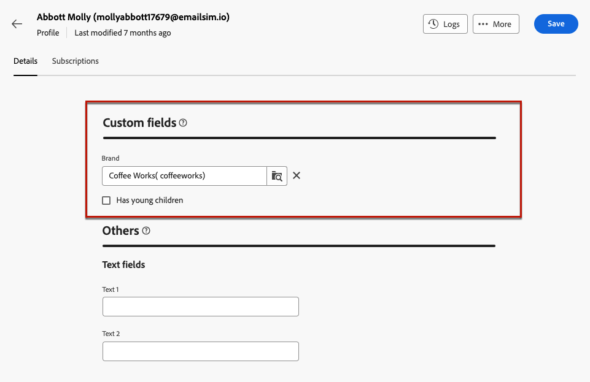

# 監視和管理設定檔 {#profiles}

>[!CONTEXTUALHELP]
>id="acw_homepage_welcome_rn4"
>title="設定檔的 360 檢視"
>abstract="建立新的設定檔，並透過強大的報表和工具進行監控。存取設定檔的屬性、互動和紀錄。使用篩選選項瀏覽設定檔清單、編輯和更新其設定檔。"
>additional-url="https://experienceleague.adobe.com/docs/campaign-web/v8/whats-new.html" text="請參閱版本注意事項"

<!--TO REMOVE BELOW-->
>[!CONTEXTUALHELP]
>id="acw_homepage_rn4"
>title="設定檔的 360 檢視"
>abstract="建立新的設定檔，並透過強大的報表和工具進行監控。存取設定檔的屬性、互動和紀錄。使用篩選選項瀏覽設定檔清單、編輯和更新其設定檔。"
>additional-url="https://experienceleague.adobe.com/docs/campaign-web/v8/whats-new.html" text="請參閱版本注意事項"

<!--TO REMOVE ABOVE-->

>[!CONTEXTUALHELP]
>id="acw_recipients_list"
>title="設定檔"
>abstract="設定檔代表個人，旨在接收 Adobe Campaign 傳送的訊息。在此清單中，您可以根據您的權限查看設定檔的詳細資料。使用篩選選項瀏覽此清單。您可以編輯和更新一小組設定檔屬性。"

## 開始使用設定檔 {#gs}

Adobe Campaign Web中的設定檔是儲存在資料庫中的個人，可作為的關鍵元件 [建立對象](create-audience.md) 用於傳遞和 [新增個人化](../personalization/personalize.md) 資料放入您的內容。

其他型別的設定檔儲存在資料庫中，例如 **[!UICONTROL 測試設定檔]**，專門用於在傳送給最終對象前測試您的傳送。 [了解更多](test-profiles.md)

設定檔只能從Adobe Campaign使用者端主控台建立 —  [瞭解如何](https://experienceleague.adobe.com/docs/campaign/campaign-v8/audience/add-profiles/create-profiles.html){target="_blank"}. 不過，您可以在Adobe Campaign Web的以下位置存取及編輯這些變數： **[!UICONTROL 客戶管理]** > **設定檔** 左側導覽邊欄中的專案。

>[!NOTE]
>
>根據您的許可權，您可能無法存取儲存在資料庫中的完整設定檔清單。 [進一步瞭解許可權](../get-started/permissions.md).

* 您可以篩選 **[!UICONTROL 設定檔]** 使用搜尋欄位或篩選器清單，該篩選器可從 **顯示篩選器** 按鈕。 您可以將結果限製為特定 [資料夾](../get-started/permissions.md#folders) 使用下拉式清單，或使用以下專案新增規則： [查詢模型工具](../query/query-modeler-overview.md).

  

* 若要刪除設定檔，請從 **[!UICONTROL 更多動作]** 功能表。

* 若要編輯設定檔，請從清單中按一下所需的專案。 [了解更多](#access)

您也可以透過存取設定檔 **[!UICONTROL 瀏覽器]** 檢視，從 **[!UICONTROL 設定檔和目標]** > **[!UICONTROL 收件者]** 節點。

您可以從中瀏覽、建立和管理檔案夾或子檔案夾，以及檢查關聯的許可權。 [瞭解如何建立資料夾](../get-started/permissions.md#folders)

從 **[!UICONTROL 瀏覽器]** 檢視您也可以篩選、刪除和 [編輯](#access) 設定檔。

## 存取及編輯設定檔的屬性 {#access}

>[!CONTEXTUALHELP]
>id="acw_recipients_creation_details"
>title="基本詳細資料"
>abstract="本章節提供對設定檔基本詳細資料的深入解析。若要修改任何訊息，請直接在對應欄位中進行變更，然後按一下螢幕右上角的「**儲存**」按鈕。"

>[!CONTEXTUALHELP]
>id="acw_recipients_creation_contactinformation"
>title="連絡資訊"
>abstract="本章節提供對設定檔連絡資訊的深入解析。若要修改任何訊息，請直接在對應欄位中進行變更，然後按一下螢幕右上角的「**儲存**」按鈕。"

>[!CONTEXTUALHELP]
>id="acw_recipients_creation_address"
>title="地址"
>abstract="本章節提供對設定檔郵寄地址和地址品質的深入解析。若要修改任何訊息，請直接在對應欄位中進行變更，然後按一下螢幕右上角的「**儲存**」按鈕。"

>[!CONTEXTUALHELP]
>id="acw_recipients_creation_account"
>title="帳戶詳細資料"
>abstract="本章節提供對設定檔帳戶詳細資料的深入解析。若要修改任何訊息，請直接在對應欄位中進行變更，然後按一下螢幕右上角的「**儲存**」按鈕。"

>[!CONTEXTUALHELP]
>id="acw_recipients_creation_nolongercontact"
>title="收件人不再是聯絡人"
>abstract="本章節提供對設定檔聯絡人偏好的深入解析。若要修改任何訊息，請直接在對應欄位中進行變更，然後按一下螢幕右上角的「**儲存**」按鈕。"

>[!CONTEXTUALHELP]
>id="acw_recipients_creation_customfields"
>title="自訂欄位"
>abstract="自訂欄位是根據您的需求量身打造的特定屬性，已針對您的執行個體設定。若要修改任何訊息，請直接在對應欄位中進行變更，然後按一下螢幕右上角的「**儲存**」按鈕。"

>[!CONTEXTUALHELP]
>id="acw_recipients_creation_othersfields"
>title="其他"
>abstract="本章節提供額外的內建屬性。若要修改任何訊息，請直接在對應欄位中進行變更，然後按一下螢幕右上角的「**儲存**」按鈕。"

>[!CONTEXTUALHELP]
>id="acw_recipients_subscription_list"
>title="收件者訂閱清單"
>abstract="此標籤列出設定檔訂閱的所有服務。"

若要存取設定檔的詳細資訊並加以編輯，請遵循下列步驟。

1. 瀏覽至 **[!UICONTROL 客戶管理]** > **[!UICONTROL 設定檔]** 並按一下「 」中所需的專案 **[!UICONTROL 設定檔]** 清單。

   

1. 設定檔的詳細資訊隨即顯示。

   此 **[!UICONTROL 詳細資料]** 索引標籤可讓您瀏覽設定檔的內建和自訂屬性。 若要編輯屬性，請在所需的欄位中進行變更，然後按一下 **[!UICONTROL 儲存]** 按鈕。

   

   1. 依預設，設定檔儲存在 **[!UICONTROL 收件者]** 資料夾。 您可以瀏覽至所需的位置來變更它。 [瞭解如何使用資料夾](../get-started/permissions.md#folders)

      

   1. 在 **[!UICONTROL 連絡資訊]** 區段，您可以更新電子郵件地址和其他相關資料。 電子郵件地址會顯示在設定檔標籤後的方括弧之間。

      

   1. 檢查 **[!UICONTROL 不再聯絡]** 並視需要更新。 選取這些選項中的任何一個時，設定檔都會列入封鎖清單。 例如，如果收件者按一下電子報中的取消訂閱連結，此資訊會新增至聯絡資料。 所選頻道上不再鎖定這類收件者。 [瞭解更多](https://experienceleague.adobe.com/docs/campaign/campaign-v8/send/failures/quarantines.html){target="_blank"}

      

   1. 如果有 **[!UICONTROL 自訂欄位]**，您可以視需要更新其值。 自訂欄位是新增到的其他屬性 **[!UICONTROL 設定檔]** 透過Adobe Campaign主控台的結構描述。 [瞭解更多](https://experienceleague.adobe.com/docs/campaign/campaign-v8/developer/shemas-forms/extend-schema.html){target="_blank"}

      

1. 按一下 **[!UICONTROL 訂閱]** 索引標籤來存取有關設定檔訂閱之服務的資訊。 [進一步瞭解訂閱服務](manage-services.md)

   

1. 按一下 **[!UICONTROL 記錄檔]** 按鈕位於畫面的右上角，可透過傳送、排除和追蹤記錄來檢視設定檔互動的歷史記錄。 [進一步瞭解傳遞記錄](../monitor/delivery-logs.md)

   您也可以檢閱呈現給設定檔的優惠，在 **[!UICONTROL 主張]** 標籤。 [進一步瞭解優惠方案](../msg/offers.md)

   
