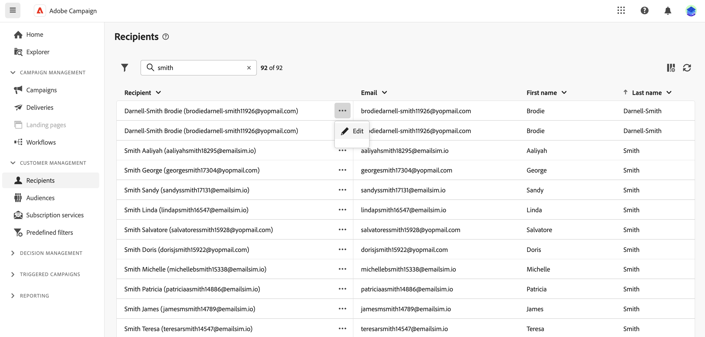
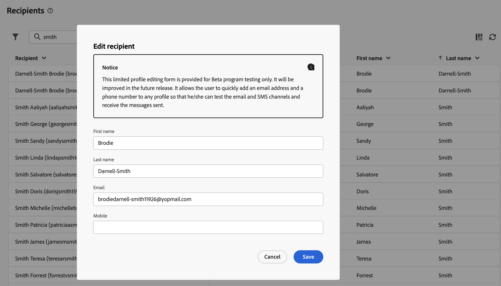
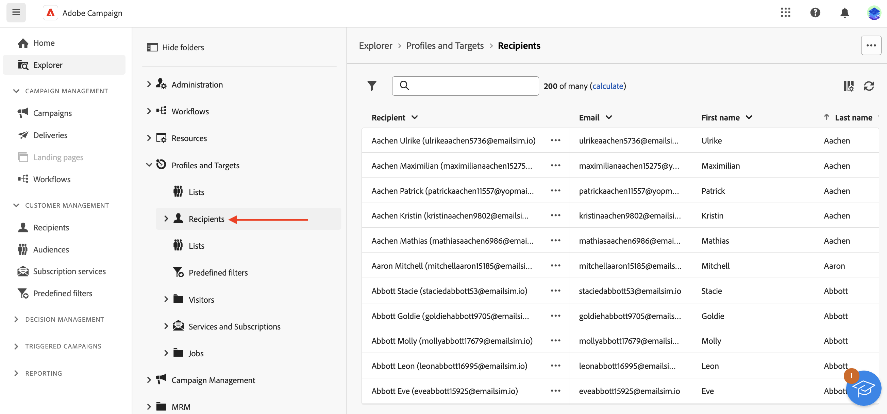

# 與收件者和受眾合作 {#about-recipients}

## 收件者 {#recipients}

>[!CONTEXTUALHELP]
>id="acw_recipients_list"
>title="收件者"
>abstract="收件者是一個設定檔，旨在接收 Adobe Campaign 傳送的訊息。 在 Adobe Campaign 中，收件者是用於傳送遞送內容 (電子郵件、SMS 等) 的預設設定檔。 在此清單中，您可以根據您的權限查看收件者的設定檔。 使用篩選選項瀏覽此清單。 您可以編輯和更新一組小型收件者屬性。"

收件者是一個設定檔，旨在接收 Adobe Campaign 傳送的訊息。 在 Adobe　Campaign 中，收件者是用於傳送內容 (電子郵件、SMS 等) 的預設用戶檔案。儲存在資料庫中的收件者資料可讓您建立將接收任何指定傳遞的對象，並在傳遞內容中新增個人化資料。 其他型別的設定檔儲存在資料庫中。 這些設定檔是針對不同用途而設計：例如，種子設定檔是用來在傳送給最終對象之前測試您的傳送。

只能從Campaign使用者端主控台新增收件者。 不過，您可以在Campaign網頁的 **收件者** 左側導覽邊欄的專案。

若要編輯收件者的資料，請按一下其名稱旁邊的三個點，然後選擇 **編輯……**.

您可以更新有限的屬性集，包括：名字、姓氏、電子郵件和電話號碼。

>[!NOTE]
>
>此有限的設定檔編輯表單僅供測試版計畫測試使用。 它將在未來版本中改進。 它可讓使用者快速將電子郵件地址和電話號碼新增到任何設定檔，以便他/她可以測試電子郵件和簡訊頻道，並接收傳送的訊息。

您可以使用搜尋欄位從以下網址篩選收件者： **顯示篩選器** 按鈕。

您也可以從以下位置存取收件者： **瀏覽器** 檢視、瀏覽及建立檔案夾和子檔案夾，以及檢查相關的許可權。

>[!NOTE]
>
>根據您的許可權，您可能無法存取資料庫中儲存的完整收件者清單。 進一步瞭解中的許可權 [本節](../get-started/permissions.md).

此外，您可以管理收件者對電子報等服務的訂閱和取消訂閱。 [瞭解如何使用訂閱服務](create-service.md)

## 對象 {#audiences}

對象是傳遞的主要目標：收到訊息的收件者。對象類型會依據傳遞範本中定義的目標對應而不同。[瞭解什麼是傳遞範本](../msg/delivery-template.md).

若要定義對象母體，您可以：

* [建立新對象](create-audience.md) 從 **[!UICONTROL 受眾]** 功能表，
* [選取現有對象](add-audience.md) 在使用者端主控台中建立為清單，
* [選取Adobe Experience Platform對象](aep-audience.md)，
* [建立新對象](segment-builder.md) 使用規則產生器，方法是定義和結合篩選准則，
* [使用外部檔案中的對象](file-audience.md).此選項僅適用於獨立電子郵件傳送，無法用於行銷活動傳送。

鎖定目標對象時，您也可以定義 **控制組** 以避免傳送訊息給部分對象，並評估行銷活動的影響。 [瞭解如何設定控制組](control-group.md)

>[!NOTE]
>
>在行銷活動工作流程內容中傳送訊息時，會在特定中定義對象 **建立對象** 工作流程活動。 在此特定情況下，您無法從檔案載入對象以進行電子郵件傳遞，並且該對象的定義僅適用於此專用活動。瞭解如何在行銷活動工作流程中定義傳送的對象 [在本節中](../workflows/activities/build-audience.md)
