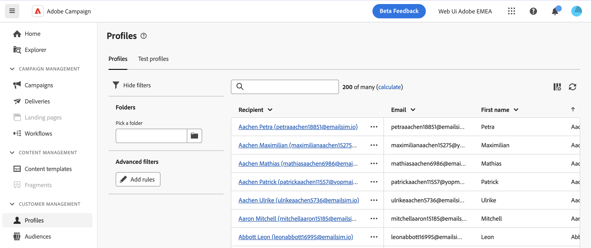
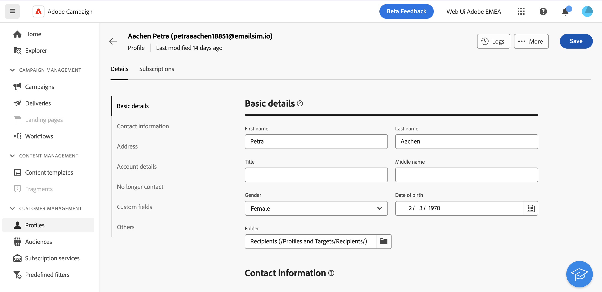

# 監視和管理設定檔 {#profiles}

>[!CONTEXTUALHELP]
>id="acw_homepage_rn4"
>title="360個設定檔檢視"
>abstract="建立新的設定檔，並透過功能強大的報告和工具加以監控。 存取設定檔的屬性、互動和記錄。 使用篩選選項來瀏覽設定檔清單、編輯和更新其設定檔。"
>additional-url="https://experienceleague.adobe.com/docs/campaign-web/v8/whats-new.html" text="請參閱版本注意事項"

>[!CONTEXTUALHELP]
>id="acw_recipients_list"
>title="設定檔"
>abstract="設定檔代表個人，旨在接收 Adobe Campaign 傳送的訊息。從此清單中，您可以根據您的許可權檢視設定檔的詳細資訊。 使用篩選選項瀏覽此清單。您可以編輯和更新一小部分設定檔屬性。"

## 開始使用設定檔 {#gs}

Adobe Campaign Web中的設定檔是儲存在資料庫中的個人，可作為關鍵元件來建立傳遞的對象，並將個人化資料新增至您的內容。 各種型別的設定檔會儲存在資料庫中（例如測試設定檔），這些設定檔的設計目的是在傳送給最終對象之前測試您的傳送。 [瞭解如何使用測試設定檔](test-profiles.md)

設定檔只能從Campaign使用者端主控台新增。 不過，您可在Adobe Campaign Web上從以下位置存取： **設定檔** 左側導覽邊欄中的專案。 您也可以從以下位置存取它們： **瀏覽器** 檢視，您可在此瀏覽、建立檔案夾和子檔案夾，以及檢查關聯的許可權。

您可以使用以下位置提供的搜尋欄位或篩選器來篩選設定檔清單： **顯示篩選器** 按鈕。

>[!NOTE]
>
>根據您的許可權，您可能無法存取儲存在資料庫中的完整設定檔清單。 若要了解權限的詳細資訊，請參閱[本章節](../get-started/permissions.md)。

## 存取及編輯設定檔的屬性 {#access}

>[!CONTEXTUALHELP]
>id="acw_recipients_creation_details"
>title="基本詳細資料"
>abstract="本節提供設定檔基本詳細資訊的深入分析。 若要修改任何資訊，請直接在個別欄位中進行變更，然後按一下 **儲存** 按鈕的位置。"

>[!CONTEXTUALHELP]
>id="acw_recipients_creation_contactinformation"
>title="聯絡資訊"
>abstract="本節提供設定檔之聯絡資訊的深入分析。 若要修改任何資訊，請直接在個別欄位中進行變更，然後按一下 **儲存** 按鈕的位置。"

>[!CONTEXTUALHELP]
>id="acw_recipients_creation_address"
>title="地址"
>abstract="本節提供設定檔郵寄地址和地址品質的深入分析。 若要修改任何資訊，請直接在個別欄位中進行變更，然後按一下 **儲存** 按鈕的位置。"

>[!CONTEXTUALHELP]
>id="acw_recipients_creation_account"
>title="帳戶詳細資料"
>abstract="本節提供設定檔之帳戶詳細資訊的深入分析。 若要修改任何資訊，請直接在個別欄位中進行變更，然後按一下 **儲存** 按鈕的位置。"

>[!CONTEXTUALHELP]
>id="acw_recipients_creation_nolongercontact"
>title="收件人不再是聯絡人"
>abstract="本節提供設定檔之聯絡人偏好設定的深入分析。 若要修改任何資訊，請直接在個別欄位中進行變更，然後按一下 **儲存** 按鈕的位置。"

>[!CONTEXTUALHELP]
>id="acw_recipients_creation_customfields"
>title="自訂欄位"
>abstract="自訂欄位是針對您的需求量身打造的特定屬性，這些屬性已針對您的執行個體進行設定。 若要修改任何資訊，請直接在個別欄位中進行變更，然後按一下 **儲存** 按鈕的位置。"

>[!CONTEXTUALHELP]
>id="acw_recipients_creation_othersfields"
>title="其他"
>abstract="本節提供其他內建屬性。 若要修改任何資訊，請直接在個別欄位中進行變更，然後按一下 **儲存** 按鈕的位置。"

>[!CONTEXTUALHELP]
>id="acw_recipients_subscription_list"
>title="收件者訂閱清單"
>abstract="此標籤會列出設定檔訂閱的所有服務。"

若要存取設定檔的詳細資訊，請在設定檔清單中按一下其名稱。

在此畫面中，您可以存取設定檔的詳細資訊：

* 此 **[!UICONTROL 詳細資料]** 索引標籤可讓您瀏覽設定檔的內建和自訂屬性。 若要編輯屬性，請在所需的欄位中進行變更，然後按一下 **[!UICONTROL 儲存]** 按鈕。
* 此 **[!UICONTROL 訂閱]** 標籤提供有關設定檔訂閱之服務的資訊。 [瞭解如何使用訂閱服務](manage-services.md)
* 此 **[!UICONTROL 記錄檔]** 位於畫面右上角的按鈕可讓您透過傳送、排除和追蹤記錄，以及顯示給設定檔的主張，檢視設定檔互動的歷史記錄。
