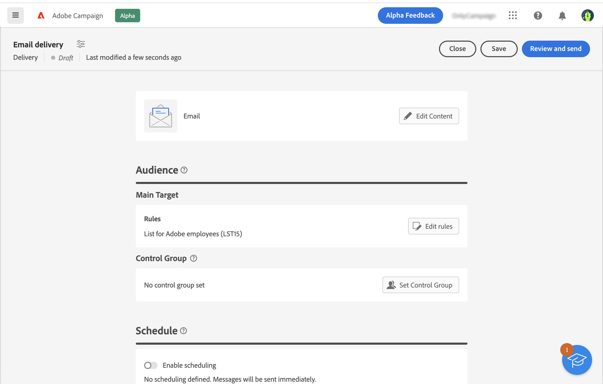
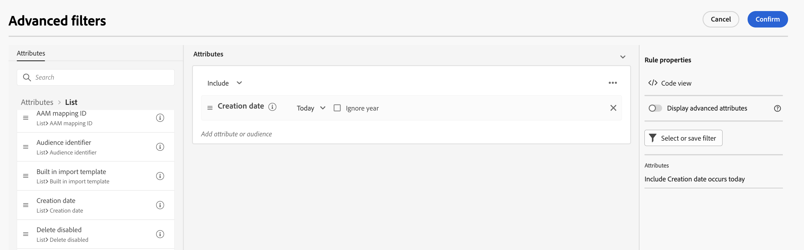

# 選取對象 {#add-audience}

>[!CONTEXTUALHELP]
>id="acw_deliveries_email_audience_select"
>title="選取現有對象"
>abstract="在 Adobe Campaign v8 主控台中定義對象。如果您有可用的 Adobe Experience Platform 整合，您也應該能夠查看平台定義的對象。"

本節說明如何定義電子郵件傳送的目標母體時，選取現有對象。 如果您想要建立新對象，請參閱 [節](segment-builder.md).

1. 從 **對象** 傳送建立助理的區段，按一下 **[!UICONTROL 選取對象]** 按鈕。

   

1. 選擇 **[!UICONTROL 選取對象]** 來使用現有對象。 若要建立要在此電子郵件中使用的新對象，請選擇 **建立自己的**. 請參閱 [節](segment-builder.md).

   此畫面會顯示Adobe Campaign Console或Adobe Experience Platform中定義的所有現有對象。

   

   >[!NOTE]
   >
   >若要運用Adobe Experience Platform對象，您需要設定與Destinations的整合。 請參閱 [目的地檔案](https://experienceleague.adobe.com/docs/experience-platform/destinations/home.html?lang=zh-Hant){target="_blank"}.

1. 選擇對象並按一下 **選擇**.

1. 按一下 **編輯規則** 如果您想要調整對象。

   

1. 使用規則產生器，您可以透過其他篩選器或結合不同對象，讓您的對象更為豐富。 看這個 [節](segment-builder.md).

   

1. 按一下 **儲存**.

您也可以設定控制組以測量促銷活動的影響。 控制組未接收消息。 這可讓您比較收到訊息的母體行為與未收到訊息的聯絡人行為。 請參閱 [節](control-group.md).