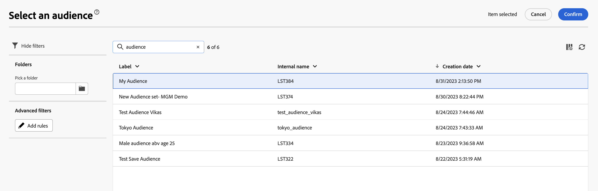

# 選取現有對象 {#add-audience}

>[!CONTEXTUALHELP]
>id="acw_deliveries_email_audience_select"
>title="選取現有對象"
>abstract="在 Adobe Campaign v8 主控台中定義對象。如果您有可用的 Adobe Experience Platform 整合，您也應該能夠查看平台定義的對象。"

本章節說明如何在定義電子郵件傳遞的目標母體時選取現有對象。

您也可以：

* 建立新對象。[了解更多](segment-builder.md)
* 使用外部檔案中的訪問群體。 [了解更多](file-audience.md)
* 使用 Adobe Experience Platform 對象。[了解更多](aep-audience.md)。

若要為您的訊息選取現有對象，請依照以下步驟操作：

1. 從傳遞建立助理的「**對象**」區段，按一下「**[!UICONTROL 選取對象]**」按鈕。

   

1. 選擇「**[!UICONTROL 選取對象]**」以使用現有對象。若要建立新對象用於此電子郵件，請選擇「**建立您自己的**」。請參閱本[章節](segment-builder.md)。

   此畫面顯示在 Adobe Campaign 主控台中定義或來自 Adobe Experience Platform 的所有現有對象。

   

   >[!NOTE]
   >
   >若要利用 Adobe Experience Platform 對象，您需要設定與目的地的整合。請參閱[目的地文件](https://experienceleague.adobe.com/docs/experience-platform/destinations/home.html?lang=zh-Hant){target="_blank"}。

1. 選擇對象，然後按一下「**選取**」。

1. 如果你想要調整您的對象，請按一下「**編輯規則**」。

   

1. 使用規則產生器，您可以使用額外的篩選器或結合不同的對象來擴充您的對象。請參閱本[章節](segment-builder.md)。

   

1. 按一下「**儲存**」。

您也可以設定控制組來測量行銷活動的影響。控制組不會收到訊息。可讓您將收到訊息之母體的行為與未收到訊息之聯絡人的行為進行比較。請參閱[章節](control-group.md)。