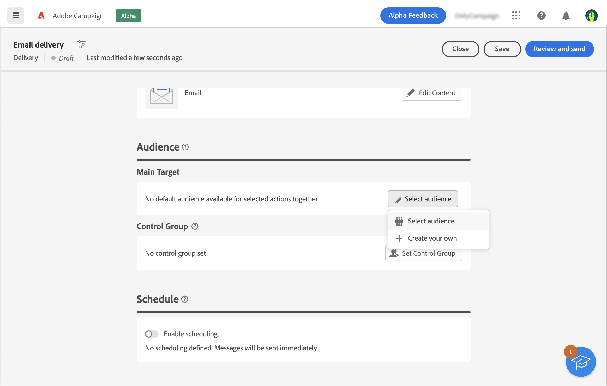
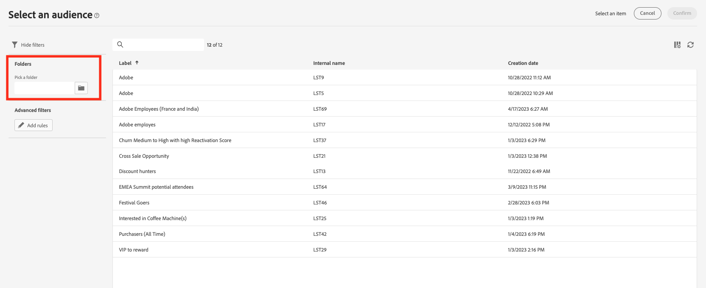
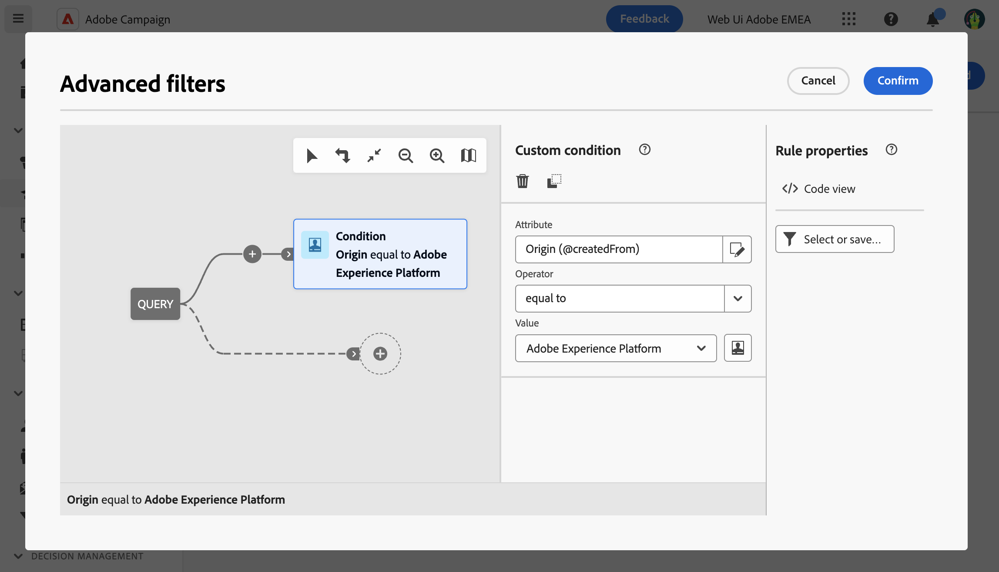
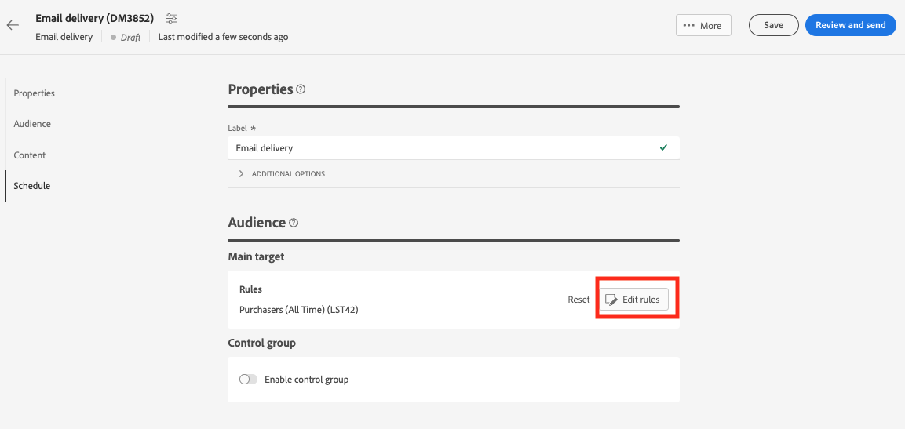

# 使用 Adobe Experience Platform 對象{#aep-audience}

Adobe Campaign受管理的Cloud Service目標和來源聯結器可讓Adobe Campaign與Adobe Experience Platform之間無縫整合。

建立Adobe Experience Platform受眾並可在使用者端主控台使用後，您可使用與Campaign受眾個人化和傳送訊息相同的方式來使用它。

>[!NOTE]
>
>若要在Campaign中使用Adobe Experience Platform對象，您需要設定與Adobe來源和目標的整合。 請參閱 [Campaign v8 （主控台）檔案](https://experienceleague.adobe.com/docs/campaign/campaign-v8/connect/ac-aep.html){target="_blank"}.

若要選取傳送的對象，您也可以：

* 建立新對象。 [了解更多](segment-builder.md)
* 從外部檔案載入對象。 [了解更多](file-audience.md)
* 使用現有的Campaign對象。 [了解更多](add-audience.md)。

若要選取要傳送的Adobe Experience Platform對象，請遵循下列步驟：

1. 從傳遞建立助理的「**對象**」區段，按一下「**[!UICONTROL 選取對象]**」按鈕。

   

1. 選擇「**[!UICONTROL 選取對象]**」以使用現有對象。若要建立新對象用於此電子郵件，請選擇「**建立您自己的**」。請參閱本[章節](segment-builder.md)。

   此畫面會針對目前的資料夾顯示Adobe Campaign使用者端主控台中定義的所有現有對象。 若要從Adobe Experience Platform選擇對象，請瀏覽至 `AEP Audiences folder` 從熒幕的篩選區段。

   

   您也可以定義規則以篩選對象的來源，如下所示：

   

1. 選擇對象，然後按一下「**選取**」。

1. 如果你想要調整您的對象，請按一下「**編輯規則**」。

   

1. 使用規則產生器，您可以使用額外的篩選器或結合不同的對象來擴充您的對象。請參閱本[章節](segment-builder.md)。

1. 按一下「**儲存**」。

