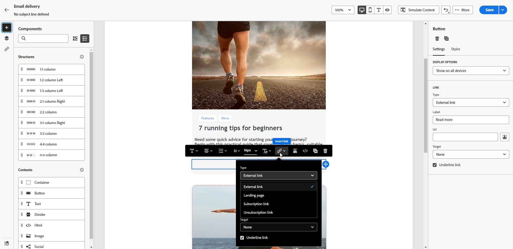

# 管理同意 {#manage-consent}

## 一般性建議 {#general-recommendations}

Adobe Campaign 可讓您收集資料，包括個人和敏感資訊。因此，您必須遵守GDPR （一般資料保護規範）等資料保護法規及其他適用的隱私權法律，取得並監控收件者的同意。

* 首先，避免傳送未經請求的電子郵件、推播通知和SMS訊息（「垃圾訊息」）。 在打造顧客期限值及忠誠度的過程中，Adobe篤信許可式行銷原則，因此我們嚴格禁止使用Adobe Campaign傳送未經請求的訊息。 [了解更多](#denylisted-profiles)

* 讓收件者能夠選擇退出您的傳遞<!-- and keep honoring opt-out requests as quickly as possible-->，讓收件者一律同意接收通訊。 [了解更多](#opt-out)

* 透過訂閱管理程式，您可以管理收件者的偏好設定，並追蹤哪些收件者已選擇加入何種訂閱型別。 [了解更多](../../delivery/using/about-services-and-subscriptions.md)

## 管理選擇退出 {#opt-out}

向收件者提供取消訂閱來自品牌之通訊的功能為法律所規定，同時需確保遵循此選擇。<!--Learn more about the applicable legislation in the [Adobe Campaign Classic v7 documentation](https://experienceleague.adobe.com/docs/campaign-classic/using/getting-started/privacy/privacy-and-recommendations.html#privacy-regulations){target="_blank"}.-->

**為什麼這很重要？**

* 若未遵守這些法規，您的品牌將面臨法律風險。
* 它可協助您避免傳送未經請求的通訊給您的收件者，這可能會使他們將您的訊息標示為垃圾訊息，並損害您的聲譽。

使用Adobe Campaign Web傳送傳遞時，您必須一律確保客戶可取消訂閱未來的通訊。 取消訂閱後，設定檔會自動從未來行銷訊息的對象中移除。

### 電子郵件選擇退出 {#email-opt-out}

若要讓收件者能夠取消訂閱接收電子郵件通訊，您必須在每封寄送給收件者的電子郵件中一律包含&#x200B;**取消訂閱連結**。

請依照下列步驟以執行此操作。

1. 建立外部登陸頁面，並在您選擇的協力廠商系統上代管該頁面。

1. 建立電子郵件傳遞。 [了解做法](../email/create-email.md)

1. 插入電子郵件內容的連結。 [了解做法](../email/message-tracking.md#insert-links)

   

1. 在&#x200B;**[!UICONTROL Url]**&#x200B;欄位中，貼上第三方登陸頁面的連結。

1. 從左窗格按一下「**[!UICONTROL 連結]**」圖示以顯示內容中被追蹤的所有 URL 清單。

1. 按一下新連結旁的鉛筆圖示即可進行編輯。

1. 修改&#x200B;**[!UICONTROL 追蹤型別]**&#x200B;並將其設定為&#x200B;**[!UICONTROL 選擇退出]**。

   

1. 按一下&#x200B;**[!UICONTROL 儲存]**&#x200B;並傳送訊息。 [了解更多](../monitor/prepare-send.md)

1. 收到訊息後，如果收件者按一下取消訂閱連結，就會顯示您的登陸頁面。

1. 收件者提交登入頁面表單時，會更新設定檔資料。 [了解更多](#denylisted-profiles)

<!--Any other option availabe such as one-click opt-out link or List-Unsubscribe (to include an unsubscribe link in the email header) to enable opt-out in a delivery?-->

## 已加入封鎖清單的設定檔 {#denylisted-profiles}

取消訂閱（選擇退出）後，設定檔位於指定頻道的&#x200B;**封鎖清單**&#x200B;上：這表示它們不再成為任何傳送的目標。

>[!NOTE]
>
>如果電子郵件通道封鎖清單上的設定檔有兩個電子郵件地址，則兩個地址都會從傳送中排除。

您可以在設定檔的&#x200B;**[!UICONTROL 詳細資料]**&#x200B;索引標籤的&#x200B;**[!UICONTROL 不再聯絡]**&#x200B;區段中，檢查設定檔是否在一個或多個頻道的封鎖清單中。 [了解更多](../audience/about-recipients.md#access)

<!--Denylisted status on quarantine list

Additionally, when recipients report your message as spam, or reply to an SMS message with a keyword such as "STOP", their address or phone number is quarantined with the **[!UICONTROL Denylisted]** status. Their profile is updated accordingly.

QUESTION: When a user marks an email as spam, is the profile's No longer contact section also updated? Apparently no (not the same = quarantine vs denylist)

>[!NOTE]
>
>The **[!UICONTROL Denylisted]** status refers to the address only, the profile is not on the denylist, so that the user continues receiving SMS messages and push notifications.

Learn more about Feedback loops in the [Delivery Best Practices Guide](https://experienceleague.adobe.com/docs/deliverability-learn/deliverability-best-practice-guide/transition-process/infrastructure.html#feedback-loops){target="_blank"}.

Learn more on quarantine in the [Campaign v8 (client console) documentation](https://experienceleague.adobe.com/docs/campaign/campaign-v8/send/failures/quarantines.html#non-deliverable-bounces){target="_blank"}.-->

