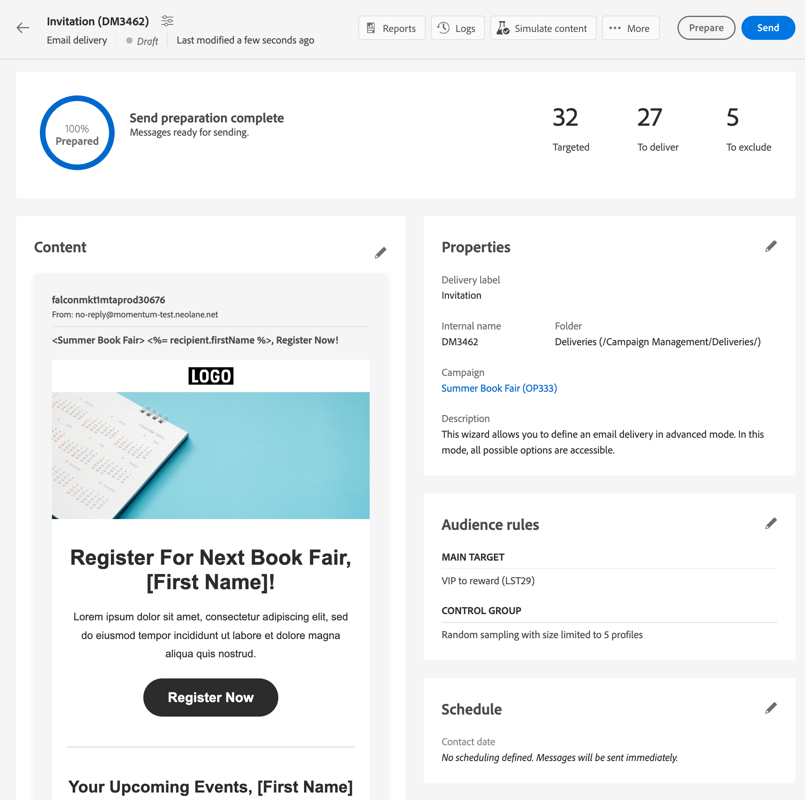

# 設定控制組 {#control-group}

您可以使用控制組來避免傳送訊息給部分觀眾，以評估行銷活動的影響。

若要這麼做，請在定義傳送的對象時建立控制組。 設定檔會隨機新增至控制組、篩選或不篩選，或根據標準。然後，您將能夠將接收到消息的目標人口的行為與未作為目標的聯絡人的行為進行比較。

可以從主要目標隨機擷取控制組和/或從特定人口中選取。因此，定義控制組的主要方法有兩種：

* 從主要目標擷取多個設定檔。
* 根據查詢中定義的條件排除一些設定檔。

定義控制組時，可以使用這兩種方法。

在傳送準備步驟中屬於控制組的所有設定檔將會從主要目標中移除。訊息傳送後，他們將無法接收。

若要建立控制組，請按一下 **[!UICONTROL 設定控制組]** 按鈕，從 **對象** 傳遞建立助理一節。

## 從目標中擷取 {#extract-target}

>[!CONTEXTUALHELP]
>id="acw_deliveries_email_controlgroup_target"
>title="從目標中擷取"
>abstract="TBC"

若要定義控制組，您可以選擇從目標人口中隨機或基於排序、百分比或固定數量的設定檔中擷取。

首先，定義從目標中擷取設定檔的方式： 隨機或根據排序 。

在 **從目標擷取** 區段，選擇 **排除類型**:

* **隨機**:準備傳送時，Adobe Campaign會隨機擷取與百分比或您要設定為大小限制的最大數量相對應的多個設定檔。

   

* **依屬性排名**:此選項可讓您根據特定排序順序中的特定屬性來排除一組設定檔。

   

然後定義 **大小限制**:您必須設定如何限制從主要目標擷取的設定檔數量。

**範例**

您可以檢視記錄以檢查並識別排除的設定檔。 讓我們以五個設定檔上隨機排除的範例為例。

傳送準備後，您可以在下列畫面上檢視排除項目：

* 此 **若要排除** 傳送前，傳遞控制面板中的KPI。

   

* 此 **排除記錄檔** 顯示每個設定檔及相關的排除 **原因**.

   

* 此 **排除原因** 顯示每個類型規則的已排除設定檔數。

   

如需傳送記錄檔的詳細資訊，請參閱 [節](../monitor/delivery-logs.md).

## 額外族群 {#extra-population}

>[!CONTEXTUALHELP]
>id="acw_deliveries_email_controlgroup_extra"
>title="額外族群"
>abstract="TBC"

定義控制組的另一種方法是使用現有對象或定義查詢，從目標中排除特定母體。

從 **額外人口** 區段 **控制組** 定義畫面，按一下 **[!UICONTROL 選取對象]** 按鈕。

* 若要使用現有對象，請按一下 **選取對象**. 請參閱 [節](add-audience.md).

* 要定義新查詢，請選擇 **建立自己的** 並使用規則產生器定義排除條件。 請參閱 [節](segment-builder.md).

對象中包含或符合查詢結果的設定檔將從目標中排除。