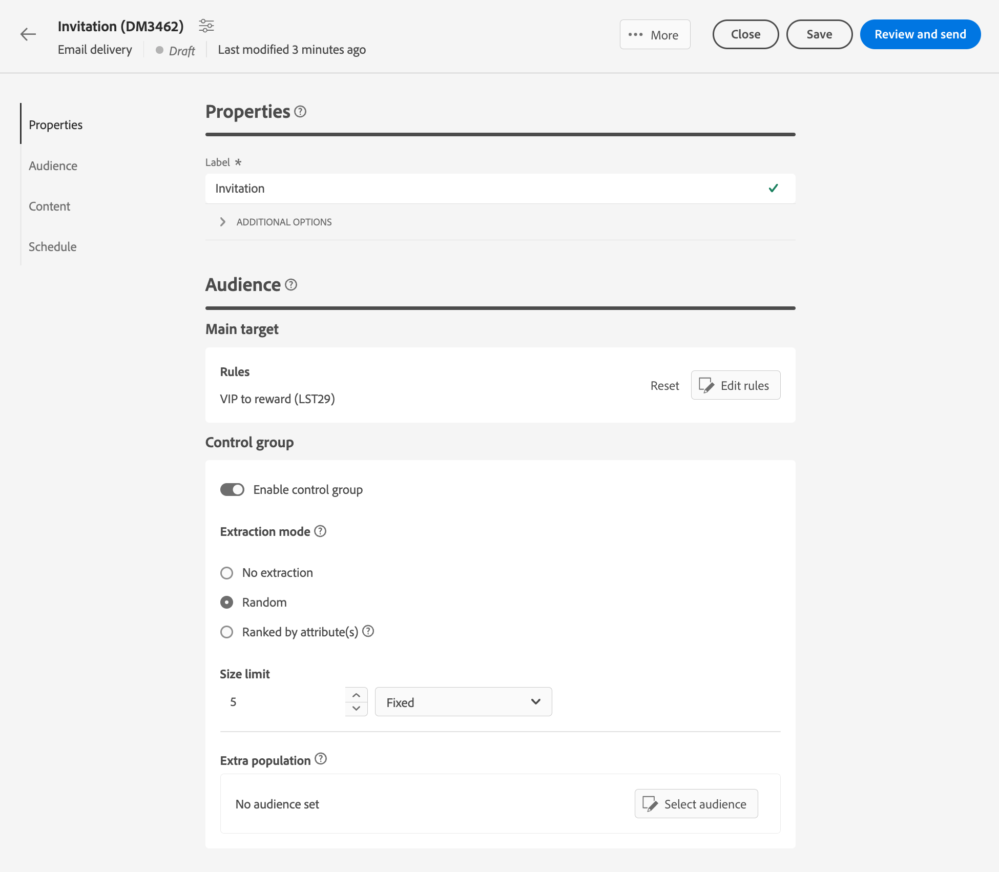

# 設定控制組 {#control-group}

控制組是從傳送中排除的子族群。 您可以定義控制組以避免傳送訊息給部分對象，並將傳送後的行為與主要目標進行比較。 此選項可協助您測量行銷活動的影響。

## 啟用控制組{#add-a-control-group}

若要新增控制組，請在定義傳送對象時啟用選項。 可以從主要目標隨機擷取控制組和/或從特定母體中選取。因此，定義控制組的主要方法有兩種：

* 從主要目標擷取設定檔。
* 從清單中排除某些設定檔，或根據查詢中定義的條件排除某些設定檔。

定義控制組時，您可以結合這兩種方法。

所有在傳遞準備步驟中屬於控制組的設定檔將會從主要目標中移除。他們並不會收到訊息。

>[!CAUTION]
>
>[從外部檔案](file-audience.md)載入目標母體時，您不能使用控制組。

若要將控制組新增至傳遞，請啟用 **[!UICONTROL 啟用控制組]** 切換，從 **對象** 傳遞建立畫面的一部分。

## 從目標中擷取 {#extract-target}

>[!CONTEXTUALHELP]
>id="acw_deliveries_email_controlgroup_target"
>title="擷取模式"
>abstract="對照組是一組從傳遞排除的設定檔。若要定義控制組，您可以選擇從目標族群中隨機或基於排序、百分比或固定數量的設定檔中擷取。"

### 建立控制組 {#build-extract-target}

若要定義控制組，您可以選擇從目標族群中隨機或基於排序、百分比或固定數量的設定檔中擷取。如果您偏好新增額外母體，請選擇 **無擷取** 選項並選取額外族群 [詳細資訊見此處](#extra-population).

首先，定義從目標中擷取設定檔的方式：隨機或根據排序。

在 **控制組** 區段，選擇 **擷取模式**：

* **隨機**：在準備傳遞時，Adobe Campaign 將隨機擷取與百分比或您設定為大小限制的最大數量對應的多個設定檔。

* **按屬性排名**：此選項可讓您根據特定排序順序中的特定屬性排除一組設定檔。

然後使用 **大小限制** 區段來設定您需要從主要目標擷取的設定檔數量。 可以是原始數字（例如要排除的50個設定檔）或初始對象的百分比（例如主要目標的5%）。

### 控制組範例{#control-group-sample}

例如，若要建立包含100個最新收件者的控制組，請遵循下列步驟：

1. 選取 **年齡** 作為排序條件的欄位。 離開 **升序** 排序選項。
1. 新增 **建立日期** 欄位。 變更為 **降序** 排序選項。
1. 將100定義為中的臨界值 **大小限制** 區段。

   

然後，這100個最年輕的收件者會從主要目標中排除。

### 檢查您的控制組 {#check-control-group}

您可以檢視記錄以檢查和識別排除的設定檔。讓我們以隨機排除五個設定檔為範例。

在準備傳送後，您可以檢閱套用排除專案的方式：

* 在傳送前，在傳遞控制面板中檢查 **要排除** KPI。

  

* 在傳送記錄檔中， 「記錄檔」索引標籤會顯示排除步驟。

  
<!--

 * The **Exclusion logs** tab displays each profile and the related exclusion **Reason**.

    
-->

* 此 **排除原因** 索引標籤顯示每個型別規則的排除設定檔數。

  

如需傳遞記錄的詳細資訊，請參閱本[章節](../monitor/delivery-logs.md)。

## 新增額外族群 {#extra-population}

>[!CONTEXTUALHELP]
>id="acw_deliveries_email_controlgroup_extra"
>title="額外族群"
>abstract="對照組是一組從傳遞排除的設定檔。定義控制組的另一種方法是選取現有對象或定義查詢從傳遞對象中排除特定族群。"

定義控制組的另一種方式是選取現有對象中的特定母體，或藉由定義查詢來進行。

從&#x200B;**控制組**&#x200B;定義畫面的「**額外族群**」區段，按一下「**[!UICONTROL 選取對象]**」按鈕。

* 若要使用現有對象，按一下「**選取對象**」。若要了解詳細資訊，請參閱[本章節](add-audience.md)。

* 若要定義新查詢，請選取「**建立您自己的**」並使用規則產生器定義排除標準。若要了解詳細資訊，請參閱[本章節](segment-builder.md)。

對象中包含或與查詢結果相符的設定檔為 **已排除** 從傳送目標：他們未收到任何訊息。

## 比較結果{#control-group-results}

傳送後，您可以擷取傳送記錄檔，以比較未接收通訊的設定檔與有效目標之間的行為。 您也可以使用傳送記錄來建置新目標定位。

若要檢視已從目標移除的設定檔，請檢查 **傳遞記錄**. 瞭解更多 [在本節中](#check-control-group).

