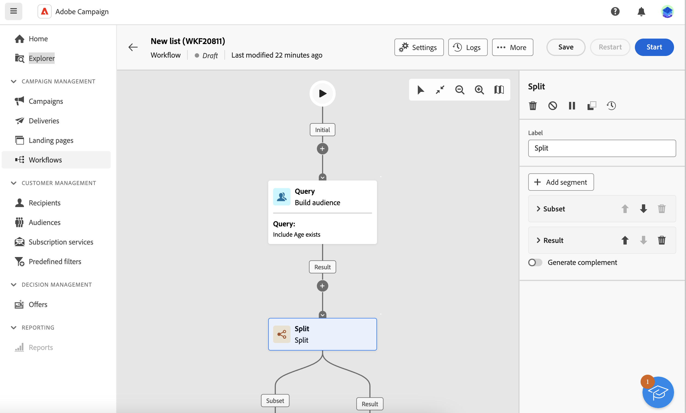
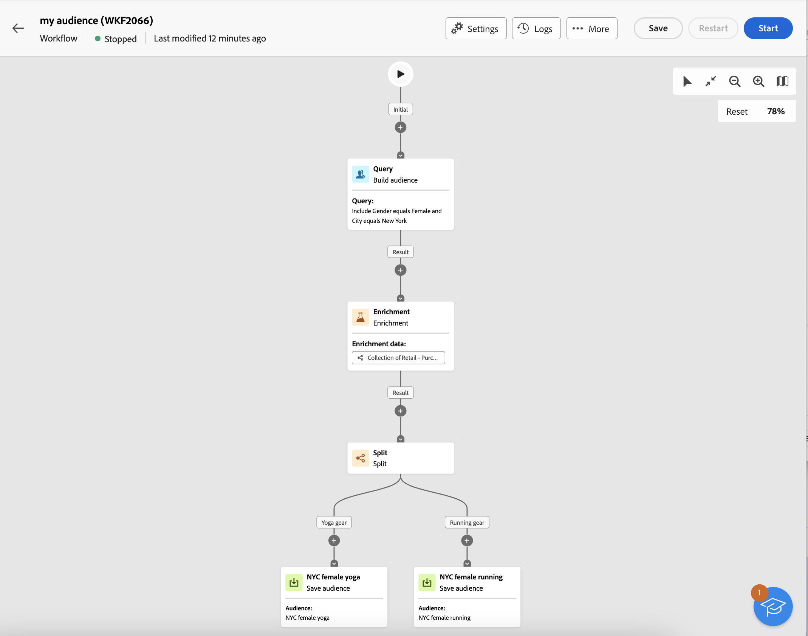
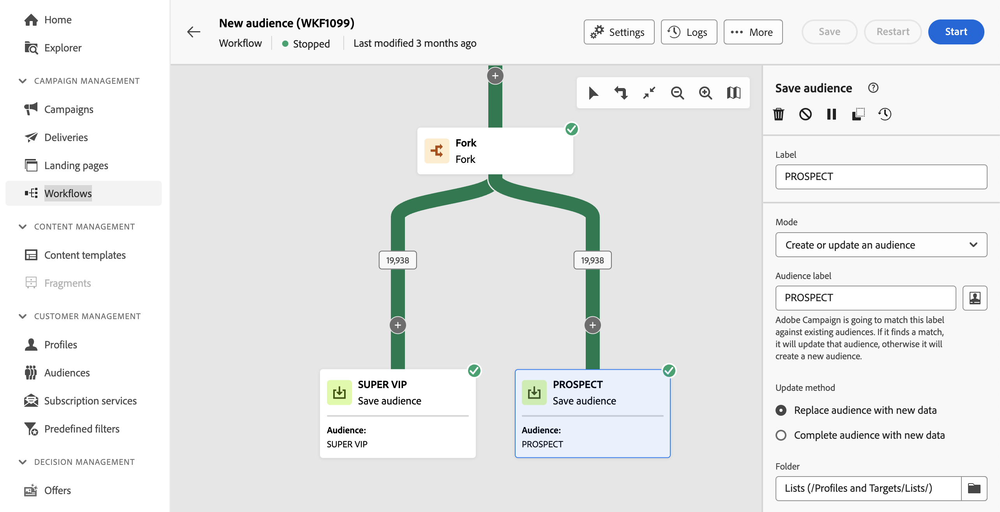

# 建立客群 {#create-audiences}

>[!CONTEXTUALHELP]
>id="acw_audiences_list"
>title="客群"
>abstract="從此畫面中，您可以存取可作為工作流程和獨立傳遞目標之所有對象的清單。按一下「**建立**」，在視覺畫布中建立新對象。  除了從頭開始建立簡單的對象之外，您還可以利用工作流程活動來調整對象。例如，您可將多個客群合併為單一客群，使用外部屬性擴充客群，或根據您選擇的規則將其分成多個客群。"

<!--
[!CONTEXTUALHELP]
>id="acw_audiences_create_settings"
>title="Audience settings"
>abstract="Enter the name of the audience and additional options, then click the **Create Audience** button."-->

## 關於對象建立

Campaign Web可讓您在視覺化工作流程畫布中建立新對象。 除了從頭開始建立簡單的客群之外，您還可以利用工作流程活動來調整客群。例如，您可將多個客群合併為單一客群，使用外部屬性擴充客群，或根據您選擇的規則將其分成多個客群。

當您製作工作流程後，產生的對象會自動與您現有的對象一起儲存在Campaign資料庫中。 接著，您就可以在工作流程或獨立傳送中鎖定這些對象。

**[!UICONTROL Origin]**&#x200B;欄指出受眾的原始項： **[!UICONTROL Adobe Campaign]**&#x200B;受眾是在Adobe Campaign v8主控台或Web使用者介面中建立，而&#x200B;**[!UICONTROL Adobe Experience Platform：]**&#x200B;受眾是在Adobe Experience Platform中建立，並使用Adobe Sources與Destinations整合整合功能整合至Campaign。

➡️ [在影片中探索此功能](#video)

## 自訂運運算元群組的許可權

建立新對象時，工作流程會自動建立並儲存在&#x200B;**[!UICONTROL 設定檔和目標]** / **[!UICONTROL 工作]** / **[!UICONTROL 目標工作流程]**&#x200B;資料夾中。

如果您被指派給自訂運運算元群組，並在建立對象時遇到「您沒有許可權」錯誤，您必須確保運運算元群組擁有此資料夾的必要許可權。

若要解決此問題，管理員必須將您的自訂運運算元群組新增至Campaign主控台中的資料夾安全性區段。 [瞭解如何管理檔案夾的許可權](../get-started/permissions.md#folder-permissions)

## 建立您的第一個對象 {#create}

若要建立對象，請遵循下列步驟：

1. 導覽至&#x200B;**[!UICONTROL 對象]**&#x200B;功能表，然後按一下右上角的&#x200B;**[!UICONTROL 建立對象]**&#x200B;按鈕。

1. 系統會自動建立新的工作流程，讓您合併活動以產生對象。 依預設，畫布包含兩個主要活動：

   * 「查詢」**[!UICONTROL 建置對象]**&#x200B;活動是工作流程的起點。 它可讓您建立受眾，並將其用作工作流程的基礎。

   * 「新對象」 **[!UICONTROL 儲存對象]**&#x200B;活動代表工作流程的最後一步。 它可讓您將結果儲存為新對象。

   {zoomable="yes"}

   >[!IMPORTANT]
   >
   >對象工作流程與其他行銷活動工作流程一起儲存在&#x200B;**工作流程**&#x200B;功能表中。 它們經過專門設計，以建立對象，並可透過其垂直畫布識別。

1. 為了更好的可讀性，請在工作流程設定&#x200B;**標籤**&#x200B;欄位中變更工作流程的名稱。 [瞭解如何設定工作流程設定](../workflows/workflow-settings.md)

1. 開啟&#x200B;**[!UICONTROL 建立對象]**&#x200B;活動，然後使用查詢模型工具，透過篩選資料庫中包含的資料，定義要包含在對象中的母體。 [瞭解如何設定組建對象活動](../workflows/activities/build-audience.md)

1. 如果您想要對工作流程中的目標母體執行其他操作，請視需要新增許多活動，並將它們連線在一起。 有關如何設定工作流程活動的詳細資訊，請參閱[工作流程檔案](../workflows/activities/about-activities.md)。

   >[!NOTE]
   >
   >管道活動不適用於對象工作流程。

   {zoomable="yes"}

1. 設定&#x200B;**[!UICONTROL 儲存對象]**&#x200B;活動，以指定您要在工作流程中儲存母體運算上游的方式。 [瞭解如何設定儲存對象活動](../workflows/activities/save-audience.md)

1. 當工作流程準備就緒時，按一下&#x200B;**[!UICONTROL 開始]**&#x200B;以執行它。

工作流程已儲存在&#x200B;**[!UICONTROL 工作流程]**&#x200B;清單中，而結果對象可在&#x200B;**[!UICONTROL 對象]**&#x200B;清單中存取，其標籤定義於&#x200B;**儲存對象**&#x200B;活動中。 在[本節](manage-audience.md)中瞭解如何監視和管理對象

您現在可以使用此對象作為傳送的主要目標。 [了解更多](add-audience.md)

## 對象工作流程範例 {#example}

以下範例顯示一個受眾工作流程，其設定是針對住在紐約的女客戶，並根據她們的最新購買專案（瑜伽或奔跑裝備）建立兩個新受眾。

{zoomable="yes"}

1. **[!UICONTROL 建置對象]**&#x200B;活動會鎖定住在紐約的所有女性設定檔。
1. **[!UICONTROL 擴充]**&#x200B;活動利用「購買」表格中的資訊來豐富對象，以識別客戶購買的產品型別。
1. **[!UICONTROL 分割]**&#x200B;活動會根據客戶的最新購買將工作流程劃分為兩個路徑。
1. 每個路徑結尾的&#x200B;**[!UICONTROL 儲存對象]**&#x200B;活動會在資料庫中建立兩個新對象，包括每個路徑中計算的母體。

## 編輯對象 {#edit}

您可以視需要透過重新執行其對應的工作流程，修改從工作流程產生的對象。 這可讓您重新整理對象資料，或調整查詢以符合您的需求來調整對象。

1. 導覽至&#x200B;**對象**&#x200B;功能表，然後開啟您要編輯的對象。
1. 在「**總覽**」標籤中，「**最後一個工作流程**」區段會提供用來產生對象的工作流程連結。 按一下以存取工作流程。
1. 進行所需的變更，然後按一下&#x200B;**開始**&#x200B;按鈕以重新執行工作流程。 完成後，工作流程產生的對象會自動更新為最新工作流程結果。

依預設，重新執行對象工作流程會以新資料取代整個對象內容，造成先前資料的遺失。

如果您不想取代現有的對象結果，請設定&#x200B;**儲存對象**&#x200B;活動以符合您的需求。 例如，您可以變更&#x200B;**對象標籤**&#x200B;欄位，將新結果儲存在新的對象中，或將新結果新增至現有的對象內容，而不清除先前的資料。 [瞭解如何設定儲存對象活動](../workflows/activities/save-audience.md)

{zoomable="yes"}

## 操作說明影片 {#video}

瞭解如何建立和管理對象、如何選取傳送對象以及定義控制群組。

>[!VIDEO](https://video.tv.adobe.com/v/3453213?captions=chi_hant&quality=12)