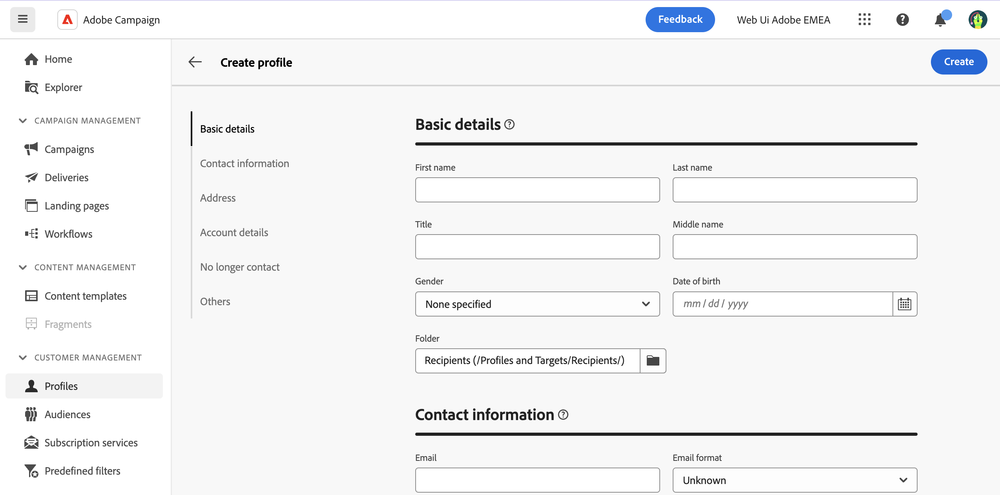

# 建立輪廓 {#profiles}

>[!CONTEXTUALHELP]
>id="acw_recipients_creation_details"
>title="基本詳細資料"
>abstract="本章節提供對輪廓基本詳細資料的深入解析。若要修改任何訊息，請直接在對應欄位中進行變更，然後按一下螢幕右上角的「**儲存**」按鈕。"

>[!CONTEXTUALHELP]
>id="acw_recipients_creation_contactinformation"
>title="聯絡資訊"
>abstract="本章節提供對輪廓聯絡資訊的深入解析。若要修改任何訊息，請直接在對應欄位中進行變更，然後按一下螢幕右上角的「**儲存**」按鈕。"

>[!CONTEXTUALHELP]
>id="acw_recipients_creation_address"
>title="地址"
>abstract="本章節提供對輪廓郵寄地址和地址品質的深入解析。若要修改任何訊息，請直接在對應欄位中進行變更，然後按一下螢幕右上角的「**儲存**」按鈕。"

>[!CONTEXTUALHELP]
>id="acw_recipients_creation_account"
>title="帳戶詳細資料"
>abstract="本章節提供對輪廓帳戶詳細資料的深入解析。若要修改任何訊息，請直接在對應欄位中進行變更，然後按一下螢幕右上角的「**儲存**」按鈕。"

>[!CONTEXTUALHELP]
>id="acw_recipients_creation_nolongercontact"
>title="不再聯絡"
>abstract="本章節提供對輪廓聯絡偏好的深入解析。若要修改任何訊息，請直接在對應欄位中進行變更，然後按一下螢幕右上角的「**儲存**」按鈕。"

>[!CONTEXTUALHELP]
>id="acw_recipients_creation_customfields"
>title="自訂欄位"
>abstract="自訂欄位是根據您的需求量身打造且已設定在執行個體中的特定屬性。若要修改任何訊息，請直接在對應欄位中進行變更，然後按一下螢幕右上角的「**儲存**」按鈕。"

>[!CONTEXTUALHELP]
>id="acw_recipients_creation_othersfields"
>title="其他"
>abstract="本區段提供額外的內建屬性。若要修改任何訊息，請直接在對應欄位中進行變更，然後按一下螢幕右上角的「**儲存**」按鈕。"

若要建立設定檔，請遵循下列步驟：

1. 導覽至&#x200B;**[!UICONTROL 客戶管理]** > **[!UICONTROL 設定檔]**，然後按一下畫面右上角的&#x200B;**[!UICONTROL 建立設定檔]**&#x200B;按鈕。

1. 設定檔顯示的可用屬性清單，組織成下表詳述的不同區段。

   {zoomable="yes"}

   | 屬性區段 | 說明 |
   |  ---  |  ---  |
   | **基本詳細資料** | 設定檔的基本資訊，例如名稱或出生日期。 依預設，設定檔儲存在&#x200B;**[!UICONTROL 收件者]**&#x200B;資料夾中。 您可以瀏覽至所需的位置來變更它。 [瞭解如何使用資料夾](../get-started/permissions.md#folders) |
   | **連絡資訊** | 設定檔的聯絡資訊，例如，電子郵件地址或電話號碼。 |
   | **位址** | 設定檔的郵寄地址。 本節也提供位址品質的評估。 如果已指定「姓氏」、「城市」和「郵遞區號」欄位，則會將設定檔的位址視為有效。 |
   | **帳戶詳細資料** | 有關設定檔帳戶的資訊，例如其狀態或帳號。 |
   | **不再連絡** | 設定檔的聯絡人偏好設定。 選取這些選項中的任何一個時，設定檔都會列入封鎖清單。 例如，如果收件者按一下電子報中的取消訂閱連結，此資訊會新增至聯絡資料。 所選頻道上不再鎖定這類收件者。 在[Adobe Campaign v8檔案](https://experienceleague.adobe.com/docs/campaign/campaign-v8/send/failures/quarantines.html){target="_blank"}中進一步瞭解隔離管理 |
   | **自訂欄位** | 如果自訂欄位已設定，則會顯示在此區段中。 自訂欄位是透過Adobe Campaign主控台新增到&#x200B;**[!UICONTROL 設定檔]**&#x200B;結構描述的其他屬性。 在[Adobe Campaign v8檔案](https://experienceleague.adobe.com/docs/campaign/campaign-v8/developer/shemas-forms/extend-schema.html){target="_blank"}中進一步瞭解 |
   | **其他** | 其他內建屬性。 |

1. 設定設定檔之後，按一下[建立]，將其儲存到資料庫中。****

   完成後，您可以隨時從設定檔清單中開啟設定檔來編輯設定檔。 [瞭解如何探索設定檔的詳細資料](profile-view.md)
