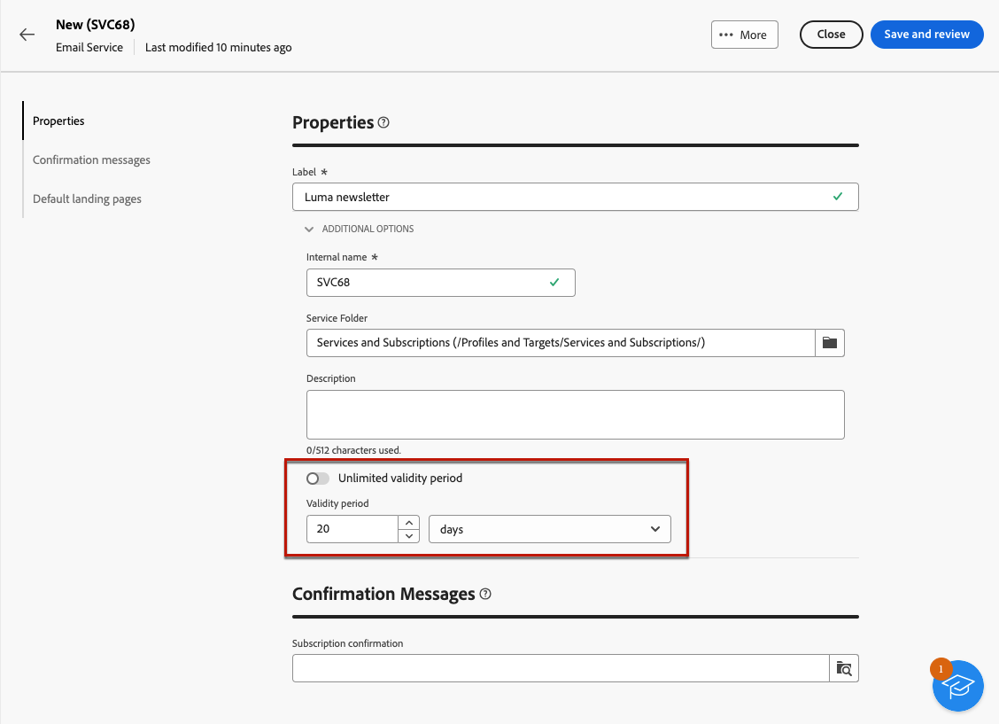
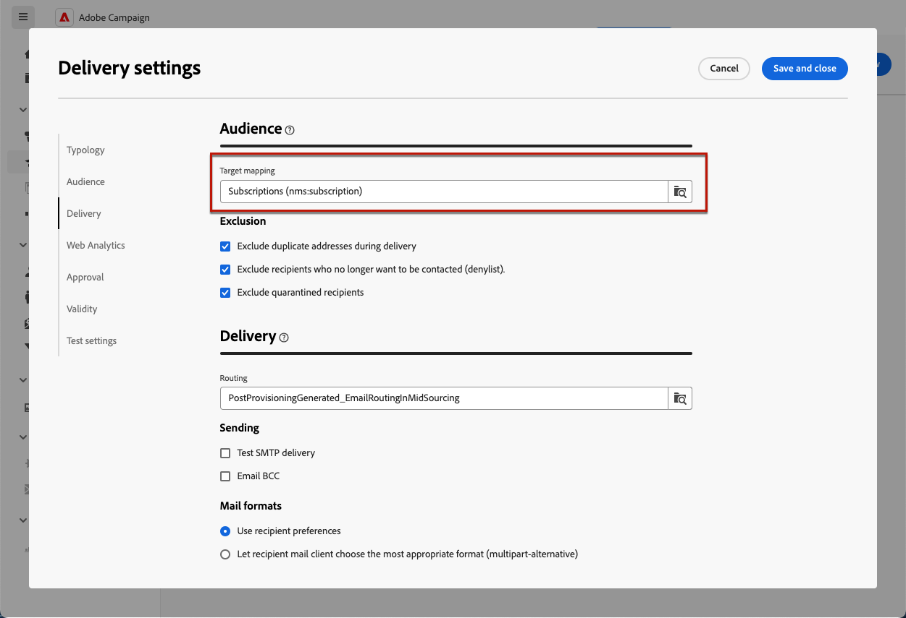
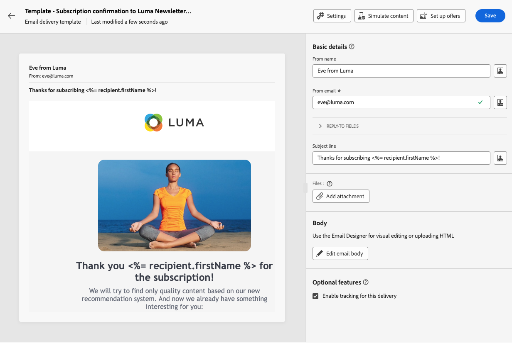
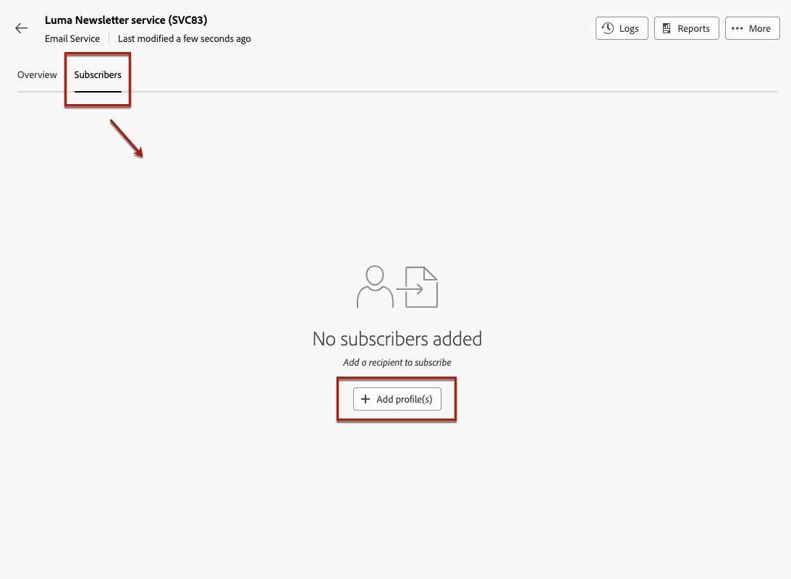
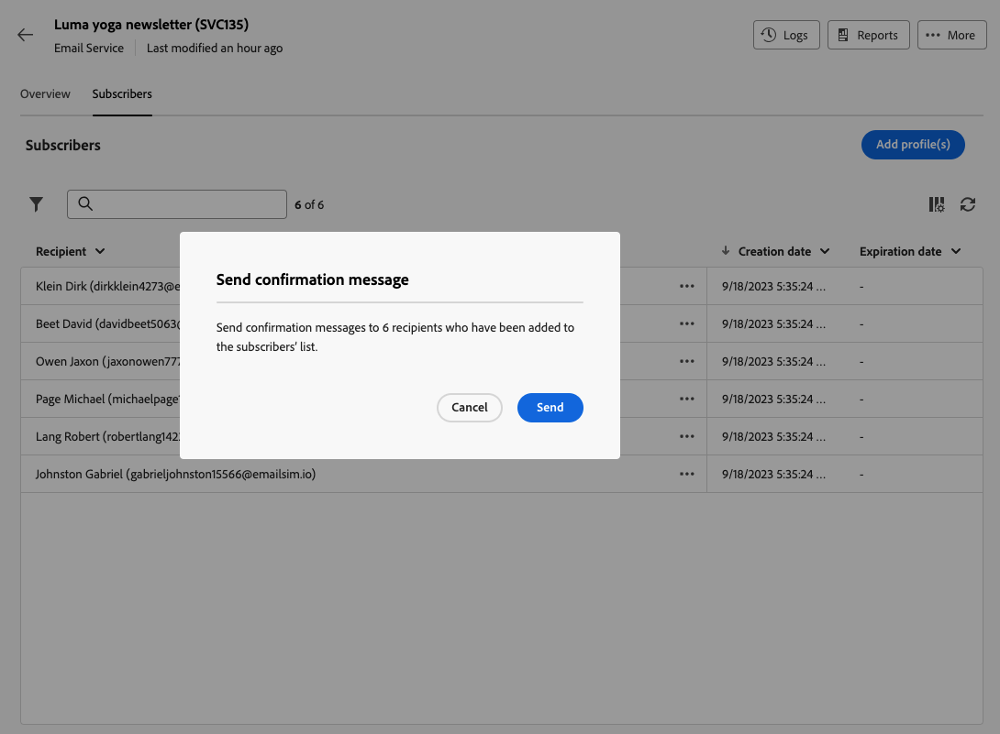
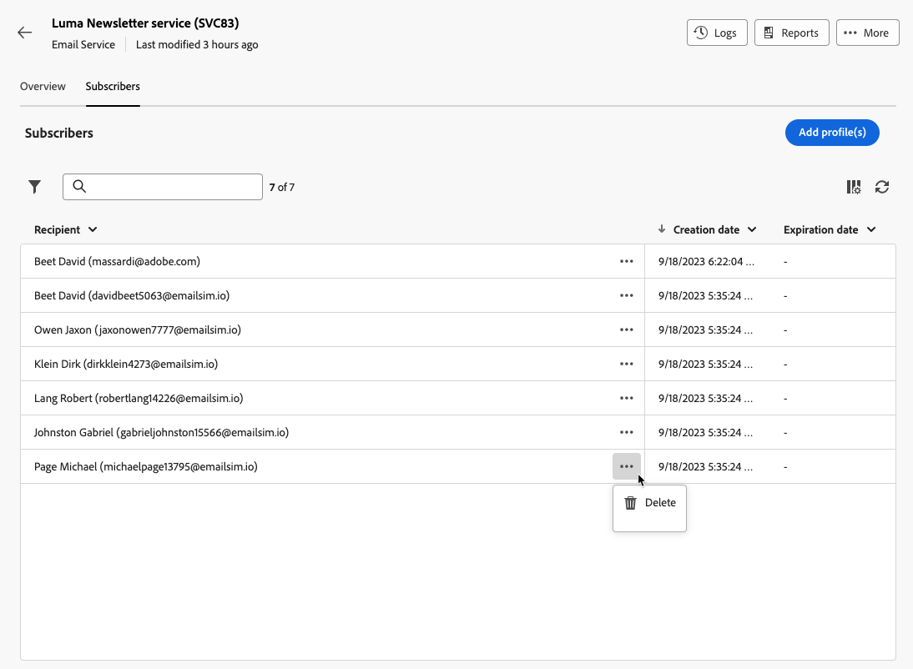
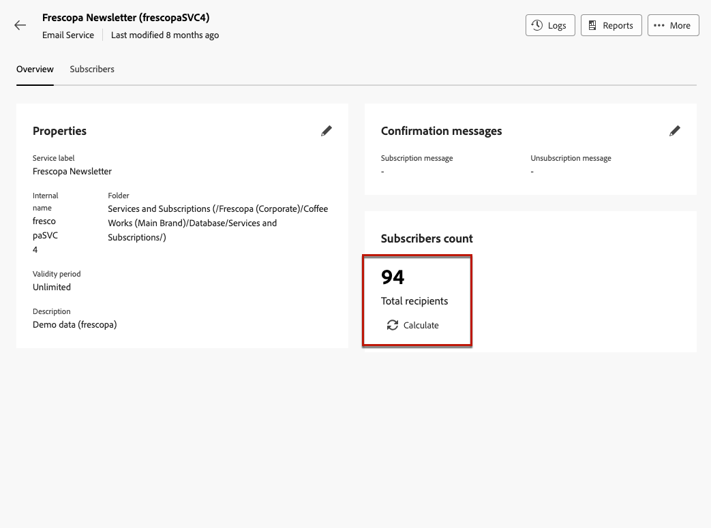
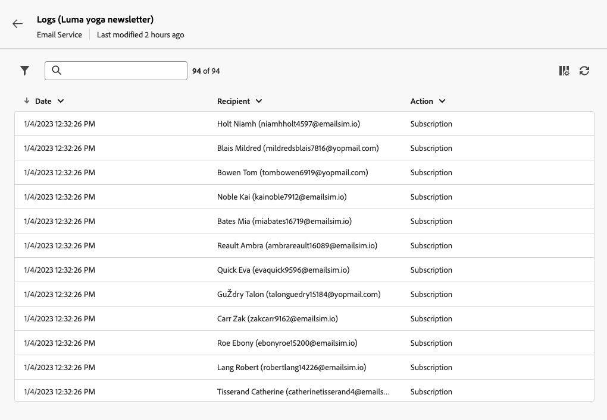
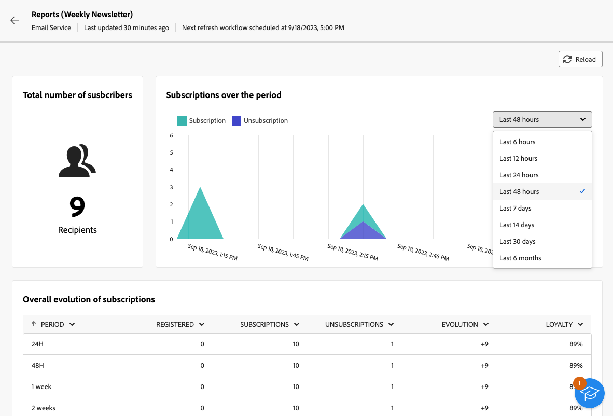
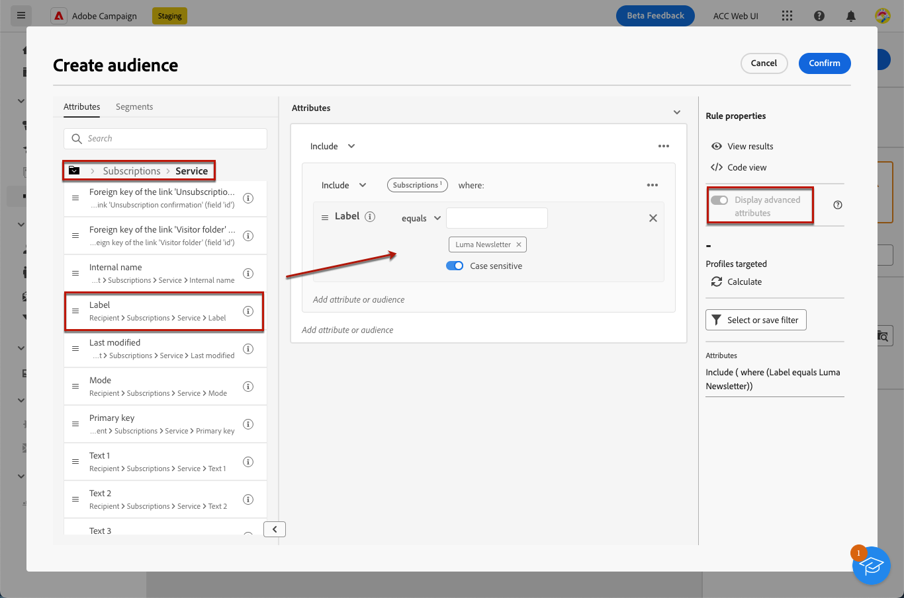

# 使用訂閱服務 {#create-services}

>[!CONTEXTUALHELP]
>id="acw_subscriptions_list"
>title="建立並管理您的服務"
>abstract="使用Adobe Campaign建立及監控您的服務（例如電子報），並檢查這些服務的訂閱或取消訂閱。 訂閱僅適用於電子郵件和簡訊傳遞。"

使用Adobe Campaign網頁管理及建立您的服務（例如電子報），以及檢查這些服務的訂閱或取消訂閱。

>[!NOTE]
>
>訂閱僅適用於電子郵件和簡訊傳遞。

數個服務可並行定義，例如：特定產品類別、網站主題或區域的電子報、各種警報訊息型別的訂閱以及即時通知。

若要進一步瞭解管理訂閱和取消訂閱，請參閱 [Campaign v8 （使用者端主控台）檔案](https://experienceleague.adobe.com/docs/campaign/campaign-v8/audience/subscriptions.html){target="_blank"}.

## 存取訂閱服務 {#access-services}

若要存取您的平台所提供的訂閱服務，請遵循下列步驟。

1. 瀏覽至 **[!UICONTROL 訂閱服務]** 功能表位於左側導覽邊欄中。

   

1. 此時會顯示所有現有訂閱服務的清單。 您可以搜尋服務並在頻道、資料夾上篩選，或使用進階篩選。

   

1. 若要編輯現有服務，請按一下其名稱。

1. 您可以使用此服務名稱旁邊的三個點圖示，刪除或複製任何服務。

## 建立您的第一個訂閱服務 {#create-service}

>[!CONTEXTUALHELP]
>id="acw_subscriptions_list_properties"
>title="定義您的服務屬性"
>abstract="輸入訂閱服務的標籤，並定義其他選項，例如服務的有效期間。"

>[!CONTEXTUALHELP]
>id="acw_subscriptions_list_confirm"
>title="選取確認訊息"
>abstract="當使用者訂閱或取消訂閱服務時，您可以傳送確認訊息。 選取要用於該訊息的範本。"

若要建立訂閱服務，請遵循下列步驟。

1. 選取 **[!UICONTROL 建立訂閱服務]** 按鈕。

   

1. 選取頻道： **[!UICONTROL 電子郵件]** 或 **[!UICONTROL 簡訊]**.

1. 在服務屬性中，輸入標籤，並視需要定義其他選項。

   

1. 依預設，訂閱沒有限制。 您可以停用 **[!UICONTROL 有效期無限制]** 定義服務有效持續時間的選項。 在下列範例中，20天後，沒有任何使用者能夠再訂閱此服務。

   

1. 當使用者訂閱或取消訂閱服務時，您可以傳送確認訊息。 根據您的使用案例，選取要用於該訊息的範本。 這些範本必須設定為 **[!UICONTROL 訂閱]** 目標對應。 [了解更多](#create-confirmation-message)

   

1. 按一下 **[!UICONTROL 儲存並檢閱]**. 新服務將新增至 **[!UICONTROL 訂閱服務]** 清單。

## 建立確認訊息 {#create-confirmation-message}

若要傳送確認訊息給訂閱或取消訂閱服務的使用者，您必須使用建立傳遞範本 **[!UICONTROL 訂閱]** 目標對應，無已定義目標。 請依照下列步驟以執行此操作。

1. 建立訂閱確認的傳遞範本。 [了解做法](../msg/delivery-template.md)

1. 請勿選取此傳遞的對象。 請改為存取 **[!UICONTROL 傳遞設定]**，前往 [對象](../advanced-settings/delivery-settings.md#audience) 標籤並選取 **[!UICONTROL 訂閱]** 清單中的目標對應。

   

   >[!NOTE]
   >
   >如果您未選取  **[!UICONTROL 訂閱]** 目標對應，您的訂閱者將不會收到確認訊息。 目標對應是在 Campaign v8 主控台中定義的。進一步瞭解 [Adobe Campaign v8檔案](https://experienceleague.adobe.com/docs/campaign/campaign-v8/audience/add-profiles/target-mappings.html){target="_blank"}.

1. 編輯傳遞範本的內容，儲存並關閉。

   

   >[!NOTE]
   >
   >瞭解更多關於傳遞頻道，以及如何在中定義傳遞內容 [電子郵件頻道](../email/create-email.md) 和 [簡訊頻道](../sms/create-sms.md) 區段。

1. 重複上述步驟，建立取消訂閱確認的傳遞範本。

您現在可以在以下情況下選取這些訊息： [建立訂閱服務](#create-service). 訂閱或取消訂閱該服務的使用者會收到所選的確認訊息。

## 新增訂閱者至您的服務 {#add-subscribers}

建立服務後，您可以手動新增訂閱者。 請遵循下列步驟。

1. 從中選擇現有服務 **[!UICONTROL 訂閱服務]** 清單。

1. 選取 **[!UICONTROL 訂閱者]** 標籤並按一下 **[!UICONTROL 新增設定檔]**.

   

1. 從清單中選取您要新增的設定檔，然後按一下 **[!UICONTROL 確認]**.

   

1. 按一下 **[!UICONTROL 傳送]**. 選取的收件者將收到訂閱 [確認訊息](#create-confirmation-message) 您選擇的時機 [建立服務](#create-service).

   

新增的設定檔會顯示在 **[!UICONTROL 訂閱者]** 清單。 他們現在已訂閱您的服務。

## 從您的服務移除訂閱者 {#remove-subscribers}

將訂閱者新增至服務後，您就可以將其移除。 請遵循下列步驟。

1. 從中選擇現有服務 **[!UICONTROL 訂閱服務]** 清單。

1. 按一下所需收件者名稱旁的三點圖示，然後選取 **[!UICONTROL 刪除]**.

   

1. 確認刪除並按一下 **[!UICONTROL 傳送]**. 選取的收件者將會收到取消訂閱 [確認訊息](#create-confirmation-message) 您選擇的時機 [建立服務](#create-service).

   

收件者會從 **[!UICONTROL 訂閱者]** 清單且不再訂閱您的服務。

## 訂閱服務記錄檔及報告 {#logs-and-reports}

若要衡量簡訊和電子郵件通道訂閱服務的成效，您可以存取特定服務的記錄檔和報告。

1. 從中選擇現有服務 **[!UICONTROL 訂閱服務]** 清單。 按一下 **[!UICONTROL 計算]** 取得訂閱者總數。

   

1. 在服務儀表板中，選取 **[!UICONTROL 記錄檔]** 檢視此服務的訂閱者清單。 您可以檢查訂閱者總數、每個收件者的姓名與地址，以及他們訂閱或取消訂閱的時間。 您也可以對其進行篩選。

   

1. 在服務儀表板中，選取 **[!UICONTROL 報表]**. 檢查下列指標：

   * 此 **[!UICONTROL 訂閱者總數]** 隨即顯示。

   * 您可以檢視選定期間內的訂閱和取消訂閱數目。 使用下拉式清單來變更時間範圍。

     

   * 此 **[!UICONTROL 訂閱的整體演化]** 圖表會依期間顯示劃分，包括訂閱、取消訂閱、人數的演化以及忠誠度百分比。<!--what is Registered?-->

   * 使用 **[!UICONTROL 重新載入]** 按鈕以擷取追蹤工作流程執行和排程的最後值。

## 傳遞給服務的訂閱者

一旦您 [已建立訂閱服務](#create-service)，您可以在傳送中鎖定其訂閱者。 請遵循下列步驟。

1. [建立對象](../audience/create-audience.md) 包括您建立之服務的訂閱者：

   * 在 **[!UICONTROL 建立對象]** 活動，顯示進階屬性並選取 **[!UICONTROL 收件者]** > **[!UICONTROL 訂閱]** > **[!UICONTROL 服務]**.

   * 在此範例中，選取訂閱服務的使用者，該服務具有 **Luma電子報** 標籤。

   

1. [建立傳遞](../msg/gs-messages.md) 並選取您在上方建立的對象。

   

1. 依需要編輯您的訊息內容並傳送傳遞。

   

您的傳遞只會傳送給該服務的訂閱者。

