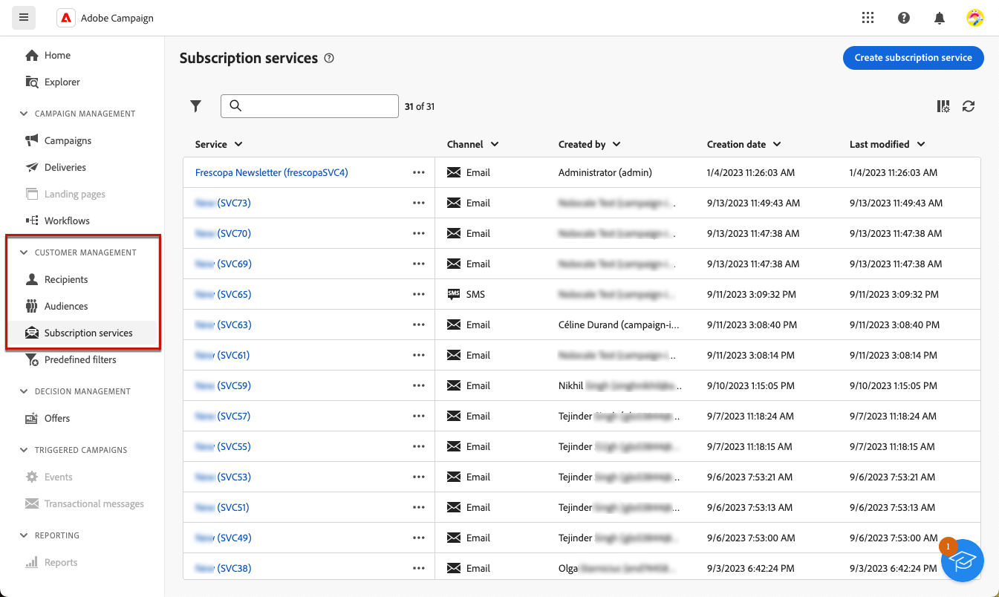
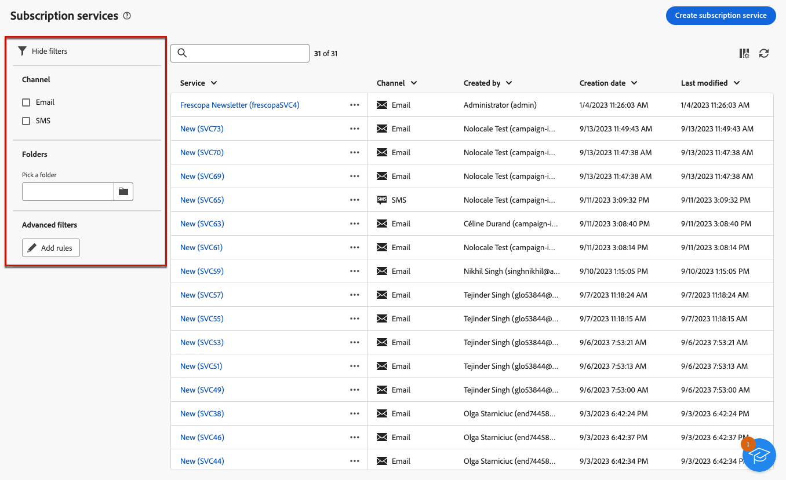
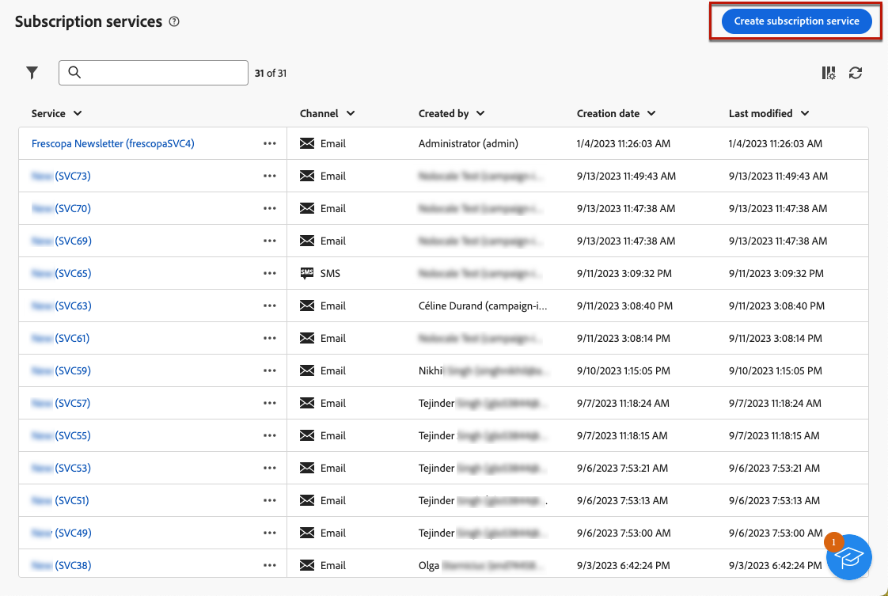
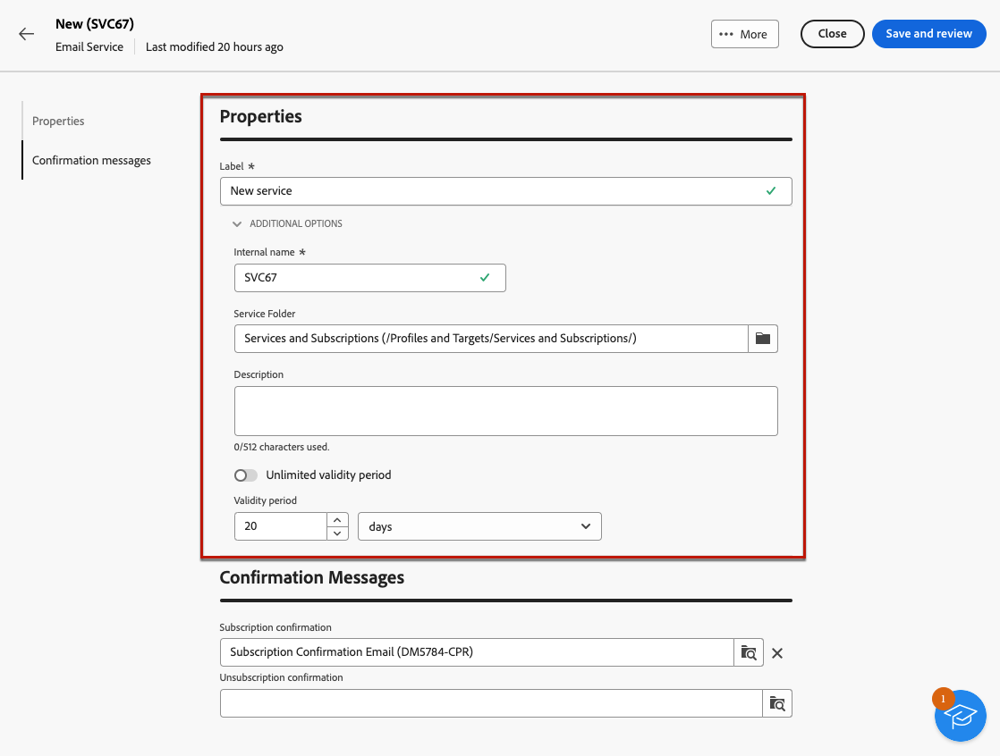
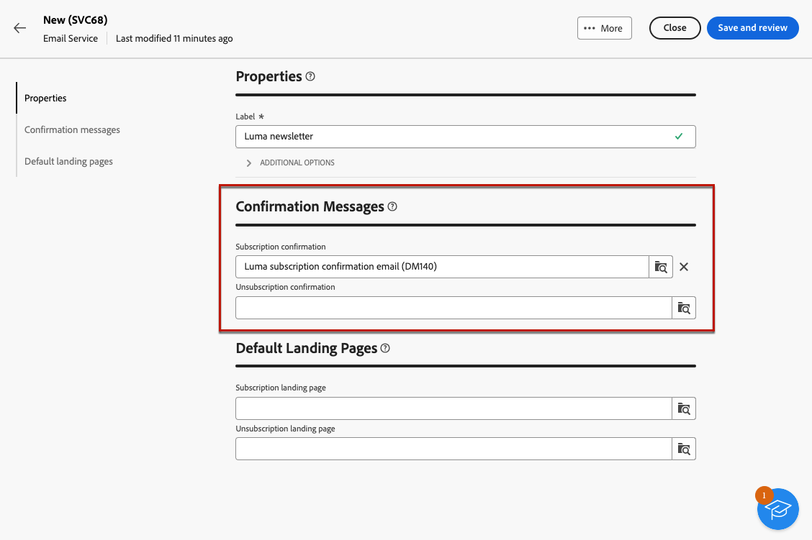

# 使用訂閱服務 {#create-services}

>[!CONTEXTUALHELP]
>id="acw_subscription_services_read_only"
>title="此服務為唯讀資料"
>abstract="您沒有編輯此服務的權限。如果需要，請聯絡管理員為您授予存取權限。"

使用Adobe Campaign建立及監控您的服務（例如電子報），並檢查這些服務的訂閱/取消訂閱。 訂閱僅適用於電子郵件和簡訊傳遞。

數個服務可並行定義，例如：特定產品類別、網站主題或區域的電子報、各種警報訊息型別的訂閱以及即時通知。

若要進一步瞭解管理訂閱和取消訂閱，請參閱 [Campaign v8 （使用者端主控台）檔案](https://experienceleague.adobe.com/docs/campaign/campaign-v8/audience/subscriptions.html){target="_blank"}.

## 存取訂閱服務 {#access-services}

若要存取您的平台所提供的訂閱服務，請瀏覽至 **[!UICONTROL 訂閱服務]** 功能表位於左側導覽邊欄中。

此時會顯示所有現有訂閱服務的清單。 您可以搜尋服務並在頻道、資料夾上篩選，或使用進階篩選。

## 建立您的第一個訂閱服務 {#create-service}

若要建立訂閱服務，請遵循下列步驟：

1. 選取 **[!UICONTROL 建立訂閱服務]** 按鈕。

   

1. 選取管道。 **[!UICONTROL 電子郵件]** 和 **[!UICONTROL 簡訊]** 可用。

1. 在服務屬性中，輸入標籤，並視需要定義其他選項。

   

1. 選取確認訊息。

   

1. 按一下 **[!UICONTROL 儲存並檢閱]**.

