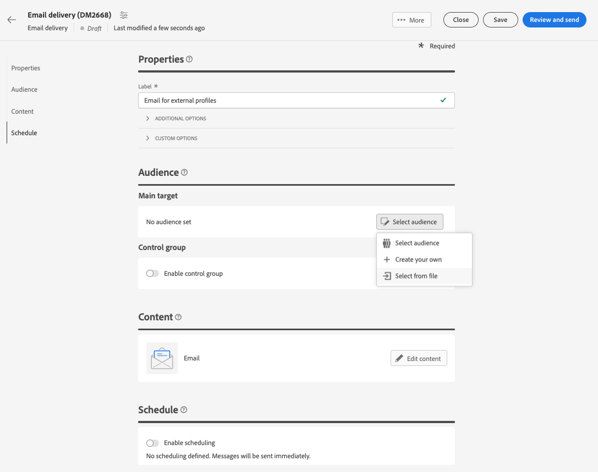
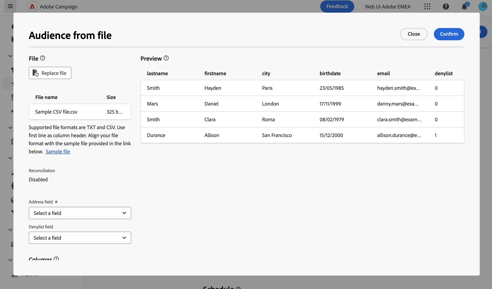
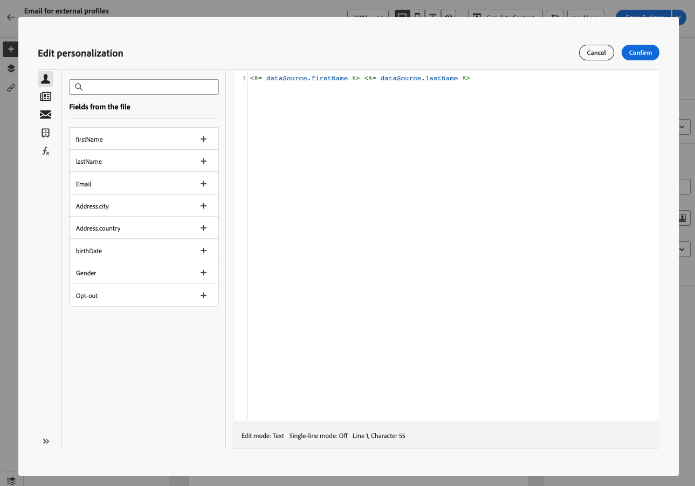
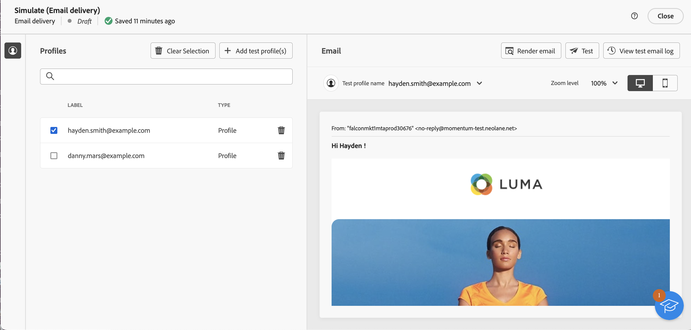
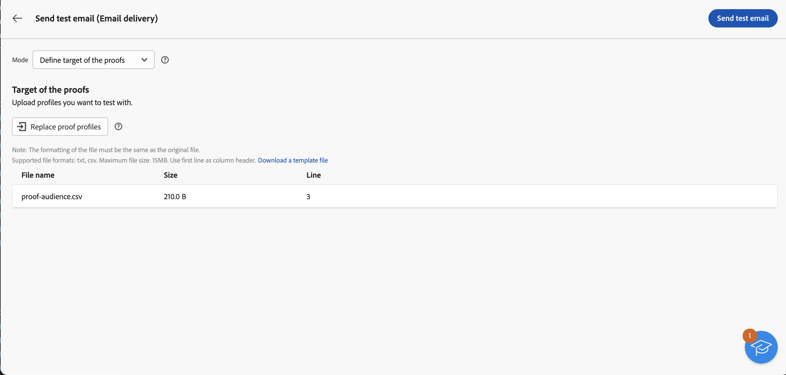

# 從檔案載入電子郵件客群 {#audience-from-file}

>[!CONTEXTUALHELP]
>id="acw_audience_fromfile_select"
>title="檔案選取"
>abstract="選取要上傳的本機檔案。支援的格式為 TXT 和 CSV。將您的檔案格式和以下連結的檔案範例保持一致。"

>[!CONTEXTUALHELP]
>id="acw_audience_fromfile_columns"
>title="欄定義"
>abstract="檢查外部檔案的欄格式。"

>[!CONTEXTUALHELP]
>id="acw_audience_fromfile_formatting"
>title="格式化參數"
>abstract="指定外部文件的格式，確保可正確匯入資料。"

>[!CONTEXTUALHELP]
>id="acw_audience_fromfile_preview"
>title="預覽您的檔案"
>abstract="檢查外部檔案的欄預覽。此畫面最多僅顯示 30 筆記錄。"

Adobe Campaign Web使用者介面可讓您定位儲存在外部檔案中的設定檔。 載入設定檔後，輸入檔案中的所有欄位都可用於個人化您的傳遞[瞭解如何個人化您的內容](../personalization/personalize.md)。

來自輸入檔案的設定檔不會新增至資料庫。 這些範本已載入，僅供此特定獨立電子郵件傳遞使用。

>[!NOTE]
>
>此頁面說明在建立獨立電子郵件傳送時，如何從檔案載入外部設定檔。 若要從工作流程內容中的檔案載入資料，請參閱[此頁面](../workflows/activities/load-file.md)。

## 必讀 {#must-read}

* 此功能僅適用於&#x200B;**電子郵件傳遞**。
* 支援的檔案格式為：文字(TXT)和逗號分隔值(CSV)。
* 從外部檔案載入目標群體時，您不能使用[控制組](control-group.md)。

## 選取並設定輸入檔案 {#upload}

若要從電子郵件中的檔案定位設定檔，請執行下列步驟：

1. 開啟現有的電子郵件傳遞，或[建立新的電子郵件傳遞](../email/create-email.md)。
1. 在&#x200B;**對象**&#x200B;區段中，按一下&#x200B;**選取對象**&#x200B;按鈕，然後選擇&#x200B;**從檔案選取**。

   {zoomable="yes"}

1. 選取要載入的本機檔案。 檔案格式必須與[範例檔案](#sample-file)對齊。
1. 在畫面中央區段預覽並檢查資料的對應方式。

   

1. 從&#x200B;**位址列位**&#x200B;下拉式清單中指定包含電子郵件地址的欄。 如果輸入檔案中有這類資訊，您也可以選取封鎖清單欄。
1. 調整欄設定並使用可用選項定義資料格式。
1. 當設定正確時，按一下「**確認**」。

建立訊息內容時，運用輸入檔案中的欄位來新增個人化。 [了解如何個人化內容](../personalization/personalize.md)

{zoomable="yes"}

## 範例檔案 {#sample-file}

>[!CONTEXTUALHELP]
>id="acw_audience_fromfile_samplefile"
>title="從檔案載入客群"
>abstract="支援的檔案格式為 TXT 和 CSV。使用第一行作為欄標題。讓您的檔案格式符合以下連結所提供的檔案範例。"

載入外部檔案以定位傳送中的設定檔時，請確定輸入檔案符合以下建議：

* 支援的格式為TXT和CSV。
* 檔案中的第一行是欄標題。
* 將檔案格式與下列範例檔案對齊：

  ```javascript
  {
  lastname,firstname,city,birthdate,email,denylist
  Smith,Hayden,Paris,23/05/1985,hayden.smith@example.com,0
  Mars,Daniel,London,17/11/1999,danny.mars@example.com,0
  Smith,Clara,Roma,08/02/1979,clara.smith@example.com,0
  Durance,Allison,San Francisco,15/12/2000,allison.durance@example.com,1
  }
  ```

## 預覽和測試您的電子郵件 {#test}

使用從檔案上傳的對象時，Campaign Web可讓您預覽和傳送校樣。 要執行此操作，請依照下列步驟執行：

1. 從您的傳遞內容編輯畫面按一下&#x200B;**[!UICONTROL 模擬內容按鈕]**，然後按一下&#x200B;**[!UICONTROL 新增測試設定檔]**&#x200B;按鈕。

1. 上傳的檔案中包含的設定檔隨即顯示。 選取您要用來預覽內容的設定檔，然後按一下&#x200B;**[!UICONTROL 選取]**。

1. 傳遞內容的預覽會顯示在畫面的右側窗格中。 個人化元素會取代為左側窗格中選取之設定檔的資料。 [進一步瞭解傳遞內容預覽](../preview-test/preview-content.md)

   {zoomable="yes"}

1. 若要傳送校樣，請按一下&#x200B;**[!UICONTROL 傳送校樣]**&#x200B;按鈕。

1. 按一下&#x200B;**[!UICONTROL 上傳校訂設定檔]**&#x200B;按鈕，然後選取包含校訂收件者的.txt或.csv檔案。

   >[!CAUTION]
   >
   >確保檔案格式符合用來上傳對象的格式。 任何格式錯誤都會顯示警報。

1. 新增校訂設定檔且您已準備好傳送校訂時，請按一下&#x200B;**[!UICONTROL 傳送校訂]**&#x200B;按鈕，並確認傳送。

   {zoomable="yes"}

1. 隨時使用&#x200B;**[!UICONTROL 檢視校樣]**&#x200B;按鈕監視校樣的傳送。 [進一步瞭解校訂監視](../preview-test/test-deliveries.md#access-test-deliveries)