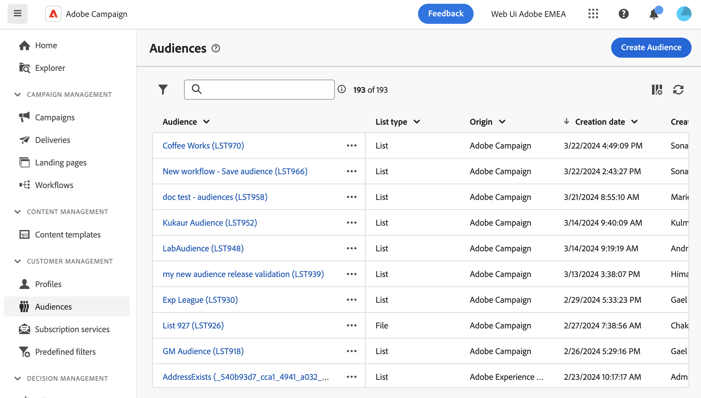

# 監視和管理對象 {#monitor}

>[!CONTEXTUALHELP]
>id="acw_audiences_workflow_error_data_execution"
>title="觀眾錯誤"
>abstract="無法取得對象資料。請等待工作流程執行結束。"

對象是傳遞的主要目標：收到訊息的收件者。對象類型會依據傳遞範本中定義的目標對應而不同。進一步瞭解中的傳遞範本 [此頁面](../msg/delivery-template.md).

若要定義對象母體，您可以：

* [建立新對象](create-audience.md) 從 **[!UICONTROL 受眾]** 功能表，
* [選取現有對象](add-audience.md) 在使用者端主控台中建立為清單，或來自Adobe Experience Platform時，
* [建立新對象](../query/query-modeler-overview.md) 使用查詢模型工具，定義並組合篩選條件，
* [使用外部檔案中的對象](file-audience.md). 此選項僅適用於獨立電子郵件傳送，無法用於行銷活動傳送。

鎖定目標對象時，您也可以定義 **控制組** 以避免傳送訊息給部分對象，並評估行銷活動的影響。 [瞭解如何設定控制組](control-group.md)

>[!NOTE]
>
>在行銷活動工作流程內容中傳送訊息時，會在特定中定義對象 **建立對象** 工作流程活動。 在此特定情況下，您無法從檔案載入對象以進行電子郵件傳遞，並且該對象的定義僅適用於此專用活動。瞭解如何在的行銷活動工作流程中定義傳送的對象 [本節](../workflows/activities/build-audience.md)

Campaign網頁適用的對象清單可從 **[!UICONTROL 受眾]** 功能表。

對象可以源自多個來源。 此 **[!UICONTROL 來源]** 欄表示建立特定對象的位置：

* **[!UICONTROL Adobe Campaign]**：這些對象是在Adobe Campaign V8主控台中建立。 進一步瞭解 [Campaign v8 （使用者端主控台）檔案](https://experienceleague.adobe.com/docs/campaign/campaign-v8/audience/create-audiences/create-audiences.html){target="_blank"}.

* **[!UICONTROL Adobe Experience Platform：]** 這些對象是在Adobe Experience Platform中建立，並使用Adobe來源和目的地整合整合來整合至Campaign網頁。 瞭解如何在中設定這項整合 [Campaign v8 （使用者端主控台）檔案](https://experienceleague.adobe.com/docs/campaign/campaign-v8/connect/ac-aep/ac-aep.html){target="_blank"}.

>[!NOTE]
>
>若要在Campaign中使用Adobe Experience Platform受眾，您需要設定與Adobe來源和目標的整合。 請參閱 [Campaign v8 （使用者端主控台）檔案](https://experienceleague.adobe.com/docs/campaign/campaign-v8/connect/ac-aep/ac-aep.html){target="_blank"}.

* **[!UICONTROL Adobe Campaign WebUI]**：這些對象是使用Campaign Web對象工作流程建立的。 [瞭解如何建立對象](create-audience.md)

若要取得對象的詳細資訊，請從清單中將其開啟。 對象屬性會連同對象中包含的設定檔數量一起顯示。 您可以隨時使用 **[!UICONTROL 計算]** 按鈕。

此 **[!UICONTROL 資料]** 索引標籤可讓您檢視屬於受眾的設定檔。 您可以新增更多欄或運用進階篩選器來調整顯示的資料，以自訂此檢視。

若要複製或刪除對象，請按一下 **[!UICONTROL 更多動作]** 「對象」清單中「對象名稱」旁或「對象詳細資料」畫面內的可用按鈕。
